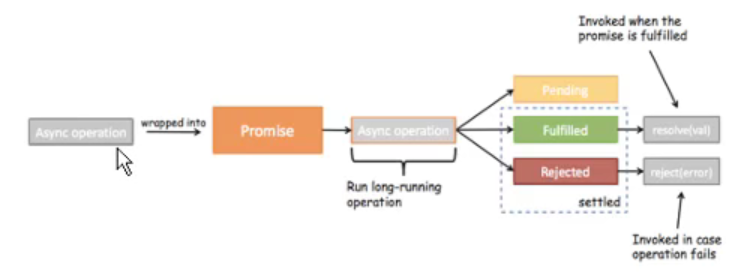

# ES6

## Promise

```
ES6中一个非常重要和好用的特性就是Promise
  但是初次接触Promise会一脸懵逼 ,这TM是什么东西?
  看看官方或者一些文章对它的介绍和用法,也是一头雾水。
Promise到底是做什么的呢?
  Promise是异步编程的一种解决方案。
那什么时候我们会来处理异步事件呢?
  一种很常见的场景应该就是网络请求了。
  我们封装一个网络请求的函数 ,因为不能立即拿到结果,所以不能像简单的3+4=7一样将结果返回。
  所以往往我们会传入另外一个函数,在数据请求成功时,将数据通过传入的函数回调出去。
  如果只是一个简单的网络请求,那么这种方案不会给我们带来很大的麻烦。
但是,当网络请求非常复杂时,就会出现回调地狱。
  OK,我以一个非常夸张的案例来说明。
```

```
setTimeout(() => {
	1.log
}, 1000)

链式编程
params -> function
resolve,reject 也是 function
new Promise((resolve, reject) => {
	setTimeout(() => {
		resolve();	resolve jump to then
	}, 1000)
}).then(() => {
	2.log
	return new Promise((resolve, reject) => {
		setTimeout(() => {
			resolve()
		}, 1000)
	}) 
}).then(() => {
	3.log
})
```

```
异步操作，使用promise对异步操作进行封装

成功调用resolve
resolve('sss')
.then((data) => {  })

失败调用reject
reject("err")
.catch(err => {  })
```




# end