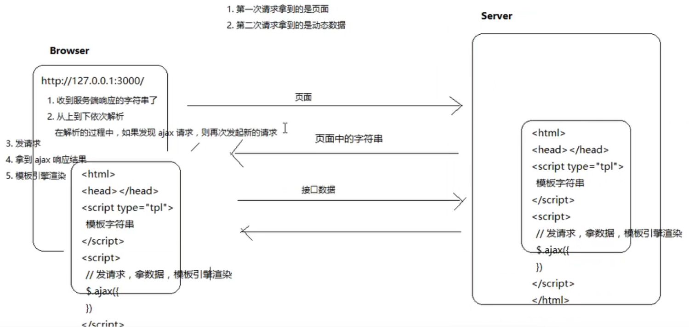
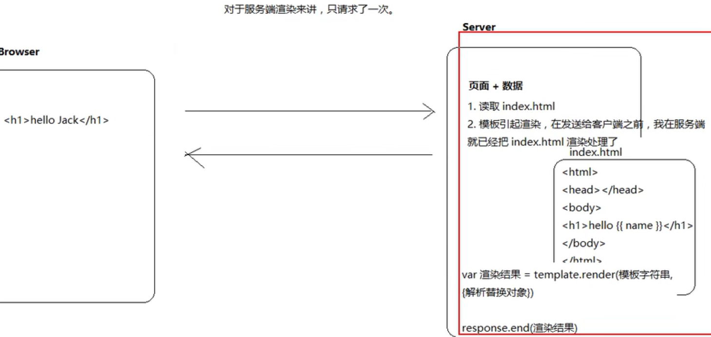
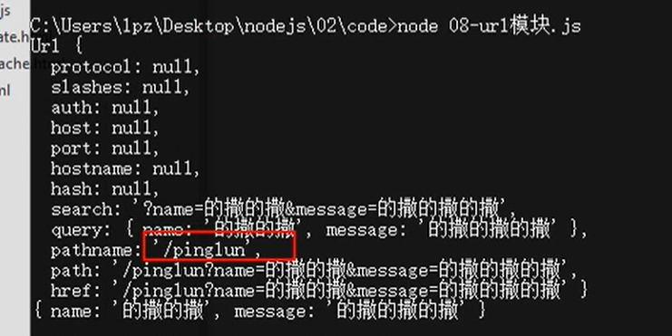
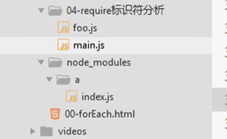
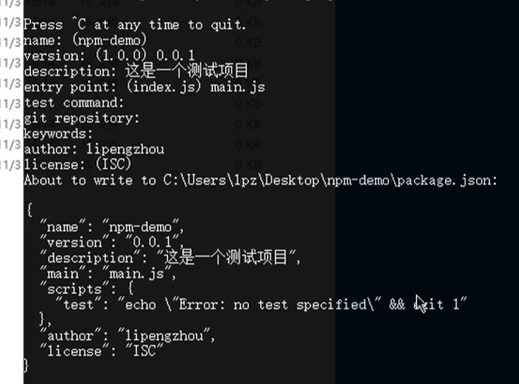
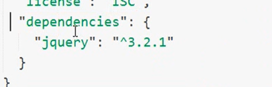
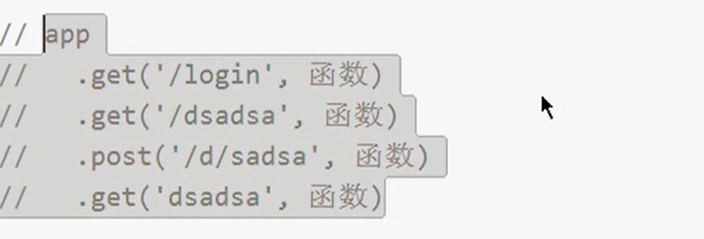
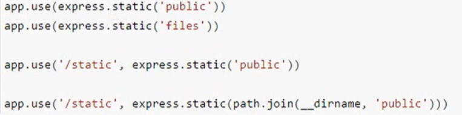
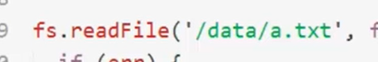
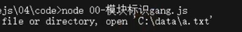

#  Node.js

## 	学习资源

```
深入浅出Node.js	也有博客
Node.js权威指南
JavaScript标准参考教程(alpha) : http://javascript.ruanyifeng.com/
Node入门: http://www.nodebeginner.org/index-zh-cn.html
官方API文档: https://nodejs.org/dist/latest-v6.x/docs/api/
中文文档(版本比较旧，凑合看) : http://www.nodeclass.com/api/node.html
CNODE社区: http://cnodejs.org
CNODE-新手入门: http://cnodejs.org/getstart

npm网站
npmjs.com
```


## 介绍

什么是nodejs

```
JavaScript 运行时环境
既不是语言，也不是框架，它是一个平台
简单来说，可以解析和执行js代码
构建于谷歌V8引擎之上
```

浏览器中的js

```
EcmaScript
	基本语法，if，var，function，object，array
Bom
Dom
```

Node.js 中的 JavaScript

```
没有 BOM、DOM
EcmaScript 基本的 JavaScript 语言部分
在 Node 中为 JavaScript 提供了一些服务器级别的 API
	文件操作的能力
	http 服务的能力
	网络服务的构建
	网络通信
	等处理...
```

```
event-driven 事件驱动
non-blocking I/O model 非阻塞IO模型（异步）
lightweight and efficient 轻量和高效
```

```
npm
最大的开源库生态系统
绝大多数js相关的包都存在了npm上
```

`npm install jquery`

node做什么

```
web服务器后台
命令行工具
	npm(node)
	git(c)
	hexo(node)
```

```
webpack
gulp
npm
```


执行

```
node 路径/xx.js
```

## 文件读写，简单http请求和路径总结

```
# Node.js 第1天

## 上午总结

- Node.js 是什么
  + JavaScript 运行时
  + 既不是语言，也不是框架，它是一个平台
- Node.js 中的 JavaScript
  + 没有 BOM、DOM
  + EcmaScript 基本的 JavaScript 语言部分
  + 在 Node 中为 JavaScript 提供了一些服务器级别的 API
    * 文件操作的能力
    * http 服务的能力

## 总结

- Node 中的 JavaScript
  + EcmaScript
    * 变量
    * 方法
    * 数据类型
    * 内置对象
    * Array
    * Object
    * Date
    * Math
  + 模块系统
    * 在 Node 中没有全局作用域的概念
    * 在 Node 中，只能通过 require 方法来加载执行多个 JavaScript 脚本文件
    * require 加载只能是执行其中的代码，文件与文件之间由于是模块作用域，所以不会有污染的问题
      - 模块完全是封闭的
      - 外部无法访问内部
      - 内部也无法访问外部
    * 模块作用域固然带来了一些好处，可以加载执行多个文件，可以完全避免变量命名冲突污染的问题
    * 但是某些情况下，模块与模块是需要进行通信的
    * 在每个模块中，都提供了一个对象：`exports`
    * 该对象默认是一个空对象
    * 你要做的就是把需要被外部访问使用的成员手动的挂载到 `exports` 接口对象中
    * 然后谁来 `require` 这个模块，谁就可以得到模块内部的 `exports` 接口对象
    * 还有其它的一些规则，具体后面讲，以及如何在项目中去使用这种编程方式，会通过后面的案例来处理
  + 核心模块
    * 核心模块是由 Node 提供的一个个的具名的模块，它们都有自己特殊的名称标识，例如
      - fs 文件操作模块
      - http 网络服务构建模块
      - os 操作系统信息模块
      - path 路径处理模块
      - 。。。。
    * 所有核心模块在使用的时候都必须手动的先使用 `require` 方法来加载，然后才可以使用，例如：
      - `var fs = require('fs')`
- http
  + require
  + 端口号
    * ip 地址定位计算机
    * 端口号定位具体的应用程序
  + Content-Type
    * 服务器最好把每次响应的数据是什么内容类型都告诉客户端，而且要正确的告诉
    * 不同的资源对应的 Content-Type 是不一样，具体参照：http://tool.oschina.net/commons
    * 对于文本类型的数据，最好都加上编码，目的是为了防止中文解析乱码问题
  + 通过网络发送文件
    * 发送的并不是文件，本质上来讲发送是文件的内容
    * 当浏览器收到服务器响应内容之后，就会根据你的 Content-Type 进行对应的解析处理

- 模块系统
- Node 中的其它的核心模块
- 做一个小管理系统：
  + CRUD
- Express Web 开发框架
  + `npm install express`
```


## 案例

### 文件读写

```
// 浏览器中的 JavaScript 是没有文件操作的能力的
// 但是 Node 中的 JavaScript 具有文件操作的能力

// fs 是 file-system 的简写，就是文件系统的意思
// 在 Node 中如果想要进行文件操作，就必须引入 fs 这个核心模块
// 在 fs 这个核心模块中，就提供了所有的文件操作相关的 API
// 例如：fs.readFile 就是用来读取文件的

// 1. 使用 require 方法加载 fs 核心模块
var fs = require('fs')

// 2. 读取文件
//    第一个参数就是要读取的文件路径
//    第二个参数是一个回调函数
//          
//        成功
//          data 数据
//          error null
//        失败
//          data undefined没有数据
//          error 错误对象
fs.readFile('./data/a.txt', function (error, data) {
  // <Buffer 68 65 6c 6c 6f 20 6e 6f 64 65 6a 73 0d 0a>
  // 文件中存储的其实都是二进制数据 0 1
  // 这里为什么看到的不是 0 和 1 呢？原因是二进制转为 16 进制了
  // 但是无论是二进制01还是16进制，人类都不认识
  // 所以我们可以通过 toString 方法把其转为我们能认识的字符
  // console.log(data)

  // console.log(error)
  // console.log(data)

  // 在这里就可以通过判断 error 来确认是否有错误发生
  if (error) {
    console.log('读取文件失败了')
  } else {
    console.log(data.toString())
  }
})
```


写入文件

```
var fs = require('fs')

// $.ajax({
//   ...
//   success: function (data) {
    
//   }
// })

// 第一个参数：文件路径
// 第二个参数：文件内容
// 第三个参数：回调函数
//    error
//    
//    成功：
//      文件写入成功
//      error 是 null
//    失败：
//      文件写入失败
//      error 就是错误对象
fs.writeFile('./data/你好.md', '大家好，给大家介绍一下，我是Node.js', function (error) {
  // console.log('文件写入成功')
  // console.log(error)
  if (error) {
    console.log('写入失败')
  } else {
    console.log('写入成功了')
  }
})
```


### 简单http服务

```
// 接下来，我们要干一件使用 Node 很有成就感的一件事儿
// 你可以使用 Node 非常轻松的构建一个 Web 服务器
// 在 Node 中专门提供了一个核心模块：http
// http 这个模块的职责就是帮你创建编写服务器的

// 1. 加载 http 核心模块
var http = require('http')

// 2. 使用 http.createServer() 方法创建一个 Web 服务器
//    返回一个 Server 实例
var server = http.createServer()

// 3. 服务器要干嘛？
//    提供服务：对 数据的服务
//    发请求
//    接收请求
//    处理请求
//    给个反馈（发送响应）
//    注册 request 请求事件
//    当客户端请求过来，就会自动触发服务器的 request 请求事件，
//      然后执行第二个参数：回调处理函数
server.on('request', function () {
  console.log('收到客户端的请求了')
})

// 4. 绑定端口号，启动服务器
server.listen(3000, function () {
  console.log('服务器启动成功了，可以通过 http://127.0.0.1:3000/ 来进行访问')
})
```


### 简单处理http请求事件

```
var http = require('http')

var server = http.createServer()

// request 请求事件处理函数，需要接收两个参数：
//    Request 请求对象
//        请求对象可以用来获取客户端的一些请求信息，例如请求路径
//    Response 响应对象
//        响应对象可以用来给客户端发送响应消息
server.on('request', function (request, response) {
  // http://127.0.0.1:3000/ /
  // http://127.0.0.1:3000/a /a
  // http://127.0.0.1:3000/foo/b /foo/b
  console.log('收到客户端的请求了，请求路径是：' + request.url)

  // response 对象有一个方法：write 可以用来给客户端发送响应数据
  // write 可以使用多次，但是最后一定要使用 end 来结束响应，否则客户端会一直等待
  response.write('hello')
  response.write(' nodejs')

  // 告诉客户端，我的话说完了，你可以呈递给用户了
  response.end()

  // 由于现在我们的服务器的能力还非常的弱，无论是什么请求，都只能响应 hello nodejs
  // 思考：
  //  我希望当请求不同的路径的时候响应不同的结果
  //  例如：
  //  / index
  //  /login 登陆
  //  /register 注册
  //  /haha 哈哈哈
})

server.listen(3000, function () {
  console.log('服务器启动成功了，可以通过 http://127.0.0.1:3000/ 来进行访问')
})
```

根据不同url返回不同结果

```
进行简单的if判断即可
```

### nodejs的核心模块

```
// 用来获取机器信息的
var os = require('os')

// 用来操作路径的
var path = require('path')

// 获取当前机器的 CPU 信息
console.log(os.cpus())

// memory 内存
console.log(os.totalmem())

// 获取一个路径中的扩展名部分
// extname extension name
console.log(path.extname('c:/a/b/c/d/hello.txt'))
```

### nodejs的模块化操作

文件目录

- a.js
- b.js
- c.js

此时两个文件的作用域不同，不会相互污染，所以两个不能相互使用对方的方法和变量

```
a.js
// require 是一个方法
// 它的作用就是用来加载模块的
// 在 Node 中，模块有三种：
//    具名的核心模块，例如 fs、http
//    用户自己编写的文件模块
//      相对路径必须加 ./
//      可以省略后缀名
//      相对路径中的 ./ 不能省略，否则报错
//    在 Node 中，没有全局作用域，只有模块作用域
//      外部访问不到内部
//      内部也访问不到外部
//      默认都是封闭的
//    既然是模块作用域，那如何让模块与模块之间进行通信
//    有时候，我们加载文件模块的目的不是为了简简单单的执行里面的代码，更重要是为了使用里面的某个成员

var foo = 'aaa'

console.log('a start')

function add(x, y) {
  return x + y
}

// Error: Cannot find module 'b'
// require('b')

// 可以
// require('./b.js')

// 推荐：可以省略后缀名
require('./b')

console.log('a end')

console.log('foo 的值是：', foo)
```

```
b.js
console.log('b start')

// console.log(add(10, 20))

var foo = 'bbb'

require('./c.js')
console.log('b end')
```

```
c.js
console.log('ccc')
```

### 模块化的加载与导出

```
a.js

// require 方法有两个作用：
//    1. 加载文件模块并执行里面的代码
//    2. 拿到被加载文件模块导出的接口对象
//    
//    在每个文件模块中都提供了一个对象：exports
//    exports 默认是一个空对象
//    你要做的就是把所有需要被外部访问的成员挂载到这个 exports 对象中
var bExports = require('./b')
var fs = require('fs')

console.log(bExports.foo)

console.log(bExports.add(10, 30))

console.log(bExports.age)

bExports.readFile('./a.js')

fs.readFile('./a.js', function (err, data) {
  if (err) {
    console.log('读取文件失败')
  } else {
    console.log(data.toString())
  }
})
```

```
b.js

var foo = 'bbb'

// console.log(exports)

exports.foo = 'hello'

exports.add = function (x, y) {
  return x + y
}

exports.readFile = function (path, callback) {
  console.log('文件路径：', path)
}

var age = 18

exports.age = age

function add(x, y) {
  return x - y
}
```

### 获取客户端的IP地址和端口号

```
// ip 地址用来定位计算机
// 端口号用来定位具体的应用程序
// 所有需要联网通信的应用程序都会占用一个端口号

var http = require('http')

var server = http.createServer()

// 2. 监听 request 请求事件，设置请求处理函数
server.on('request', function (req, res) {
  console.log('收到请求了，请求路径是：' + req.url)
  console.log('请求我的客户端的地址是：', req.socket.remoteAddress, req.socket.remotePort)

  res.end('hello nodejs')
})

server.listen(5000, function () {
  console.log('服务器启动成功，可以访问了。。。')
})
```

### 设置编码头

避免出现中文乱码

text/plain	是普通文本

text/html	是html文本

```
// require
// 端口号

var http = require('http')

var server = http.createServer()

server.on('request', function (req, res) {
  // 在服务端默认发送的数据，其实是 utf8 编码的内容
  // 但是浏览器不知道你是 utf8 编码的内容
  // 浏览器在不知道服务器响应内容的编码的情况下会按照当前操作系统的默认编码去解析
  // 中文操作系统默认是 gbk
  // 解决方法就是正确的告诉浏览器我给你发送的内容是什么编码的
  // 在 http 协议中，Content-Type 就是用来告知对方我给你发送的数据内容是什么类型
  // res.setHeader('Content-Type', 'text/plain; charset=utf-8')
  // res.end('hello 世界')

  var url = req.url

  if (url === '/plain') {
    // text/plain 就是普通文本
    res.setHeader('Content-Type', 'text/plain; charset=utf-8')
    res.end('hello 世界')
  } else if (url === '/html') {
    // 如果你发送的是 html 格式的字符串，则也要告诉浏览器我给你发送是 text/html 格式的内容
    res.setHeader('Content-Type', 'text/html; charset=utf-8')
    res.end('<p>hello html <a href="">点我</a></p>')
  }
})

server.listen(3000, function () {
  console.log('Server is running...')
})
```

### http请求进行文件读取

```
// 1. 结合 fs 发送文件中的数据
// 2. Content-Type
//    http://tool.oschina.net/commons
//    不同的资源对应的 Content-Type 是不一样的
//    图片不需要指定编码
//    一般只为字符数据才指定编码

var http = require('http')
var fs = require('fs')

var server = http.createServer()

server.on('request', function (req, res) {
  // / index.html
  var url = req.url

  if (url === '/') {
    // 肯定不这么干
    // res.end('<!DOCTYPE html><html lang="en"><head><meta charset="UTF-8"><title>Document</title></head><body><h1>首页</h1></body>/html>')

    // 我们要发送的还是在文件中的内容
    fs.readFile('./resource/index.html', function (err, data) {
      if (err) {
        res.setHeader('Content-Type', 'text/plain; charset=utf-8')
        res.end('文件读取失败，请稍后重试！')
      } else {
        // data 默认是二进制数据，可以通过 .toString 转为咱们能识别的字符串
        // res.end() 支持两种数据类型，一种是二进制，一种是字符串
        res.setHeader('Content-Type', 'text/html; charset=utf-8')
        res.end(data)
      }
    })
  } else if (url === '/xiaoming') {
    // url：统一资源定位符
    // 一个 url 最终其实是要对应到一个资源的
    fs.readFile('./resource/ab2.jpg', function (err, data) {
      if (err) {
        res.setHeader('Content-Type', 'text/plain; charset=utf-8')
        res.end('文件读取失败，请稍后重试！')
      } else {
        // data 默认是二进制数据，可以通过 .toString 转为咱们能识别的字符串
        // res.end() 支持两种数据类型，一种是二进制，一种是字符串
        // 图片就不需要指定编码了，因为我们常说的编码一般指的是：字符编码
        res.setHeader('Content-Type', 'image/jpeg')
        res.end(data)
      }
    })
  }
})

server.listen(3000, function () {
  console.log('Server is running...')
})
```

### 使用url输入去本地读取对应url的文件并显示

```
var http = require('http')
var fs = require('fs')

var server = http.createServer()

var wwwDir = 'D:/Movie/www'

server.on('request', function (req, res) {
  var url = req.url
  // / index.html
  // /a.txt wwwDir + /a.txt
  // /apple/login.html wwwDir + /apple/login.html
  // /img/ab1.jpg wwwDir + /img/ab1.jpg
  
  var filePath = '/index.html'
  if (url !== '/') {
    filePath = url
  }

  fs.readFile(wwwDir + filePath, function (err, data) {
    if (err) {
      return res.end('404 Not Found.')
    }
    res.end(data)
  })
})

// 3. 绑定端口号，启动服务
server.listen(3000, function () {
  console.log('running...')
})
```

### 写出apache的那种目录列表

```
// 1. 如何得到 wwwDir 目录列表中的文件名和目录名
//    fs.readdir
// 2. 如何将得到的文件名和目录名替换到 template.html 中
//    2.1 在 template.html 中需要替换的位置预留一个特殊的标记（就像以前使用模板引擎的标记一样）
//    2.2 根据 files 生成需要的 HTML 内容

// 2.1 生成需要替换的内容
var content = ''
files.forEach(function (item) {
// 在 EcmaScript 6 的 ` 字符串中，可以使用 ${} 来引用变量
content += `
<tr>
    <td data-value="apple/"><a class="icon dir" href="/D:/Movie/www/apple/">${item}/</a></td>
    <td class="detailsColumn" data-value="0"></td>
    <td class="detailsColumn" data-value="1509589967">2017/11/2 上午10:32:47</td>
</tr>
`
})
// 2.3 替换,原本的html文件里面的body中就只有特殊标记^_^通过这个特殊标记进行替换
data = data.toString()
data = data.replace('^_^', content)

// 3. 发送解析替换过后的响应数据
res.end(data)
```

### 读取目录

```
var fs = require('fs')

fs.readdir('D:/Movie/www', function (err, files) {
  if (err) {
    return console.log('目录不存在')
  }
  console.log(files)
})
```

## 代码风格与渲染

- [JavaScript Standard Style](https://standardjs.com/)
- Airbnb JavaScript Style

- 服务端渲染和客户端渲染的区别
  + 客户端渲染不利于 SEO 搜索引擎优化
  + 服务端渲染是可以被爬虫抓取到的，客户端异步渲染是很难被爬虫抓取到的
  + 所以你会发现真正的网站既不是纯异步也不是纯服务端渲染出来的
  + 而是两者结合来做的
  + 例如京东的商品列表就采用的是服务端渲染，目的了为了 SEO 搜索引擎优化
  + 而它的商品评论列表为了用户体验，而且也不需要 SEO 优化，所以采用是客户端渲染

##### 客户端渲染

```
先进行页面请求
然后对于里面的数据，还要进行Ajax请求，会出现多次请求

服务端压力小
但是响应块
```



##### 服务器端渲染

```
就只进行一次请求，在请求的时候服务器端会先把数据渲染入页面，然后把页面发给前端

服务器端压力变大
不需要客户端进行处理
```



##### 如何查看是不是服务端渲染出来的

```
网页查看源代码，存在的是服务端渲染出来的，不存在的是客户端渲染出来的
```

## 案例

### npm安装

```
//    npm install art-template
//    该命令在哪执行就会把包下载到哪里。默认会下载到 node_modules 目录中
//    node_modules 不要改，也不支持改。
```

### art-template模板引擎

```
注意：在浏览器中需要引用 lib/template-web.js 文件

强调：模板引擎不关心你的字符串内容，只关心自己能认识的模板标记语法，例如 {{}}
{{}} 语法被称之为 mustache 语法，八字胡啊。
```

```
<script src="node_modules/art-template/lib/template-web.js"></script>
```

```
<script type="text/template" id="tpl">
    <p>大家好，我叫：{{ name }}</p>
    <p>我今年 {{ age }} 岁了</p>
    <h1>我来自 {{ province }}</h1>
    <p>我喜欢：{{each hobbies}} {{ $value }} {{/each}}</p>
</script>
```

```
<script>
var ret = template('tpl', {
    name: 'Jack',
    age: 18,
    province: '北京市',
    hobbies: [
        '写代码',
        '唱歌',
        '打游戏'
    ]
})

console.log(ret)
</script>
```

```
输出：
    <p>大家好，我叫：Jack</p>
    <p>我今年 18 岁了</p>
    <h1>我来自 北京市</h1>
    <p>我喜欢： 写代码  唱歌  打游戏 </p>
```

### 使用模板引擎实现apache目录

```
var http = require('http')
var fs = require('fs')
var template = require('art-template')

var server = http.createServer()

var wwwDir = 'D:/Movie/www'

server.on('request', function (req, res) {
  var url = req.url
  fs.readFile('./template-apache.html', function (err, data) {
    if (err) {
      return res.end('404 Not Found.')
    }
    // 1. 如何得到 wwwDir 目录列表中的文件名和目录名
    //    fs.readdir
    // 2. 如何将得到的文件名和目录名替换到 template.html 中
    //    2.1 在 template.html 中需要替换的位置预留一个特殊的标记（就像以前使用模板引擎的标记一样）
    //    2.2 根据 files 生成需要的 HTML 内容
    // 只要你做了这两件事儿，那这个问题就解决了
    fs.readdir(wwwDir, function (err, files) {
      if (err) {
        return res.end('Can not find www dir.')
      }

      // 这里只需要使用模板引擎解析替换 data 中的模板字符串就可以了
      // 数据就是 files
      // 然后去你的 template.html 文件中编写你的模板语法就可以了
      var htmlStr = template.render(data.toString(), {
        title: '哈哈',
        files: files
      })

      // 3. 发送解析替换过后的响应数据
      res.end(htmlStr)
    })
  })
})
server.listen(3000, function () {
  console.log('running...')
})
```

```
<tbody id="tbody">
    {{each files}}
    <tr>
        <td data-value="apple/"><a class="icon dir" href="/D:/Movie/www/apple/">{{$value}}/</a></td>
        <td class="detailsColumn" data-value="0"></td>
        <td class="detailsColumn" data-value="1509589967">2017/11/2 上午10:32:47</td>
    </tr>
    {{/each}}
</tbody>
```

```
template的服务端简单使用理解

require 引包 template
在要使用的服务端渲染的url里面
data.toString()，就是用来template的模板的html代码，第一个为模板，第二个参数为数据对象
var htmlStr = template.render(data.toString(), {
	comments: comments
})
最后，再res.end()发出htmlStr数据字符串

html模板代码的样子
{{each comments}}
<li class="list-group-item">{{ $value.name }}说：{{ $value.message }} <span class="pull-right">{{ $value.dateTime }}</span></li>
{{/each}}
```


### 留言板

```
浏览器收到 html 响应内容之后，就要开始从上到下依次解析，
当在解析的过程中，如果发现：
	link,script,img,iframe,video,audio等带有src或者href（link）属性标签（具有外链的资源）的时候，浏览器会自动对这些资源发起新的请求。
```

```
我们为了方便 的统一处理静态资源，所以把所有的静态资源都存在pubic目录下
public/	css/img/js/lib

如果请求以public开头，使用 url.indexOf('/public/')===0
就readFile url 并 res.end(data);
```

```
在服务端中，文件的路径就不要去写相对路径了，因为这个时候所有的资源都是通过url标识来获取的
http://127.0.0.1:3000 浏览器会在真正发生请求的时候自动拼上
```

### get提交

```
使用url模块把get请求里面的url和请求数据分隔开

var url = require('url')

var obj = url.parse('/pinglun?name=的撒的撒&message=的撒的撒的撒', true)

console.log(obj)
console.log(obj.query)
```



### 使用302进行重定向

```
// 如何通过服务器让客户端重定向？
//    1. 状态码设置为 302 临时重定向
//        statusCode
//    2. 在响应头中通过 Location 告诉客户端往哪儿重定向
//        setHeader
// 如果客户端发现收到服务器的响应的状态码是 302 就会自动去响应头中找 Location ，然后对该地址发起新的请求
// 		所以你就能看到客户端自动跳转了

res.statusCode = 302
res.setHeader('Location', '/')
res.end()
```

REPL

```
read
eval
print
loop

终端输入node直接回车，在里面可以直接使用node的核心模块，
	类似于浏览器的控制台，但事实基于node的
```

## 核心模块，npm，exppress

```
知识点
	模块系统
		核心模块
		第三方模块
		自己写的模块
	npm
	package.json
	Express
		第三方web开发框架
		高度封装了 http 模块
		更加专注于业务，而非底层细节
	增删改查
		使用文件保存数据
```

使用slice和call将伪数组化为数组

```
[].slice.call($('div'));
```

### 模块化

#### CommonJs模块规范

```
文件作用域
通信规则
	加载 require
	导出 exports
```

#### 加载 `require`

```
语法
var x = require('modlue');

两个作用：
	执行被加载模块中的代码
	得到被加载模块中的exports导出接口对象
```

#### 导出 `exports`

```
Node中是模块作用域，默认文件中所有的成员只在当前文件模块有效
对于希望可以被其他模块访问的成员，我们就需要把这些公开的成员都挂在到exports接口对象中就可以了

导出多个成员：
	再对象中
	exports.a = 12;
	exports.c = function() {}
	
导出单个成员：
	拿到的就是函数、字符串
	module.exports = 'hello'
	如果写了两个，会覆盖
```

```
直接把一个方法返回，而不是使用对象
// 这种方式不行。
// exports = add

// 如果一个模块需要直接导出某个成员，而非挂载的方式
// 那这个时候必须使用下面这种方式
module.exports = 'hello'


var fooExports = require('./foo')
fooExports.log
```

#### 导出原理解析

```
在Node中，每个模块内部都有一个自己的 module 对象
该 module 对象中，有一个成员叫：exports 也是一个对象
也就是说如果你需要对外导出成员，只需要把导出的成员挂载到 module.exports 中
```

```
// 我们发现，每次导出接口成员的时候都通过 module.exports.xxx = xxx 的方式很麻烦，点儿的太多了
// 所以，Node 为了简化你的操作，专门提供了一个变量：exports 等于 module.exports
```

```
// 两者一致，那就说明，我可以使用任意一方来导出内部成员
// console.log(exports === module.exports)
```

```
// 当一个模块需要导出单个成员的时候
// 直接给 exports 赋值是不管用的

// exports.a = 123

//这样写代表了把exports指向了新的对象，所以此时exports已经没用了，
// exports = {}
// exports.foo = 'bar'

// module.exports.b = 456
```

```
// 给 exports 赋值会断开和 module.exports 之间的引用
// 同理，给 module.exports 重新赋值也会断开
```

```
// // 但是这里又重新建立两者的引用关系
// exports = module.exports
```

```
// 默认在代码的最后有一句：
// 一定要记住，最后 return 的是 module.exports
// 不是 exports
// 所以你给 exports 重新赋值不管用，
// return module.exports
```

#### require加载规则

```
核心模块
	模块名
第三方模块
	模块名
用户自己写的
	路径
```

##### 优先从缓存加载

```
此时，执行顺序
main.js
	加载a，然后log输出，
	然后，a加载b，b里面又log输出
	然后到了main.js的加载b
	因为前面a已经加载了b，所以b不会被执行
	所以log只输出两次
	
因为加载的目的为拿到模块里面的exports，在加载之后就会放在缓存，所以模块不会重新在执行一次

// 优先从缓存加载
// 由于 在 a 中已经加载过 b 了
// 所以这里不会重复加载
// 可以拿到其中的接口对象，但是不会重复执行里面的代码
// 这样做的目的是为了避免重复加载，提高模块加载效率
```

```
main.js

require('./a')
require('./b')
```

```
a.js

'a.js loading'.log
require('./b')
```

```
b.js

'b.js loading'.log
```

##### 判断模块标识

```
核心模块，第三方模块，自己的模块


// 路径形式的模块：
//  ./ 当前目录，不可省略
//  ../ 上一级目录，不可省略
//  /xxx 几乎不用	
//  d:/a/foo.js 几乎不用	
//  首位的 / 在这里表示的是当前文件模块所属磁盘根路径	C盘
//  .js 后缀名可以省略
// require('./foo.js')
```

```
// 核心模块的本质也是文件
// 核心模块文件已经被编译到了二进制文件中了，我们只需要按照名字来加载就可以了
// require('fs')
// require('http')
```

```
// 第三方模块
// 凡是第三方模块都必须通过 npm 来下载
// 使用的时候就可以通过 require('包名') 的方式来进行加载才可以使用
// 不可能有任何一个第三方包和核心模块的名字是一样的
// 既不是核心模块、也不是路径形式的模块
//    先找到当前文件所处目录中的 node_modules 目录
//    node_modules/art-template
//    node_modules/art-template/package.json 文件
//    node_modules/art-template/package.json 文件中的 main 属性
//    main 属性中就记录了 art-template 的入口模块
//    然后加载使用这个第三方包
//    实际上最终加载的还是文件
```

```
//    如果 package.json 文件不存在或者 main 指定的入口模块是也没有
//    则 node 会自动找该目录下的 index.js
//    也就是说 index.js 会作为一个默认备选项
```

```
//    如果以上所有任何一个条件都不成立，则会进入上一级目录中的 node_modules 目录查找
//    如果上一级还没有，则继续往上上一级查找
//    。。。
//    如果直到当前磁盘根目录还找不到，最后报错：
//      can not find module xxx
```



```
// 注意：我们一个项目有且只有一个 node_modules，放在项目根目录中，这样的话项目中所有的子目录中的代码都可以加载到第三方包
// 不会出现有多个 node_modules
// 模块查找机制
//    优先从缓存加载
//    核心模块
//    路径形式的文件模块
//    第三方模块
//      node_modules/art-template/
//      node_modules/art-template/package.json
//      node_modules/art-template/package.json main
//      index.js 备选项
//      进入上一级目录找 node_modules
//      按照这个规则依次往上找，直到磁盘根目录还找不到，最后报错：Can not find moudle xxx
//    一个项目有且仅有一个 node_modules 而且是存放到项目的根目录
```

### package.json包描述文件

```
我们建议每个项目都要有一个package.json文件
这个文件可以通过
npm init自动初始化出来
```



```
npm install --save art-template
使用了 --save 
所以在安装包以后也会自动把这个写在json文件里面

package.json dependencies 选项保存第三方包依赖信息
```



```
这个时候，可以通过
npm install 
直接把package.json里面引用到的包直接打包出来
```

### npm

#### npm网站

```
npmjs.com
```

#### npm命令行工具

```
命令行工具，安装node就安装了npm
npm有版本
npm --version
```

```
升级npm
npm install --alobal npm
```

```
npm init
	npm init -y	跳过向导快速生成
```

```
npm install / npm i
	npm install package	
	npm install package --save	/ npm i  -S package
```

```
删除，但不删除依赖信息
npm uninstall package /	npm un package
删除并且删除依赖信息
npm uninstall --save package
```

```
帮助
npm help
查看具体命令的使用帮助
npm 命令 help
```

```
npm --global 
表示安装到全局，而非当前目录
```

#### 使用npm的淘宝镜像

```
http://npm.taobao.org/
```

##### 使用cnpm

```
安装淘宝的cnpm
npm install --global cnpm
然后把npm替换成cnpm
cnpm install jquery
```

##### 直接使用淘宝的url

```
npm install jquery --registry=https://registry.npm.taobao.org
```

```
把配置加入文件中
npm config set registry https://registry.npm.taobao.org
查看npm配置信息
npm config list

以后所有的npm install 都会通过淘宝服务器下载
```

### Express

```
expressjs.com
```

```
原生的http在某些方面表现不足以应对我们的开发需求，所以我们就需要使用框架来加快我们的开发效率,框架的目的就是提高效率，让我们的代码更高度统一。
在Node中，有很多Web开发框架，我们这里以学习express 为主。
```

```
npm install express
```

#### 简单案例

```
// 1. 引包
var express = require('express')
// 2. 创建你服务器应用程序
//    也就是原来的 http.createServer
var app = express()

app.get('/about', function (req, res) {
  // 在 Express 中可以直接 req.query 来获取查询字符串参数
  console.log(req.query)
  res.send('你好，我是 Express!')
})

// 相当于 server.listen
app.listen(3000, function () {
  console.log('app is running at port 3000.')
})
```

#### 基本路由

```
路由表
```



get

```
app.get('/', function(req, res) {
	res.send('hello');
})
```

post

```
app.post('/', function(req, res) {
	res.send('world');
})
```

静态服务



```
// 当以 /public/ 开头的时候，去 ./public/ 目录中找找对应的资源
// 这种方式更容易辨识，推荐这种方式
// app.use('/public/', express.static('./public/'))
```

```
// 当省略第一个参数的时候，则可以通过 省略 /public 的方式来访问
// 这种方式的好处就是可以省略 /public/
app.use(express.static('./public/'))
```

```
// 必须是 /abc/ /puiblic目录中的资源具体路径
// index.use('/abc/', express.static('./public/'))
```


### 使用工具`nodemon`服务自动重启

```
是一个基于Node.js 开发的第三方命令行工具，我们使用的时候需要独立安装

npm install --global nodemon
```

使用方法

```
原来使用node 执行文件
node app.js

现在使用nodemon
nodemon app.js
```


## 案例

#### slice方法

```
function mySlice() {
	var start = 0;
	var end = this.length;
	
	if (arguments.length === 1) {
		start = arguments[0];
	} else if (arguments.length === 2) {
		start = arguments[0];
		end = arguments[1];
	}
	
	var tmp = [];
	for (let i=start; i<end; i++) {
		tmp.push(this[i]);
	}
	
	return tmp;
}
```

#### express的一些简单操作

```
// 0. 安装
// 1. 引包
var express = require('express')

// 2. 创建你服务器应用程序
//    也就是原来的 http.createServer
var app = express()


// 在 Express 中开放资源就是一个 API 的事儿
// 公开指定目录
// 只要这样做了，你就可以直接通过 /public/xx 的方式访问 public 目录中的所有资源了
app.use('/public/', express.static('./public/'))
app.use('/static/', express.static('./static/'))
app.use('/node_modules/', express.static('./node_modules/'))

// 模板引擎，在 Express 也是一个 API 的事儿

// 得到路径
// 一个一个的判断
// 以前的代码很丑

app.get('/about', function (req, res) {
  // 在 Express 中可以直接 req.query 来获取查询字符串参数
  console.log(req.query)
  res.send('你好，我是 Express!')
})

app.get('/pinglun', function (req, res) {
  // req.query
  // 在 Express 中使用模板引擎有更好的方式：res.render('文件名， {模板对象})
  // 可以自己尝试去看 art-template 官方文档：如何让 art-template 结合 Express 来使用
})

// 当服务器收到 get 请求 / 的时候，执行回调处理函数
app.get('/', function (req, res) {
  res.send(`
<!DOCTYPE html>
<html lang="en">
  <head>
    <meta charset="UTF-8" />
    <title>Document</title>
  </head>
<body>
  <h1>hello Express！你好</h1>
</body>
</html>
`)
})

// 相当于 server.listen
app.listen(3000, function () {
  console.log('app is running at port 3000.')
})
```

#### 文件和模块读取路径问题

```
如果在读取路径上使用的是 / 开头，就会从根目录进行寻找
```






## 大案例


# end