# VueCLI

## 什么是VueCLI

```
如果你只是简单写几个Vue的Demo程序,那么你不需要Vue CLI.
如果你在开发大型项目,那么你需要,并且必然需要使用Vue CLI
  使用Vue.js开发大型应用时,我们需要考虑代码目录结构、项目结构和部署、热加载、代码单元测试等事情。
  如果每个项目都要手动完成这些工作,那无疑效率比较低效,所以通常我们会使用一些脚手架工具来帮助完成这些事情。
CLI是什么意思
  CLI是Command-Line Interface,翻译为命令行界面,但是俗称脚手架.
  Vue CLI是一个官方发布vue.js项目脚手架
  使用vue-cli可以快速搭建Vue开发环境以及对应的webpack配置.
VueCLI -> webpack -> NodeJS
```

## 使用

```
安装
npm install -g @vue/cli	脚手架3
使用 查看版本
vue --version

脚手架2
npm install -g @vue/cli-init
```

```
初始化项目
cli2
vue init webpack my-project

cli3
vue create my-project
```

```
vue全家桶
vue-core	vue-router	vuex
```

### 创建

```
ESLint	限制代码规范
e2e test -> 端到端测试 selenium或webdriver等。。
npm / yarn	npm是node的，但是早期并没有那么好用，所以谷歌和Facebook联合推出了yarn
```


### 项目目录结构


## es lint


## runtime-compiler && runtime-only

```
区别
在src/main.js
```

```
runtime-compiler

new Vue({
	el: '#app',
	template: '<App/>',
	components: { App }
})
```

```
runtime-only

new Vue({
	el: '#app',
	//render: 渲染   => 箭头函数
	render: h => h(App)
})
```

### 箭头函数

```
一般很少使用，一般是把函数作为一个参数的时候使用的才比较多

h => h(App)

function(h) {
	return h(App)
}
```

#### 基本使用

```
定义函数的方式
const a = function() {}
const o = {
	b() {}
	c: function() {}
}
箭头函数
const c = (参数列表) => {}
const c = () => {
	
}
```

#### 参数和返回值

```
(n1, n2) => {
	return n1 + n2;
}
(n1, n2) => n1+n2

n => { return n*n }

() => {
	
}
```

#### this指向

```
箭头函数中的this引用的就是最近作用域中的this
箭头函数的this是向外层作用域中，一层层查找this，直到有this的定义

const o = {
	a() {
		function.call(window)，这里面，在调用的时候，会通过call，
		setTimeout(function() {
			this.log	window
		}, 1000)
		
		this.log
		
		setTimeout(() => {
			this.log	o对象
		}, 1000)
	}
}
```

```
const obj = {
	a() {
		setTimeout(function() {
			setTimeout(function() {
				这里使用的funtion，直接window
				this.log		//window
			})
			
			this.log	//window
			
			setTimeout(() => {
				这里是使用的箭头函数，所以向上一个作用域寻找,上一个作用域：window
				this.log		//window
			})
		})
		
		setTimeout(() => {
			setTimeout(function() {
				这里使用的function，所以window
				this.log		//window
			})
			
			this.log
			
			setTimeout(() => {
				这里使用的箭头函数，所以this指向上级，obj
				this.log		//obj
			})
		})
	}
}

obj.a();
```

### Vue程序运行过程

```
当我们把template模板传给vue的时候，vue会保存在vue的实例下的options里面，
然后会把template parse（解析）
解析成一个ast的抽象语法树（abstract syntax tree）
然后进行 compile（编译）
变成 render（functions）render函数，也是放在vue实例的options里面
之后就是通过render函数最终编译成一个virtual dom（虚拟dom）
然后virtual dom通过diff和patch update渲染成真实的dom UI

template -(parse)-> ast -(compile)-> render -(render)-> virtual dom -(update)-> UI
```


```
所以 compile和only的区别就是
compile是使用的template
步骤：
template -(parse)-> ast -(compile)-> render -(render)-> virtual dom -(update)-> UI

only是使用的render
步骤：
render -(render)-> virtual dom -(update)-> UI
1.性能更好，因为少处理了几步
2.代码量也少，因为少了template到render的代码部分
```

### only

```
return createElement(
  'h2',
  {class:'box'},
  ['hello vue', 
  	createElement(
      'button',
      ['按钮'])])
```

```
const app = {
	template: 'div',
	data() {
		return {
			
		}
	}
}

template: {	cpn }
或者
render: function(createElement) {
	return createElement(cpn)
}
```

```
所以.vue文件是由 vue-template-compiler 进行解析的,
把vue文件的tempalte解析为了render函数
```

## npm run build 的解析过程

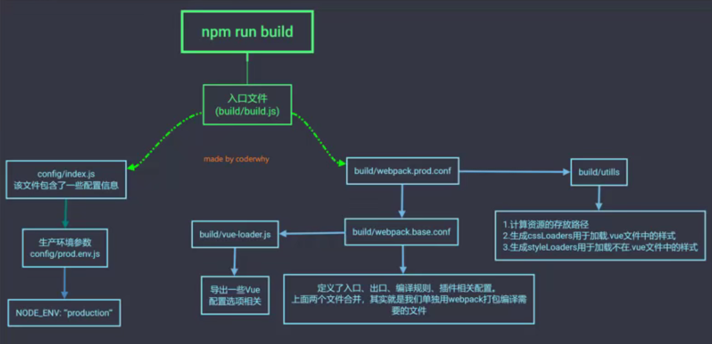

## npm run dev 的 解析过程

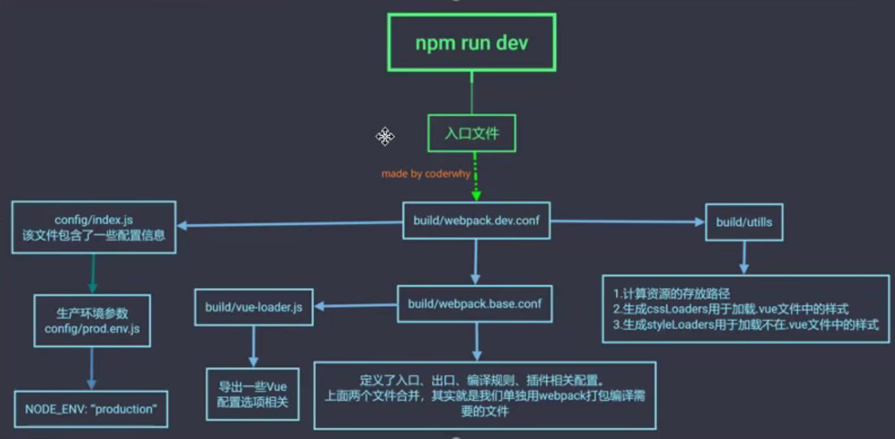

## 修改配置：webpack.base.conf.js别名

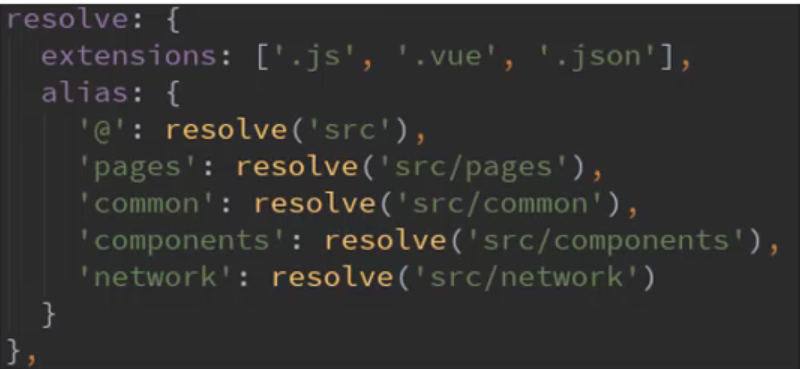

# Vue CLI3

```
2和3的区别
  vue-cli 3是基于webpack 4打造, vue-cli 2还是webapck 3
  vue-cli 3的设计原则是"0配置” ,移除的配置文件根目录下的, build和config等目录
  vue-cli 3提供了vue ui命令,提供了可视化配置,更加人性化
  移除了static文件夹,新增了public文件夹,并且index.html移动到public中
```

### 创建project vue create my-project

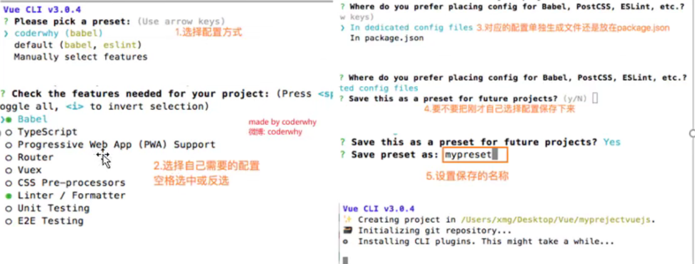

```
可以把保存的配置文件删掉，路径
大部分全局（git/vue）工具的全局配置文件都会存放在c/users/administrator里面
c/users/administrator/.vuerc

rc -> run command
vcs -> version control system
```

```
main.js

new Vue({
  render: h => h(App),
}).$mount('#app')

new Vue({
	el: '#app',
  render: h => h(App),
})

这里 el 和 .$mount 没有什么区别，
el就是 在运行 .$mount 的时候再加上了一层判断
```

### 目录结构

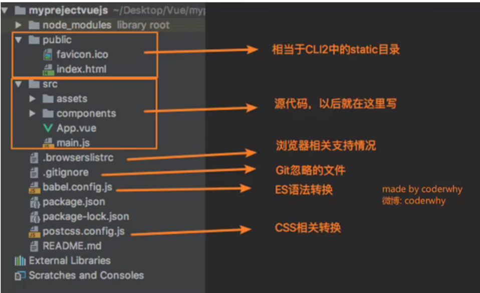

### vue ui

```
一个图形界面化的操作
```

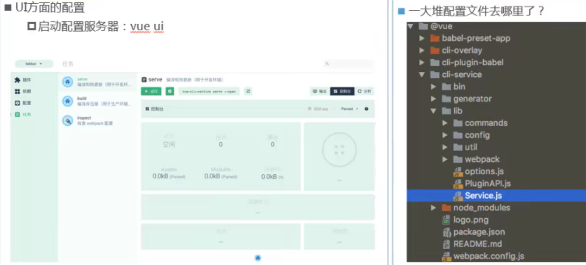

### vuecli3 的cliservice 配置

```
vue cli3的配置查看，因为它隐藏了，
cli-service -> lib -> webpack.config.js
```

```
自己修改一些不满足的情况
vue.config.js
里面可以修改配置

module.exports = { }
```

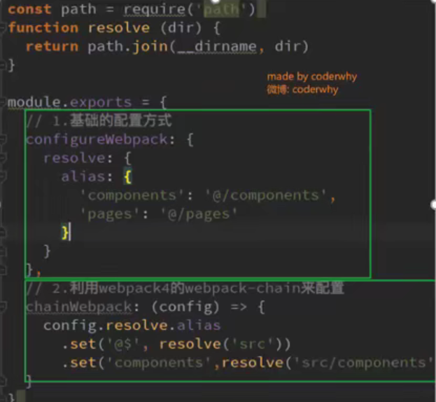


# Vue Router

### 认识路由

```
路由是一个网络工程里面的术语。
路由( routing )就是通过互联的网络把信息从源地址传输到目的地址的活动. ---维基百科
```

```
在生活中,我们有没有听说过路由的概念呢?当然了,路由器嘛.
路由器是做什么的?你有想过吗?
路由器提供了两种机制:路由和转送.
	路由是决定数据包从来源到目的地的路径.
	转送将输入端的数据转移到合适的输出端.
路由中有一个非常重要的概念叫路由表.
	路由表本质上就是一个映射表, 决定了数据包的指向.
```

```
后端渲染，前后端分离，前端路由
jsp				jQuery		vue-router
```

#### 改变url，页面不进行刷新

```
使用的hash
location.hash = 'foo';

使用history
push 和 back	go
可以返回
history.pushState({}, '', 'home')
history.back()	
history.go(-1)
不能返回
history.replaceState({}, '', 'about')
```


```
angular -> ngRouter
react -> reactRouter
vue -> vue-router
```

```
当然我们的重点是vue-router
	vue-router是Vue.js官方的路由插件,它和vue.js是深度集成的,适合用于构建单页面应用。
	我们可以访问其官方网站对其进行学习: https://router.vuejs.org/zh/
vue-router是基于路由和组件的
	路由用于设定访问路径,将路径和组件映射起来.
	在vue-router的单页面应用中,页面的路径的改变就是组件的切换.
```

### vue-router基本使用

```
步骤一:安装vue-router
npm install vue-router --save

步骤二:在模块化工程中使用它(因为是一个插件, 所以可以通过Vue.use(来安装路由功能)
  ➢第一步:导入路由对象,并且调用Vue.use(VueRouter)
  ➢第二步:创建路由实例,并且传入路由映射配置
  ➢第三步:在Vue实例中挂载创建的路由实例
  
使用vue-router的步骤:
	第一步:创建路由组件
	第二步:配置路由映射:组件和路径映射关系
	第三步:使用路由:通过<router-link>和<router-view>
```

```
1.先导入vue实例和vue-router实例
import  VueRouter from 'vue-router';
import Vue from 'vue';

2. 通过Vue.use(插件)，安装插件
Vue.use(VueRouter);

创建 router路由对象
const routes = [

]

const router = new VueRouter({
	配置路由和组件之间的应用关系
	routes
})

4.导出router实例
将 router 对象传入到Vue实例
export default router
```

```
main.js
这里虽然没有写到index.js文件，但是没有写会默认为index.js
import router from './router'

new Vue({
	el: '',
	router,
	render: ''
})
```

```
组件和路由的映射
router/index.js

import Home from '../components/Home';
import About from '../components/About';

routes = [
	{
		path: '/home',
		component: Home
	},
	{
		path: '/about',
		component: About
	}
]
```

```
这是vue-router 的
router-link to='home'

router-view
```

#### 使用步骤

##### 创建router实例

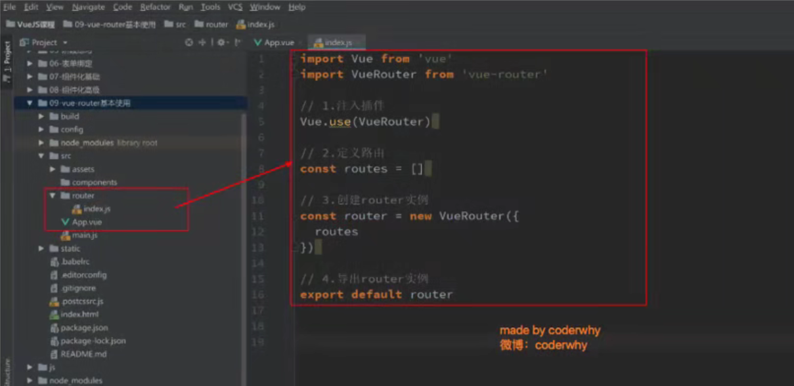

##### 挂载到 vue实例中

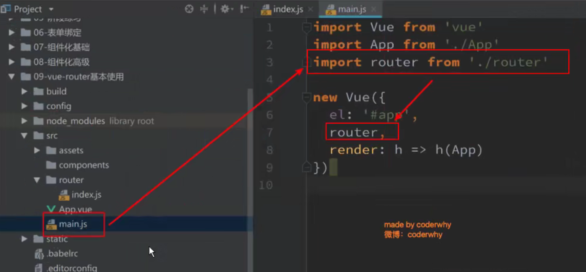

##### 创建路由组件

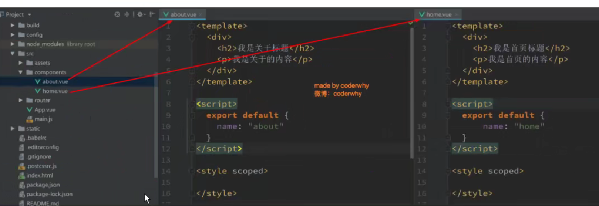

##### 配置组件和路径的映射关系

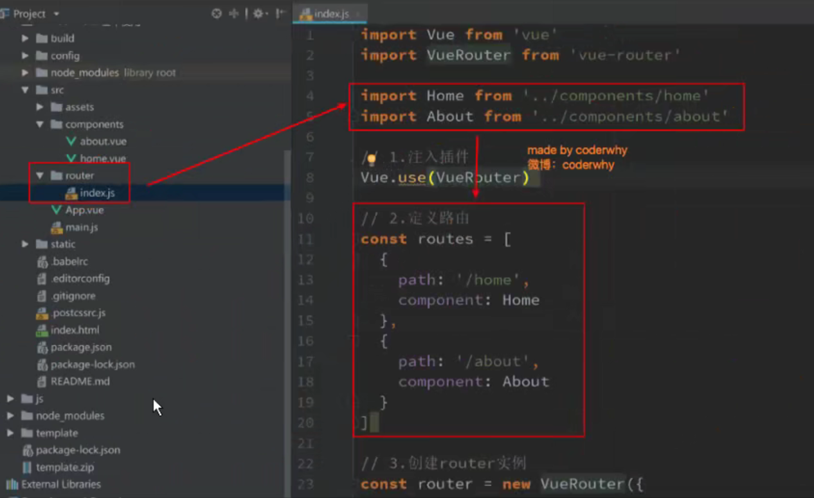

##### 使用路由

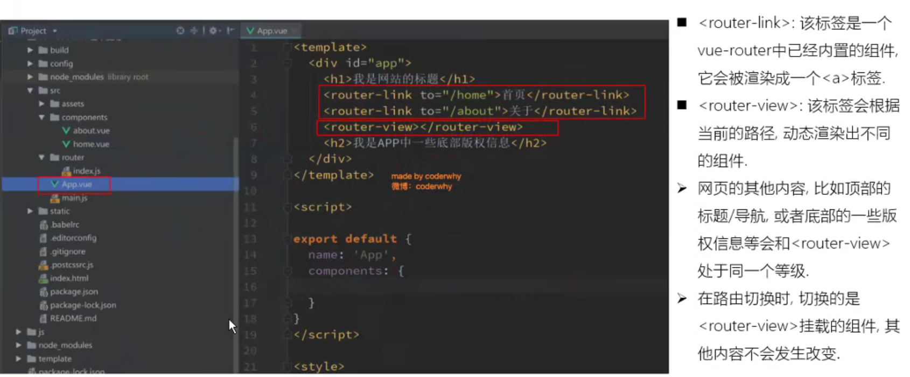

```
<router-link>:该标签是一个vue-router中已经内置的组件,它会被渲染成一个<a>标签.
< router-view>:该标签会根据当前的路径,动态渲染出不同的组件.
网页的其他内容,比如顶部的标题/导航,或者底部的一些版权信息等会和<router-view>处于同一个等级.
在路由切换时,切换的是<router-view>挂载的组件,其他内容不会发生改变.
```

#### 路由默认路径

```
默认情况下，进入网站的首页,我们希望<router-view>渲染首页的内容.
但是我们的实现中,默认没有显示首页组件,必须让用户点击才可以

配置映射
path: '/',  | ''
这个可以，但是没有把url改变
component: Home
使用重定向 redirect
redirect: '/home'

配置解析
  我们在routes中又配置了一个映射.
  path配置的是根路径: /
  redirect是重定向,也就是我们将根路径重定向到/home的路径下,这样就可以得到我们想要的结果了.
```

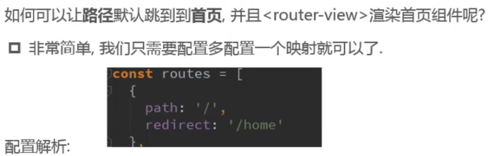

#### 修改模式 hash和history

```
在router， index.js
const router = new VueRouter({
	routes,
	mode: 'history'
})
```

#### router-link

```
router-link to='/home' tag='button' replace active-class='active'

这样也可以
router/index.js
const router = new VueRouter({
	linkActiveClass: 'active'
})
```

```
在前面的<router-link>中,我们只是使用了一一个属性: to,用于指定跳转的路径.
<router-link>还有一些其他属性:

	tag: tag可以指定<router-link>之后渲染成什么组件,比如上面的代码会被渲染成一个<li> 元素,而不是<a>					<router-link to='/home' tag='li'>
	replace: replace不会留下history记录,所以指定replace的情况下，后退键返回不能返回到上一个页面中
	active-class: 当<router-link>对应的路由匹配成功时,会自动给当前元素设置一 个router-link-active的class,
设置active-class可以修改默认的名称.
  ➢在进行高亮显示的导航菜单或者底部tabbar时,会使用到该类.
  ➢但是通常不会修改类的属性,会直接使用默认的router-link-active即可.
```

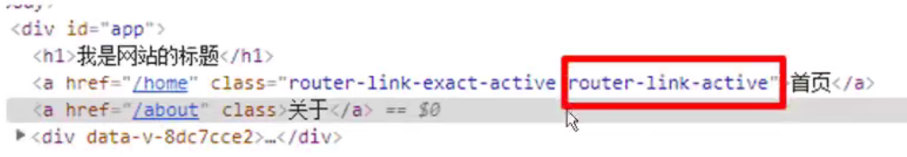

#### 补充

```
active-class 可以通过router的实例属性进行修改
```

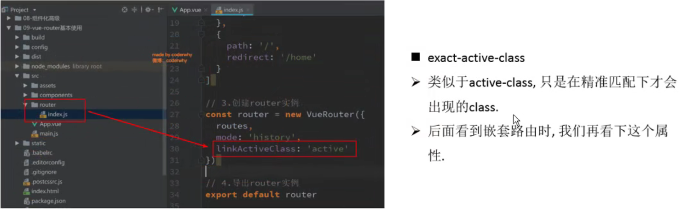

##### 路由代码跳转

```
通过代码的方式修改路由
history.pushState 不要这样写，这样会绕过了 vue-router

$router 路由创建时会加上的属性
this.$router.push('/home')
this.$router.replace('/home')
```

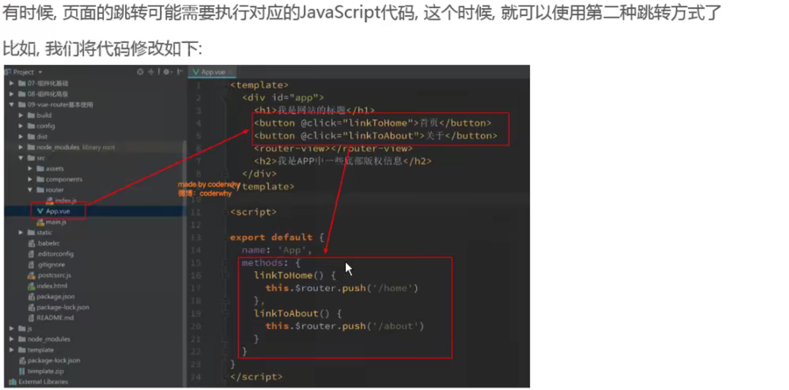

##### 动态路由的使用

```
页面的路径不确定，可能加上了用户的id

router/index.js

path: '/user/:id',
component: User

router-link to='/user/zs'
router-link :to="'/user/' + id"

this.$router 就是创建的 const router = new VueRouter({}) 对象
this.$route 就是处于活跃状态的路由， /home   /about

this.$route.params.id(这个id是path里面的那个:id)
```

##### 路由的懒加载

```

```


### vue-router嵌套路由

### vue-router参数传递

### vue-router导航守卫

### keep-alive


# Vuex


# axios 网络请求封装


# end