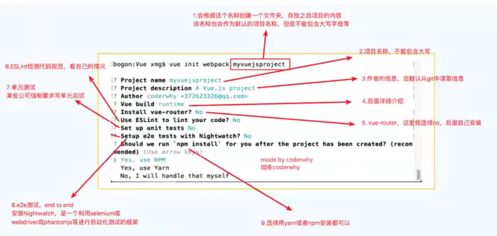
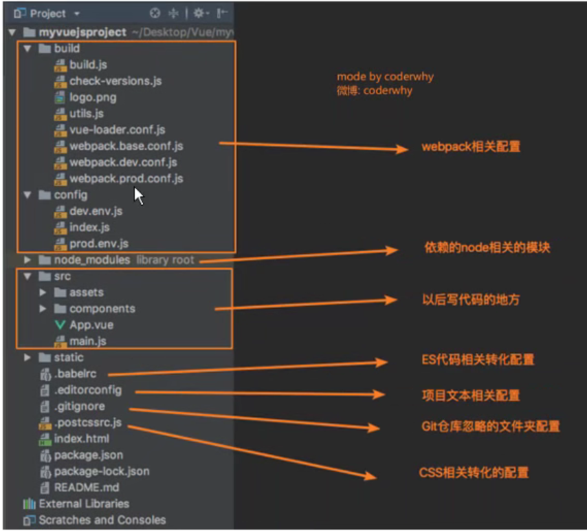
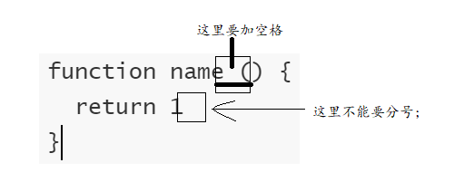
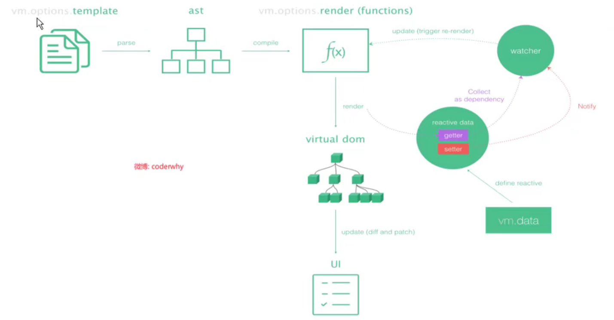

# VueCLI

## 什么是VueCLI

```
如果你只是简单写几个Vue的Demo程序,那么你不需要Vue CLI.
如果你在开发大型项目,那么你需要,并且必然需要使用Vue CLI
  使用Vue.js开发大型应用时,我们需要考虑代码目录结构、项目结构和部署、热加载、代码单元测试等事情。
  如果每个项目都要手动完成这些工作,那无疑效率比较低效,所以通常我们会使用一些脚手架工具来帮助完成这些事情。
CLI是什么意思
  CLI是Command-Line Interface,翻译为命令行界面,但是俗称脚手架.
  Vue CLI是一个官方发布vue.js项目脚手架
  使用vue-cli可以快速搭建Vue开发环境以及对应的webpack配置.
VueCLI -> webpack -> NodeJS
```

## 使用

```
安装
npm install -g @vue/cli	脚手架3
使用 查看版本
vue --version

脚手架2
npm install -g @vue/cli-init
```

```
初始化项目
cli2
vue init webpack my-project

cli3
vue create my-project
```

```
vue全家桶
vue-core	vue-router	vuex
```

### 创建

```
ESLint	限制代码规范
e2e test -> 端到端测试 selenium或webdriver等。。
npm / yarn	npm是node的，但是早期并没有那么好用，所以谷歌和Facebook联合推出了yarn
```



### 项目目录结构



## es lint



## runtime-compiler && runtime-only

```
区别
在src/main.js
```

```
runtime-compiler

new Vue({
	el: '#app',
	template: '<App/>',
	components: { App }
})
```

```
runtime-only

new Vue({
	el: '#app',
	//render: 渲染   => 箭头函数
	render: h => h(App)
})
```

## 箭头函数

```
h => h(App)

function(h) {
	return h(App)
}
```

## Vue程序运行过程




# Vue Router


# Vuex


# axios 网络请求封装


# end