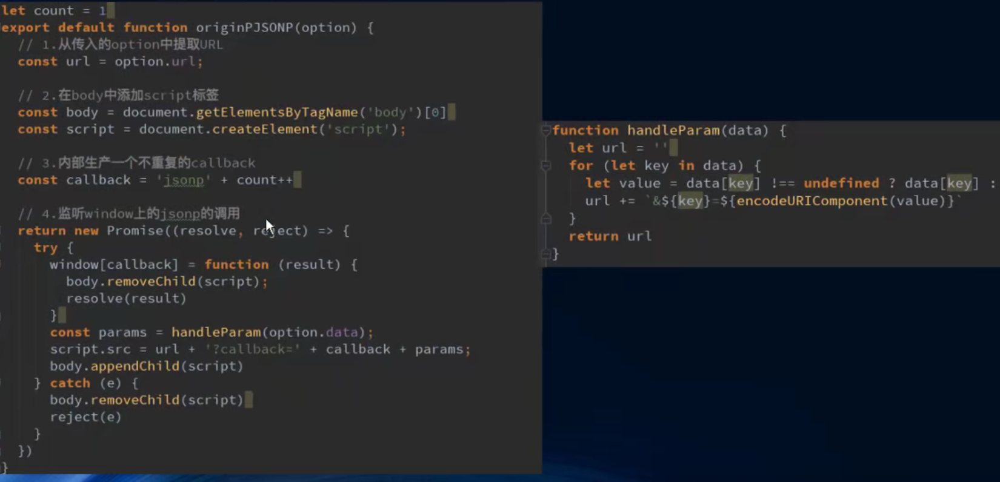

# VueCLI

## 什么是VueCLI

```
如果你只是简单写几个Vue的Demo程序,那么你不需要Vue CLI.
如果你在开发大型项目,那么你需要,并且必然需要使用Vue CLI
  使用Vue.js开发大型应用时,我们需要考虑代码目录结构、项目结构和部署、热加载、代码单元测试等事情。
  如果每个项目都要手动完成这些工作,那无疑效率比较低效,所以通常我们会使用一些脚手架工具来帮助完成这些事情。
CLI是什么意思
  CLI是Command-Line Interface,翻译为命令行界面,但是俗称脚手架.
  Vue CLI是一个官方发布vue.js项目脚手架
  使用vue-cli可以快速搭建Vue开发环境以及对应的webpack配置.
VueCLI -> webpack -> NodeJS
```

## 使用

```
安装
npm install -g @vue/cli	脚手架3
使用 查看版本
vue --version

脚手架2
npm install -g @vue/cli-init
```

```
初始化项目
cli2
vue init webpack my-project

cli3
vue create my-project
```

```
vue全家桶
vue-core	vue-router	vuex
```

### 创建

```
ESLint	限制代码规范
e2e test -> 端到端测试 selenium或webdriver等。。
npm / yarn	npm是node的，但是早期并没有那么好用，所以谷歌和Facebook联合推出了yarn
```


### 项目目录结构


## es lint


## runtime-compiler && runtime-only

```
区别
在src/main.js
```

```
runtime-compiler

new Vue({
	el: '#app',
	template: '<App/>',
	components: { App }
})
```

```
runtime-only

new Vue({
	el: '#app',
	//render: 渲染   => 箭头函数
	render: h => h(App)
})
```

### 箭头函数

```
一般很少使用，一般是把函数作为一个参数的时候使用的才比较多

h => h(App)

function(h) {
	return h(App)
}
```

#### 基本使用

```
定义函数的方式
const a = function() {}
const o = {
	b() {}
	c: function() {}
}
箭头函数
const c = (参数列表) => {}
const c = () => {
	
}
```

#### 参数和返回值

```
(n1, n2) => {
	return n1 + n2;
}
(n1, n2) => n1+n2

n => { return n*n }

() => {
	
}
```

#### this指向

```
箭头函数中的this引用的就是最近作用域中的this
箭头函数的this是向外层作用域中，一层层查找this，直到有this的定义

const o = {
	a() {
		function.call(window)，这里面，在调用的时候，会通过call，
		setTimeout(function() {
			this.log	window
		}, 1000)
		
		this.log
		
		setTimeout(() => {
			this.log	o对象
		}, 1000)
	}
}
```

```
const obj = {
	a() {
		setTimeout(function() {
			setTimeout(function() {
				这里使用的funtion，直接window
				this.log		//window
			})
			
			this.log	//window
			
			setTimeout(() => {
				这里是使用的箭头函数，所以向上一个作用域寻找,上一个作用域：window
				this.log		//window
			})
		})
		
		setTimeout(() => {
			setTimeout(function() {
				这里使用的function，所以window
				this.log		//window
			})
			
			this.log
			
			setTimeout(() => {
				这里使用的箭头函数，所以this指向上级，obj
				this.log		//obj
			})
		})
	}
}

obj.a();
```

### Vue程序运行过程

```
当我们把template模板传给vue的时候，vue会保存在vue的实例下的options里面，
然后会把template parse（解析）
解析成一个ast的抽象语法树（abstract syntax tree）
然后进行 compile（编译）
变成 render（functions）render函数，也是放在vue实例的options里面
之后就是通过render函数最终编译成一个virtual dom（虚拟dom）
然后virtual dom通过diff和patch update渲染成真实的dom UI

template -(parse)-> ast -(compile)-> render -(render)-> virtual dom -(update)-> UI
```


```
所以 compile和only的区别就是
compile是使用的template
步骤：
template -(parse)-> ast -(compile)-> render -(render)-> virtual dom -(update)-> UI

only是使用的render
步骤：
render -(render)-> virtual dom -(update)-> UI
1.性能更好，因为少处理了几步
2.代码量也少，因为少了template到render的代码部分
```

### only

```
return createElement(
  'h2',
  {class:'box'},
  ['hello vue', 
  	createElement(
      'button',
      ['按钮'])])
```

```
const app = {
	template: 'div',
	data() {
		return {
			
		}
	}
}

template: {	cpn }
或者
render: function(createElement) {
	return createElement(cpn)
}
```

```
所以.vue文件是由 vue-template-compiler 进行解析的,
把vue文件的tempalte解析为了render函数
```

## npm run build 的解析过程


## npm run dev 的 解析过程


## 修改配置：webpack.base.conf.js别名


# Vue CLI3

```
2和3的区别
  vue-cli 3是基于webpack 4打造, vue-cli 2还是webapck 3
  vue-cli 3的设计原则是"0配置” ,移除的配置文件根目录下的, build和config等目录
  vue-cli 3提供了vue ui命令,提供了可视化配置,更加人性化
  移除了static文件夹,新增了public文件夹,并且index.html移动到public中
```

### 创建project vue create my-project


```
可以把保存的配置文件删掉，路径
大部分全局（git/vue）工具的全局配置文件都会存放在c/users/administrator里面
c/users/administrator/.vuerc

rc -> run command
vcs -> version control system
```

```
main.js

new Vue({
  render: h => h(App),
}).$mount('#app')

new Vue({
	el: '#app',
  render: h => h(App),
})

这里 el 和 .$mount 没有什么区别，
el就是 在运行 .$mount 的时候再加上了一层判断
```

### 目录结构


### vue ui

```
一个图形界面化的操作
```


### vuecli3 的cliservice 配置

```
vue cli3的配置查看，因为它隐藏了，
cli-service -> lib -> webpack.config.js
```

```
自己修改一些不满足的情况
vue.config.js
里面可以修改配置

module.exports = { }
```


# Vue Router

### 认识路由

```
路由是一个网络工程里面的术语。
路由( routing )就是通过互联的网络把信息从源地址传输到目的地址的活动. ---维基百科
```

```
在生活中,我们有没有听说过路由的概念呢?当然了,路由器嘛.
路由器是做什么的?你有想过吗?
路由器提供了两种机制:路由和转送.
	路由是决定数据包从来源到目的地的路径.
	转送将输入端的数据转移到合适的输出端.
路由中有一个非常重要的概念叫路由表.
	路由表本质上就是一个映射表, 决定了数据包的指向.
```

```
后端渲染，前后端分离，前端路由
jsp				jQuery		vue-router
```

#### 改变url，页面不进行刷新

```
使用的hash
location.hash = 'foo';

使用history
push 和 back	go
可以返回
history.pushState({}, '', 'home')
history.back()	
history.go(-1)
不能返回
history.replaceState({}, '', 'about')
```


```
angular -> ngRouter
react -> reactRouter
vue -> vue-router
```

```
当然我们的重点是vue-router
	vue-router是Vue.js官方的路由插件,它和vue.js是深度集成的,适合用于构建单页面应用。
	我们可以访问其官方网站对其进行学习: https://router.vuejs.org/zh/
vue-router是基于路由和组件的
	路由用于设定访问路径,将路径和组件映射起来.
	在vue-router的单页面应用中,页面的路径的改变就是组件的切换.
```

### vue-router基本使用

```
步骤一:安装vue-router
npm install vue-router --save

步骤二:在模块化工程中使用它(因为是一个插件, 所以可以通过Vue.use(来安装路由功能)
  ➢第一步:导入路由对象,并且调用Vue.use(VueRouter)
  ➢第二步:创建路由实例,并且传入路由映射配置
  ➢第三步:在Vue实例中挂载创建的路由实例
  
使用vue-router的步骤:
	第一步:创建路由组件
	第二步:配置路由映射:组件和路径映射关系
	第三步:使用路由:通过<router-link>和<router-view>
```

```
1.先导入vue实例和vue-router实例
import  VueRouter from 'vue-router';
import Vue from 'vue';

2. 通过Vue.use(插件)，安装插件
Vue.use(VueRouter);

创建 router路由对象
const routes = [

]

const router = new VueRouter({
	配置路由和组件之间的应用关系
	routes
})

4.导出router实例
将 router 对象传入到Vue实例
export default router
```

```
main.js
这里虽然没有写到index.js文件，但是没有写会默认为index.js
import router from './router'

new Vue({
	el: '',
	router,
	render: ''
})
```

```
组件和路由的映射
router/index.js

import Home from '../components/Home';
import About from '../components/About';

routes = [
	{
		path: '/home',
		component: Home
	},
	{
		path: '/about',
		component: About
	}
]
```

```
这是vue-router 的
router-link to='home'

router-view
```

#### 使用步骤

##### 创建router实例


##### 挂载到 vue实例中


##### 创建路由组件


##### 配置组件和路径的映射关系


##### 使用路由


```
<router-link>:该标签是一个vue-router中已经内置的组件,它会被渲染成一个<a>标签.
< router-view>:该标签会根据当前的路径,动态渲染出不同的组件.
网页的其他内容,比如顶部的标题/导航,或者底部的一些版权信息等会和<router-view>处于同一个等级.
在路由切换时,切换的是<router-view>挂载的组件,其他内容不会发生改变.
```

#### 路由默认路径

```
默认情况下，进入网站的首页,我们希望<router-view>渲染首页的内容.
但是我们的实现中,默认没有显示首页组件,必须让用户点击才可以

配置映射
path: '/',  | ''
这个可以，但是没有把url改变
component: Home
使用重定向 redirect
redirect: '/home'

配置解析
  我们在routes中又配置了一个映射.
  path配置的是根路径: /
  redirect是重定向,也就是我们将根路径重定向到/home的路径下,这样就可以得到我们想要的结果了.
```


#### 修改模式 hash和history

```
在router， index.js
const router = new VueRouter({
	routes,
	mode: 'history'
})
```

#### router-link

```
router-link to='/home' tag='button' replace active-class='active'

这样也可以
router/index.js
const router = new VueRouter({
	linkActiveClass: 'active'
})
```

```
在前面的<router-link>中,我们只是使用了一一个属性: to,用于指定跳转的路径.
<router-link>还有一些其他属性:

	tag: tag可以指定<router-link>之后渲染成什么组件,比如上面的代码会被渲染成一个<li> 元素,而不是<a>					<router-link to='/home' tag='li'>
	replace: replace不会留下history记录,所以指定replace的情况下，后退键返回不能返回到上一个页面中
	active-class: 当<router-link>对应的路由匹配成功时,会自动给当前元素设置一 个router-link-active的class,
设置active-class可以修改默认的名称.
  ➢在进行高亮显示的导航菜单或者底部tabbar时,会使用到该类.
  ➢但是通常不会修改类的属性,会直接使用默认的router-link-active即可.
```


#### 补充

```
active-class 可以通过router的实例属性进行修改
```


##### 路由代码跳转

```
通过代码的方式修改路由
history.pushState 不要这样写，这样会绕过了 vue-router

$router 路由创建时会加上的属性
this.$router.push('/home')
this.$router.replace('/home')
```


##### 动态路由的使用

```
页面的路径不确定，可能加上了用户的id

router/index.js

path: '/user/:id',
component: User

router-link to='/user/zs'
router-link :to="'/user/' + id"

this.$router 就是创建的 const router = new VueRouter({}) 对象
this.$route 就是处于活跃状态的路由， /home   /about

this.$route.params.id(这个id是path里面的那个:id)
```

##### vue-router打包文件的解析

```
dist/static/js
	app.js 当前应用程序开发的所有代码（业务代码）
	vendor.js	vendor，提供商，第三方，  就是引用的第三方的东西 vue，vue-router
	manifest.js	为打包的代码做底层支撑， 我们写的导入导出，的一些实现
```

##### 路由的懒加载

```
当打包构建应用时, Javascript包会变得非常大,影响页面加载。
如果我们能把不同路由对应的组件分割成不同的代码块,然后当路由被访问的时候才加载对应组件,这样就更加高效了

首先,我们知道路由中通常会定义很多不同的页面.
这个页面最后被打包在哪里呢? 一般情况下，是放在一个js文件中.
但是,页面这么多放在一个js文件中,必然会造成这个页面非常的大.
如果我们一次性从服务器请求下来这个页面,可能需要花费一定的时间,甚至用户的电脑上还出现了短暂空白的情况.
如何避免这种情况呢?使用路由懒加载就可以了.
```


###### 懒加载方式

```
1.结合Vue的异步组件和webpack代码分析

const Home = resulve => { 
	require.ensure(['../components/Home.vue'], () => {	  																	resolve(require('../components/Home.vue')) 
	})
}
```

```
2.AMD写法

const About = resolve => require(['../components/About.vue'], resolve);
```

```
3.在ES6中,我们可以有更加简单的写法来组织Vue异步组件和Webpack的代码分割.

const Home = () => import('../components/Home.vue')
```

```
一个懒加载对应一个js文件
```

### vue-router嵌套路由

```
比如在home页面中，我们希望通过/home/news和/home/message访问一些内容.
一个路径映射一个组件,访问这两个路径也会分别渲染两个组件.
```

```

```


#### 步骤

##### index.js 路由配置

```
不要加 / 
```


##### Home.vue配置


##### 默认路径


### vue-router参数传递

```
Profile.vue
```

```
传递参数的类型： params && query

params
  配置路由格式: /router/:id
  传递的方式:在path后面跟上对应的值
  传递后形成的路径: /router/123, /router/abc
  router-link :to="'/user' + id"
使用
	$route.params.id
	
query
  配置路由格式: /router,也就是普通配置
  传递的方式:对象中使用query的key作为传递方式
  传递后形成的路径: /router?id= 123, /router?id=abc
  router-link :to="{path: '/profile', query: {name: 'why', age: 18}}"	也可以只是用path		来代替以前的那些路径的写法
使用
	$route.query.name
```

```
url:
	协议(Scheme)（http）:localhost(主机):port(80可以不写)/path?query
	scheme://host:port/ path?query#fragment
```

```
使用函数代码进行传递
this.$router.push('/user/' + this.id);
this.$router.push({
	path: '/profile',
	query: {
		name: 'kobe',
		age: 18
	}
});
```

```
所有的组件都继承自vue的原型

Vue.protorype.$router = 'haha';

router and route 区别
  $router为VueRouter实例,想要导航到不同URL ,则使用$router.push方法
  $route为当前router跳转对象里面可以获取name、path、 query. params等
```

### vue-router导航守卫

#### 全局守卫

```
生命周期函数
created() {
	在被创建时会执行
	可以使用
	document.title = 'xxx';
}

这样写的化，会每个地方都要写，很麻烦，
我们可以知道这个标题和路由的跳转有关的，所以我们可以使用全局导航守卫，
main.js
router.beforeEach((to, from, next) => {
	从from jump to to
	这里使用 Mathcad是因为，/home/new 这里匹配不上，因为在子路由的原因（存在路由嵌套），所以需要使用matched来进行匹配
	document.title = to.matched[0].meta.title;
	next() this is necessary be used
})

router/index.js
在每个路由里面
{
	path: '',
	component: xx,
	meta: {	//表示元数据，描述数据的数据
		titile: 'xxxx'
	}
}
```


```
钩子（hook）：回调
这里是守卫 guard
前置钩子，在跳转之前进行修改  beforeEach
后置钩子，跳转后，afterEach(to, from)
	后置钩子不用调next（）函数
	
next('/')，可以跳转到/页面
	
上面这种导航守卫是全局守卫，
	除了全局守卫之外，还有： 路由独享的守卫	组件内的守卫
```

#### 路由独享守卫


#### 组件内的守卫

```
beforeRouteEnter
beforeRouteUpdate
beforeRouteLeave
```


### keep-alive

#### 使用

```
缓存组件状态

使用
keep-alive
	router-view
```

```
一个生命周期
这两个函数，只有该组件被保持了状态使用了keep-alive状态时，才是有效的
activated 活跃的
activated() {

}
deactivated 不活跃的
```

#### keep-alive属性

```
keep-alive是Vue内置的一个组件,可以使被包含的组件保留状态,或避免重新渲染。
它们有两个非常重要的属性:
  include -字符串或正则表达,只有匹配的组件会被缓存
  exclude -字符串或正则表达式,任何匹配的组件都不会被缓存
router-view也是一个组件 ,如果直接被包在keep-alive里面,所有路径匹配到的视图组件都会被缓存:
```


```
exclude='User'  这里的User就是User.vue里面的name
```


```
先创建，在销毁
这里不能随便加空格，
```


# 文件路径引用问题，别名alias，@

```
文件夹起别名
在webpack.base.conf.js 里面

这里是给src起了别名alias @
使用 @/components/tabbar/TabBar.vue

经常添加的别名alias
这里添加别名，不能使用前面的 
'assets': resolve('@/assets')	  这里使用了前面使用的@，不能
'assets': resolve('src/assets')		use:	assets/xx/xx
'components'
'views'
```


```
使用别名之后，正常只有import导入才能使用
img src='~assets/xx/xxx' 要使用波浪符号
```

# Vuex

## vuex是做什么的

```
官方解释: Vuex是一个专为Vue.js应用程序开发的状态管理模式。
  它采用集中式存储管理应用的所有组件的状态,并以相应的规则保证状态以一种可预测的方式发生变化。
  Vuex 也集成到Vue的官方调试工具devtools extension ,提供了诸如零配置的time -travel调试、状态快照导入导出等高级调试功能。
状态管理到底是什么?
  状态管理模式、集中式存储管理这些名词听起来就非常高大上,让人捉摸不透。
  其实,你可以简单的将其看成把需要多个组件共享的变量全部存储在一 个对象里面。
  然后,将这个对象放在顶层的Vue实例中,让其他组件可以使用。
  那么,多个组件是不是就可以共享这个对象中的所有变量属性了呢?
等等,如果是这样的话,为什么官方还要专门出一个插件Vuex呢?难道我们不能自己封装一个对象来管理吗 ?
  当然可以,只是我们要先想想VueJS带给我们最大的便利是什么呢?没错,就是响应式。
  如果你自己封装实现一个对象能不能保证它里面所有的属性做到响应式呢?当然也可以,只是自己封装可能稍微麻烦一些。
  不用怀疑, Vuex就是为了提供这样一个在多 个组件间共享状态的插件,用它就可以了。
```

```
简单来想，就是在vue原型里面加入一个对象，因为所有的vue组件都是继承于vue原型的
Vue.prototype.shareObj = shareObj;
```

## 单界面到多界面状态管理

```
有什么状态是需要我们在多个组件之间共享的呢
  如果你做过大型开放,你一定遇到过多个状态,在多个界面间的共享问题。
  比如用户的登录状态、用户名称、头像、地理位置信息等等。
  比如商品的收藏、购物车中的物品等等。
  这些状态信息,我们都可以放在统- -的地方 ,对它进行保存和管理,而且它们还是响应式的(待会儿我们就可以看到代码了,莫着急)。
  
talk is cheap, show me the code (Linus)
```

### 单界面状态管理

```
state
	data() {return {}}
	State :不用多说,就是我们的状态。( 你姑且可以当做就是data中的属性)
view
	{{mess}}
	View :视图层,可以针对State的变化,显示不同的信息。( 这个好理解吧? )
actions
	act
	Actions :这里的Actions主要是用户的各种操作:点击、输入等等，会导致状态的改变。
```


### 多页面的状态管理

```
Vue已经帮我们做好了单个界面的状态管理,但是如果是多个界面呢?
  多个试图都依赖同一个状态( -个状态改了,多个界面需要进行更新)
  不同界面的Actions都想修改同一个状态( Home.vue需要修改, Profile.vue也需要修改这个状态)
也就是说对于某些状态(状态1/状态2/状态3)来说只属于我们某一个试图 ,但是也有一-些状态(状态a/状态b/状态c)属于多个试图共同想要维护的
  状态1/状态2/状态3你放在自己的房间中,你自己管理自己用,没问题。
  但是状态a/状态b/状态c我们希望交给一个大管家来统一 帮助我们管理! ! !
  没错, Vuex就是为我们提供这个大管家的工具。
全局单例模式(大管家)
  我们现在要做的就是将共享的状态抽取出来,交给我们的大管家,统一进行管理。
  之后,你们每个试图,按照我规定好的规定,进行访问和修改等操作。
  这就是Vuex背后的基本思想。
```

```
devtool 这个是vue提供的一个浏览器插件，可以记录每次修改state的状态，前提是要在Mutations
	安装，在浏览器进行插件的添加，搜索vue
actions 是可以不需要的，但是 mutations不能进行异步操作，会跟踪不到，所以actions可以用来进行异步操作，mutations只能用于同步，所以actions连接的是backend API 	[backend:后端，frontend:前端]
```


#### 使用

```
npm install vuex -S

创建文件夹 store 仓库
index.js
	import vue
	import vuex

	安装插件
	Vue.use(Vuex)	这里会执行vuex的install方法

	创建对象
	const store = new Vuex.Store({
		state: {
			counter: 100
		},
		mutations: {
			increment() {
				state,默认就有
				state.counter++
			},
			decrement() {
				state.counter--
			}
		},
		actions: {},
		getters: {},
		modules: {}
	})
	
	导出 store 独享
	export default store
	
然后就在main.js
	import store from './store'
	
	Vue.prototype.$store = store
	其他地方可以用$store来使用
```

```
使用
	const store = new Vuex.Store({
		state: {
			counter: 100
		}
	})
	
	other use
	$store.state.counter
	
	addition() {
		不是这样
		this.$store.mutations.increment();
		
		this.$store.commit('increment')
	}
	
	修改数据时，不希望直接进行数据的修改
```

#### devtools 的界面


## Vuex的核心core概念

```
state
	单一状态树
getters
mutation
action
module
```

## state单一状态树

```
Vuex提出使用单一状态树,什么是单一状态树呢?
  英文名称是Single Source of Truth ,也可以翻译成单-数据源。
但是,它是什么呢?我们来看-个生活中的例子。
  OK ,我用一个生活中的例子做一个简单的类比。
  我们知道,在国内我们有很多的信息需要被记录,比如上学时的个人档案,工作后的社保记录,公积金记录,结婚后的婚姻信息,以及其他相关的户口、医疗文凭房产记录等等(还有很多信息)。
  这些信息被分散在很多地方进行管理,有一天你需要办某个业务时(此如入户某个城市) ,你会发现你需要到各个对应的工作地点去打印、盖章各种资料信息,最后到一个地方提交证明你的信息无误。
  这种保存信息的方案,不仅仅低效,而且不方便管理,以及日后的维护也是- - 个庞大的工作(需要大量的各个部]的人力来维护,当然国家目前已经在完善我们的这个系统了)。
这个和我们在应用开发中比较类似:
  如果你的状态信息是保存到多个Store对象中的,那么之后的管理和维护等等都会变得特别困难。
  所以Vuex也使用了单一-状态树来管理应用层级的全部状态。
  单一状态树能够让我们最直接的方式找到某个状态的片段,而且在之后的维护和调试过程中,也可以非常方便的管理和维护。
```

## getters 基本使用basic use


```
getters: {
	powerCounter(state) { return state.counter^2 }
}

作为 一个属性，而不是一个方法
$store.getters.powerCounter

使用computed:计算属性
computed: { more20stu() {
	return this.$store.state.students.filter(s => s.age>=20)
}}
上面这个是放在组件的，所以如果其他组件要使用也得写，所以我们可以放在getters里面
```

### getters作为参数和传递参数

```
getters: {
	more(state) {
		state.students.filter(s => s.age > 20)
	},
	moreLength(state, getters) {
		return getters.more.length;
	}
}
```

### getters返回函数

```
getters: {
	age(state) {
		return function(age) {
			return state.students.filter(s => s.age > age)
		}
	}
}

调用
这里，前面的
	$store.getters.age将会在getters里面调用，并返回一个函数，所以后面再加上()进行函数的调用
$store.getters.age(2)
```


## mutations

### mutation状态更新

```
Vuex的store状态的更新唯一方式:提交Mutation
Mutation主要包括两部分:
	字符串的事件类型( type )
	一个回调函数( handler ) ,该回调函数的第一个参数就是state。
```


### mutation传递参数

```
专业名词 payload 

在通过mutation更新数据的时候,有可能我们希望携带一 些额外的参数
	参数被称为是mutation的载荷(Payload)
Mutation中的代码:
decrement(state, n) { state. count -= n }
使用
decrement: function () { this.$store.commit('decrement', 2) }
但是如果参数不是-个呢?
	比如我们有很多参数需要传递.
	这个时候,我们通常会以对象的形式传递也就是payload是一个对象.
	这个时候可以再从对象中取出相关的信息.
changeCount(state, pay1oad) { state.count = payload.count }
使用
changeCount: function () {
	this.$store.commit('changeCount', {count: 0})
}
```

```
mutations: {
	increC(state, count) {
		state.couonter += count;
	}
}

使用
this.$store.commit('increC', 3)
```

### mutation提交风格 commit style

```
mutations: {
事件类型，
	inC(state, payload) {
    这里的payload成为了一个对象
      {
        type: 'inC',
        count: 5,
        xxx
      }
		state.counter += payload.count
	}
}

use
methods: {
	clickC(count) {
		this.$store.commit({
			type: 'inC',
			count
		})
	}
}
```


### mutation类型常量

```

```

```
放在 store/mutations-types.js

export const INCREMENT = 'increment'

导入 import
import * as const from './store/mutations-types.js'
or
import {
	INCREMENT
} from './store/mutations-types.js'

在对象里面的方法,可以这样 写
const.INCREMENT
mutations: {
	[INCREMENT]() {}
}
```


### mutation同步函数

```
通常情况下，Vuex要求我们Mutation中的方法必须是同步方法.
  主要的原因是当我们使用devtools时,可以devtools可以帮助我们捕捉mutation的快照
  但是如果是异步操作,那么devtools将不能很好的追踪这个操作什么时候会被完成.
```

## Vux响应式原理

### mutation响应规则

```
Vuex的store中的state是响应式的,当state中的数据发生改变时，Vue组件会自动更新.
这就要求我们必须遵守些Vuex对应的规则:
  提前在store中初始化好所需的属性.
  当给state中的对象添加新属性时,使用下面的方式:
  ➢方式-:使用Vue.set(obj, 'newProp', 123)
  ➢方式二:用新对象给旧对象重新赋值
```


```
每个属性都有 dep -> [watcher]
通过观察者模式
当发生数据变化了，就会通知watcher，这里watcher不只有一个，

这些属性都会被加入到响应式系统中，而响应式系统会监听属性的变化，当属性发生变化时，会通知所有男面中用到该属性的地方，让界面发生刷新
```


```
state.info['address'] = 'luo shan ji'
这样写，因为没有再state的info里面定义国address，所以这个不会加入到响应式系统里面，所以不会进行刷新

为了让其响应式
Vue.set(state.info, 'address', 'luo shan ji')
这样写就会把address加入响应式系统
Vue.delete(state.info, 'age')
```


## action

```
但是某些情况,我们确实希望在Vuex中进行一些异步操作, 比如网络请求,必然是异步的.这个时候怎么处理呢?
Action类似于Mutation,但是是用来代替Mutation进行异步操作的.
```

### basic use

```
context， payload(params)
context.commit('update')
payload or payload.aa

this.$store.dispatch('aUpdate', {
	mess: 'sss',
})
```


### 使用回调函数

```
context, payload
context.commit('update')
payload.callback()


this.$store.dispatch('aUpdate', {
	callback() {
		xxx
	}
})
```

### 使用promise进行异步的回调


## modules

### learn

```
Module是模块的意思,为什么在Vuex中我们要使用模块呢?
  Vue使用单-状态树，那么也意味着很多状态都会交给Vuex来管理.
  当应用变得非常复杂时,store对象就有可能变得相当臃肿.
  为了解决这个问题, Vuex允许我们将store分割成模块(Module),而每个模块拥有自己的state、mutations、actions、getters等
```

### basic use

```
modules: {
	a: {
		state: {},
		mutatios: {},
		actions: {},
		modules: {}
	}
}
```

分解

```
const moduleA = { }

const store = new Vuex.store({
	modules: {
		a: moduleA
	}
})
```


```
state
这里需要 .a 之后在name
$store.state.a.name

mutations
提交mutations，这里名字可以 直接写，因为他会先找 本来的mutations，如果没有才会去找 模块里面的mutations
$store.commit('aaa');

getter
直接调用，不用管
$store.getters.fullname
```

#### getter的几个参数

```
在module里面， 
第一个state， 本模块的state
第二个 getters， 本模块的getters
第三个 rootState 父级模块的state
```


## Vuex项目结构


```
就是在一个文件导出，一个文件导入

导出
const mutations = {

};
export default mutations;

导入
import mutations from './mutations.js'

const store = new Vue.store({
	mutations
})
```

# axios 网络请求封装

## 常见的网络请求模块,以及优缺点对比。

```
选择一: 传统的Ajax是基于XMLHttpRequest(XHR)
为什么不用它呢?
  非常好解释，配置和调用方式等非常混乱.
  编码起来看起来就非常蛋疼.
  所以真实开发中很少直接使用，而是使用jQuery- Ajax
  
  
选择二:在前面的学习中，我们经常会使用jQuery-Ajax
  ➢相对于传统的Ajax非常好用.
为什么不选择它呢?
  ➢首先, 我们先明确一点: 在Vue的整个开发中都是不需要使用jQuery了.
  ➢
  那么，就意味着为了方便我们进行一个网络请求，特意引用一个jQuery,你觉得合理吗?
  ➢jQuery的代码1w+行.
  ➢Vue的代码才1w+行.
  ➢完全没有必要为了用网络请求就引用这个重量级的框架.


选择三:官方在Vue1.x的时候，推出了Vue-resource.
  Vue-resource的体积相对于jQuery小很多. 
  另外Vue-resource是官方推出的.
为什么不选择它呢?
  ➢在Vue2.0退出后, Vue作者就在GitHub的Issues中说明了去掉vue-resource,并且以后也不会再更新.
  ➢那么意味着以后vue-reource不再支持新的版本时，也不会再继续更新和维护.
  ➢对以后的项目开发和维护都存在很大的隐患.


选择四:在说明不再继续更新和维护vue-resource的同时，作者还推荐了一个框架: axios为什么不用它呢?
  axios有非常多的优点，并且用起来也非常方便
  稍后，我们对他详细学习.
```


## JSONP的原理和封装

### JSONP原理回顾

```
在前端开发中，我们一种常见的网络请求方式就是JSONP 
  使用JSONP最主要的原因往往是为了解决跨域访问的问题.
JSONP的原理是什么呢?
  JSONP的核心在于通过< script>标签的src来帮助我们请求数据
  原因是我们的项目部署在domain1.com服务器上时，是不能直接访问domain2.com服务器上的资料的.
  这个时候，我们利用<script>标签的src帮助我们去服务器请求到数据，将数据当做一个javascript的函数来执行， 并且执行的过程中传入我们需要的json.
  口所以封装jsonp的核心就在F我们监听window上的jsonp进行回调时的名称.
```


### JSONP请求封装



## axios的内容详解

### 认识axios网络模块

```
特点

在浏览器中发送XMLHttpRequests请求
在node.js中发送http请求
支持Promise API
拦截请求和响应
转换请求和响应数据
等等
```

#### 请求方式

```
axios(config)
axios.request(config)
axios.get(url[, config])
axios.delete(urI[ config])
axios.head(url[ config])
axios.post(url[ data[ config]])
axios.put(urI[ data[ config]])
axios.patch(url[ data[, config]])
```

### 发送基本请求

```
install

npm install axios -S

basic use

method one
import axios from 'axios'
axios({
	url: 'https://',
	method: 'get', //post
}).then(res => res.log)

method two
axios.post(url, config)
```

```
get请求request 参数param  contact
axios({
	url: 'xxxx?type=pop&page=1',
})

axios({
	url: 'xxxx',
	params: {
		type: 'pop',
		page: 1
	}
})
```

get请求案例


#### 发送并发请求

```
使用axios.all,可以放入多个请求的数组.
axios.all(])返回的结果是一个数组,使用axios.spread可将数组[res1,res2]展开为res1, res2 
```

```
axios.all([
	axios({
		url: 'xxx',
		
	}),
	axios({
		url: 'xxx',
		params: {
			type: 'sell',
			page: 5
		}
	})
])
.then(results => {
	
})

,then(axios.spread((res1, res2) => {
	
}))
```


### axios创建实例

### axios拦截器的使用


# end