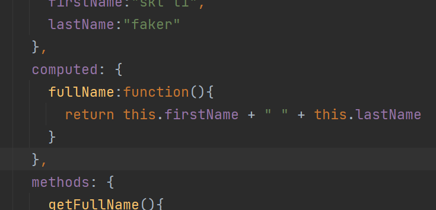
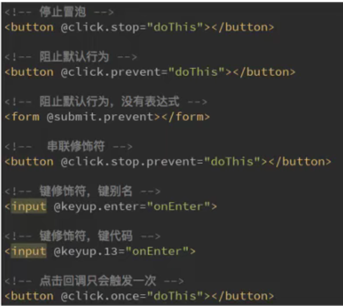
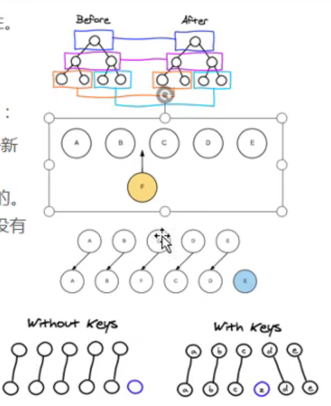
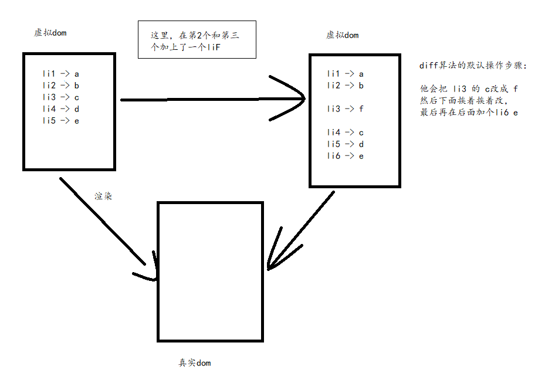
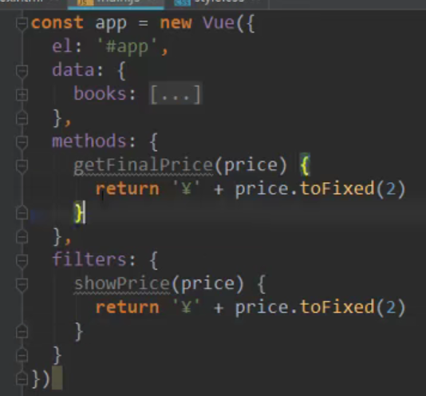

# Vue

```
unix编程艺术
代码大全
深入理解计算机原理
现代操作系统
```


## vue认识

### Vue是一个渐进式的框架

```
渐进式意味着你可以将Vue作为你应用的一部分嵌入其中,带来更丰富的交互体验。
或者如果你希望将更多的业务逻辑使用Vue实现,那么Vue的核心库以及其生态系统。
比如Core+ Vue-router+Vuex ,也可以满足你各种各样的需求。
```

### 特点和常用的高级功能

```
解耦视图和数据
可复用的组件
前端路由技术
状态管理.
虚拟DOM
```

## vue安装

1.CDN引入

2.下载引入

3.npm安装

## vue基本使用

### 开始

```
我们来阅读JavaScript代码,会发现创建了一 个Vue对象。
创建Vue对象的时候,传入了一些options: {}
{}中包含了el属性:该属性决定了这个Vue对象挂载到哪一个元素上,很明显,我们这里是挂载到了id为app的元素上。
{}中包含了data属性:该属性中通常会存储一些数据
	这些数据可以是我们直接定义出来的,比如像上面这样。
	也可能是来自网络,从服务器加载的。
```

```
  <div id="app">
      <h2>{{message}}</h2>
      <p>{{name}}</p>
  </div>
  <script>
    //let变量/const常量
    //编程范式：声明式编程
    const app = new Vue({
      el:"#app",//用于挂载要管理的元素
      data:{//定义数据
        message:"HelloVuejs",
        name:"zzz"
      }
    })
    
    //原生js做法（编程范式：命令式编程）
    //1.创建div元素，设置id属性
    //2.定义一个变量叫message
    //3.将message变量放在前面的div元素中显示
    //4.修改message数据：helloworld
    //5.将修改的元素再次替换到div
  </script>
```

```
el:
    类型: string | HTMLElement
    作用:决定之后Vue实例会管理哪一个DOM。
data:
    类型: Object| Function
    作用: Vue实例对应的数据对象。
methods:
    类型: { [key: string]: Function }
    作用:定义属于Vue的一些方法,可以在其他地方调用,也可以在指令中使用。
```

### vue for 循环列表展示

```
v-for指令	item in movies   {{ item }}
```

```
  <div id="app">
      <h2>{{message}}</h2>
      <ul>
        <li v-for="(item, index) in movies" :key="index">{{item}}</li>
      </ul>
  </div>
  <script>
    //let变量/const常量
    //编程范式：声明式编程 
    const app = new Vue({
      el:"#app",//用于挂载要管理的元素
      data:{//定义数据
        message:"你好啊",
        movies:["星际穿越","海王","大话西游","复仇者联盟"]
      }
    })
  </script>
```

### 点击按钮事件,计数器

```
v-on:click=""
这个是上面的语法糖 @click=""
```

```
  <div id="app">
      <h2>当前计数：{{count}}</h2>
      <!-- <button v-on:click="count--">-</button>
      <button v-on:click="count++">+</button> -->

      <button v-on:click="sub()">-</button>
      <button @click="add()">+</button>
  </div>
  <script>
    const app = new Vue({
      el:"#app",//用于挂载要管理的元素
      data:{//定义数据
        count:0
      },
      methods: {
        add:function(){
          console.log("add")
          this.count++
        },
        sub:function(){
          console.log("sub")
          this.count--
        }
      },
    })
  </script>
```

```
计数器的MVVM
我们的计数器中就有严格的MVVM思想
    ➢View依然是我们的DOM
    ➢Model就是我们我们抽离出来的obj
    ➢ViewModel就是我们创建的Vue对象实例
它们之间如何工作呢?
    ➢首先ViewModel通过Data Bindingli上obj中的数据实时的在DOM中显示。
    ➢其次ViewModel通过DOM Listener来监听DOM事件,并且通过methods中的操作,来改变obj中的数据。
```


## vue的MVVM

```
Model ViewModel View 
ViewModel是Model和View通信之间的桥梁，当你有数据要展示的时候，ViewModel会自动把数据绑定到View上面，当我们View有些事件或操作也是通过ViewModel
```


```
View层:
➢视图层
➢在我们前端开发中，通常就是DOM层。
➢主要的作用是给用户展示各种信息。
Model层:
➢数据层
➢数据可能是我们固定的死数据，更多的是来自我们服务器，从网络上请求下来的数据。
➢在我们计数器的案例中，就是后面抽取出来的obj,当然，里面的数据可能没有这么简单。
VueModel层:
➢视图模型层
➢视图模型层是View和Model沟通的桥梁。
➢一.方面它实现了DataBinding，也就是数据绑定，将Model的改变实时的反应到View中
➢另一方面它实现了DOM Listener， 也就是DOM监听，当DOM发生一些事件(点击、滚动、touch等)时，可以监听到，并在需要的情况下改变对应的Data。
```

## 什么叫做方法，什么叫做函数

```
方法：method,和某一个实例对象像挂钩
函数：function

函数：写在外面
function a() {}
方法：定义在类里面
function Person() { function a() {} }
```

## vue的生命周期

```
诞生到消亡的过程 
```

```

```


## vue插值操作 Mustache语法

### 什么是插值操作

Mustache语法，也就是双大括号

```
<h2>{{message}}</h2>
<h2>{{message}},啧啧啧</h2>

<!-- Mustache的语法不仅可以直接写变量，还可以写简单表达式 -->
<h2>{{firstName + lastName}}</h2>
<h2>{{firstName + " " + lastName}}</h2>
<h2>{{firstName}} {{lastName}}</h2>
<h2>{{count * 2}}</h2>
```

### v-once

```
使用了v-once，只会第一次展示数据的时候改变，后面数据改变了也不会改变,只渲染一次数据
<h2 v-once>{{message}}</h2>

v-once:
    该指令后面不需要跟任何表达式(比如之前的v-for后面是由跟表达式的)
    该指令表示元素和组件(组件后面才会学习)只渲染一次,不会随着数据的改变而改变。
```

### v-html

```
可以使用v-html指令
    ➢该指令后面往往会跟上一个string类型
	➢会将string的html解析出来并且进行渲染

表示以html展示,将数据以html形式展示
<h2 v-html="url"></h2>
url:"<a href='http://www.baidu.com'>百度一下</a>"
```

### v-text

```
将数据展示出来
<h2 v-text="message">，啧啧啧</h2>
会覆盖 "，啧啧啧"
```

### v-pre

```
不会解析
v-pre用于跳过这个元素和它子元素的编译过程,用于显示原本的Mustache语法。

<h2 v-pre>{{message}}</h2>
	{{message}}
```

### v-cloak

```
cloak 斗篷
//在vue解析前，div中有一个属性cloak
//在vue解析之后，div中没有一个属性v-cloak
所以我们可以通过style样式进行展示，让没有解析的元素不显示
  <style>
    [v-cloak]{
      display: none;
    }
  </style>

<div id='app' v-cloak> {{message}} </div>
```

## v-bind绑定属性

### 是什么

```
但是,除了内容需要动态来决定外,某些属性我们也希望动态来绑定。
    比如动态绑定a元素的href属性
    比如动态绑定img元素的src属性
这个时候,我们可以使用v- bind指令:
    作用:动态绑定属性
    缩写::
    预期: any (with argument) | Object (without argument)
    参数: attrOrProp (optional)
    
    
v-bind用于绑定一个或多个属性值,或者向另一个组件传递props值(这个学到组件时再介绍)
在开发中,有哪些属性需要动态进行绑定呢?
	还是有很多的,比如图片的链接src、网站的链接href. 动态绑定一些类、样式等等
比如通过Vue实例中的data绑定元素的src和href ,代码如下:
```

### 怎么用

```
<!-- 错误的做法这里不能使用Mustache语法 -->
<!--  -->

<!-- 正确的做法使用v-bind指令 -->

```

### 语法糖

```
在开发中，我们通常会使用语法糖的形式，因为这样更加简洁。

```

### 绑定class

#### 对象语法

```
对象语法
<!-- 动态绑定class对象用法  --> 使用类名加上Boolean值
这里，如果Boolean值为true的话，这个class就会加载到这个元素里面	·
<!-- <h2 :class="{key1:value1,key2:value2}">{{message}}</h2>
<h2 :class="{类名1:true,类名2:boolean}">{{message}}</h2> -->
<h2 class="title" :class="{active:isActive}">{{message}}</h2>

用法1.
通过{}绑定class
	:class="{'active': isActive}"
用法2.
通过判断，传入多个值
	:class="{'active': isActive, 'line: isLine'}"
用法3.
可以和普通的class存在，并不冲突
用法4.
可以放在一个methods 或者 computed 中
	:class="getClasses()"
	
	getClasses: function() {
		return {
			'active': this.isActive
		};
	}
	
```

#### 数组语法

```
数组语法

<!-- 加上单引号当成字符串 -->
<h2 class="title" :class="['active','line']">{{message}}</h2>
<!-- 不加会被当成变量 -->
<h2 class="title" :class="[active,line]">{{message}}</h2>
使用方法
<h2 class="title" :class="getClasses()">{{message}}</h2>
getClasses(){
	return [this.active,this.line]
}

```

### 动态绑定style

#### 对象语法

```
<!-- <h2 :style="{key(属性名):value(属性值)}">{{message}}</h2> -->
<!-- 加单引号，当成字符串解析 -->
<h2 :style="{fontSize:'50px'}">{{message}}</h2>
<!-- 不加单引号，变量解析 -->
<h2 :style="{fontSize:fontSize}">{{message}}</h2>
<h2 :style="getStyle()">{{message}}</h2>

fontSize:'100px'
getStyle(){
	return {fontSize:this.fontSize}
}
```

#### 数组语法

```
<h2 :style="[baseStyle]">{{message}}</h2>
baseStyle:{backgroundColor:'red'}
```

#### 绑定disabled属性

```
:disabled="true"
diabled
:disabled="item.count <= 1"
```


## 计算属性

```
有缓存，效率高
```

### 一般合并两个变量

```
<h2>{{firstName+ " " + lastName}}</h2>
<h2>{{firstName}} {{lastName}} </h2>
<h2>{{getFullName()}}</h2>

getFullName() {
	return this.firstName + " " + this.lastName;
}
```

### 使用计算属性

```
计算属性

<!-- 计算属性 -->
<h2>{{fullName}}</h2>

computed: {
    fullName:function(){
         return this.firstName + " " + this.lastName
    }
},
```



### 计算属性的复杂操作

```
<h2>总价格：{{totalPrice}}</h2>

books:[
    {id:110,name:"JavaScript从入门到入土",price:119},
    {id:111,name:"Java从入门到放弃",price:80},
    {id:112,name:"编码艺术",price:99},
    {id:113,name:"代码大全",price:150},
]

computed: {
    totalPrice(){
        let res = this.books.reduce(function (total, book) {
            return total+book.price;
        });
        console.log(res);

        let result= 0;
        for (let i = 0; i < this.books.length; i++) {
            result += this.books[i].price;
        }
        return result
    }
}
```

#### 番外：es6的for语法

```
for (let i = 0; i < books.length; i++) { }

for (let i in books) { }

for (let book of books) { }
```

### 计算属性的getter和setter

```
fullName:{
	一般我们不希望设置set方法，不写set，就为只读属性
    //计算属性一般没有set方法，只读属性
    set:function(newValue){
        console.log("-----")
        const names = newValue.split(" ")
        this.firstName = names[0]
        this.lastName = names[1]
    },
    get:function(){
        return this.firstName + " " + this.lastName
    }
}

所以简写为
fullName: function() { return }
```

```
所以我们在使用的时候没有以方法的形式调用，因为它只是一个属性，而不是一个方法
```

### 计算属性的缓存

```
<!-- 计算属性有缓存，只有关联属性改变才会再次计算 -->
<h2>{{fullName}}</h2>
<h2>{{fullName}}</h2>
<h2>{{fullName}}</h2>
<h2>{{fullName}}</h2>

computed: {
    fullName(){
        console.log("调用了计算属性fullName");
        return this.firstName + " " + this.lastName
    }
},
```

```
只要计算属性里面的关联属性没有发生改变，那么计算属性就不会执行，而是将缓存里面的内容返回，所以计算属性比方法快
```

## ES6补充

### 作用域

```
let和var的问题，块级作用域
```

#### let/var

```
变量作用域：变量在什么范围内可以使用，这就是他的作用域
{ var name=1; name.log }	name.log
这里外面也能访问

没有块级作用域引起的问题
if的块级问题
if (true) { var name=1; func=function() { name.log } }
name=2; func();

for的块级作用域
在对按钮进行监听的时候，因为for是用的for,var，所以在进行监听事件的添加的时候，i也会变，所以真正 在点击的时候，显示 的i不是那个i，所以需要使用立即执行函数来产生闭包，因为函数是一个闭包
// var btns = document.getElementsByTagName("button")
// 使用闭包,函数有作用域
// for (var i = 0; i < btns.length; i++) {
//   (function (i) {
//     btns[i].addEventListener('click',function (param) {
//       console.log("第"+i+"个按钮被点击了");
//     })
//   })(i)
// }
```

##### es6 let

```
let对if和for加了块级作用域
// const btns = document.getElementsByTagName("button")
// for (let i = 0; i < btns.length; i++) {
//   btns[i].addEventListener('click',function (param) {
//     console.log("第"+i+"个按钮被点击了");
//   })
// }
```

#### 闭包

```
i
{
  var i = 0;
}

{
  var i = 1;
}

{
  var i = 2;
}
i.log
```

### const

```
建议:在ES6开发中,优先使用const,只有需要改变某-一个标识符的时候才使用let.
```

```
注意一：一旦给const修饰的标识符被赋值之后，不能修改

注意二：在使用const定义标识符，必须进行赋值，初始化

注意三：常量的含义是指向的对象不能修改，但是可以修改对象内部的属性
const obj = { name: 1 }
obj.name = 2;

```

### 对象字面量的增强写法

#### 属性的增强写法

```
const name = 1;
const age = 2;
const height = 3;
const obj = {
	name,
	age,
	height
};
```

#### 函数的增强写法

```
const obj = {
	run() {
		
	}
}
```

## 事件监听 v-on

```
v-on介绍
    作用:绑定事件监听器
    缩写:@	语法糖
    预期: Function| Inline Statement| Object
    参数: event
```

```
v-on:click=""
@click=""

@keyup=""
```

### 参数问题

```
情况一:如果该方法不需要额外参数,那么方法后的()可以不添加。
	但是注意:如果方法本身中有一个参数,那么会默认将原生事件event参数传递进去
情况二:如果需要同时传入某个参数,同时需要event时,可以通过$event传入事件。
```

```
<!-- 事件没传参 -->
<button @click="btnClick">按钮1</button>
<button @click="btnClick()">按钮2</button>
<!-- 事件调用方法传参，写函数时候省略小括号，但是函数本身需要传递一个参数 -->
<button @click="btnClick2(123)">按钮3</button>
打了括号，参数就为空了
<button @click="btnClick2()">按钮4</button>
没打括号，会把event传过去
<button @click="btnClick2">按钮5</button>
<!-- 事件调用时候需要传入event还需要传入其他参数 -->
<button @click="btnClick3($event,123)">按钮6</button>

btnClick(){
    console.log("点击XXX");
},
btnClick2(value){
    console.log(value+"----------");
},
btnClick3(event,value){
    console.log(event+"----------"+value);
}

点击之后的效果分别为：
点击xxx
点击xxx
123------
undefined-----
[object MouseEvent]------
[object MouseEvent]------123
```

### v-on修饰符

```
Vue提供了修饰符来帮助我们方便的处理一些事件
.stop - 调用event.stopPropagation().
.prevent - 调用event.preventDefault().
.{keyCode | keyAlias} -只当事件是从特定键触发时才触发回调。
.native -监听组件根元素的原生事件。
.once -只触发一次回调。
```



#### .stop 停止冒泡修饰符

```
<div @click="divClick">
    <button @click.stop="btnClick">按钮1</button>
</div>
会阻止button按钮事件的冒泡
```

#### .prevent默认事件

```
<form action="www.baidu.com">
  <button type="submit" @click.prevent="submitClick">提交</button>
</form>

阻止了form表单的submit的自动提交
```

#### .{keyCode | keyAlias}键盘点击

```
有keyup，keydown，一般用keyup比较多
<input type="text" @keyup.enter="keyup">
```

#### .native 自定义组件事件

```
自定义组件的事件，这里cpn组件为自定义，如果不使用native不能调用click事件
所以要加上

<cpn @click=""></cpn>
<cpn @click.native=""></cpn>
```

## v-if v-else-if v-else

```
Vue的条件指令可以根据表达式的值在DOM中渲染或销毁元素或组件

原理
v-if后面的条件为false时,对应的元素以及其子元素不会渲染。
也就是根本没有不会有对应的标签出现在DOM中。
```

```
<div v-if="age<18">小于18岁未成年</div>
<div v-else-if="age<60">大于18岁小于60岁正值壮年</div>
<div v-else="">大于60岁,暮年</div>
```

## dom元素复用

```
如果我们在有输入内容的情况下,切换了类型,我们会发现文字依然显示之前的输入的内容。
但是按道理讲,我们应该切换到另外一个input元素中了.在另外一个input元素中,我们并没有输入内容。
为什么会出现这个问题呢?
<!-- 添加key主要是为了让vue不复用dom，如果不添加vue底层会复用dom -->
<span v-if="isUser">
    <label for="username">用户账号</label>
    <input type="text" key='username-input' id="username" placeholder="请输入用户名" >
</span>
<span v-else="isUser">
    <label for="email">用户邮箱</label>
    <input type="text" key='email-input' id="email" placeholder="请输入用户邮箱" >
</span>
<button @click="isUser=!isUser">切换类型</button>
```

```
原因
这是因为Vue在进行DOM渲染时,出于性能考虑,会尽可能的复用已经存在的元素，而不是重新创建新的元素。
在上面的案例中, Vue内部会发现原来的input元素不再使用.直接作为else中的input来使用了。
解决方法
如果我们不希望Vue出现类似重复利用的问题,可以给对应的input添加key
并且我们需要保证key的不同
```

## v-show

```
v-if当条件为false时,压根不会有对应的元素在DOM中。
v-show当条件为false时,仅仅是将元素的display属性设置为none而已。

切换频率很高使用v-show
只有一两次切换，v-if
```

## v-for

```
遍历数组
<!-- 1.遍历过程没有使用索引（下标值） -->
<ul>
    <li v-for="item in names" >{{item}}</li>
</ul>
<!-- 2.遍历过程有使用索引（下标值） -->
<ul>
    <li v-for="(item,index) in names"  >{{index+":"+item}}</li>
</ul>
```

```
遍历对象
只要值
v-for="item in info"	item为value

值value和关键字key
v-for="(value, key) in user" value为value，key为key
<!-- 1.遍历过程没有使用key-->

<!-- 2.遍历过程没有使用索引和key-->
v-for="(value, key, index) in user"
	value为值，key为关键字，index为下标
<!-- 格式为：key-value-index -->

```

## key属性

```
官方推荐我们在使用v-for时,给对应的元素或组件添加上一个:key属性。
```

 

```
为什么需要这个key属性呢(了解) ?
	这个其实和Vue的虚拟DOM的Diff算法有关系。
	这里我们借用React's diff algorithm中的一张图来简单说明一下:
当某一层有很多相同的节点时,也就是列表节点时,我们希望插入一个新的节点
	我们希望可以在B和C之间加一个F , Diff算法默认执行起来是这样的。
	即把C更新成F , D更新成C, E更新成D ,最后再插入E ,是不是很没有效率?
所以我们需要使用key来给每个节点做一个唯一标识
	Diff算法就可以正确的识别此节点
	找到正确的位置区插入新的节点。
所以一句话, key的作用主要是为了高效的更新虚拟DOM。

```



```
<!-- 不加key如果要插入f依次改变 -->
<ul>
	<li v-for="item in letters">{{item}}</li>
</ul>

把真实的dom渲染到浏览器上之前，经过一个环节，就是虚拟dom，然后虚拟dom里面有对应的元素的生成，然后，再在真实的dom上patch（补丁），通过patch，把虚拟dom里面的东西patch到真实dom上面，
现在，我在li的b和c之前插入f ，步骤如下
```



```
上面这个性能比较低，如果我们加上一个key的话，可以提高性能
注意，key要和内容一一对应，如果用index的话，后面渲染之后会发生改变
加上key之后，如果发现里面的内容没有发生变化，那么就会继续复用，而不会进行改变

<!-- 加key如果要插入f使用diff算法高效,如果使用index做key一直变，所以item如果唯一可以使用item-->
<ul>
	<li v-for="item in letters" :key="item">{{item}}</li>
</ul>
```

## 哪些数组的方法式响应式的

### 可以响应式

```
push方法
	this.str.push('aaa')
pop()
	删除最后一个元素
shift()
	删除第一个
unshift()
	添加在最前面,可以添加多个
splice()
	删除，插入，替换
sort()
	排序
reverse()
	反转数组
```

### 不能响应式

```
通过索引值修改数组中的元素
	this.str[0] = 'bbbb'
```

### Vue内部方法响应式

```
要修改的对象，索引值，修改后的值
Vue.set(this.letters, 0, 'bbbbb')
```

## 可变参数函数写法

```
function (...num) {
	num.log	数组
}
```

## 过滤器 filters

```
使用
<td>{{book.price | showPrice}}</td>

filters: {
	showPrice(price) {
		return '￥' + price.toFixed(2);
	}
}

编写位置
```




# end