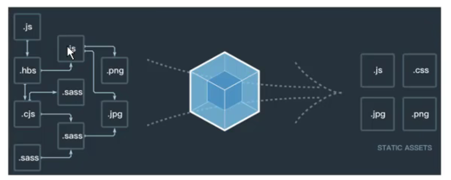
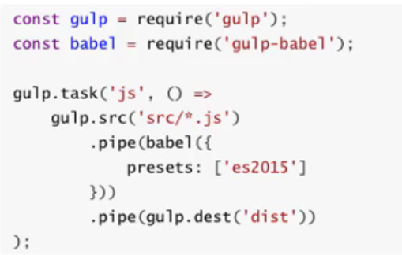
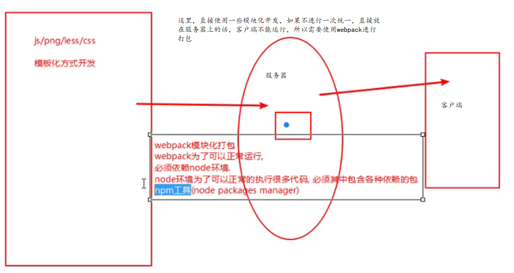
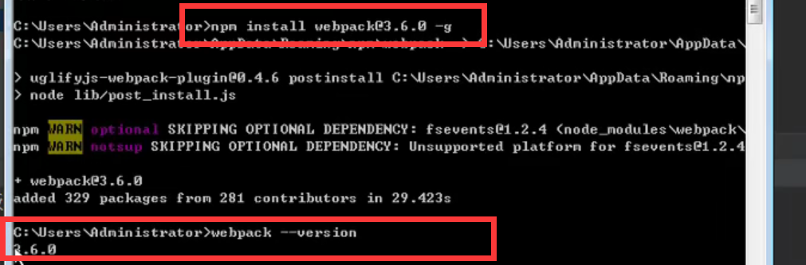

# webpack

```
grunt/gulp/webpack 打包工具
```

## 认识webpack

```
前端模块化打包工具
At its core, webpack is a static module bundler for modern JavaScript applications.
从本质上来讲, webpack是一个现代的JavaScript应用的静态模块打包工具。
```



grunt/gulp的对比

```
grunt/gulp的核心时Task
	我们可以配置一系列的task ,并且定义task要处理的事务(例如ES6、ts转化 ,图片压缩, scss转成css )
	之后让grunt/gulp来依次执行这些task ,而且让整个流程自动化。
	所以grunt/gulp也被称为前端自动化任务管理工具。
```

```
我们看一个gulp的task
	下面的task就是将src下面的所有js文件转成ES5的语法。
	并且最终输出到dist文件夹中。
```



```
什么时候使用 grunt/gulp呢
    如果你的工程模块依赖非常简单,甚至是没有用到模块化的概念。
    只需要进行简单的合并、压缩,就使用grunt/gulp即可。
    但是如果整个项目使用了模块化管理,而且相互依赖非常强,我们就可以使用更加强大的webpack了。
```

```
grunt/gulp 和 webpack 的区别
	grunt/gulp更加强调的是前端流程的自动化,模块化不是它的核心。
	webpack更加强调模块化开发管理,而文件压缩合并、预处理等功能,是他附带的功能。
```



## webpack的安装

```
webpack 需要 node.js , node.js 自带 npm
全局安装webpack,  3.6.0,vue cli2依赖这个版本
npm i xxx --save-dev


全局安装webpack后,还要进行局部安装
    在终端直接执行webpack命令,使用的全局安装的webpack
    当在package.json中定义了scripts时,其中包含了webpack命令,那么使用的是局部webpack
```




## webpack的起步

## webpack的配置

## loader的使用

## webpack中配置Vue

## plugin的使用

## 搭建本地服务器


# end