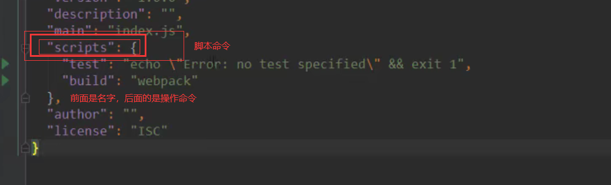
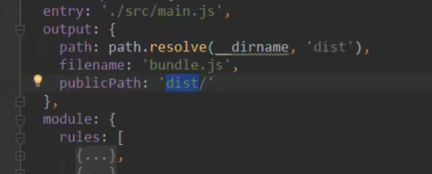
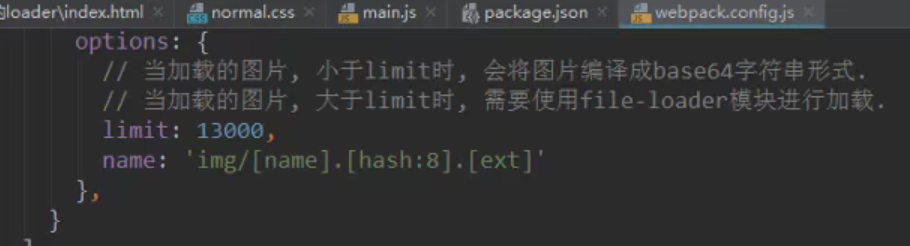

# webpack

```
grunt/gulp/webpack 打包工具
```

## 认识webpack

```
前端模块化打包工具
At its core, webpack is a static module bundler for modern JavaScript applications.
从本质上来讲, webpack是一个现代的JavaScript应用的静态模块打包工具。
```


grunt/gulp的对比

```
grunt/gulp的核心时Task
	我们可以配置一系列的task ,并且定义task要处理的事务(例如ES6、ts转化 ,图片压缩, scss转成css )
	之后让grunt/gulp来依次执行这些task ,而且让整个流程自动化。
	所以grunt/gulp也被称为前端自动化任务管理工具。
```

```
我们看一个gulp的task
	下面的task就是将src下面的所有js文件转成ES5的语法。
	并且最终输出到dist文件夹中。
```


```
什么时候使用 grunt/gulp呢
    如果你的工程模块依赖非常简单,甚至是没有用到模块化的概念。
    只需要进行简单的合并、压缩,就使用grunt/gulp即可。
    但是如果整个项目使用了模块化管理,而且相互依赖非常强,我们就可以使用更加强大的webpack了。
```

```
grunt/gulp 和 webpack 的区别
	grunt/gulp更加强调的是前端流程的自动化,模块化不是它的核心。
	webpack更加强调模块化开发管理,而文件压缩合并、预处理等功能,是他附带的功能。
```


## webpack的安装

```
webpack 需要 node.js , node.js 自带 npm
全局安装webpack,  3.6.0,vue cli2依赖这个版本
npm i xxx --save-dev


全局安装webpack后,还要进行局部安装
    在终端直接执行webpack命令,使用的全局安装的webpack
    当在package.json中定义了scripts时,其中包含了webpack命令,那么使用的是局部webpack
```


## webpack的起步

```
src是开发文件夹
dist是打包的文件夹
文件入口一般都是 mian.js || index.js

文件和文件夹解析：
    dist文件夹:用于存放之后打包的文件
    src文件夹:用于存放我们写的源文件
        main.js :项目的入口文件。具体内容查看下面详情。
        mathUtils.js :定义了一些数学工具函数,可以在其他地方引用,并且使用。具体内容查看下面的详情。
    index.html :浏览器打开展示的首页html
    package.json :通过npm init生成的, npm包管理的文件(暂时没有用上,后面才会用上)
```

```
打包

使用webpack  把main.js		打包入bundle.js
webpack ./src/main.js ./dist/bundle.js

然后引入./dist/bundle.js的js文件就行
```

## webpack的配置

```
加入一个 webpack.config.js 文件，作为webpack的入口出口存放文件

//1.导入node的path包获取绝对路径，需要使用npm init初始化node包
const path = require('path')

//2.配置webpack的入口和出口
module.exports = {
  entry: './src/main.js',//入口文件
  output:{
    path: path.resolve(__dirname, 'dist'),//动态获取打包后的文件路径,path.resolve拼接路径
    filename: 'bundle.js'//打包后的文件名
  }
}
```

```
在package.json上添加脚本

"scripts": {
  "test": "echo \"Error: no test specified\" && exit 1",
  "build": "webpack"
},

npm run build  ->  webpack
会优先在本地里面找webpack，所以我们可以在本地位置也安装一个webpack，
npm install webpack@3.6.0 --save-dev
安装3.6.0  --save-dev代表了开发时依赖

package.json 
"devDependencies" 是开发时依赖的包
dependencies 是运行时的依赖包

如果在终端里面直接敲 webpack 是使用全局的webpack ，
	要想在终端使用本地的，需要自己进入本地的webpack目录位置，然后再webpack
```



## loader的使用

```
loader是webpack中一个非常核心的概念。
webpack用来做什么呢?
	在我们之前的实例中,我们主要是用webpack来处理我们写的js代码,并且webpack会自动处理js之间相关的依		赖。
	但是,在开发中我们不仅仅有基本的js代码处理,我们也需要加载css、图片,也包括一些高级的将ES6转成ES5代			码,将TypeScript转成ES5代码,将sCSS、less转成csS ,将jsx、.vue文件转成js文件等等。
	对于webpack本身的能力来说，对于这些转化是不支持的。
	那怎么办呢?给webpack扩展对应的loader就可以啦。
loader使用过程:
	步骤一:通过npm安装需要使用的loader
	步骤二:在webpack.config.js中的modules关键字下进行配置
大部分loader我们都可以在webpack的官网中找到,并且学习对应的用法。
```

### css

```
我们将css放到main.js的入口中，把其当作一个模块进行使用
先在main.js中进行引入	
	require('./css/normal.css')
然后就可以进行打包了，打包好了之后，就可以直接只引入main.js文件来进行css的渲染，不需要再引入normal.css文件
	
npm安装
npm install --save-dev css-loader
npm install --save-dev style-loader
然后再webpack.config.js里面进行配置css的打包
module.exports = {
	module: {
		rules: [
			前面使用的是正则表达式匹配，把匹配的使用use的规则
			test: /\.css$/,
			css-loader 只负责 将css文件进行加载  
			style-loader 负责将样式添加到Dom中
			使用多个loader时，是从右向左的进行读取
			use: ['style-loader', 'css-loader']
		]
	}
}
```

### less的rules

```
{
	test: /\.less$/,
	use: [{
		creates style nodes from js strings
		loader: 'style-loader',
		options: xxx	这样写，可以写更多的参数进行配置
	}, {
		translates css into commonjs
		loader: 'css-loader'
	}, {
		compiles less to css
		loader: 'less-loader'
	}]
}
```

### 图片|文件

```
使用 url-loader

rules：
{
	test: /\.(png|jph|gif|jpeg)$/,
	ues: [
		{
			loader: 'url-loader',
			options: {
				文件大小限制，（byte），当低于指定的限制时，可以返回一个DataURL。
				就是指，将一个图片转化成例如base64的格式的字符串，然后浏览器直接进行传输和解析
				超过了这个limit的，需要使用file-loader模块进行加载
				limit: 8192
			}
		}
	]
}

file-loader
会进行hash 32算法，防止名字重复
这个不需要在module模块中进行什么配置
但是需要在output里面加上一个publicPath的配置
publicPath: 'dist/'
加上以后 ，以后涉及到任何url的东西，都会自动在前面拼接一个 public Path的值
```



```
在options设置命名
		img目录/ []这个是代表了变量，如果不加这个，就会当成常量name，[name]就是文件名，
		[hash:8]代表了hash，取前8位，[ext]代表了扩展名，
name: 'img/[name].[hash:8].[ext]'
```



### Es6语法处理

```
babel es6转化位es5
										core转化6-5	es2015就是es6
npm install --save-dev babel-loader@7 babel-core babel-preset-es2015
```

```
{
  test: /\.js$/,
  //排除node模块的js和bower的js
  exclude：排除
  include 包含
  exclude: /(node_modules|bower_components)/,
  use: {
    loader: 'babel-loader',
    options: {
      //如果要使用@babel/preset-env这里需要在根目录新建一个babel的文件
      // presets: ['@babel/preset-env']
      //这里直接使用指定
      presets: ['es2015']
    }
  }
}
```

## webpack中配置Vue

```
npm vue -save

import Vue from 'vue'
```


## plugin的使用

## 搭建本地服务器


# end