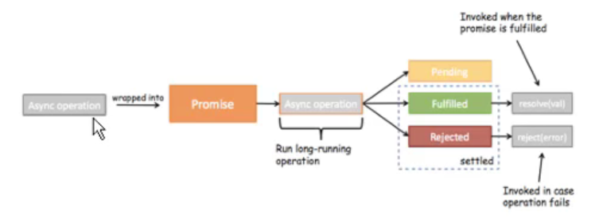

# ES6

## Promise

### 介绍和基本使用

```
ES6中一个非常重要和好用的特性就是Promise
  但是初次接触Promise会一脸懵逼 ,这TM是什么东西?
  看看官方或者一些文章对它的介绍和用法,也是一头雾水。
Promise到底是做什么的呢?
  Promise是异步编程的一种解决方案。
那什么时候我们会来处理异步事件呢?
  一种很常见的场景应该就是网络请求了。
  我们封装一个网络请求的函数 ,因为不能立即拿到结果,所以不能像简单的3+4=7一样将结果返回。
  所以往往我们会传入另外一个函数,在数据请求成功时,将数据通过传入的函数回调出去。
  如果只是一个简单的网络请求,那么这种方案不会给我们带来很大的麻烦。
但是,当网络请求非常复杂时,就会出现回调地狱。
  OK,我以一个非常夸张的案例来说明。
```

```
setTimeout(() => {
	1.log
}, 1000)

链式编程
params -> function
resolve,reject 也是 function
new Promise((resolve, reject) => {
	setTimeout(() => {
		resolve();	resolve jump to then
	}, 1000)
}).then(() => {
	2.log
	return new Promise((resolve, reject) => {
		setTimeout(() => {
			resolve()
		}, 1000)
	}) 
}).then(() => {
	3.log
})
```

```
一般是有异步操作时，使用promise对异步操作进行封装

成功调用resolve
resolve('sss')
.then((data) => {  })

失败调用reject
reject("err")
.catch(err => {  })

.then(data => { }, err => { })
```

```
new ->构造函数(1.保存了一些状态信息 2.执行传入的函数)
在执行传入的回调函数时，会传入两个参数，resolve, reject.本身 又是函数
```

### promise的三种状态



```
sync 同步
synchronization

async 异步
asynchronization

async operation 异步操作
pending 等待
fulfilled 满足
rejected 失败

异步async操作之后会有三种状态
pending :等待状态,比如正在进行网络请求,或者定时器没有到时间。
fulfill :满足状态,当我们主动回调了resolve时,就处于该状态,并且会回调.then()
reject :拒绝状态,当我们主动回调了reject时,就处于该状态,并且会回调.catch()
```

### 链式调用

```
new promise((resolve, reject) => { })
.then(() => {
	return new Promise((resolve, reject) => { })
})
.then(() => {
	return new Promise((resolve, reject) => { })
})
.then(() => { })
```

```
可以不要reject
new Promise((resolve) => {
	resolve()
}).then(() => { })
```

```
promise可以简写

new Promise(resolve => {resolve()})
Promise.resolve(res + '1111')
Promise.reject(err)

new Promise(resolve => resolve())
.then(res => {
	return Promise.resolve(res + '1111')
}).then(res => {
	return Promise.reject(res + '222');
}).catch(err => {
	err.log
})

也可以使用 throw 手动抛出异常
throw 'error message'
.catch()

还能简写
省略了 promise的包装，他会自动给你补充上
new Promise(resolve => resolve())
.then(res => {
	return res + '1111';
})
```

### promise all方法method

```
iterator 可迭代的

代表了每个都进行了resolve 正常 fulfilled后，才会调用then方法，
方法参数的 results代表了 数组 每次resolve的值
Promise.all([
	new Promise((resolve, reject) => { resolve(data) }),
	new Promise((resolve, reject) => { resolve(data) })
]).then(results => {
	
})
```

### promise源码

```
Promise(callback) {
	this.then.callback = return callback.arguments[0].arguments;
	callback();
	then(callback)
}
```


## 解构

### 对象的解构

```
const obj = {
	name: 1,
	age: 2,
	add: '1'
}

const name = obj.name;
const age = obj.age;
```

```
使用解构

这里是把名字进行分配，没有 的就不会取,不是按照顺序
const {name, age} = obj;
```

### 数组的解构

```
const names = [1, 2];
const [n1, n2] = names;
```

## 箭头函数

```
一般很少使用，一般是把函数作为一个参数的时候使用的才比较多

h => h(App)

function(h) {
	return h(App)
}
```

### 基本使用

```
定义函数的方式
const a = function() {}
const o = {
	b() {}
	c: function() {}
}
箭头函数
const c = (参数列表) => {}
const c = () => {
	
}
```

### 参数和返回值

```
(n1, n2) => {
	return n1 + n2;
}
(n1, n2) => n1+n2

n => { return n*n }

() => {
	
}
```

### this指向

```
箭头函数中的this引用的就是最近作用域中的this
箭头函数的this是向外层作用域中，一层层查找this，直到有this的定义

const o = {
	a() {
		function.call(window)，这里面，在调用的时候，会通过call，
		setTimeout(function() {
			this.log	window
		}, 1000)
		
		this.log
		
		setTimeout(() => {
			this.log	o对象
		}, 1000)
	}
}
```

```
 
```


# end