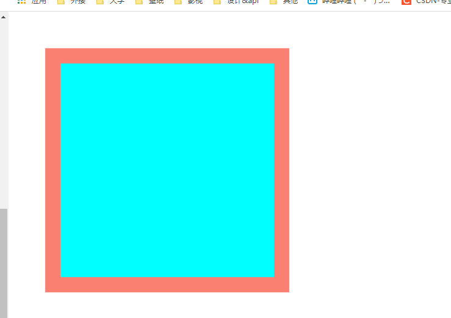
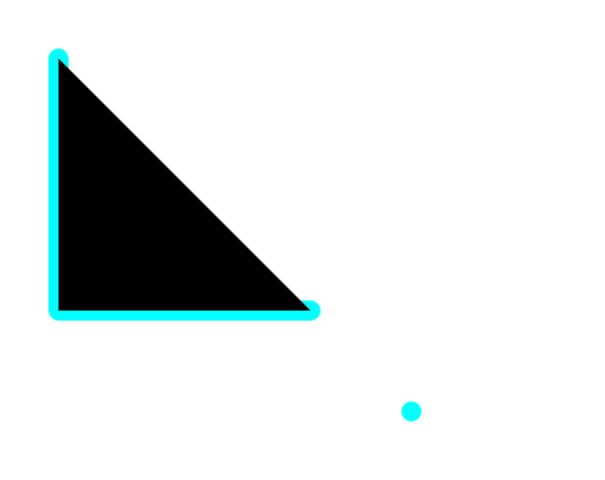
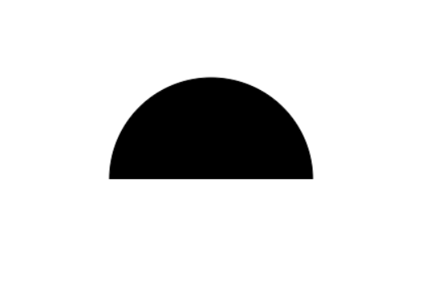
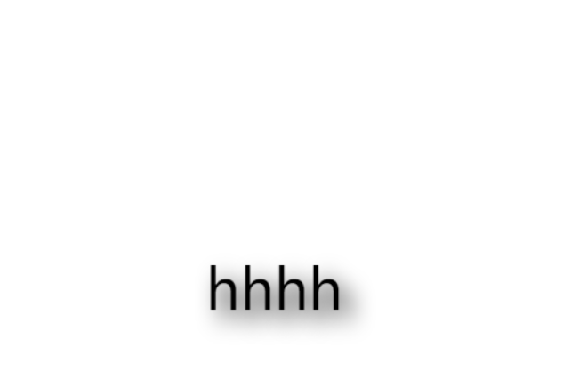
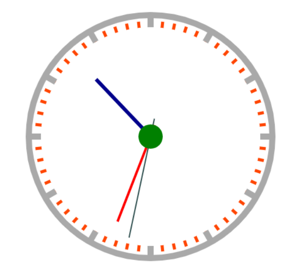
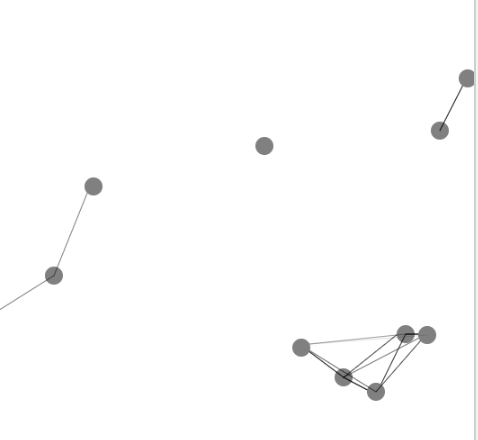

# canvas

## 概述

### 简述

h5<canvas>标签用于绘制图像

```
白鹭引擎2d
three.js 3d
```

 

```
<canvas id="canvas1" width="600" height="600" style='width='800px''></canvas>

外面的width="600"
代表的是画布里面的分辨率为600
style里面的style='width='800px''代表的是画布整体占据的分辨率
```


```
canvas 的标签属性只有两个，width 和 height.。表示的是 canvas 画布的宽度和高度。注意 canvas 的 width 和 height 不要用 css 的样式来设置，如果使用 css 的样式来设置，画布会失真，会变形 标签对儿里面的文字是用来提示低版本浏览器 (IE6/7/8)
```

```
<canvas width="400" height="500" id="mycanvas">
       当前浏览器版本不支持，请升级浏览器
</canvas>
```


### 编程思想

```
1.像素化
我们使用 canvas 绘制了一个图形，一旦绘制成功了，canvas 就像素化了他们。 canvas 没有能力，从画布上再次得到这个图形，也就是说我们没有能力去修改已经在画布上的内容。这个就是 canvas 比较轻量的原因，Flash 重的原因之一就有它可以通过对应的 api 得到已经上 “画布” 的内容然后再次绘制，如果我们想要让这个 canvas 图形移动，必须按照清屏 - 更新 - 渲染的逻辑进行编程，总之就是重新再画一次
```

```
2.动画思想
清屏 - 更新 - 渲染，这个思想就可以为 canvas 的动画思想
```

```
3.面向对象实现canvas动画
因为 canvas 不能得到已经上屏的对象，所以我们要维持对象的状态。在 canvas 动画中，我们都使用面向对象来进行编程，因为我们可以使用面向对象的方式来维持 canvas 需要的属性和状态
```

```
对象存储持续
// 绘制方法
function Rect(x, y, w, h, color) {
    this.x = x;
    this.y = y;
    this.w = w;
    this.h = h;
    this.color = color
}
// 更新方法
Rect.prototype.update = function () {
    this.x++;
}
// 渲染
Rect.prototype.render = function () {
    // 设置颜色
    ctx.fillStyle = this.color;
    // 渲染
    ctx.fillRect(this.x, this.y, this.w, this.h);
}
```

```
// 实例化
var r1 = new Rect(100, 100, 50, 50, "#91d5ff")
```

```
// 获取画布
var can = document.getElementById("can")
var ctx = can.getContext("2d");

// 动画过程
setInterval(() => {
    //清屏
    ctx.clearRect(0, 0, can.width, can.height)
    //更新
    r1.update()
    // 渲染
    r1.render()
}, 5)
```


## 方法例子

### 绘制矩形

```
function Rect() {
    context.rect(50, 50, 300, 300);

    context.fillStyle = 'aqua';
    context.fill();

    context.lineWidth = 20;
    context.strokeStyle = 'salmon';
    context.stroke();
}
```




### 画线和三角形

```
function Line() {
    context.beginPath();
    context.moveTo(50, 50);
    context.lineTo(50, 300);
    context.lineTo(300, 300);
    context.moveTo(400, 400);
    context.closePath();

    context.lineJoin = 'round';
    context.lineCap = 'round';
    context.miterLimit = 2;
    context.strokeStyle = 'aqua';
    context.lineWidth = 20;
    context.stroke();

    context.fill();
}
```




### 画圆

```
function Circle() {
    context.arc(300, 300, 100, 0, Math.PI, true);
    context.stroke();
    context.fill();
}
```




### 文字

```
function Text() {

    context.font = '50px 微软雅黑';

    context.shadowBlur = 20;
    context.shadowColor = 'rgba(0, 0, 0, 1)';
    context.shadowOffsetX = 10;
    context.shadowOffsetY = 10;

    context.fillText('hello', 100, 100);
    context.strokeText('xxxxxxxxx', 100,100);

    var x = 600;
    setInterval(function () {
        context.clearRect(0, 0, 600, 600);
        x -= 10;
        x = x || 600;
        context.fillText('hhhh', x, 300);
    }, 16)
}
```




### 渐变

```
// 线性渐变
var linear=ctx.createLinearGradient(0, 0, 200, 200);
linear.addColorStop(0,"red");
linear.addColorStop(0.5,"#91d5ff");
linear.addColorStop(0.8,"#ffec3d");
linear.addColorStop(1,"blue")
ctx.fillStyle=linear
ctx.fillRect(10,10,200,100)
```


### 阴影

```
// 阴影
ctx.shadowOffsetX=10 // 左右偏移
ctx.shadowOffsetY=10 // 上下偏移
ctx.shadowBlur=3; // 模糊度
ctx.shadowColor="red"; // 颜色
// 设置文字
ctx.font="30px 宋体"
ctx.fillText("Hello Canvas",100,100)
```


### 图片

```
function Img() {
    var img = new Image();
    img.src = 'xxx';

    img.onload = function () {
        context.drawImage(img, 0, 0, 100, 100, 50, 50, 200, 150);
    }
}
```


### 视频

```
function Video() {
    var video = document.querySelector('video');

    var id;
    video.onplay = function () {
        id = setInterval(function () {
            context.clearRect(0, 0, 800, 600);
            context.fillRect(0, 0, 800, 600);

            context.drawImage(video, 0, 70, 800, 440)

            context.font = '20px 微软雅黑';
            context.strokeStyle = '#999';
            context.strokeText('xxxx', 50, 50);
        }, 16);
    }

    video.onpaste = function () {
        clearInterval(id);
    }
}
```


### 获取图片像素点信息

```
function getImgData() {
    context.getImageData(0, 0, 10, 10);
    context.putImageData();
}
```


### 图片加载和使用像素点进行排列

```
function getImg() {
    var c1 = document.querySelector('#c1');
    var c2 = document.querySelector('#c2');

    var c1C = c1.getContext('2d');
    var c2C = c1.getContext('2d');


    var img = new Image();
    img.src = 'img/xxxx.png';

    img.onload = function () {
        c1C.drawImage(img, 0, 0);

        var imgData = c1C.getImageData(0, 0, 784, 1);
        var imgData2 = c2C.createImageData(28, 28);

        for (let i = 0; i < (784 * 4); i++) {
            imgData2.data[i] = imgData.data[i];
        }

        c2C.putImageData(imgData2, 0, 0, 0, 0, 28, 28);
    }
}
```


### canvas几个操作

```
function Option1() {
    // 移动
    context.translate(300, 0);
    // 旋转
    context.rotate(Math.PI/4);
    // 缩放
    context.scale(1, 2);

    // 可以层次保留和层次恢复
    // 保留画笔状态
    context.save();
    // 恢复画笔状态
    context.restore();
}
```


### 合成，蒙版

```
ctx.globalCompositeOperation="destination-over"
```


## 案例


### 时钟

```
function drawC() {
    function drawClock() {
        context.clearRect(0, 0, 600, 600);
        context.save();
        context.translate(300, 300);
        context.rotate(-Math.PI/2);
        // context.translate(50%, 50%); //不能用

        context.beginPath();
        context.arc(0, 0, 200, 0, 2*Math.PI);
        context.lineWidth = 10;
        context.strokeStyle = 'darkgrey';
        context.stroke();
        context.closePath();

        context.save();
        for (let i=0; i<60; i++) {
            context.beginPath();
            context.rotate(Math.PI/30);
            context.moveTo(180, 0);
            context.lineTo(190, 0);
            context.strokeStyle = 'orangered';
            context.lineWidth = 5;
            context.stroke();
            context.closePath();
        }
        context.restore();

        context.save();
        for (let i=0; i<12; i++) {
            context.beginPath();
            // context.save();
            // context.rotate(2*Math.PI/12 * i);
            context.rotate(Math.PI/6);
            context.moveTo(180, 0);
            context.lineTo(200, 0);
            context.strokeStyle = 'darkgrey';
            context.stroke();
            // context.restore();
            context.closePath();
        }
        context.restore();

        getTime();
        context.restore();

        function drawTime(hour, min, sec) {

            // 秒针
            context.save();
            context.beginPath();
            var hourRotate = Math.PI/30*sec;
            context.rotate(hourRotate);
            context.moveTo(-30, 0);
            context.lineTo(170, 0);
            context.lineWidth = 2;
            context.strokeStyle = 'darkslategrey';
            context.stroke();
            context.closePath();
            context.restore();

            // 分针
            context.save();
            context.beginPath();
            var hourRotate = Math.PI/30*min+Math.PI/30/60*sec;
            context.rotate(hourRotate);
            context.moveTo(-20, 0);
            context.lineTo(150, 0);
            context.lineWidth = 4;
            context.strokeStyle = 'red';
            context.stroke();
            context.closePath();
            context.restore();

            // 时针
            context.save();
            context.beginPath();
            var hourRotate = Math.PI/6*hour+Math.PI/6/60*min;
            context.rotate(hourRotate);
            context.moveTo(-10, 0);
            context.lineTo(130, 0);
            context.lineWidth = 6;
            context.strokeStyle = 'darkblue';
            context.stroke();
            context.closePath();
            context.restore();

            context.arc(0, 0, 20, 0, 2*Math.PI);
            context.fillStyle = 'green';
            context.fill();
        }

        function getTime() {

            var time = new Date();

            var hour = time.getHours();
            var min = time.getMinutes();
            var sec = time.getSeconds();

            hour = hour % 12;

            drawTime(hour, min, sec);
        }

    }

    drawClock();
    setInterval(drawClock, 1000);
}
```




### 连线小球

```
var canvas = document.getElementById('c');
var context = canvas.getContext('2d');

canvas.width = document.documentElement.clientWidth;
canvas.height = document.documentElement.clientHeight - 1;

function Ball() {
    this.x = parseInt(Math.random()*(canvas.width-20)) + 10;
    this.y = parseInt(Math.random()*(canvas.height-20)) + 10;
    this.r = 10;
    this.color = 'gray';

    this.dx = parseInt(Math.random()*10)-5;
    this.dy = parseInt(Math.random()*10)-5;

    ballArr.push(this);
    this.index = ballArr.length-1;
}
Ball.prototype.render = function () {
    context.beginPath();
    context.globalAlpha = 1;
    context.arc(this.x, this.y, this.r, 0, Math.PI*2);
    context.fillStyle = this.color;
    context.fill();
}
Ball.prototype.update = function () {
    this.x += this.dx;
    this.y += this.dy;
    this.dx = this.x<this.r||this.x>canvas.width-this.r ? -1*this.dx : this.dx;
    this.dy = this.y<this.r||this.y>canvas.height-this.r ? -1*this.dy : this.dy;
}
Ball.prototype.line = function () {
    for (let i = this.index+1; i < ballArr.length; i++) {
        if (Math.abs(ballArr[i].x-this.x)<150 && Math.abs(ballArr[i].y-this.y)<150) {
            context.strokeStyle = '#000';
            context.beginPath();
            let lineLen = Math.sqrt(Math.pow(this.x - ballArr[i].x, 2) + Math.pow(this.y - ballArr[i].y, 2));
            let maxLineLen = Math.sqrt(150*150);
            context.globalAlpha = 1 - lineLen/maxLineLen;
            context.moveTo(this.x, this.y);
            context.lineTo(ballArr[i].x, ballArr[i].y);
            context.closePath();
            context.stroke();
        }
    }
}


var ballArr = [];
for (let i = 0; i < 20; i++) {
    new Ball();
}

setInterval(function () {
    context.clearRect(0, 0, canvas.width, canvas.height);
    for (let i = 0; i < ballArr.length; i++) {
        ballArr[i].update();
        ballArr[i].render();
        ballArr[i].line();
    }
}, 16);
```




# end

## 参考

```
哔哩哔哩 老陈打码 BV1Ri4y1M7NT
哔哩哔哩 马士兵教育 BV1rV411t7Fr
```

