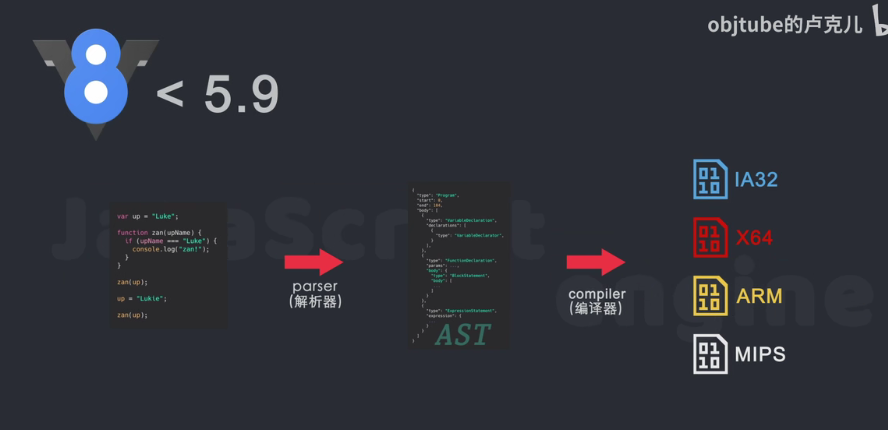

# js运行原理

## 运行过程

### 生成抽象语法树

```
js源码通过解析器解析成抽象语法树ast
```


### 生成字节码bytecode

```
然后通过解释器将ast编译成字节码byteCode
```


### 生成机器代码运行

```
字节码通过编译器生成机器代码
	编译器会根据平台差异生成机器代码
```


### 一些差异

```
v8引擎的5.9版本以前不会生成字节码
```



```
使用了新的架构
```


## 编译过程

### 什么是v8

```
是用C ++编写的Google开源高性能JavaScript和WebAssembly引擎。它用于Chrome和Node. js等。它实现3 ECMAScript和WebAssembly,并在Windows 7或更高版本，macOS 10. 12 +和使用x64, IA-32，ARM或MIPS处理器的Linux系统上运行。
```

```
是一个接收JavaScript代码，编译代码然后执行的C+ +程序,编译后的代码可以在多种操作系统多种处理器上运行。
```

### v8负责的工作

```
编译和执行js代码
处理调用栈
内存分配
垃圾回收
```


```
js引擎在编译和执行所用到的三个组件
	解析器，解释器，编译器
```


### 早期的v8

```
js通过解析器parser 生成ast抽象语法树
然后ast使用full-codegen编译器 直接编译机器代码
	这个full-codegen编译器也被称为基准编译器，生成的代码是基准的，未被优化的机器代码，
	好处就是直接使用了高效的机器代码，没有中间字节码的产生
当代码运行一段时间后，v8的分析器线程，收集了足够的数据来帮助另一个编译器  crankshaft 来做代码优化
然后需要优化的源码，会重新通过parser为ast，
然后crankshaft使用生成好的ast，再生成机器代码，
	所以crankshaft又被称为优化编译器
```


#### 问题

```
1.机器码占用大量内存
2.缺少中间层机器码无法实现一些优化策略
3.无法很好的支持和优化JS的新语法特性
```

### 新的v8架构

```
前期还是将js通过parser解释为ast抽象语法树
然后使用lgniton，基准解释器 生成字节码，此时ast被清除掉
字节码直接被解释器执行，字节码更小，
然后代码优化，解释器lgniton收集到了很多优化信息
这些就会发给trubofan 优化编译器
trubofan会根据这些信息和字节码进行优化  机器代码

整体来说就是处于运行字节码和优化机器代码共存的状态
```


#### new v8 的策略

```
1.函数只声明未被调用，不会被解析生成ast
2.函数只被调用-次，bytecode直 接被解释执行
3.函数被调用多次，可能会被标记为热点函数，可能会被编译成机器代码

4.某些情况下，优化后的机器代码会被逆向还原为字节码，因为js是动态语言，收集到的信息可能是错误的
	比如 sum函数，使用时，前期一直使用整型，所以被优化的机器代码为整型，
	但是，后面在使用时换了数据类型，就会导致优化后的机器代码不能解析，所以会被还原deoptimization 字节码
	所以传入参数的类型最好是保持固定
```


#### 优点

```
没有 生成机器码，字节码生成速度快，所以初始化，解析执行js时间缩短，网页更快onload
第二，生成优化机器代码时，不需要源码重新编译，而是使用字节码，并且在还原字节码deoptimization时，只需要回到字节码执行就行
```

## v8的总结

```
## 新版本的V8

1. parser  解析器  生成AST抽象语法树
2. interpreter   解释器   Ignition   生成byteCode字节码  并直接执行
3. 清除AST 释放内存空间
4. 得到25% - 50%的等效机器代码大小
5. compiler  运行过程中，解释器收集优化信息发送给编译器TurboFan
6. 重新生成机器码
7. 有些热点函数变更会由优化后的机器码还原成字节码 也就是deoptimization  回退字节码操作执行

优化点：

1. 值声明未调用，不会被解析生成AST
2. 函数只被调用一次，bytcode直接被解释执行，不会进入到编译优化阶段
3. 函数被调用多次，Igniton会收集函数类型信息，可能会被标记为热点函数，可能被编译成优化后的机器代码

好处：

1. 由于一开始不需要直接编译成机器码，生成了中间层的字节码，从而节约了时间
2. 优化编译阶段，不需要从源码重新解析,直接通过字节码进行优化，也可以deoptimization回退操作

​```javascript
function sum(x,y){return x + y};
sum(1,2);
sum(3,4);
sum(5,6);
sum(7,8);//会回退字节码操作执行
​```
```

```
# 介绍

哪些程序用到V8

- Chrome浏览器的JS引擎是V8
- Nodejs的运行时环境是V8
- electron的底层引擎是V8  【ɪˈlektrɑːn】  跨平台桌面应用开发工具

blink是渲染引擎，V8是JS引擎

访问Dom的接口是由Blink提供的

# 功能

接收JavaScript代码，编译代码后执行C++程序，编译后的代码可以在多种操作系统多种处理器上运行。

1. 编译和执行JS代码
2. 处理调用栈
3. 内存分配
4. 垃圾回收

# V8的js编译和执行

- 解析器  parser  js -- 解析成功抽象语法树AST
- 解释器  interpreter   AST -- 字节码bytecode，也有直接执行字节码的能力
- 编译器  compiler  bytecode -- 更高效的机器码

V8版本5.9之前没有解释器，但是有两个编译器

## 5.9版本的V8

1. parser  解释器生成抽象语法树AST
2. compiler  编译器Full-codegen  基准编译器  直接生成机器码
3. 运行一段时间后，由分析器线程优化js代码
4. compiler  编译器CrankShaft   优化编译器   重新生成AST提升运行效率

这样设计的缺点

1. 机器码会占用大量的内存
2. 缺少中间层机器码，无法实现一些优化策略
3. 无法很好的支持和优化JS的新语特性，无法拥抱未来
```

# js调用栈

```
调用栈是JS引擎追踪函数执行流程的一种机制，当执行环境中调用了多个函数时，通过这种机制，我们能够追踪到哪个函数正在执行，执行的函数体又调用了哪个函数。
执行完了以后就出栈
```


## 总结

```
# 介绍

栈：先进后出，进栈，出栈，与堆栈不同，后面讲堆~
队列：先进先出

# 概念

调用栈是JS引擎追踪函数执行流程的一种机制，当执行环境中调用了多个函数时，通过这种机制，我们能够追踪到哪个函数正在执行，执行的函数体又调用了哪个函数

# 例子

调用栈，调用函数执行才回入栈

1. push  average()
2. push  sum()
3. shift  sum()
4. shift  average()
5. push  console.log()
6. shift  console.log()

​```javascript
   function sum(a, b) {
    return a + b;
   }
   function average(a, b) {
    const aver = sum(a, b) / 2;
    return aver;
   }
   const num = average(3, 5);
   console.log(num);
​```

# tips

用栈持持续被调用，会导致内存溢出
原因是因为，JS主线程被占用会造成堵塞下期预告：事件循环，异步回调(宏任务，微任务，面试必问哦)
```


# end

## 参考

```
哔哩哔哩 objtube的卢克儿 BV1zV411z7RX
哔哩哔哩 objtube的卢克儿 BV13k4y1y7vU
```

