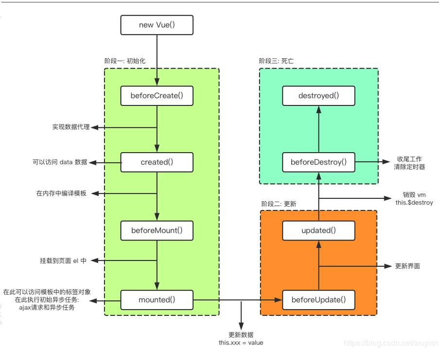
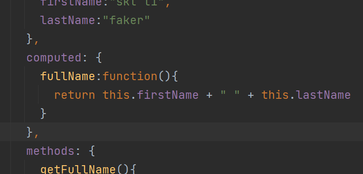

# Vue

## vue认识

### Vue是一个渐进式的框架

```
渐进式意味着你可以将Vue作为你应用的一部分嵌入其中,带来更丰富的交互体验。
或者如果你希望将更多的业务逻辑使用Vue实现,那么Vue的核心库以及其生态系统。
比如Core+ Vue-router+Vuex ,也可以满足你各种各样的需求。
```

### 特点和常用的高级功能

```
解耦视图和数据
可复用的组件
前端路由技术
状态管理.
虚拟DOM
```

## vue安装

1.CDN引入

2.下载引入

3.npm安装

## vue基本使用

### 开始

```
我们来阅读JavaScript代码,会发现创建了一 个Vue对象。
创建Vue对象的时候,传入了一些options: {}
{}中包含了el属性:该属性决定了这个Vue对象挂载到哪一个元素上,很明显,我们这里是挂载到了id为app的元素上。
{}中包含了data属性:该属性中通常会存储一些数据
	这些数据可以是我们直接定义出来的,比如像上面这样。
	也可能是来自网络,从服务器加载的。
```

```
  <div id="app">
      <h2>{{message}}</h2>
      <p>{{name}}</p>
  </div>
  <script>
    //let变量/const常量
    //编程范式：声明式编程
    const app = new Vue({
      el:"#app",//用于挂载要管理的元素
      data:{//定义数据
        message:"HelloVuejs",
        name:"zzz"
      }
    })
    
    //原生js做法（编程范式：命令式编程）
    //1.创建div元素，设置id属性
    //2.定义一个变量叫message
    //3.将message变量放在前面的div元素中显示
    //4.修改message数据：helloworld
    //5.将修改的元素再次替换到div
  </script>
```

```
el:
    类型: string | HTMLElement
    作用:决定之后Vue实例会管理哪一个DOM。
data:
    类型: Object| Function
    作用: Vue实例对应的数据对象。
methods:
    类型: { [key: string]: Function }
    作用:定义属于Vue的一些方法,可以在其他地方调用,也可以在指令中使用。
```

### vue for 循环列表展示

```
v-for指令	item in movies   {{ item }}
```

```
  <div id="app">
      <h2>{{message}}</h2>
      <ul>
        <li v-for="(item, index) in movies" :key="index">{{item}}</li>
      </ul>
  </div>
  <script>
    //let变量/const常量
    //编程范式：声明式编程 
    const app = new Vue({
      el:"#app",//用于挂载要管理的元素
      data:{//定义数据
        message:"你好啊",
        movies:["星际穿越","海王","大话西游","复仇者联盟"]
      }
    })
  </script>
```

### 点击按钮事件,计数器

```
v-on:click=""
这个是上面的语法糖 @click=""
```

```
  <div id="app">
      <h2>当前计数：{{count}}</h2>
      <!-- <button v-on:click="count--">-</button>
      <button v-on:click="count++">+</button> -->

      <button v-on:click="sub()">-</button>
      <button @click="add()">+</button>
  </div>
  <script>
    const app = new Vue({
      el:"#app",//用于挂载要管理的元素
      data:{//定义数据
        count:0
      },
      methods: {
        add:function(){
          console.log("add")
          this.count++
        },
        sub:function(){
          console.log("sub")
          this.count--
        }
      },
    })
  </script>
```

```
计数器的MVVM
我们的计数器中就有严格的MVVM思想
    ➢View依然是我们的DOM
    ➢Model就是我们我们抽离出来的obj
    ➢ViewModel就是我们创建的Vue对象实例
它们之间如何工作呢?
    ➢首先ViewModel通过Data Bindingli上obj中的数据实时的在DOM中显示。
    ➢其次ViewModel通过DOM Listener来监听DOM事件,并且通过methods中的操作,来改变obj中的数据。
```


## vue的MVVM

```
Model ViewModel View 
ViewModel是Model和View通信之间的桥梁，当你有数据要展示的时候，ViewModel会自动把数据绑定到View上面，当我们View有些事件或操作也是通过ViewModel
```


```
View层:
➢视图层
➢在我们前端开发中，通常就是DOM层。
➢主要的作用是给用户展示各种信息。
Model层:
➢数据层
➢数据可能是我们固定的死数据，更多的是来自我们服务器，从网络上请求下来的数据。
➢在我们计数器的案例中，就是后面抽取出来的obj,当然，里面的数据可能没有这么简单。
VueModel层:
➢视图模型层
➢视图模型层是View和Model沟通的桥梁。
➢一.方面它实现了DataBinding，也就是数据绑定，将Model的改变实时的反应到View中
➢另一方面它实现了DOM Listener， 也就是DOM监听，当DOM发生一些事件(点击、滚动、touch等)时，可以监听到，并在需要的情况下改变对应的Data。
```

## 什么叫做方法，什么叫做函数

```
方法：method,和某一个实例对象像挂钩
函数：function

函数：写在外面
function a() {}
方法：定义在类里面
function Person() { function a() {} }
```

## vue的生命周期

```
诞生到消亡的过程 
```

```

```




## vue插值操作 Mustache语法

### 什么是插值操作

Mustache语法，也就是双大括号

```
<h2>{{message}}</h2>
<h2>{{message}},啧啧啧</h2>

<!-- Mustache的语法不仅可以直接写变量，还可以写简单表达式 -->
<h2>{{firstName + lastName}}</h2>
<h2>{{firstName + " " + lastName}}</h2>
<h2>{{firstName}} {{lastName}}</h2>
<h2>{{count * 2}}</h2>
```

### v-once

```
使用了v-once，只会第一次展示数据的时候改变，后面数据改变了也不会改变,只渲染一次数据
<h2 v-once>{{message}}</h2>

v-once:
    该指令后面不需要跟任何表达式(比如之前的v-for后面是由跟表达式的)
    该指令表示元素和组件(组件后面才会学习)只渲染一次,不会随着数据的改变而改变。
```

### v-html

```
可以使用v-html指令
    ➢该指令后面往往会跟上一个string类型
	➢会将string的html解析出来并且进行渲染

表示以html展示,将数据以html形式展示
<h2 v-html="url"></h2>
url:"<a href='http://www.baidu.com'>百度一下</a>"
```

### v-text

```
将数据展示出来
<h2 v-text="message">，啧啧啧</h2>
会覆盖 "，啧啧啧"
```

### v-pre

```
不会解析
v-pre用于跳过这个元素和它子元素的编译过程,用于显示原本的Mustache语法。

<h2 v-pre>{{message}}</h2>
	{{message}}
```

### v-cloak

```
cloak 斗篷
//在vue解析前，div中有一个属性cloak
//在vue解析之后，div中没有一个属性v-cloak
所以我们可以通过style样式进行展示，让没有解析的元素不显示
  <style>
    [v-cloak]{
      display: none;
    }
  </style>

<div id='app' v-cloak> {{message}} </div>
```

## v-bind绑定属性

### 是什么

```
但是,除了内容需要动态来决定外,某些属性我们也希望动态来绑定。
    比如动态绑定a元素的href属性
    比如动态绑定img元素的src属性
这个时候,我们可以使用v- bind指令:
    作用:动态绑定属性
    缩写::
    预期: any (with argument) | Object (without argument)
    参数: attrOrProp (optional)
    
    
v-bind用于绑定一个或多个属性值,或者向另一个组件传递props值(这个学到组件时再介绍)
在开发中,有哪些属性需要动态进行绑定呢?
	还是有很多的,比如图片的链接src、网站的链接href. 动态绑定一些类、样式等等
比如通过Vue实例中的data绑定元素的src和href ,代码如下:
```

### 怎么用

```
<!-- 错误的做法这里不能使用Mustache语法 -->
<!--  -->

<!-- 正确的做法使用v-bind指令 -->

```

### 语法糖

```
在开发中，我们通常会使用语法糖的形式，因为这样更加简洁。

```

### 绑定class

#### 对象语法

```
对象语法
<!-- 动态绑定class对象用法  --> 使用类名加上Boolean值
这里，如果Boolean值为true的话，这个class就会加载到这个元素里面	·
<!-- <h2 :class="{key1:value1,key2:value2}">{{message}}</h2>
<h2 :class="{类名1:true,类名2:boolean}">{{message}}</h2> -->
<h2 class="title" :class="{active:isActive}">{{message}}</h2>

用法1.
通过{}绑定class
	:class="{'active': isActive}"
用法2.
通过判断，传入多个值
	:class="{'active': isActive, 'line: isLine'}"
用法3.
可以和普通的class存在，并不冲突
用法4.
可以放在一个methods 或者 computed 中
	:class="getClasses()"
	
	getClasses: function() {
		return {
			'active': this.isActive
		};
	}
	
```

#### 数组语法

```
数组语法

<!-- 加上单引号当成字符串 -->
<h2 class="title" :class="['active','line']">{{message}}</h2>
<!-- 不加会被当成变量 -->
<h2 class="title" :class="[active,line]">{{message}}</h2>
使用方法
<h2 class="title" :class="getClasses()">{{message}}</h2>
getClasses(){
	return [this.active,this.line]
}

```

### 动态绑定style

#### 对象语法

```
<!-- <h2 :style="{key(属性名):value(属性值)}">{{message}}</h2> -->
<!-- 加单引号，当成字符串解析 -->
<h2 :style="{fontSize:'50px'}">{{message}}</h2>
<!-- 不加单引号，变量解析 -->
<h2 :style="{fontSize:fontSize}">{{message}}</h2>
<h2 :style="getStyle()">{{message}}</h2>

fontSize:'100px'
getStyle(){
	return {fontSize:this.fontSize}
}
```

#### 数组语法

```
<h2 :style="[baseStyle]">{{message}}</h2>
baseStyle:{backgroundColor:'red'}
```

#### 绑定disabled属性

```
:disabled="true"
diabled
:disabled="item.count <= 1"
```


## 计算属性 computed

```
有缓存，效率高
```

### 一般合并两个变量

```
<h2>{{firstName+ " " + lastName}}</h2>
<h2>{{firstName}} {{lastName}} </h2>
<h2>{{getFullName()}}</h2>

getFullName() {
	return this.firstName + " " + this.lastName;
}
```

### 使用计算属性

```
计算属性

<!-- 计算属性 -->
<h2>{{fullName}}</h2>

computed: {
    fullName:function(){
         return this.firstName + " " + this.lastName
    }
},
```



### 计算属性的复杂操作

```
<h2>总价格：{{totalPrice}}</h2>

books:[
    {id:110,name:"JavaScript从入门到入土",price:119},
    {id:111,name:"Java从入门到放弃",price:80},
    {id:112,name:"编码艺术",price:99},
    {id:113,name:"代码大全",price:150},
]

computed: {
    totalPrice(){
        let res = this.books.reduce(function (total, book) {
            return total+book.price;
        });
        console.log(res);

        let result= 0;
        for (let i = 0; i < this.books.length; i++) {
            result += this.books[i].price;
        }
        return result
    }
}
```

#### 番外：es6的for语法

```
for (let i = 0; i < books.length; i++) { }

for (let i in books) { }

for (let book of books) { }
```

#### es6的高阶函数循环操作 

##### filter

```
filter,回调函数，必须返回一个Boolean值
返回为true，会自动将这次回调的n加入到新的数组中，
let newNums = nums.filter(function(n) {
	return n < 100;
});
```

##### map

```
map,返回值会加入数组
let newN = num.map(function(n) {
	return n*2;
})
```

##### reduce

```
对数组中所有的内容进行汇总
let total = num.reduce(function(total, n) {
	return total + n;
})
```

##### 合并案例

```
num.filter(function(n) {
	return n < 100;
}).map(function(n) {
	return n * 2;
}).reduce(function(total, n) {
	return total + n;
})

箭头函数
num.filter(n => n<100).map(n => n*2).reduce((total, n) => total+n);
```


### 计算属性的getter和setter

```
fullName:{
	一般我们不希望设置set方法，不写set，就为只读属性
    //计算属性一般没有set方法，只读属性
    set:function(newValue){
        console.log("-----")
        const names = newValue.split(" ")
        this.firstName = names[0]
        this.lastName = names[1]
    },
    get:function(){
        return this.firstName + " " + this.lastName
    }
}

所以简写为
fullName: function() { return }
```

```
所以我们在使用的时候没有以方法的形式调用，因为它只是一个属性，而不是一个方法
```

### 计算属性的缓存

```
<!-- 计算属性有缓存，只有关联属性改变才会再次计算 -->
<h2>{{fullName}}</h2>
<h2>{{fullName}}</h2>
<h2>{{fullName}}</h2>
<h2>{{fullName}}</h2>

computed: {
    fullName(){
        console.log("调用了计算属性fullName");
        return this.firstName + " " + this.lastName
    }
},
```

```
只要计算属性里面的关联属性没有发生改变，那么计算属性就不会执行，而是将缓存里面的内容返回，所以计算属性比方法快
```

## ES6补充

### 作用域

```
let和var的问题，块级作用域
```

#### let/var

```
变量作用域：变量在什么范围内可以使用，这就是他的作用域
{ var name=1; name.log }	name.log
这里外面也能访问

没有块级作用域引起的问题
if的块级问题
if (true) { var name=1; func=function() { name.log } }
name=2; func();

for的块级作用域
在对按钮进行监听的时候，因为for是用的for,var，所以在进行监听事件的添加的时候，i也会变，所以真正 在点击的时候，显示 的i不是那个i，所以需要使用立即执行函数来产生闭包，因为函数是一个闭包
// var btns = document.getElementsByTagName("button")
// 使用闭包,函数有作用域
// for (var i = 0; i < btns.length; i++) {
//   (function (i) {
//     btns[i].addEventListener('click',function (param) {
//       console.log("第"+i+"个按钮被点击了");
//     })
//   })(i)
// }
```

##### es6 let

```
let对if和for加了块级作用域
// const btns = document.getElementsByTagName("button")
// for (let i = 0; i < btns.length; i++) {
//   btns[i].addEventListener('click',function (param) {
//     console.log("第"+i+"个按钮被点击了");
//   })
// }
```

#### 闭包

```
i
{
  var i = 0;
}

{
  var i = 1;
}

{
  var i = 2;
}
i.log
```

### const

```
建议:在ES6开发中,优先使用const,只有需要改变某-一个标识符的时候才使用let.
```

```
注意一：一旦给const修饰的标识符被赋值之后，不能修改

注意二：在使用const定义标识符，必须进行赋值，初始化

注意三：常量的含义是指向的对象不能修改，但是可以修改对象内部的属性
const obj = { name: 1 }
obj.name = 2;

```

### 对象字面量的增强写法

#### 属性的增强写法

```
const name = 1;
const age = 2;
const height = 3;
const obj = {
	name,
	age,
	height
};
```

#### 函数的增强写法

```
const obj = {
	run() {
		
	}
}
```

## 事件监听 v-on

```
v-on介绍
    作用:绑定事件监听器
    缩写:@	语法糖
    预期: Function| Inline Statement| Object
    参数: event
```

```
v-on:click=""
@click=""

@keyup=""
```

### 参数问题

```
情况一:如果该方法不需要额外参数,那么方法后的()可以不添加。
	但是注意:如果方法本身中有一个参数,那么会默认将原生事件event参数传递进去
情况二:如果需要同时传入某个参数,同时需要event时,可以通过$event传入事件。
```

```
<!-- 事件没传参 -->
<button @click="btnClick">按钮1</button>
<button @click="btnClick()">按钮2</button>
<!-- 事件调用方法传参，写函数时候省略小括号，但是函数本身需要传递一个参数 -->
<button @click="btnClick2(123)">按钮3</button>
打了括号，参数就为空了
<button @click="btnClick2()">按钮4</button>
没打括号，会把event传过去
<button @click="btnClick2">按钮5</button>
<!-- 事件调用时候需要传入event还需要传入其他参数 -->
<button @click="btnClick3($event,123)">按钮6</button>

btnClick(){
    console.log("点击XXX");
},
btnClick2(value){
    console.log(value+"----------");
},
btnClick3(event,value){
    console.log(event+"----------"+value);
}

点击之后的效果分别为：
点击xxx
点击xxx
123------
undefined-----
[object MouseEvent]------
[object MouseEvent]------123
```

### v-on修饰符

```
Vue提供了修饰符来帮助我们方便的处理一些事件
.stop - 调用event.stopPropagation().
.prevent - 调用event.preventDefault().
.{keyCode | keyAlias} -只当事件是从特定键触发时才触发回调。
.native -监听组件根元素的原生事件。
.once -只触发一次回调。
```


#### .stop 停止冒泡修饰符

```
<div @click="divClick">
    <button @click.stop="btnClick">按钮1</button>
</div>
会阻止button按钮事件的冒泡
```

#### .prevent默认事件

```
<form action="www.baidu.com">
  <button type="submit" @click.prevent="submitClick">提交</button>
</form>

阻止了form表单的submit的自动提交
```

#### .{keyCode | keyAlias}键盘点击

```
有keyup，keydown，一般用keyup比较多
<input type="text" @keyup.enter="keyup">
```

#### .native 自定义组件事件

```
自定义组件的事件，这里cpn组件为自定义，如果不使用native不能调用click事件
所以要加上

<cpn @click=""></cpn>
<cpn @click.native=""></cpn>
```

## v-if v-else-if v-else

```
Vue的条件指令可以根据表达式的值在DOM中渲染或销毁元素或组件

原理
v-if后面的条件为false时,对应的元素以及其子元素不会渲染。
也就是根本没有不会有对应的标签出现在DOM中。
```

```
<div v-if="age<18">小于18岁未成年</div>
<div v-else-if="age<60">大于18岁小于60岁正值壮年</div>
<div v-else="">大于60岁,暮年</div>
```

## dom元素复用

```
如果我们在有输入内容的情况下,切换了类型,我们会发现文字依然显示之前的输入的内容。
但是按道理讲,我们应该切换到另外一个input元素中了.在另外一个input元素中,我们并没有输入内容。
为什么会出现这个问题呢?
<!-- 添加key主要是为了让vue不复用dom，如果不添加vue底层会复用dom -->
<span v-if="isUser">
    <label for="username">用户账号</label>
    <input type="text" key='username-input' id="username" placeholder="请输入用户名" >
</span>
<span v-else="isUser">
    <label for="email">用户邮箱</label>
    <input type="text" key='email-input' id="email" placeholder="请输入用户邮箱" >
</span>
<button @click="isUser=!isUser">切换类型</button>
```

```
原因
这是因为Vue在进行DOM渲染时,出于性能考虑,会尽可能的复用已经存在的元素，而不是重新创建新的元素。
在上面的案例中, Vue内部会发现原来的input元素不再使用.直接作为else中的input来使用了。
解决方法
如果我们不希望Vue出现类似重复利用的问题,可以给对应的input添加key
并且我们需要保证key的不同
```

## v-show

```
v-if当条件为false时,压根不会有对应的元素在DOM中。
v-show当条件为false时,仅仅是将元素的display属性设置为none而已。

切换频率很高使用v-show
只有一两次切换，v-if
```

## v-for

```
遍历数组
<!-- 1.遍历过程没有使用索引（下标值） -->
<ul>
    <li v-for="item in names" >{{item}}</li>
</ul>
<!-- 2.遍历过程有使用索引（下标值） -->
<ul>
    <li v-for="(item,index) in names"  >{{index+":"+item}}</li>
</ul>
```

```
遍历对象
只要值
v-for="item in info"	item为value

值value和关键字key
v-for="(value, key) in user" value为value，key为key
<!-- 1.遍历过程没有使用key-->

<!-- 2.遍历过程没有使用索引和key-->
v-for="(value, key, index) in user"
	value为值，key为关键字，index为下标
<!-- 格式为：key-value-index -->

```

## key属性

```
官方推荐我们在使用v-for时,给对应的元素或组件添加上一个:key属性。
```

 

```
为什么需要这个key属性呢(了解) ?
	这个其实和Vue的虚拟DOM的Diff算法有关系。
	这里我们借用React's diff algorithm中的一张图来简单说明一下:
当某一层有很多相同的节点时,也就是列表节点时,我们希望插入一个新的节点
	我们希望可以在B和C之间加一个F , Diff算法默认执行起来是这样的。
	即把C更新成F , D更新成C, E更新成D ,最后再插入E ,是不是很没有效率?
所以我们需要使用key来给每个节点做一个唯一标识
	Diff算法就可以正确的识别此节点
	找到正确的位置区插入新的节点。
所以一句话, key的作用主要是为了高效的更新虚拟DOM。

```


```
<!-- 不加key如果要插入f依次改变 -->
<ul>
	<li v-for="item in letters">{{item}}</li>
</ul>

把真实的dom渲染到浏览器上之前，经过一个环节，就是虚拟dom，然后虚拟dom里面有对应的元素的生成，然后，再在真实的dom上patch（补丁），通过patch，把虚拟dom里面的东西patch到真实dom上面，
现在，我在li的b和c之前插入f ，步骤如下
```


```
上面这个性能比较低，如果我们加上一个key的话，可以提高性能
注意，key要和内容一一对应，如果用index的话，后面渲染之后会发生改变
加上key之后，如果发现里面的内容没有发生变化，那么就会继续复用，而不会进行改变

<!-- 加key如果要插入f使用diff算法高效,如果使用index做key一直变，所以item如果唯一可以使用item-->
<ul>
	<li v-for="item in letters" :key="item">{{item}}</li>
</ul>
```

## 哪些数组的方法式响应式的

### 可以响应式

```
push方法
	this.str.push('aaa')
pop()
	删除最后一个元素
shift()
	删除第一个
unshift()
	添加在最前面,可以添加多个
splice()
	删除，插入，替换
sort()
	排序
reverse()
	反转数组
```

### 不能响应式

```
通过索引值修改数组中的元素
	this.str[0] = 'bbbb'
```

### Vue内部方法响应式

```
要修改的对象，索引值，修改后的值
Vue.set(this.letters, 0, 'bbbbb')
```

## 可变参数函数写法

```
function (...num) {
	num.log	数组
}
```

## 过滤器 filters

```
使用
<td>{{book.price | showPrice}}</td>

filters: {
	showPrice(price) {
		return '￥' + price.toFixed(2);
	}
}

编写位置
```


## v-model 双向绑定

### 基本使用和原理

绑定表单，text area也可以使用

```
当我们在输，入框输入内容时
因为input中的v-model绑定了message ,所以会实时将输入的内容传递给message , message发生改变。
当message发生改变时,因为上面我们使用Mustache语法,将message的值插入到DOM中,所以DOM会发生响应的改变。
所以,通过v-model实现了双向的绑定。
```

```
原理
两个指令的结合,表单，value绑定message，@监听input输入事件
:value="message" @input="message = $event.target.value"

<input type="text" :value="message" @input="message = $event.target.value">
```

### 结合radio

```
<!-- name属性radio互斥 使用v-model可以不用name就可以互斥 -->
<label for="male">
    <input type="radio" id="male" name="sex" value="男" v-model="sex">男
</label>
<label for="female">
    <input type="radio" id="female" name="sex" value="女" v-model="sex">女
</label>
<div>你选择的性别是：{{sex}}</div>
	男，女
```

### 结合checkbox

#### 单选框

```
<!-- checkbox单选框 -->
<h2>单选框</h2>
<label for="agree">
    <input type="checkbox" id="agree" v-model="isAgree">同意协议
</label>
<div>你选择的结果是：{{isAgree}}</div>
	true，false
<button :disabled="!isAgree">下一步</button>
```


#### 多选框

```
<input type="checkbox" name="hobby" value="足球" v-model="hobbies">足球
<input type="checkbox" name="hobby" value="羽毛球"  v-model="hobbies">羽毛球
```


```
注意：
这里一个为true和false，另一个为value数组的原因是因为
在vue的data v-model绑定的数组的类型有关

isAgree:false,
	这里为Boolean类型，所以就为true和false，使用数字也是一样的
hobbies:["篮球"],
	这里是数组，所以里面就是对应的value，如果使用数字和Boolean类型，那么就会一变全变
```

### select

```
和checkbox-样, select也分单选和多选两种情况。
单选:只能选中一个值。
	v-model绑定的是一个值。
	当我们选中option中的一个时 ,会将它对应的value赋值到mySelect中
多选:可以选中多个值。
	v-model绑定的是一个数组。
	当选中多个值时,就会将选中的option对应的value添加到数组mySelects中
```

#### 单选

```
<!-- select单选 -->
<select name="fruit" v-model="fruit">
    <option value="苹果">苹果</option>
    <option value="香蕉">香蕉</option>
    <option value="西瓜">西瓜</option>
</select>
<h2>你选择的水果是：{{fruit}}</h2>

fruit:"苹果",
```

#### 多选

```
<!-- select多选 -->
multiple 多选

<select name="fruits" v-model="fruits" multiple>
    <option value="苹果">苹果</option>
    <option value="香蕉">香蕉</option>
    <option value="西瓜">西瓜</option>
</select>
<h2>你选择的水果是：{{fruits}}</h2>

fruits:[]
```

### 值绑定

```
简单来说就是使用v-bind动态给value绑定值

<label :for="item" v-for="(item, index) in oriHobbies" :key="index">
	<input type="checkbox" name="hobby" :value="item" :id="item" v-model="hobbies">{{item}}
</label>
```

### v-model 修饰符

```
lazy修饰符:
	默认情况下, v-model默认是在input事件中同步输入框的数据的。
	也就是说,一旦有数据发生改变对应的data中的数据就会自动发生改变。
	lazy修饰符可以让数据在失去焦点或者回车时才会更新:
number修饰符:
	默认情况下,在输入框中无论我们输入的是字母还是数字,都会被当做字符串类型进行处理。
	但是如果我们希望处理的是数字类型,那么最好直接将内容当做数字处理。
	number修饰符可以让在输入框中输入的内容自动转成数字类型: 
trim修饰符:
	如果输入的内容首尾有很多空格,通常我们希望将其去除
	trim修饰符可以过滤内容左右两边的空格
```

#### lazy 懒惰 修饰符

```
<h3>lazy,默认情况是实时更新数据，加上lazy，从输入框失去焦点，按下enter都会更新数据</h3>
<input type="text" v-model.lazy="message">
```

#### number

```
<h3>修饰符number,默认是string类型，使用.number赋值为number类型</h3>
<input type="number" v-model.number="age">
```

#### trim

```
<h3>修饰符trim:去空格</h3>
<input type="text" v-model.trim="name">
```

## 组件化

```
思想
如果我们将一一个页面中所有的处理逻辑全部放在一起,处理起来就会变得非常复杂,而且不利于后续的管理以及扩展。
但如果,我们讲一个页面拆分成一个个小的功能块 ,每个功能块完成属于自己这部分独立的功能,那么之后整个页面的管理和维护就变得非常容易了。
```

### 步骤

```
创建组件构造器
注册组件
使用组件
```


```
创建组件
const cpnConstructor = Vue.extend({
	template: `
		<div>
			<h2>title</h2>
		</div>`
});
注册组件
Vue.component('cpn', cpnConstructor);
使用组件
<cpn></cpn>
```

```
1.Vue.extend():
    调用Vue.extend(创建的是一个组件构造器。
    通常在创建组件构造器时,传入template代表我们自定义组件的模板。
    该模板就是在使用到组件的地方,要显示的HTML代码。
    事实上,这种写法在Vue2.x的文档中几乎已经看不到了,它会直接使用下面我们会讲到的语法糖,但是在很多资料还		是会提到这种方式,而且这种方式是学习后面方式的基础。
2.Vue.component():
    调用Vue.component(是将刚才的组件构造器注册为一个组件 ,并且给它起一个组件的标签名称。
    所以需要传递两个参数: 1、注册组件的标签名2、组件构造器
3.组件必须挂载在某个Vue实例下,否则它不会生效。
    我们来看下面我使用了三次<my-cpn></my-cpn>
    而第三次其实并没有生效:
```

### 全局组件和局部组件

#### 全局

```
上述方式注册的组件就是全局组件
意味着可以在多个Vue的实例下使用  app = new Vue({el:'#app'}) app2 = new Vue({el:'#app2'})
    const cpnC = Vue.extend({
        template: `
            <div>
                <h2>s</h2>
            </div>
        `
    });
    Vue.component('con', cpnC);
```

#### 局部组件

```
const cpnC = Vue.extend({
	template: `
		<div></div>
	`
})

在一个vue实例里面注册组件 
const app = new Vue({
	el: '#app',
	data: {
		message: 'aaaa'
	},
	组件注册
	components: {
		组件使用时的标签名
		cpn: cpnC
	}
})
```

### 父组件和子组件

```
子组件
const cpn2 = Vue.extend({})

父组件
const cpn2 = Vue.extend({
  template:`
    <div>
      <h2>标题2</h2>
      <p>组件2</p>
      <cpn1></cpn1>
    </div>`,
  components:{
    cpn1:cpn1
  }
})

这个也可以算成一个组件，一个顶级组件，root组件
const app = new Vue({
  el:"#app",
  components:{//局部组件创建
    cpn2:cpn2
  }
})
```

```
注意:
<div id="app">
  <cpn2></cpn2>
  这里，app里面没有注册，所以不能使用，虽然在cpn2里面注册了，但是不能这样直接使用
  <cpn1></cpn1>
</div>
```

```
父子组件错误用法:以子标签的形式在Vue实例中使用
	因为当子组件注册到父组件的components时, Vue会编译好父组件的模块
	该模板的内容已经决定了父组件将要渲染的HTML (相当于父组件中已经有了子组件中的内容了)
	<child-cpn> </child-cpn>是只能在父组件中被识别的。
	类似这种用法，<child-cpn> </child-cpn>是会被浏览器忽略的。
```

### 注册组件语法糖

```
主要是省去了调用Vue.extend()的步骤,而是可以直接使用一个对象来代替。

Vue.component('cpn1', {
	template: `
		<div></div>
	`
})

const app = new Vue({
  el:"#app",
  components:{//局部组件创建
    cpn2:{
      template:`
    <div>
      <h2>局部组件语法糖</h2>
      <p>局部组件语法糖</p>
    </div>`
    }
  }
})
```

### 模板抽离写法

#### script标签

使用script标签，type='text/x-template'

```
使用id来辨别
<script type="text/x-template" id="cpn1">
  <div>
      <h2>组件模板的分离写法</h2>
      <p>script标签注意类型是text/x-template</p>
    </div>
</script>

注册全局组件
Vue.component('cpn', {
	template: '#cpn1'
})

//局部组件创建
const app = new Vue({
  components: { 
    cpn1:{
      template:'#cpn1'
    },
  }
})
```

#### template标签

```
<template id="cpn2">
  <div>
    <h2>组件模板的分离写法</h2>
    <p>template标签</p>
  </div>
</template>

使用同上
```

### 组件使用数据

```
组件是一个单独功能模块的封装
	这个模块有属于自己的html模板，也应该有属于自己的数据data
组件中的数据是保存在那里呢，顶层的Vue实例中吗
	组件不能直接访问Vue实例中的data
```

```
组件对象也有一个data属性(也可以有methods等属性，下面我们有用到）
只是这个data属性必须是一个函数
而且这个函数返回一个对象,对象内部保存着数据
```

```
这里data是一个函数的原因
为了保证数据不会相互影响，如果不使用函数的话，那么就会出现修改了一个地方的数据，另一个地方也会被修改
每一个组件都有一个自己的状态，所以需要是一个函数

下面这样写的话，就会造成相互影响，因为是一个内存地址
const obj = { counter: 0 }
data() {
	return obj;
}
```

```
cpn1:{
  template:'<div>{{msg}}</div>',
  data(){
    return {
      msg:"组件的数据存放必须要是一个函数"
    };
  }
}
```

## 组件之间的通信


```
有些数据确实需要从上层传递到下层：
    比如在一个页面中,我们从服务器请求到了很多的数据。
    其中一部分数据,并非是我们整个页面的大组件来展示的,而是需要下面的子组件进行展示。
    这个时候,并不会让子组件再次发送一 个网络请求,而是直接让大组件(父组件)将数据传递给小组件(子组件)。
   
如何进行父子组件间的通信呢
	通过props向子组件传递数据 （props -> properties属性）
	通过事件向父组件发送消息
```

### props基本用法，父->子

```
在组件中,使用选项props来声明需要从父级接收到的数据。
props传值的两种方式
    方式一:字符串数组,数组中的字符串就是传递时的名称。
    方式二:对象,对象可以设置传递时的类型,也可以设置默认值等。
```

```
父组件调用子组件的时候，将参数使用v-bind和父子组件进行传值
然后，子组件里面加上props里面写入子组件的参数
子组件就可以直接使用这个参数了
```

```
使用
div id='app'
	cpn :cmovies='movies'
	

模板
template id='cpn'
	div	{{cmovies}}
	
const cpn = {
	template: '#cpn',
	props: ['cmovies'],
	data() {
		return {};
	},
}

const app = new Vue({
	el: '#app',
	data: {
		movies: ['你好哈', 'qq']
	},
	components: {
	
	}
})
```


### props数据验证

```
支持的数据类型：
String	Number	Boolean	Array	Object	Date	Function	Symbol
```


类型是对象或者数组的默认值

 

### props的驼峰标识

```
在v-bind那里不支持驼峰，因为html的标签和属性不支持大小写，会全为小写，大写要使用-i
cInfo  v-info

在vue里面可以使用驼峰，应该是在vue里面有个编译，然后转换成render文件，所以没有问题，如果使用原生的进行编译就会出现问题
```


### 子传父（自定义事件）

```
什么时候需要自定义事件呢
    当子组件需要向父组件传递数据时,就要用到自定义事件了。
    我们之前学习的v-on不仅仅可以用于监听DOM事件,也可以用于组件间的自定义事件。
   
使用流程 ：
	子组件，$emit()来触发事件
	父组件，v-on来监听事件
```

```
子组件
使用 this.$emit方法

<button v-for="(item, index) in categoties" :key="index" @click="btnClick(item)">{{item.name}}</button>

btnClick(item) {
	this.$emit('itemclick', item)
}

父组件
<div id="app">
    <!-- 不写参数默认传递btnClick的item --> 不会传递浏览器事件对象event
    <cpn @itemclick="cpnClcik"></cpn>
</div>

cpnClcik(item) {
    console.log('cpnClick'+item.name);
}
```


### 父子组件通信修改值

```
首先，对于props，是不建议直接对值进行修改的，所以，这里是通过将值返回给data里面，然后，修改dnumber的操作
```


```
一个使用组件通信和双向绑定
```

```
<!DOCTYPE html>
<html lang="en">
<head>
  <meta charset="UTF-8">
  <title>Title</title>
</head>
<body>

<!--父组件-->
<div id="app">
<!--  调用子组件，和一个监听子组件的方法，和传给自组件的值-->
  <cpn @change-m="excFV" :msg="test"></cpn>
  <div>
    father:
    <br>
    {{test}}
  </div>
</div>

<!--子组件-->
<template id="cpn">
<!--  template组件root只能一个-->
  <div>
<!--    input输入，将父组件传过来的值给了value,再用input监听，把value通过$emit传递给父组件-->
    <input type="text" :value="msg" @input="comV($event.target.value)">
    <div>
      son: {{msg}}</div>
  </div>
</template>

</body>
<script src="https://cdn.jsdelivr.net/npm/vue@2.6.10/dist/vue.js"></script>
<script>

  // 子组件
  const cpn = {
    template: '#cpn',
    props: {
      // 父组件传的值
      msg: {
        type: String,
        default() {
          return 'a';
        }
      }
    },
    // 调用input输入方法，将值返给父组件，通过父组件修改这个值 ，从而修改了子组件的值
    methods: {
      comV: function (msg) {
        this.$emit('change-m', msg);
      }
    }
  }

  // 父组件
  const app = new Vue({
    el: '#app',
    data: {
      // 传给子组件的默认值
      test: 'c'
    },
    // 子组件
    components: {
      cpn
    },
    // 子组件修改返给父组件，父组件调用方法进行修改
    methods: {
      excFV: function (msg) {
        this.test = msg;
      }
    },

  })
</script>
</html>
```

### 父子组件通信 watch实现

```
监听什么属性的改变，名字就是什么,参数有newValue和oldValue

监听的改变有 类型和值的改变，所以就算给了新值，但是和原来的类型和值没有变化的话也不会被监听到。
```


```
注意点：
传过来的值，需要有定义为string，因为input输入框为string类型，如果没有把string定义加上，那么就会在计算时类型对应不上报错，但是这里我是把msg赋值给了sonMsg，却报了msg问题，这里错误原因如下
```


```
错误原因：
	我们以msg为例，首先父组件把msg传递给了子组件，然后再给了sonMsg，这时候类型就应该是传递过来的类型number，
	然后我们再input输入后，因为input输入框是一个string类型value，所以在输入之后，此时拿出来的newValue就变成了string，
	然后我们通过计算给了兄弟元素，兄弟元素的变成了number，但是本身的还是string，
	我们又通过事件传递给了父元素，父元素将这个值赋值给了msg，此时msg就从number变成了string了，
	然后又因为绑定的原因，所以会把msg传递给了son，但是子元素只允许传递number，所以就报错了。
```


```
代码


<!--父组件-->
<div id="app">
  <!--  调用子组件，和一个监听子组件的方法，和传给自组件的值-->
  <cpn @change-m="excFV" :msg="test" :info="a" @info-ex="infoEx"></cpn>
  <div>
    father:
    <br>
    {{test}}
    <br>
    a
    {{a}}
  </div>
</div>

<!--子组件-->
<template id="cpn">
  <!--  template组件root只能一个-->
  <div>
    <!--    input输入，将父组件传过来的值给了value,再用input监听，把value通过$emit传递给父组件-->
    <input type="text" :value="sonMsg" @input="comV($event.target.value)">
    <input type="text" v-model="sonMsg">
    <div>
      son: {{sonMsg}}
    </div>

    <input type="text" v-model="sonInfo">
    <div>{{sonInfo}}</div>
  </div>
</template>

</body>
<script src="https://cdn.jsdelivr.net/npm/vue@2.6.10/dist/vue.js"></script>
<script>

  // 子组件
  const cpn = {
    template: '#cpn',
    props: {
      // 父组件传的值
      msg: {
        type: [Number, String],
        // type: Number,
      },
      info: {
        type: [Number, String],
        // type: Number,
      }
    },
    data() {
      return {
        sonInfo: this.info,
        sonMsg: this.msg,
      };
    },
    created() {
      console.log(typeof this.sonInfo);
    },
    // 调用input输入方法，将值返给父组件，通过父组件修改这个值 ，从而修改了子组件的值
    methods: {
      comV: function (msg) {
        this.$emit('change-m', msg);
      }
    },
    watch: {
      sonInfo(newValue) {
        this.sonMsg = newValue / 100;
        this.$emit('info-ex', newValue);
      },
      sonMsg(newValue) {
        console.log(typeof newValue);
        this.sonInfo = newValue * 100;
        console.log(newValue);
        // this.$emit('change-m', newValue);
      }
    }
  }

  // 父组件
  const app = new Vue({
    el: '#app',
    data: {
      // 传给子组件的默认值
      test: 2,
      a: 3,
    },
    // 子组件
    components: {
      cpn
    },
    // 子组件修改返给父组件，父组件调用方法进行修改
    methods: {
      excFV: function (msg) {
        this.test = msg;
      },
      infoEx: function (info) {
        this.a = info;
      },
    },
  });
```

### 父子组件的访问方式 $children && $parent

```
有时候我们需要父组件直接访问子组件，子组件直接访问父组件,或者是子组件访问跟组件。
	父组件访问子组件:使用$children或$refs reference(引用)
	子组件访问父组件:使用$parent
```

#### 父 访问子 $children || $refs reference

```
我们先来看下$children的访问
	this.$children是一个数组类型,它包含所有子组件对象。
	我们这里通过一个遍历,取出所有子组件的message状态。
	真实开发里面一般不通过$children拿东西
$ref
	首先给子组件加上 ref并附上自己所定义的值，用于判断是要找哪个
	然后父组件通过 this.$ref.xxx 获取到子组件
```

```
父组件
$children
		返回的是一个数组， 这个是子组件里面的方法
	this.$children[0].showMessage();
						这个是子组件的一个变量
	this.$children[0].name;

$refs -> 对象类型，默认是个空的对象
	子组件需要加上 <cpn ref="aaa"></cpn> 
	获取方式
		console.log(this.$refs.aaa.name)
```


#### 子访问父 parent root

```
很少用，因为这样使用之后，就会导致子组件不够独立，复用性不强，会对父组件有依赖性
```

```
使用方法如上
	this.$parent 获取到父组件
	this.$root 根组件，vue实例
```

## 组件需要一个确切的根。root

```
这里，如果，不加上div会报错
```


## 插槽 slot

### 基本使用和默认值

```
组件的插槽也是为了让我们封装的组件更加具有扩展性。
让使用者可以决定组件内部的一些内容到底展示什么。
```

```
里面什么都没有，使用默认，button
<cpn></cpn>
将slot进行替换，不要默认
<cpn><span style="color:red;">这是插槽内容222</span></cpn>
两个一起作为替换元素
<cpn>
	<span style="color:red;">这是插槽内容222</span>
	<span style="color:red;">这是插槽内容222</span>
</cpn>

<template id="cpn">
    <div>
        <div>
        	{{message}}
        </div>
        <slot>
        	<!-- 插槽默认值 -->
        	<button>button</button>
        </slot>
    </div>
</template>
```

### 具名插槽

```
当子组件的功能复杂时,子组件的插槽可能并非是一个。
    比如我们封装一个导航栏的子组件 ,可能就需要E个插槽,分别代表左边、中间、右边。
    那么,外面在给插槽插入内容时,如何区分插入的是哪一个呢?
    这个时候,我们就需要给插槽起一个名字

如何使用
	非常简单，只要给slot元素一 个name属性即可
	<slot name= 'myslot'> </slot>
```

```
会把所有没有具名的插槽替换掉
<span>没具名</span>
定义 slot ，查找对应name的插槽进行替换
<span slot="left">这是左边具名插槽</span>


<div>
  <slot name="left">左边</slot>
  <slot name="center">中间</slot>
  <slot name="right">右边</slot>
  <slot>没有具名的插槽</slot>
</div>
```

### 作用域插槽

#### 编译作用域

```
  <div id="app">
	#app 的 isShow
    <!-- 使用的vue实例作用域的isShow -->
    <cpn v-show="isShow"></cpn>
  </div>
```

#### 作用域插槽

```
简单的一句话总结：
	父组件替换插槽的标签,但是内容由子组件来提供。
```

```
一个简单需求：
	子组件包括一组数据
	需要在多个界面进行展示：
		某些界面水平
		某些界面列表
	内容在子组件，希望父组件告诉我们如何展示
```

```
这个是默认的，然后给插槽加上一个属性  :data="pLanguage" 名字可以随便选，字符串为组件的变量
这里为data，所以 slot.data   如果为 :a='pLanguage'  slot.a
<slot :data="pLanguage">
    <ul>
        <li v-for="(item, index) in pLanguage" :key="index">{{item}}</li>
    </ul>
</slot>
```

```
父组件
vue 2.5.x一下，需要使用template模板
cpn
			 lost-scope='s'  s.data  data是子组件自定写的名字为data
	template slot-scope='slot' //''里面的值自己定义
		span v-for='item in slot.data'
			{{item}}
```

## 前端模块化

常见模块化规范

```
CommonJS、AMD、CMD、ES6的Modules
```

### 早期使用匿名函数解决重名问题

```
非常简单,在匿名函数内部,定义一个对象。
给对象添加各种需要暴露到外面的属性和方法(不需要暴露的直接定义即可)。
最后将这个对象返回,并且在外面使用了一个MoudleA接受。

这就是模块化最基础的封装
```

```
let mA = (function () {
	let obj = {};
	
	let flag = true;
	
	obj.myFunc = function(info) {
		info.log;
	}
	obj.flag = flag;
	return obj;
})
```

### CommontJS模块化写法

```
导出
module.exports = {

}
导入
var a = require('./aa')
var flag = a.flag;
var fn = a.fn;
等于
var {flag, fn} = require('./aa');
```

### es6模块化

```
设置type为 module， 代表了使用模块化思想，此时 aaa.js 文件里面命名的变量将不会被外部使用
<script src="aaa.js" type="module"></script>
```

导出

```
导出不是代表结束，只是一般在最后导出，导出是可以重复导出的
然后导出的名字要和导入时定义 的名字相同   
example
	import {name,flag,sum,say,Person} from './aaa.js'
	这里 aaa里面导出了 name， flag， sum， say， Person，所以名字也要这样定义

aaa.js

导出方式一：
export {
  flag,sum,age
}

导出方式二：
export var num = 100;
export var h = 1.2;

导出方式三：
导出函数/类
export function mu(nu1, nu2) {
	return nu1 + nu2;
}
export class Per {
	run() {
		
	}
}

const add = 1;
default只能有一个，不允许存在多个
export default add;
default的导入
import add from './add.js';
```

导入

```
变量，方法，类都是这样
import {name,flag,sum,say,Person} from './aaa.js'

导入 export default
import add from './add.js';

统一全部导入
import * as aaa from './aaa.js'
使用
	aaa.flag
```

## 防抖节流

```
对于refresh刷新频繁的问题，进行防抖 操作
防抖debounce/节流throttle
防抖函数起作用的过程:
	如果我们直接执行refresh,那么refresh函数会被执行30次.
	可以将refresh函数传 入到debounce函数中,生成-个新的函数.
```

```
这个的作用是生成闭包，timer，
debounce(func, delay) {
	let  timer = null;
	
	return function(...args) {
		if (timer) clearTimeout(timer);
		
		timer = setTimeout(() => {
			func.apply(this, args)
		}, delay)
	}
}
```

## 事件总线

## 项目目录结构

```
src
	assets 资源 
		img
		css
	components	组件，公共的组件
		common	这是完全公共的组件，可以跨项目使用的
		content	和业务相关的公共组件
	view	大的视图，购物车一类的
		category （这是个例子）
	router	路由
	store	状态管理
	network	网络相关
	common	公共的js文件
		const.js	公共的js文件，公共的常量
		utils.js	一些公共的方法
		
```

# 面试题

## 如何理解vue生命周期

## 如何进行非父子组件通信

## Vue响应式原理


```
app .message修改数据，Vue内部是如何监听message数据的改变
	object.defineProperty -> 监听对象属性的改变
当数据发生改变，Vue是如何知道通知哪些人，界面发生刷新
	发布订阅者模式
```

```
监听

const obj = {
	message: 'hahaha',
}

Object.key(obj).forEach(key => {
	let value = obj[key];
	
	这里这个东西，可以监听到数据的改变，可以在 这里进行一些操作
	Object.defineProperty(obj, key, {
		set(newValue) {
      ('监听' + key + '改变').log
      value = newValue
    },
    get() {
      ('获取' + key + '的值').log
      return value
    }
	})
})

obj.message = 'aaaa';
```

```
谁用了，就是调用了get方法，所以在给他们加上订阅者模式
```

```
发布者订阅者

发布者
class Dep {
	constructor() {
		this.subs = []
	}
	
	addSub(watcher) {
		this.subs.push(watcher)
	}
	
	notify() {
		this.subs.forEach(item => {
			item.update();
		})
	}
}

订阅者
class Watcher {
	constructor(name) {
		this.name = name;
	}
	
	update() {
		(this.name + 'update').log
	}
}

const dep = new Dep();

const w1 = new Watcher('san')
dep.addSub(w1);
```

### 源码

```

  class Vue {
    constructor(options) {
      // save data 保存数据
      this.$options = options;
      this.$data = options.data;
      this.$el = options.el;

      // 将data添加add到响应式系统中
      new Observer(this.$data);

      // 代理 proxy this.$data的数据dta
      Object.keys(this.$data).forEach(key => {
          this._proxy(key);
      })

      // 处理deal el
      new Compiler(this.$el, this);
    }
  }


  class Observer {
    constructor(data) {
      this.data = data;

      Object.keys(data).forEach(key => {
        this.defineReactive(this.data, key, data[key])
      })
    }

    defineReactive(data, key, val) {
      const dep = new Dep();
      Object.defineProperty(data, key, {
        enumerable: true,
        configurable: true,
        get() {
          if (Dep.target) {
            dep.addSub(Dep.target);
          }
          return val;
        },
        set(newValue) {
          if (newValue === val) {
            return
          }
          val = newValue;
          dep.notify();
        }
      })
    }
  }


  class Dep {
    constructor() {
      this.subs = [];
    }

    addSub(sub) {
      this.subs.push(sub);
    }

    notify() {
      this.subs.forEach(sub => {
        sub.update();
      })
    }
  }


  class Watcher {
    constructor(node, name, vm) {
      this.node = node;
      this.name = name;
      this.vm = vm;
      Dep.target = this;
      this.update();
      Dep.target = null;
    }

    update() {
      this.node.nodeValue = this.vm[this.name];
    }
  }


  const reg = /\{\{(.*)\}\}/;
  class Compiler {
    constructor(el, vm) {
      this.el = document.querySelector(el);
      this.vm = vm;

      this.frag = this._createFragment();
      this.el.appendChild(this.frag);
    }

    _createFragment() {
      const frag = document.createDocumentFragment();

      let child;
      while (child = this.el.firstChild) {
        this._compile(child);
        frag.appendChild(child);
      }
      return frag;
    }

    _compile(node) {
      if (node.nodeType === 1) {  //等于1表示标签节点
        const attrs = node.attributes;
        if (attrs.hasOwnProperty('v-model')) {
          const name = attrs['v-model'].nodeValue;
          node.addEventListener('input', e => {
            this.vm[name] = e.target.value;
          })
        }
      }
      if (node.nodeType === 3) {  //等于文本节点
        console.log(res.test(node.nodeValue));
        if (reg.test(node.nodeValue)) {
          const name = RegExp.$1.trim();  //$1拿正则里面的第一个的()
          console.log(name);
          new Watcher(node, name, this.vm);
        }
      }
    }
  }
  
```

# end

## 参考

```
哔哩哔哩， coderwhy， BV15741177Eh
```

## 资料

```
unix编程艺术
代码大全
深入理解计算机原理
现代操作系统
```

