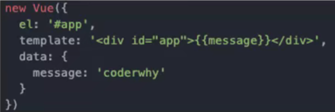

# webpack

```
grunt/gulp/webpack 打包工具
```

## 认识webpack

```
前端模块化打包工具
At its core, webpack is a static module bundler for modern JavaScript applications.
从本质上来讲, webpack是一个现代的JavaScript应用的静态模块打包工具。
```


grunt/gulp的对比

```
grunt/gulp的核心时Task
	我们可以配置一系列的task ,并且定义task要处理的事务(例如ES6、ts转化 ,图片压缩, scss转成css )
	之后让grunt/gulp来依次执行这些task ,而且让整个流程自动化。
	所以grunt/gulp也被称为前端自动化任务管理工具。
```

```
我们看一个gulp的task
	下面的task就是将src下面的所有js文件转成ES5的语法。
	并且最终输出到dist文件夹中。
```


```
什么时候使用 grunt/gulp呢
    如果你的工程模块依赖非常简单,甚至是没有用到模块化的概念。
    只需要进行简单的合并、压缩,就使用grunt/gulp即可。
    但是如果整个项目使用了模块化管理,而且相互依赖非常强,我们就可以使用更加强大的webpack了。
```

```
grunt/gulp 和 webpack 的区别
	grunt/gulp更加强调的是前端流程的自动化,模块化不是它的核心。
	webpack更加强调模块化开发管理,而文件压缩合并、预处理等功能,是他附带的功能。
```


## webpack的安装

```
webpack 需要 node.js , node.js 自带 npm
全局安装webpack,  3.6.0,vue cli2依赖这个版本
npm i xxx --save-dev


全局安装webpack后,还要进行局部安装
    在终端直接执行webpack命令,使用的全局安装的webpack
    当在package.json中定义了scripts时,其中包含了webpack命令,那么使用的是局部webpack
```


## webpack的起步

```
src是开发文件夹
dist是打包的文件夹
文件入口一般都是 mian.js || index.js

文件和文件夹解析：
    dist文件夹:用于存放之后打包的文件
    src文件夹:用于存放我们写的源文件
        main.js :项目的入口文件。具体内容查看下面详情。
        mathUtils.js :定义了一些数学工具函数,可以在其他地方引用,并且使用。具体内容查看下面的详情。
    index.html :浏览器打开展示的首页html
    package.json :通过npm init生成的, npm包管理的文件(暂时没有用上,后面才会用上)
```

```
打包

使用webpack  把main.js		打包入bundle.js
webpack ./src/main.js ./dist/bundle.js

然后引入./dist/bundle.js的js文件就行
```

## webpack的配置

```
加入一个 webpack.config.js 文件，作为webpack的入口出口存放文件

//1.导入node的path包获取绝对路径，需要使用npm init初始化node包
const path = require('path')

//2.配置webpack的入口和出口
module.exports = {
  entry: './src/main.js',//入口文件
  output:{
    path: path.resolve(__dirname, 'dist'),//动态获取打包后的文件路径,path.resolve拼接路径
    filename: 'bundle.js'//打包后的文件名
  }
}
```

```
在package.json上添加脚本

"scripts": {
  "test": "echo \"Error: no test specified\" && exit 1",
  "build": "webpack"
},

npm run build  ->  webpack
会优先在本地里面找webpack，所以我们可以在本地位置也安装一个webpack，
npm install webpack@3.6.0 --save-dev
安装3.6.0  --save-dev代表了开发时依赖

package.json 
"devDependencies" 是开发时依赖的包
dependencies 是运行时的依赖包

如果在终端里面直接敲 webpack 是使用全局的webpack ，
	要想在终端使用本地的，需要自己进入本地的webpack目录位置，然后再webpack
```


## loader的使用

```
loader是webpack中一个非常核心的概念。
webpack用来做什么呢?
	在我们之前的实例中,我们主要是用webpack来处理我们写的js代码,并且webpack会自动处理js之间相关的依		赖。
	但是,在开发中我们不仅仅有基本的js代码处理,我们也需要加载css、图片,也包括一些高级的将ES6转成ES5代			码,将TypeScript转成ES5代码,将sCSS、less转成csS ,将jsx、.vue文件转成js文件等等。
	对于webpack本身的能力来说，对于这些转化是不支持的。
	那怎么办呢?给webpack扩展对应的loader就可以啦。
loader使用过程:
	步骤一:通过npm安装需要使用的loader
	步骤二:在webpack.config.js中的modules关键字下进行配置
大部分loader我们都可以在webpack的官网中找到,并且学习对应的用法。
```

### css

```
我们将css放到main.js的入口中，把其当作一个模块进行使用
先在main.js中进行引入	
	require('./css/normal.css')
然后就可以进行打包了，打包好了之后，就可以直接只引入main.js文件来进行css的渲染，不需要再引入normal.css文件
	
npm安装
npm install --save-dev css-loader
npm install --save-dev style-loader
然后再webpack.config.js里面进行配置css的打包
module.exports = {
	module: {
		rules: [
			前面使用的是正则表达式匹配，把匹配的使用use的规则
			test: /\.css$/,
			css-loader 只负责 将css文件进行加载  
			style-loader 负责将样式添加到Dom中
			使用多个loader时，是从右向左的进行读取
			use: ['style-loader', 'css-loader']
		]
	}
}
```

### less的rules

```
{
	test: /\.less$/,
	use: [{
		creates style nodes from js strings
		loader: 'style-loader',
		options: xxx	这样写，可以写更多的参数进行配置
	}, {
		translates css into commonjs
		loader: 'css-loader'
	}, {
		compiles less to css
		loader: 'less-loader'
	}]
}
```

### 图片|文件

```
使用 url-loader

rules：
{
	test: /\.(png|jph|gif|jpeg)$/,
	ues: [
		{
			loader: 'url-loader',
			options: {
				文件大小限制，（byte），当低于指定的限制时，可以返回一个DataURL。
				就是指，将一个图片转化成例如base64的格式的字符串，然后浏览器直接进行传输和解析
				超过了这个limit的，需要使用file-loader模块进行加载
				limit: 8192
			}
		}
	]
}

file-loader
会进行hash 32算法，防止名字重复
这个不需要在module模块中进行什么配置
但是需要在output里面加上一个publicPath的配置
publicPath: 'dist/'
加上以后 ，以后涉及到任何url的东西，都会自动在前面拼接一个 public Path的值
```


```
在options设置命名
		img目录/ []这个是代表了变量，如果不加这个，就会当成常量name，[name]就是文件名，
		[hash:8]代表了hash，取前8位，[ext]代表了扩展名，
name: 'img/[name].[hash:8].[ext]'
```


### Es6语法处理

```
babel es6转化位es5
										core转化6-5	es2015就是es6
npm install --save-dev babel-loader@7 babel-core babel-preset-es2015
```

```
{
  test: /\.js$/,
  //排除node模块的js和bower的js
  exclude：排除
  include 包含
  exclude: /(node_modules|bower_components)/,
  use: {
    loader: 'babel-loader',
    options: {
      //如果要使用@babel/preset-env这里需要在根目录新建一个babel的文件
      // presets: ['@babel/preset-env']
      //这里直接使用指定
      presets: ['es2015']
    }
  }
}
```

## webpack中配置Vue

```
npm vue -save

import Vue from 'vue'
```

```
import Vue from 'vue';

const app = new Vue({
	el: '#app',
	data: {
		
	}
})

此时编译会报错，因为使用的是runtime-only  这个不能编译带有template的，他会把el挂载的那个作为一个template的组件
runtime-only -> 代码中,不可以有任何的template
runtime-compiler -> 代码中,可以有template,因为有compiler可以用于编译template

可以通过在webpack的配置resolve来切换为compiler
```

```
resolve: {
  //导入模块简写省略指定后缀
  extensions: ['.js', '.css', '.vue'],
  // alias:别名
  alias: {
    //指定vue使用vue.esm.js
    'vue$':'vue/dist/vue.esm.js'
  }
}
```

```
单页面复应用，Simple page web application
通过vue-router 进行跳转

定义template属性：
  在前面的Vue实例中,我们定义了el属性,用于和index.html中的#app进行绑定,让Vue实例之后可以管理它其中		的内容
  这里,我们可以将div元素中的{{message}}内容删掉,只保留一个基本的id为div的元素
  但是如果我依然希望在其中显示{{message}}的内容,应该怎么处理呢?
  我们可以再定义一个template属性 ,代码如下:
```



```
<div id="app"></div>
  
import App from './vue/App.vue'
new Vue({
  el: "#app",
  //使用组件
  template会将div#app替换掉
  template: `
  	div
  		h2 {{message}}
  		button @click='btnClick' {按钮}
  		h2 {{name}}
  `,
  components: {
    //注册局部组件
    App
  }
})  
```

```
优化

const App = {
	template: ` div
  `,
	data() {
		return { message: 'sss' }
	},
	methods: {
		btnClick() { }
	}
}

new Vue({
	el: '#app',
	template: '<App/>',
	components: {
		App
	}
})
```

```
将App分离成 vue文件

template
	div
		button
		
script
	export default {
		name: 'App',
    data() {
      return {
        mess: 'ssss'
      }
    },
    methods: {
      btnClick() {

      }
    }
  }

style scoped
	.title {
		color: green;
	}
```

```
使用vue文件
import App from './vue/app.vue'

需要配置对应的loader
						vue文件加载			vue模板编译
npm install vue-loader vue-template-compiler --save-dev

webpack.config.js
rules: [{
	test: /\.vue$/,
	use: {
		loader: 'vue-loader'
	}
}]
```

```
此时还是有问题，vue-loader从14这个版本开始，就需要再配置一个插件才能使用，如果不想配置这个插件，就换个低一点的版本 
所以去 package.json 里面进行修改		"vue-loader": '^13.0.0'

```

## plugin的使用

```
plugin 插件
  plugin是插件的意思,通常是用于对某个现有的架构进行扩展。
  webpack中的插件,就是对webpack现有功能的各种扩展,比如打包优化,文件压缩等等。

plugin 和 loader 的区别
  loader主要用于转换某些类型的模块,它是一个转换器。
  plugin是插件,它是对webpack本身的扩展，是一个扩展器。
  
plugin 的使用过程：
  步骤一 :通过npm安装需要使用的plugins(某些webpack已经内置的插件不需要安装)
  步骤二:在webpack.config.js中的plugins中配置插件。 
```

### 版权 plugin

```
为打包的文件添加版权声明
	BannerPlugin，属于webpack自带的插件
	
webpack.config.js
const webpack = require('webpack');
module.exports = {
	plugins: [
		new webpack.BannerPlugin('aa');
	]
}
```


```
然后重新打包，查看js文件头部
```


### 打包html的plugin

```
作用：
  我们知道,在真实发布项目时,发布的是dist文件夹中的内容,但是dist文件夹中如果没有index.htm|文件,那么打包的js等文件也就没有意义了。
  所以,我们需要将index.html文件打包到dist文件夹中,这个时候就可以使用HtmIWebpackPlugin插件
 
可以用来
	自动生成一个index.html文件(可以指定模板来生成)
  将打包的js文件,自动通过script标签插入到body中
```

```
使用 
安装
npm install html-webpack-plugin --save-dev
使用插件，修改webpack.config.js的plugins部分
  这里的template表示根据什么模板来生成index.html.
  另外,我们需要删除之前在output中添加的publicPath属性
  否则插入的script标签中的src可能会有问题
 
const htmlWbepackPlugin = require('html-webpack-plugin')

plugins: [
  new webpack. BannerPlugin( '最终版权归coderwhy所有'),
  new htmlWebpackPlugin({
  	template也可以不写，不写的话，就只有script的引入
  	此时会找当前配置文件为路径来找index.html
    template: 'index.html'
	}),
]
```

```
index.html 模板
不用添加script，因为plugin会自动添加

<body>
  <div id="app"></div>
</body>
```

### js压缩的plugin

```
我们必然需要对js等文件进行压缩处理
	这里,我们就对打包的js文件进行压缩
	我们使用一个第三方的插件uglifjs-webpack-plugin ,并且版本号指定1.11, CLU2保持一致
		npm install uglifyjs-webpack-plugin@1.1.1 --save-dev
修改webpack.config.js文件，使用插件：
	const UglifyjsWebpackPlugin = require('uglifyjs-webpack-plugin')
	new UglifyjsWebpackPlugin()
```

## 搭建本地服务器

### dev-server基础和配置

```
webpack提供了一个可选的本地开发服务器,这个本地服务器基于node.js搭建,内部使用express框架,可以实现我们想要的让浏览器自动刷新显示我们修改后的结果。
不过它是一个单独的模块 ,在webpack中使用之前需要先安装它
	npm install --save-dev webpack-dev-server@2.9.1
devserver也是作为webpack中的一个选项,选项本身可以设置如下属性:
	contentBase :为哪一个文件夹提供本地服务,默认是根文件夹,我们这里要填写./dist
	port :端口号
	inline :页面实时刷新
	historyApiFallback :在SPA页面中,依赖HTML5的history模式
webpack.config.js文件配置修改如下: 
我们可以再配置另外一个scripts :
	--open参数表示直接打开浏览器
```


```
webpack.config.js
devServer: {
	contentBase: './dist',
	inline: true
}

package.json 
srcipts 里面配置
"dev" : webpack-dev-server --open(可以自动打开浏览器)

npm run dev
```

### webpack配置文件分离

```
有的配置再开发阶段使用，但是发布阶段是不需要的，
所以我们需要配置文件分离
公共时的放base，dev时开发时的，prod是生产时的。
base.config.js		dev.config.js	prod.config.js

prod.config.js
使用压缩代码
base.config.js
其他公共的
使用module.exports = {} 作为入口和出口存放
dev.config.js
devServer 开发时，作为服务器

最终编译	base+prod
开发	base+dev
```


```
最终使用步骤

npm下载
npm install webpack-merge --serve-dev
	merge 合并

使用
base.config.js
  这里因为把config文件从根目录存放到了build目录里面，所以需要把
  output的path路径进行修改 
  path: path.resolve(__dirname, '../dist'),//动态获取打包后的文件路径,path.resolve拼接路径
prod.config.js
  先导入 在	prod.config.js
    const webpackMerge = require('webpack-merge')
    导入base.config
    const baseConfig = require('./base.config')
  导出：
    //使用webpackMerge将baseConfig和prod.config的内容合并
    module.exports = webpackMerge(baseConfig, {
      plugins:[
        new uglifyjsWebpackPlugin()
      ]
    })
dev.config.js
  再在dev.config里面用同样的方式
  引入 webpackMerge合并包，再导入 baseConfig
  然后使用 module.exports = webpackMerge(baseConfig, {自己的})

然后再在package.json里面的scripts里面  把打包（build）和开发（dev）的进行设置
	build : webpack --config ./build/prod.config.js
	dev : webpack-dev-server --open --config ./build/dev.config.js
```

# end

## 参考

```
哔哩哔哩， coderwhy， BV15741177Eh
```

