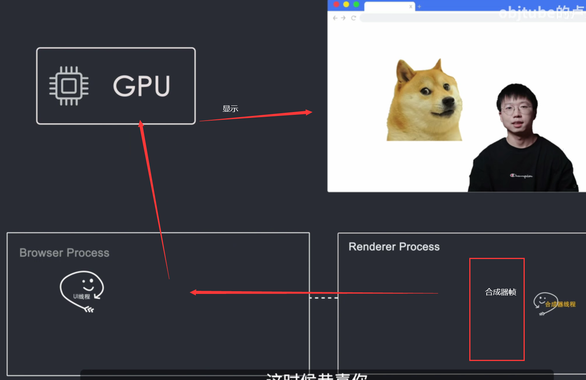

# 浏览器的工作原理

## 浏览器的发展


## 浏览器框架结构

### 用户界面

### 浏览器引擎

#### 数据持久层

### 渲染引擎

```
称为内核

网络模块，js解析器
```


#### 进程和线程

```
进程是操作系统进行资源分配和调度的基本单元，可以申请和拥有计算机资源，进程是程序的基本执行实体。
线程是操作系统能够进行运算调度的最小单位，一个进程中可以并发多个线程，每条线程并行执行不同的任务
```

##### 单进程浏览器


```
不稳定
不安全
不流畅
```

##### 多进程浏览器


```
	浏览器进程负责控制chrome浏览器除标签页外的用户界面，包括地址栏，书签，后退和前进按钮，以及负责与浏览器的其他进程协调工作
	网络进程负责发起接收网络请求
	GPU进程负责整个浏览器界面的渲染
	插件进程负责控制网站使用的所有插件 （flash）
	渲染器进程用来控制显示tab标签内的内容，浏览器默认情况下会为每个标签页创建一个进程
```

#### 当输入地址时

```
浏览器进程的UI会捕捉你的输入内容，
如果访问的是网址，则UI程会启动一个网络线程来请求DNS进行域名解析，着开始连接服务器获取数据，
如果你的输入不是网址，而是一串关键词，浏览器就知道你是要搜索于是就会使用默认配置的搜索引擎来查询
```


### 网络线程获取到数据之后会怎么办

```
当网络线程获取到数据后，会通过SafeBrowsing来检查站点是否是恶意站点，
如果是，则会提示给警告页面，告诉你这个站点有安全问题，浏览器会阻止你的访问，当然你也可以强行继续访问，
SafeBrowsing是谷歌内部的一个站点安全系统，通过检测该站点的数据来判断是否安全，
比如通过查看该站点的IP是否在谷歌的黑名单之内，
当返回数据准备完毕，并且安全校验通过时，
网络线程会通知UI线程 我就要准备好了
然后UI线程 会创建一个渲染器进程 （Render Thread）来渲染页面
```


### 渲染过程

#### 生成dom树

```
浏览器进程通过IPC管道将数据传递给渲染器进程，正式进入渲染流程
渲染器进程接到的数据也就是html
渲染器进程的核心任务就是把html，css，js，image等资源渲染成用户可以交互的web页面，
渲染器进程的主线程将html进行解析
构造dom数据结构，dom也就是文档对象模型，是浏览器对页面在其 内部的表示形式，是web开发程序员 可以 通过js与 之交互的数据 结构和API
html首先经过 tokeniser标记化，通过词法 分析将输入的html内容解析成 多个标记，
根据识别后的标记进行dom树构造，在dom树构造过程中会 创建document对象
然后以document的为根节点的dom树不断进行修改，向其中 添加各种元素，
html代码 中往往会引入一些额外的资源，比如说图片，css，js脚本等，
图片和css这些 资源需要通过网络下载或者从缓存中直接加载
这些资源不会阻塞html 的解析，因为他们不会影响dom的生成，
但当 html标解析过程中遇到script标签，
就会停止html解析流程，转而去加载并执行js，
你可能就会 问了为什么不直接跳过js的加载和执行这个 过程
等html解析 完后，再加载运行js
这是因为浏览器并不知道 js执行 是否会改变当前页面的html结构，
如果js代码里用了document.write方法来修改html，
那之前的html解析就 没有意义了，这也就是为什么我们一致说要把script标签放在合适的位置，或者使用async或 defer属性来异步加载执行js
```


```
在html解析完成后，我们就会获得一个 dom tree
但我们还不知道dom tree上每一个节点应该长什么样子
主线程需要解析css，并确定每个dom节点的计算样式
即使你没有提供自定义的CSS的样式，浏览器会有自己默认的样式表，比如h2的字体要比h3的大
```


```
在知道dom结构和每个节点的样式后，我们接下来需要知道每个节点需要。放在页面上的哪个位置？
也就是节点的坐标以及该节点需要。占用多大的区域？
这个阶段被称为layout布局。
主线程通过遍历dom和计算好的样式来生成layout tree。
```


```
layout tree上的每个节点都记录了xy坐标和边框尺寸。
这里需要注意的一点是dom tree和Layout tree并不是一一对应的。
设置了display:none的节点不会出现在layout tree上
而在before伪类添加了content值元素。content里的内容会出现在Layout tree上。不会出现在dom树里，这是因为dom是通过html解析获得。并不关心样式。
而layout tree是根据dom和计算好的样式来生成,layout tree是和最后展示在屏幕上的节点是对应的。
```


#### 元素绘制顺序

```
好了，现在我们已经知道了元素的形状，大小和位置，这还不够，我们还需要做什么？
我们还需要知道以什么样的顺序绘制（print）这个节点。
z-index属性会影响节点绘制的层级关系。
如果我们按照dom的层级结构来绘制页面。则会导致错误的渲染。
所以为了保证在屏幕上展示正确的层级，主线程遍历layout tree创建一个绘制记录表（paint record）。
该表记录了绘制的顺序。这个阶段被称为绘制。（paint）
现在知道了文档的绘制顺序。
```


#### 显示，栅格化

```
终于到了该把这些信息转化成像素点,显示在屏幕上的时候了,这种行为被称为栅格化(Rastering)
Chrome最早使用了一种很简单的方式,只删格化用户可视区域(Viewport)的内容
当用户滚动页面时，再删格化更多的内容来填充缺失的部分
这种方式带来的问题显而易见，会导致展示延迟
随着不断的优化升级，现在的Chrome使用了-种更为，复杂的栅格化流程，叫做合成(Composting),
合成是一种将页面的各个部分，分成多个图层，分别对其进行栅格化
并在合成器线程(Compositor Thread)，的技术中单独进行合成页面
简单来说就是页面所有的元素按照，某种规则进行分图层
并把图层都栅格化好了，然后只需要把可视区的内容组合成
一帧展示给用户即可
主线程遍历Layout Tree，生成Layer (图层)Tree
当Layer Tree生成完毕和，绘制顺序确定后，
主线程将这些信息传递给合成器线程，合成器线程将每个图层栅格化
```


```
由于一层可能像页面的整个长度一样大，因此合成器线程将他们切分为，许多图块(iles)
然后将每个图块发送给栅格化线程(Raster Thread)
```


```
栅格化线程栅格化每个图块，并将它们存储在GPU内存中
当图块删格画完成后
合成器线程将收集称为"draw quads'的图块信息
这些信息里记录了图块在内存中的位置和在页面的哪个位置绘制图块的信息
```


#### 合成器帧

```
根据这些信息合成器线程生成了一个合成器帧(Compositor Frame)
然后合成器Frame(帧通过IPC传送给浏览器进程
接着浏览器进程将合成器帧传送到GPU，然后GPU渲染展示到屏幕上
这个时候看到了页面内容，
当页面发生变化，比如滚动页面
都会生成一个新的合 成器帧，新的帧再传给GPU，然后再次渲染到屏幕上
```



#### 浏览器渲染过程简单解析

```
浏览器进程中的网络线程请求获取到Html数据后。
通过ipc将数据传给渲染器进程的主线程
主线程将html解析构造dom树。
然后进行样式计算。根据dom树和生成好的样式生成layout tree
通过遍历layout tree生成绘制顺序表。
接着遍历了layout tree，生成了layer tree
然后主线程将layer tree和绘制顺序信息一起传给合成器线程。
合成期现场按照规则进行分图层。
并把图层分为更小的图块（tiles）传给栅格化线程进行栅格化。
栅格化完成后。合成器线程会获得栅格化线程传过来的“draw quads”图块信息
根据这些信息，合成器线程合成了一个合成器帧。
然后将该合成器帧通过ipc传回给浏览器进程。
浏览器进程再传到gpu进行渲染。之后就展示到你的屏幕上。
```


### 重绘和重排的问题

```
当我们改变一个元素的尺寸，位置，属性时，会重新进行样式计算（computed style）
布局绘制（layout paint）以及后面的所有流程。
这种行为我们称为重排。

当我们改变某个元素的颜色属性时，不会重新触发布局。那还是会触发样式计算和绘制。这个就是重绘。

我们可以发现重排和重绘都会占用主线程。

还有另外一个东西也是运行在主线程上。就是js，
既然他们都是在主线程运行。就会出现抢占时执行时间的问题。
如果你写了一个不断导致重排重绘的动画。浏览器则需要在每一帧都运行样式。计算布局和绘制的操作。
我们知道，当页面以每秒60帧的刷新率时才不会让用户感觉到页面卡顿。
如果你在运行动画时，还有大量的js任务需要执行。
因为布局绘制和js执行都是在主线程运行的。
当在每一帧的时间内布局和绘制结束后。
如果还有剩余时间。js就会得到主线程的使用权。
如果js执行时间过长。就会导致在下一帧开始js没有及时归还主线程。
导致下一帧动画没有按时渲染。
就会出现页面动画的卡顿。
```

#### 优化

```
优化手段。
第一种是通过
requestAnimationFrame()来解决这个问题。
这个方法会在每一帧被调用。通过api的回调。
我们可以把js任务分成一些更小的任务快。在每一帧时间用完前暂停js执行。
归还主线程。

这样主线程就可以按时执行布局和绘制。

react最新渲染引擎 react fiber就是用到了这个api来做优化。


第二个优化方法
因为栅格化的整个流程不占用主线程。只在合成器线程和栅格线程中运行
就意味着它无需和js抢夺主线程。
如果我们反复进行重绘和重排，可能会导致掉帧，这是因为有可能js执行阻塞了主线程。
而css中有个动画属性叫做transform。通过该属性实现的动画不会经过布局和绘制。
而是直接运行在合成器线程和栅格化线程，
所以不会受到主线程中js执行的影响。更重要的是通过transform实现的动画由于不需要经过布局绘制样式计算等操作。
所以节省了很多运算时间。
我们常常会使用哪些属性来实现动画效果
```


## 具体的默认的样式表可以在这里查看


# end

## 参考

```
哔哩哔哩 objtube的卢克儿 BV1x54y1B7RE
```

