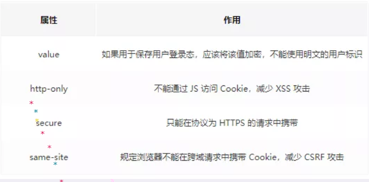

# 第一个

## 回流/重绘

```
https://blog.csdn.net/weixin_34353714/article/details/91445129 
```

### 浏览器的渲染过程

```
https://blog.csdn.net/farsight1/article/details/79758347
处理 HTML 并tokeniser标记构造 DOM 树。
处理 CSS 标记并构造 CSSOM 树。
如果遇到了js会停止dom树的解析，并且如果js还操作了cssom，并且cssom没有下载和构建，浏览器甚至会延迟脚本执行和构建dom，直至cssom的下载完成和构建
然后 将dom和cssom合并位渲染树 render tree
根据渲染树来布局，计算每个节点的几何信息
将节点绘制到屏幕上
```

### 渲染树 的生成

```
遍历可见的节点
对于可见的节点，找到cssom的规则，并 渲染

注意：
一些不会渲染输出的节点。比如 script、meta、link等。是不可见的
某些节点通过 CSS 隐藏。注意 visibility: hidden 与 display: none 是不一样的。前者隐藏元素，但元素仍占据着布局空间（即将其渲染成一个空框），而后者 (display: none) 将元素从渲染树中完全移除，元素既不可见，也不是布局的组成部分。
```

### 回流(reflow)


当 Render Tree 中**部分或全部, 因元素的尺寸、布局、隐藏等改变而需要重新构建，浏览器重新渲染的过程**称为回流。

```
会导致回流的操作：
  页面首次渲染。
  浏览器窗口大小发生改变。
  元素尺寸或者位置发生改变。
  元素内容变化(文字数量或者图片大小发生改变)。
  元素字体大小的改变。
  添加或者删除可见的 DOM 元素。
  激活 CSS 伪类 (eg: :hover)。
  查询某些属性或调用某些方法。

一些常用且会导致回流的属性和方法。
  clientWidth、clientHeight、clientTop、clientLeft
  offsetWidth、offsetHeight、offsetTop、offsetLeft
  scrollWidth、scrollHeight、scrollTop、scrollLeft
  scrollIntoView()、scrollIntoViewIfNeeded()
  getComputedStyle()
  getBoundingClientRect()
  scrollTo()
```

### 重绘(repaint)

当页面中元素样式的改变并不影响布局时（eg：`color`、`background-color`等），浏览器会将新样式赋予给元素并重新绘制它，这个过程称为重绘。

**一句话： 回流必将引起重绘，重绘不一定会引起回流。**

### 现代浏览器对频繁的回流/重绘的优化

浏览器会维护一个队列，把所有引起回流和重绘的操作放入队列中，如果队列中的任务数量或者时间间隔达到一个阈值的，浏览器就会将队列清空，进行一次批处理，这样可以把多次回流和重绘变成一次。

```
当你访问以下属性或方法时，浏览器会立刻清空队列：
  clientWidth、clientHeight、clientTop、clientLeft
  offsetWidth、offsetHeight、offsetTop、offsetLeft
  scrollWidth、scrollHeight、scrollTop、scrollLeft
  scrollIntoView()、scrollIntoViewIfNeeded()
  getComputedStyle()
  getBoundingClientRect()
  scrollTo()
 
		因为队列中可能会有影响到这些属性或方法返回值的操作，即使你希望获取的信息与队列中操作引发的改变无关，浏览器也会强行清空队列，确保你拿到的值是最精确的。
```

### 优化回流

```
减少 render tree 操作，合并多次多dom和样式的的修改
减少对一些style信息的请求，尽量利用好浏览器的优化策略
```

#### css

直接改变className

避免使用table布局(尽量不要使用表格布局，如果没有定宽表格一列的宽度由最宽的一列决定，那么很可能在最后一行的宽度超出之前的列宽，引起整体回流造成table可能需要多次计算才能确定好其在渲染树中节点的属性，通常要花3倍于同等元素的时间。)

尽可能在dom树的最末端改变class，尽可能在dom树的里面改变class（可以显示回流的范围）

将需要多次重排的元素，position属性设置位absolute或fixed，这样此元素就脱离了文档流，她的变化不会影响到其他元素。例如有动画效果的元素就最好 设置为绝对定位。

使用 display:none技术，只引发两次回流和重绘。

#### js

避免频繁操作，最好一次性重写style属性，或者将样式列表定义为class，并一次性更改class属性，而不是利用js控制样式

不要经常访问会引起浏览器缓存队列的属性（上述那些浏览器会立刻清空队列的属性）。如果确实要访问，利用缓存 eg：

```
// bad
for (var i = 0; i < len; i++) {
  el.style.left = el.offsetLeft + x + "px";
  el.style.top = el.offsetTop + y + "px";
}

// good
var x = el.offsetLeft,
    y = el.offsetTop;
for (var i = 0; i < len; i++) {
  x += 10;
  y += 10;
  el.style = x + "px";
  el.style = y + "px";
}
```

尽量将需要改变dom的操作一次完成

```
let box = document.getElementById("box").style;
// bad
box.color = "red";    // 重绘
box.size = "14px";    // 回流、重绘

// good
box.bord = '1px solid red'
```

对具有复杂动画的元素使用绝对定位，使它脱离文档流，否则会引起父元素及后续元素频繁回流。

避免频繁操作 `DOM`，创建一个`documentFragment`，在它上面应用所有 `DOM` 操作，最后再把它添加到文档中。

```
DocumentFragment，文档片段接口，表示一个没有父级文件的最小文档对象. 与 Document 最大的区别是因为 DocumentFragment 不是真实 DOM 树的一部分，它的变化不会触发 DOM 树的（重新渲染) ，且不会导致性能等问题。

可以使用 document.createDocumentFragment 方法或者构造函数来创建一个空的 DocumentFragment.
```

## requestAnimationFrame 为什么不会掉帧

```
	首先，我们可以知道布局绘制和js执行都是在主线程进行的执行的，
	所以，如果当js拿到主线程执行权后，有可能会出现执行时间过长，导致在下一帧的开始js没有及时归还主线程，导致下一帧没有按时渲染，于是就会出现掉帧，而这个requestAnimationFrame方法就是解决这个问题的，
	他会在每一帧被调用，通过回调函数，会把js任务分成更小的任务快，并且会在每一帧时间用完暂停js的执行，归还主线程，所以布局绘制就会在每帧及时拿到主线程的使用权，所以不会掉帧。
```

```
requestAnimationFrame最大的优势是由系统来决定回调函数的执行时机。
「requestAnimationFrame的步伐跟着系统的刷新步伐走」，
「它能保证回调函数在屏幕每一次的刷新间隔中只被执行一次」，
「这样就不会引起丢帧现象，也不会导致动画出现卡顿的问题」。
```

```
requestAnimationFrame还有以下两个优势：

「CPU节能」：
		使用setTimeout实现的动画，当页面被隐藏或最小化时，setTimeout 仍然在后台执行动画任务，由于此时页面处于不可见或不可用状态，刷新动画是没有意义的，完全是浪费CPU资源。而requestAnimationFrame则完全不同，当页面处理未激活的状态下，该页面的屏幕刷新任务也会被系统暂停，因此跟着系统步伐走的requestAnimationFrame也会停止渲染，当页面被激活时，动画就从上次停留的地方继续执行，有效节省了CPU开销。

「函数节流」：
		在高频率事件(resize,scroll等)中，为了防止在一个刷新间隔内发生多次函数执行，使用requestAnimationFrame可保证每个刷新间隔内，函数只被执行一次，这样既能保证流畅性，也能更好的节省函数执行的开销。一个刷新间隔内函数执行多次时没有意义的，因为显示器每16.7ms刷新一次，多次绘制并不会在屏幕上体现出来。
```

下面为《HTML5 Canvas 核心技术》给出的兼容主流浏览器的requestNextAnimationFrame 和cancelNextRequestAnimationFrame方法

```
window.requestNextAnimationFrame = (function () {
    var originalRequestAnimationFrame = undefined,
        wrapper = undefined,
        callback = undefined,
        geckoVersion = null,
        userAgent = navigator.userAgent,
        index = 0,
        self = this;

    wrapper = function (time) {
        time = performance.now();
        self.callback(time);
    };

    /*!
     bug!
     below code:
     when invoke b after 1s, will only invoke b, not invoke a!

     function a(time){
     console.log("a", time);
     webkitRequestAnimationFrame(a);
     }

     function b(time){
     console.log("b", time);
     webkitRequestAnimationFrame(b);
     }

     a();

     setTimeout(b, 1000);


     so use requestAnimationFrame priority!
     */
    if(window.requestAnimationFrame) {
        return requestAnimationFrame;
    }


    // Workaround for Chrome 10 bug where Chrome
    // does not pass the time to the animation function

    if (window.webkitRequestAnimationFrame) {
        // Define the wrapper

        // Make the switch

        originalRequestAnimationFrame = window.webkitRequestAnimationFrame;

        window.webkitRequestAnimationFrame = function (callback, element) {
            self.callback = callback;

            // Browser calls the wrapper and wrapper calls the callback

            return originalRequestAnimationFrame(wrapper, element);
        }
    }

    //修改time参数
    if (window.msRequestAnimationFrame) {
        originalRequestAnimationFrame = window.msRequestAnimationFrame;

        window.msRequestAnimationFrame = function (callback) {
            self.callback = callback;

            return originalRequestAnimationFrame(wrapper);
        }
    }

    // Workaround for Gecko 2.0, which has a bug in
    // mozRequestAnimationFrame() that restricts animations
    // to 30-40 fps.

    if (window.mozRequestAnimationFrame) {
        // Check the Gecko version. Gecko is used by browsers
        // other than Firefox. Gecko 2.0 corresponds to
        // Firefox 4.0.

        index = userAgent.indexOf('rv:');

        if (userAgent.indexOf('Gecko') != -1) {
            geckoVersion = userAgent.substr(index + 3, 3);

            if (geckoVersion === '2.0') {
                // Forces the return statement to fall through
                // to the setTimeout() function.

                window.mozRequestAnimationFrame = undefined;
            }
        }
    }

    return window.webkitRequestAnimationFrame ||
        window.mozRequestAnimationFrame ||
        window.oRequestAnimationFrame ||
        window.msRequestAnimationFrame ||

        function (callback, element) {
            var start,
                finish;

            window.setTimeout(function () {
                start = performance.now();
                callback(start);
                finish = performance.now();

                self.timeout = 1000 / 60 - (finish - start);

            }, self.timeout);
        };
})();


    window.cancelNextRequestAnimationFrame = window.cancelRequestAnimationFrame
        || window.webkitCancelAnimationFrame
        || window.webkitCancelRequestAnimationFrame
        || window.mozCancelRequestAnimationFrame
        || window.oCancelRequestAnimationFrame
        || window.msCancelRequestAnimationFrame
        || clearTimeout;
```


## HTTP的请求报文结构

### 请求报文


```
请求行	请求方法， 请求url（不包括域名）， HTTP协议版本
		get/post			/user							HTTP/1.1
请求头
	user-agent
空行
请求体
```

```
POST /user HTTP/1.1      //请求行
Host: www.user.com
Content-Type: application/x-www-form-urlencoded
Connection: Keep-Alive
User-agent: Mozilla/5.0.      //以上是首部行
（此处必须有一空行）  //空行分割header和请求内容 
name=world   请求体
```

#### HTTP1.1版本

```
		HTTP/1.1是当前正在使用的版本。该版本默认采用持久连接，并能很好地配合代理服务器工作。还支持以管道方式同时发送多个请求，以便降低线路负载，提高传输速度。

　　HTTP/1.1新增了：OPTIONS、PUT、DELETE、TRACE、CONNECT五种HTTP请求方法。
```

```
User-Agent : 产生请求的浏览器类型
Accept : 客户端希望接受的数据类型，比如 Accept：text/xml（application/json）表示希望接受到的是xml（json）类型
Content-Type：发送端发送的实体数据的数据类型。
比如，Content-Type：text/html（application/json）表示发送的是html类型。
Host : 请求的主机名，允许多个域名同处一个IP地址，即虚拟主机
```

```
请求体：
与请求数据相关的最常使用的请求头是 Content-Type 和 Content-Length。
```

#### HTTP各个版本

```
https://blog.csdn.net/qq_22238021/article/details/81197157
```

```
HTTP/0.9
        HTTP协议的最初版本，功能简陋，仅支持请求方式GET，并且仅能请求访问HTML格式的资源。
```

```
HTTP/1.0
		请求行必须在尾部添加协议版本字段（http/1.0）；必须包含头消息        
		其他的新增功能还包括状态码（status code）、多字符集支持、多部分发送（multi-part type）、权限（authorization）、缓存（cache）、内容编码（content encoding）等。
     但是1.0版本的工作方式是每次TCP连接只能发送一个请求，当服务器响应后就会关闭这次连接，下一个请求需要再次建立TCP连接，就是不支持keepalive。
```

```
HTTP/1.1
		1.1 版的最大变化，就是引入了持久连接（persistent connection），即TCP连接默认不关闭，可以被多个请求复用，不用声明Connection: keep-alive。解决了1.0版本的keepalive问题，1.1版本加入了持久连接，一个TCP连接可以允许多个HTTP请求；

		客户端和服务器发现对方一段时间没有活动，就可以主动关闭连接。不过，规范的做法是，客户端在最后一个请求时，发送Connection: close，明确要求服务器关闭TCP连接。

		加入了管道机制，在同一个TCP连接里，允许多个请求同时发送，增加了并发性，进一步改善了HTTP协议的效率；举例来说，客户端需要请求两个资源。以前的做法是，在同一个TCP连接里面，先发送A请求，然后等待服务器做出回应，收到后再发出B请求。管道机制则是允许浏览器同时发出A请求和B请求，但是服务器还是按照顺序，先回应A请求，完成后再回应B请求。
```

```
HTTP/2.0
        为了解决1.1版本利用率不高的问题，提出了HTTP/2.0版本。增加双工模式，即不仅客户端能够同时发送多个请求，服务端也能同时处理多个请求；
        HTTP请求和响应中，状态行和请求/响应头都是些信息字段，并没有真正的数据，因此在2.0版本中将所有的信息字段建立一张表，为表中的每个字段建立索引，客户端和服务端共同使用这个表，他们之间就以索引号来表示信息字段，这样就避免了1.0旧版本的重复繁琐的字段，并以压缩的方式传输，提高利用率。
        另外也增加服务器推送的功能，即不经请求服务端主动向客户端发送数据。
```

### 响应报文

```
响应行
响应头
空行
响应体
```

响应行

```
http协议版本	状态码	状态码的文本描述
```

响应头

```
date， content-length， content-type
```

空行

响应体

```
就是返回的内容
```


## TCP三次握手、四次挥手

**TCP报文格式**


```
URG:Urget pointer is valid (紧急指针字段值有效)
SYN: 表示建立连接
FIN: 表示关闭连接
ACK: 表示响应
PSH: 表示有 DATA数据传输
RST: 表示连接重置。
seq：序号
ack：确认序号
ACK：确认标识号
```


### 三次握手


```
seq：序号
ack：确认序号
ACK：确认标识号
```

```
A：发送同步请求，syn：1，随机生成32位的序列号seq，并进入syn.sent状态
B：接收到同步请求后，返回syn：1，ACK：1 确认序号ack，为上一个的序列号+1，同时也自身生成一个随机序列号seq，并进入syn.received
A: 收到B的请求， ack： seq+1， ACk：1，并进入established
B：收到A的请求后，也进入了established，表明了连接建立成功
```

### 四次挥手


```
A：发送FIN，seq=x，变为fin-wait-1状态
B: 接收到了后，发送ack确认序号，ACK，seq，并进入close-wait状态，并会通知应用进程，此时因为服务器可能还有数据处理，
A: 收到B的确认后，进入fin-wait-2状态，
B：数据处理完毕，发送ACK，ack确认序号，seq和FIN，并将状态置为last-ack
A: A收到了b的结束确认，返回ack，ACK，seq，并进入了time-wait状态，等待了2MSL，就关闭
B: 收到了A的结束确认，就关闭了
```

```
MSL：报文最大来回传输时间，Maximum Segment Lifetime，中文可以译为“报文最大生存时间”
```


## HTTP TCP 属于哪个层

网络体系结构分了五层：应用层， 传输层， 网络层， 数据链路层， 物理层。

HTTP属于应用层，TCP属于传输层


## ES6的新特性

```
https://www.jianshu.com/p/ac1787f6c50f
```

### 变量声明 const/let

```
let 关键词声明的变量不具备变量提升（hoisting）特性
let 和 const 声明只在最靠近的一个块中（花括号内）有效
当使用常量 const 声明时，请使用大写变量，如：CAPITAL_CASING
const 在声明时必须被赋值
```

### 模板字符串

```
es5:
	var str = '';
	
es6:
	let str = ``;
	
基本的字符串格式化。将表达式嵌入字符串中进行拼接。用${}来界定；
ES6反引号(``)直接搞定；
```

### 箭头函数（Arrow Functions）

```
不需要 function 关键字来创建函数
省略 return 关键字
继承当前上下文的 this 关键字

function(res => res+1)
```

### 函数的参数默认值

```
// ES6之前，当未传入参数时，text = 'default'；
function printText(text) {
    text = text || 'default';
    console.log(text);
}

// ES6；
function printText(text = 'default') {
    console.log(text);
}
```

### Spread/Rest操作符

```
Spread / Rest 操作符指的是 ...，具体是 Spread 还是 Rest 需要看上下文语境。
```

```
当被用于迭代器中时，它是一个 Spread 操作符：

function foo(x,y,z) {
  console.log(x,y,z);
}
 
let arr = [1,2,3];
foo(...arr); // 1 2 3


当被用于函数传参时，是一个 Rest 操作符：当被用于函数传参时，是一个 Rest 操作符：

function foo(...args) {
  console.log(args);
}
foo( 1, 2, 3, 4, 5); // [1, 2, 3, 4, 5]
```

### 二进制和八进制字面量

ES6 支持二进制和八进制的字面量，通过在数字前面添加 0o 或者0O 即可将其转换为八进制值：

```
let oValue = 0o10;
console.log(oValue); // 8
 
let bValue = 0b10; // 二进制使用 `0b` 或者 `0B`
console.log(bValue); // 2
```

### 对象和数组解构

```
// 对象
const student = {
    name: 'Sam',
    age: 22,
    sex: '男'
}
// 数组
// const student = ['Sam', 22, '男'];

// ES5；
const name = student.name;
const age = student.age;
const sex = student.sex;
console.log(name + ' --- ' + age + ' --- ' + sex);

// ES6
const { name, age, sex } = student;
console.log(name + ' --- ' + age + ' --- ' + sex);
```

### 对象超类

ES6 允许在对象中使用 super 方法：

```
var parent = {
  foo() {
    console.log("Hello from the Parent");
  }
}
 
var child = {
  foo() {
    super.foo();
    console.log("Hello from the Child");
  }
}
 
Object.setPrototypeOf(child, parent);
child.foo(); // Hello from the Parent
             // Hello from the Child
```

### for...of 和 for...in

for...of 用于遍历一个迭代器，如数组：

for...in 用来遍历对象中的属性：

### ES6中的类

ES6 中支持 class 语法，不过，ES6的class不是新的对象继承模型，它只是原型链的语法糖表现形式。

函数中使用 static 关键词定义构造函数的的方法和属性：

```
class Student {
  constructor() {
    console.log("I'm a student.");
  }
 
  study() {
    console.log('study!');
  }
 
  static read() {
    console.log("Reading Now.");
  }
}
 
console.log(typeof Student); // function
let stu = new Student(); // "I'm a student."
stu.study(); // "study!"
stu.read(); // "Reading Now."
```

类中的继承和超集：

```
class Phone {
  constructor() {
    console.log("I'm a phone.");
  }
}
 
class MI extends Phone {
  constructor() {
    super();
    console.log("I'm a phone designed by xiaomi");
  }
}
 
let mi8 = new MI();
```

```
extends 允许一个子类继承父类，需要注意的是，子类的constructor 函数中需要执行 super() 函数。
当然，你也可以在子类方法中调用父类的方法，如super.parentMethodName()。
在 这里 阅读更多关于类的介绍。
```

```
有几点值得注意的是：
		类的声明不会提升（hoisting)，如果你要使用某个 Class，那你必须在使用之前定义它，否则会抛出一个 ReferenceError 的错误
		在类中定义函数不需要使用 function 关键词
```

## 箭头函数和匿名函数的区别

### 匿名函数

```
个人认为，匿名函数常用于几个地方，
回调函数， 将函数赋值给变量， 自调用函数，
所以匿名函数和普通函数应该是没有什么大区别的
```

### 箭头函数

```
为es6的新函数，
特点，简化了函数的定义
```

### 区别

```
this的指向，匿名函数的this指向为调用它的
而箭头函数的this是由词法作用域，由上下文决定
```

```
和带名函数相比，匿名函数需要讲地址赋值给另一个变量let a，然后再用a来调用函数；和匿名函数比，箭头函数完全修复了this的指向，this总是指向词法作用域。
```

## 闭包的定义以及解决的问题，会存在哪些问题

### 什么是闭包

由于在JS中，变量的作用域属于**函数作用域**，在函数**执行后作用域就会被清理、内存也随之被收回**，但是由于**闭包是建立在一个函数内部的子函数**，由于其**可访问上级作用域**的原因，**即使上级函数执行完，作用域也不会随之销毁**，这时的**子函数—也就是闭包**，便拥有了**访问上级作用域中的变量的权限**，即使上级函数执行完后，作**用域内的值也不会被销毁。**

### 解决了什么

阮一峰在他的博客中写到：`在本质上，闭包就是将函数内部和函数外部连接起来的一座桥梁。`

```
由于闭包可以缓存上级作用域，那么就使得函数外部打破了“函数作用域”的束缚，可以访问函数内部的变量。
以平时使用的 AJAX 成功回调为例，这里其实就是个闭包，由于上述的特性，
回调就拥有了整个上级作用域的访问和操作能力，提高了极大的便利。
开发者不用去学钩子函数来操作上级函数作用域内部的变量了
```

`闭包最大的用处`

 1） 一个是可以读取函数内部的变量；
		 2） 另一个就是让这些变量的值始终保存在内存中。

应用场景：

回调函数（Ajax， 事件绑定），简而言之，无论使用何种方式对函数类型的值进行传递，当函数在别处被调用时，都有闭包的身影

**特性：**

1. 函数内部嵌套函数
2. 函数内部可以引用外部的变量
3. 参数和变量不会被垃圾回收机制回收

### 存在的问题：

**代码维护**，特别是异步加上了闭包

**内存消耗大**：性能问题。**解决办法**：在退出函数之前，将不使用的局部变量全部删除。

**this指向**：指向的是window

### 闭包是不回收引用的那个对象还是不回收外部整个作用域，你是怎么验证这一点的

```
https://www.iteye.com/blog/justjavac-1465169
```

对于不同的浏览器的js引擎可能会有不同，这个取决于gc，垃圾回收机制，我当时是使用的谷歌的v8引擎验证，发现对于不使用的会被回收，至于验证的方法，我是在浏览器里面通过断点调试，查看变量是否存在来判断的，当然还可以对代码执行以后强制进行一次垃圾回收，来查看内存的变化来判断回收的是对象还是整个作用域。

## 跨域怎么解决

```
https://segmentfault.com/a/1190000011145364
```

### 什么是跨域

**因为浏览器同源策略的限制，**

​	【1】无法读取非同源网页的 Cookie、LocalStorage 和 IndexedDB

​	【2】无法接触非同源网页的 DOM

​	【3】无法向非同源地址发送 AJAX 请求

**所谓同源（即指在同一个域）**就是两个页面具有相同的协议（protocol），主机（host）和端口号（port）

### jsonp

简单来说，就是我们请求script标签不会出现跨域问题，所以我们可以把请求放在script标签的src文件上，这样就能进行请求了，缺点，只能进行get请求


    <script>
        var script = document.createElement('script');
        script.type = 'text/javascript';
      // 传参一个回调函数名给后端，方便后端返回时执行这个在前端定义的回调函数
      script.src = 'http://www.domain2.com:8080/login?user=admin&callback=handleCallback';
      document.head.appendChild(script);
    
      // 回调执行函数
      function handleCallback(res) {
          alert(JSON.stringify(res));
      }
    </script>
###  document.domain + iframe跨域

此方案仅限主域相同，子域不同的跨域应用场景。

实现原理：两个页面都通过js强制设置document.domain为基础主域，就实现了同域。

### location.hash + iframe

实现原理： a欲与b跨域相互通信，通过中间页c来实现。 三个页面，不同域之间利用iframe的location.hash传值，相同域之间直接js访问来通信。

具体实现：A域：a.html -> B域：b.html -> A域：c.html，a与b不同域只能通过hash值单向通信，b与c也不同域也只能单向通信，但c与a同域，所以c可通过parent.parent访问a页面所有对象。

### window.name + iframe跨域

window.name属性的独特之处：name值在不同的页面（甚至不同域名）加载后依旧存在，并且可以支持非常长的 name 值（2MB）。

### postMessage跨域

postMessage是HTML5 XMLHttpRequest Level 2中的API，且是为数不多可以跨域操作的window属性之一，它可用于解决以下方面的问题：
	a.） 页面和其打开的新窗口的数据传递
	b.） 多窗口之间消息传递
	c.） 页面与嵌套的iframe消息传递
	d.） 上面三个场景的跨域数据传递

用法：postMessage(data,origin)方法接受两个参数
	data： html5规范支持任意基本类型或可复制的对象，但部分浏览器只支持字符串，所以传参时最好用JSON.stringify()序列化。
	origin： 协议+主机+端口号，也可以设置为"*"，表示可以传递给任意窗口，如果要指定和当前窗口同源的话设置为"/"。

### 跨域资源共享（CORS）

**CORS是一个W3C标准，全称是"跨域资源共享"（Cross-origin resource sharing）。**

普通跨域请求：只服务端设置Access-Control-Allow-Origin即可，前端无须设置，若要带cookie请求：前后端都需要设置。

需注意的是：由于同源策略的限制，所读取的cookie为跨域请求接口所在域的cookie，而非当前页。如果想实现当前页cookie的写入，可参考下文：七、nginx反向代理中设置proxy_cookie_domain 和 八、NodeJs中间件代理中cookieDomainRewrite参数的设置。

目前，所有浏览器都支持该功能(IE8+：IE8/9需要使用XDomainRequest对象来支持CORS）)，CORS也已经成为主流的跨域解决方案。

```
// 前端设置是否带cookie
xhr.withCredentials = true;

后端
/*
 * 导入包：import javax.servlet.http.HttpServletResponse;
 * 接口参数中定义：HttpServletResponse response
 */

// 允许跨域访问的域名：若有端口需写全（协议+域名+端口），若没有端口末尾不用加'/'
response.setHeader("Access-Control-Allow-Origin", "http://www.domain1.com"); 

// 允许前端带认证cookie：启用此项后，上面的域名不能为'*'，必须指定具体的域名，否则浏览器会提示
response.setHeader("Access-Control-Allow-Credentials", "true"); 

// 提示OPTIONS预检时，后端需要设置的两个常用自定义头
response.setHeader("Access-Control-Allow-Headers", "Content-Type,X-Requested-With");
```

### nginx代理跨域

##### **1、 nginx配置解决iconfont跨域**

浏览器跨域访问js、css、img等常规静态资源被同源策略许可，但iconfont字体文件(eot|otf|ttf|woff|svg)例外，此时可在nginx的静态资源服务器中加入以下配置。

```
location / {
  add_header Access-Control-Allow-Origin *;
}
```

##### **2、 nginx反向代理接口跨域**

跨域原理： 同源策略是浏览器的安全策略，不是HTTP协议的一部分。服务器端调用HTTP接口只是使用HTTP协议，不会执行JS脚本，不需要同源策略，也就不存在跨越问题。

实现思路：通过nginx配置一个代理服务器（域名与domain1相同，端口不同）做跳板机，反向代理访问domain2接口，并且可以顺便修改cookie中domain信息，方便当前域cookie写入，实现跨域登录。

### nodejs中间件代理跨域

node中间件实现跨域代理，原理大致与nginx相同，都是通过启一个代理服务器，实现数据的转发，也可以通过设置cookieDomainRewrite参数修改响应头中cookie中域名，实现当前域的cookie写入，方便接口登录认证。

### WebSocket协议跨域

WebSocket protocol是HTML5一种新的协议。它实现了浏览器与服务器全双工通信，同时允许跨域通讯，是server push技术的一种很好的实现。
原生WebSocket API使用起来不太方便，我们使用Socket.io，它很好地封装了webSocket接口，提供了更简单、灵活的接口，也对不支持webSocket的浏览器提供了向下兼容。

```
<div>user input：<input type="text"></div>
<script src="https://cdn.bootcss.com/socket.io/2.2.0/socket.io.js"></script>
<script>
var socket = io('http://www.domain2.com:8080');

// 连接成功处理
socket.on('connect', function() {
    // 监听服务端消息
    socket.on('message', function(msg) {
        console.log('data from server: ---> ' + msg); 
    });

    // 监听服务端关闭
    socket.on('disconnect', function() { 
        console.log('Server socket has closed.'); 
    });
});

document.getElementsByTagName('input')[0].onblur = function() {
    socket.send(this.value);
};
</script>
```

## webpack 一般用来做什么，以及怎么去优化

```
https://blog.csdn.net/weixin_43827779/article/details/104457234
https://blog.csdn.net/VhWfR2u02Q/article/details/100149580
```

### **Webpack是用来干什么的**

主要是用来打包、编译的

### **减少 Webpack 打包时间**

**1.优化 Loader**
对于 Loader 来说，影响打包效率首当其冲必属 **Babel** 了。因为 Babel 会将代码转为字符串生成 AST，然后对 AST 继续进行转变最后再生成新的代码，项目越大，转换代码越多，效率就越低。当然了，我们是有办法优化的。

首先我们可以优化 Loader 的文件搜索范围

对于 Babel 来说，我们肯定是希望只作用在 JS 代码上的，然后 node_modules 中使用的代码都是编译过的，所以我们也完全没有必要再去处理一遍。

当然这样做还不够，我们还可以将 Babel 编译过的文件缓存起来，下次只需要编译更改过的代码文件即可，这样可以大幅度加快打包时间

**2.HappyPack**

开启多线程

受限于 Node 是单线程运行的，所以 Webpack 在打包的过程中也是单线程的，特别是在执行 Loader 的时候，长时间编译的任务很多，这样就会导致等待的情况。

HappyPack 可以将 Loader 的同步执行转换为并行的，这样就能充分利用系统资源来加快打包效率了

**3. DllPlugin	/	 Externals	抽离 ** 

DllPlugin 可以将特定的类库提前打包然后引入。这种方式可以极大的减少打包类库的次数，只有当类库更新版本才有需要重新打包，并且也实现了将公共代码抽离成单独文件的优化方案。

**4.代码压缩**

在 Webpack3 中，我们一般使用 UglifyJS 来压缩代码，但是这个是单线程运行的，为了加快效率，我们可以使用 webpack-parallel-uglify-plugin 来并行运行 UglifyJS，从而提高效率。

### **减少 Webpack 打包后的文件体积**

**按需加载**

Scope Hoisting 会分析出模块之间的依赖关系，尽可能的把打包出来的模块合并到一个函数中去。如果在 Webpack4 中你希望开启这个功能，只需要启用 optimization.concatenateModules 就可以了。

Tree Shaking 可以实现删除项目中未被引用的代码。如果你使用 Webpack 4 的话，开启生产环境就会自动启动这个优化功能

## 浏览器安全

url，sql注入

输入输入编码

上传文件白名单

## 常用状态码

```
https://www.jianshu.com/p/369db1ba04ea
https://blog.csdn.net/qq_35689573/article/details/82120851
```

**100**：这个状态码是告诉客户端应该继续发送请求，这个临时响应是用来通知客户端的，部分的请求服务器已经接受，但是客户端应继续发送求请求的剩余部分，如果请求已经完成，就忽略这个响应，而且服务器会在请求完成后向客户发送一个最终的结果


**200**：这个是最常见的http状态码，表示服务器已经成功接受请求，并将返回客户端所请求的最终结果

**202**：表示服务器已经接受了请求，但是还没有处理，而且这个请求最终会不会处理还不确定

**204**：服务器成功处理了请求，但没有返回任何实体内容 ，可能会返回新的头部元信息

**206 Partial Content**：是对资源某一部分的请求，该状态码表示客户端进行了范围请求，而服务器成功执行了这部分的GET请求。响应报文中包含由Content-Range指定范围的实体内容。 Partial Content：是对资源某一部分的请求，该状态码表示客户端进行了范围请求，而服务器成功执行了这部分的GET请求。响应报文中包含由Content-Range指定范围的实体内容。


**301**：客户端请求的网页已经永久移动到新的位置，当链接发生变化时，返回301代码告诉客户端链接的变化，客户端保存新的链接，并向新的链接发出请求，已返回请求结果，**永久重定向**

**302 Found**：资源的URI已临时定位到其他位置了，姑且算你已经知道了这个情况了。临时性重定向。和301相似，但302代表的资源不是永久性移动，只是临时性性质的。换句话说，已移动的资源对应的URI将来还有可能发生改变。

**303 See Other**：资源的URI已更新，你是否能临时按新的URI访问。该状态码表示由于请求对应的资源存在着另一个URL，应使用GET方法定向获取请求的资源。303状态码和302状态码有着相同的功能，但303状态码明确表示客户端应当采用GET方法获取资源，这点与302状态码有区别。

当301,302,303响应状态码返回时，几乎所有的浏览器都会把POST改成GET，并删除请求报文内的主体，之后请求会自动再次发送。

**304 Not Modified**：资源已找到，但未符合条件请求。该状态码表示客户端发送附带条件的请求时（采用GET方法的请求报文中包含If-Match，If-Modified-Since，If-None-Match，If-Range，If-Unmodified-Since中任一首部）服务端允许请求访问资源，但因发生请求未满足条件的情况后，直接返回304.。

**307 Temporary Redirect**：临时重定向。与302有相同的含义。


**400 Bad Request**：服务器端无法理解客户端发送的请求，请求报文中可能存在语法错误。

**401 Unauthorized**：该状态码表示发送的请求需要有通过HTTP认证（BASIC认证，DIGEST认证）的认证信息。

**403 Forbidden**：不允许访问那个资源。该状态码表明对请求资源的访问被服务器拒绝了。（权限，未授权IP等）403 Forbidden：不允许访问那个资源。该状态码表明对请求资源的访问被服务器拒绝了。（权限，未授权IP等）

**404 Not Found**：服务器上没有请求的资源。路径错误等。


**500 Internal Server Error：**貌似内部资源出故障了。该状态码表明服务器端在执行请求时发生了错误。也有可能是web应用存在bug或某些临时故障。

**503 Service Unavailable**：抱歉，我现在正在忙着。该状态码表明服务器暂时处于超负载或正在停机维护，现在无法处理请求。

## 返回304状态码的流程，属于哪一种缓存机制

首先就是文件要有 Etag 和 last-modified，当浏览器请求这个资源的时候，发现了本地所对应的这个资源存在etag和last-modified，就会把这两个写入请求头，etag => if-none-match  last-modified => if-modified-since ，然后服务器就会查看做对应的值是否相等，如果相等，那么就会直接返回304，并在response headers里面添加 etag 和 last-modified，此时，浏览器接收到响应之后，就会从本地进行加载

### **交互流程**

客户端第一次请求服务端的某个地址时，服务端会在响应时**携带 ETag 与 Last-Modified 响应头**，客户端下次再发送同一地址的请求时，**会携带 If-None-Match 与 If-Modified-Since 请求头**，而 **If-None-Match 就是 ETag 的值，If-Modified-Since 就是 Last-Modified 的值**，这时服务端在接收请求后会获取请求头中的这两个值，然后进行比对，**若资源没有更新，则响应 304 状态码**，表示请求的资源没有更新，客户端可以从自己的缓存里获取，**若资源已更新，则响应 200 状态码**，同第一次请求一样，又会在响应时**携带新的 ETag 与 Last-Modified 响应头，之后同上逻辑循环。**

### ETag 与 Last-Modified

**etag**：默认的Apache的FileEtag设置为：FileEtag INode Mtime Size

**ETag** 是属于 HTTP 1.1 属性，它是由服务器生成返回给前端，说白了，ETag 一般为资源的哈希值，即 ETag 就是服务器生成的一个标记，用来标识资源是否有变化的，**且 ETag 的优先级高于 Last-Modified。**

**Last-Modified 与 If-Modified-Since**

Last-Modified 与 ETag 类似。不过 Last-Modified 表示响应资源在服务器最后修改时间而已。

**与 ETag 相比，不足为：**

​	**Last-Modified 标注的最后修改只能精确到秒级，**如果某些文件在 1 秒钟以内，被修改多次的话，它将不能准确标注文件的修改时间；

​	**如果某些文件会被定期生成，但有时内容并没有任何变化，**而 Last-Modified 却改变了，导致文件没法使用缓存；

​	**有可能存在服务器没有准确获取文件修改时间，或者与代理服务器时间不一致**等情形；

然而，**ETag 是服务器自动生成或者由开发者生成的对应资源在服务器端的唯一标识符，能够更加准确的控制缓存。**

### 缓存机制

协商缓存

## 浏览器的缓存机制

```
https://zhuanlan.zhihu.com/p/25953524
https://www.cnblogs.com/skynet/archive/2012/11/28/2792503.html
```

**1.强缓存**：不会向服务器发送请求，直接从缓存中读取资源，在chrome控制台的network选项中可以看到该请求返回200的状态码，并且size显示from disk cache或from memory cache；

**2.协商缓存**：向服务器发送请求，服务器会根据这个请求的request header的一些参数来判断是否命中协商缓存，如果命中，则返回304状态码并带上新的response header通知浏览器从缓存中读取资源；

**两者的共同点是，都是从客户端缓存中读取资源；区别是强缓存不会发请求，协商缓存会发请求。**

### 缓存有关的header

#### 强缓存

**Expires**：response header里的过期时间，浏览器再次加载资源时，如果在这个过期时间内，则命中强缓存。
Cache-Control：当值设为max-age=300时，则代表在这个请求正确返回时间（浏览器也会记录下来）的5分钟内再次加载资源，就会命中强缓存。`cache-control` 主要有 `max-age` 和 `s-maxage`、`public` 和 `private`、`no-cache` 和 `no-store` 等值。

```
cache-control: public, max-age=3600, s-maxage=3600 
```


> Expires和Cache-Control:max-age=*** 的作用是差不多的，区别就在于 Expires 是http1.0的产物，Cache-Control是http1.1的产物，两者同时存在的话，Cache-Control优先级高于Expires；在某些不支持HTTP1.1的环境下，Expires就会发挥用处。所以Expires其实是过时的产物，现阶段它的存在只是一种兼容性的写法

（编辑补充：Expires和Cache-Control的区别还有一个：Expires是一个具体的服务器时间，这就导致一个问题，如果客户端时间和服务器时间相差较大，缓存命中与否就不是开发者所期望的。Cache-Control是一个时间段，控制就比较容易。）

#### 协商缓存

ETag和If-None-Match：这两个要一起说。Etag是上一次加载资源时，服务器返回的response header，是对该资源的一种唯一标识，只要资源有变化，Etag就会重新生成。浏览器在下一次加载资源向服务器发送请求时，会将上一次返回的Etag值放到request header里的If-None-Match里，服务器接受到If-None-Match的值后，会拿来跟该资源文件的Etag值做比较，如果相同，则表示资源文件没有发生改变，命中协商缓存。


Last-Modified和If-Modified-Since：这两个也要一起说。Last-Modified是该资源文件最后一次更改时间，服务器会在response header里返回，同时浏览器会将这个值保存起来，在下一次发送请求时，放到request header里的If-Modified-Since里，服务器在接收到后也会做比对，如果相同则命中协商缓存。


> ETag和Last-Modified的作用和用法也是差不多，说一说他们的区别。
> 首先在精确度上，Etag要优于Last-Modified。Last-Modified的时间单位是秒，如果某个文件在1秒内改变了多次，那么他们的Last-Modified其实并没有体现出来修改，但是Etag每次都会改变确保了精度；如果是负载均衡的服务器，各个服务器生成的Last-Modified也有可能不一致。
>
> 第二在性能上，Etag要逊于Last-Modified，毕竟Last-Modified只需要记录时间，而Etag需要服务器通过算法来计算出一个hash值。
> 第三在优先级上，服务器校验优先考虑Etag。

### 缓存过程

1. 浏览器第一次加载资源，服务器返回200，浏览器将资源文件从服务器上请求下载下来，并把response header及该请求的返回时间一并缓存；
2. 下一次加载资源时，先比较当前时间和上一次返回200时的时间差，如果没有超过cache-control设置的max-age，则没有过期，命中强缓存，不发请求直接从本地缓存读取该文件（如果浏览器不支持HTTP1.1，则用expires判断是否过期）；如果时间过期，则向服务器发送header带有If-None-Match和If-Modified-Since的请求；
3. 服务器收到请求后，优先根据Etag的值判断被请求的文件有没有做修改，Etag值一致则没有修改，命中协商缓存，返回304；如果不一致则有改动，直接返回新的资源文件带上新的Etag值并返回200；
4. 如果服务器收到的请求没有Etag值，则将If-Modified-Since和被请求文件的最后修改时间做比对，一致则命中协商缓存，返回304；不一致则返回新的last-modified和文件并返回200；

### 用户行为对浏览器缓存的控制

1. 地址栏访问，链接跳转是正常用户行为，将会触发浏览器缓存机制；
2. F5刷新，浏览器会设置max-age=0，跳过强缓存判断，会进行协商缓存判断；
3. ctrl+F5刷新，跳过强缓存和协商缓存，直接从服务器拉取资源。

**Cache-Control: no-cache和no-store**

```
https://blog.csdn.net/qq_25673113/article/details/52004236
https://blog.csdn.net/mymilkbottles/article/details/69060193
```

```
而no-store才是真正的不进行缓存。
使用no-cache的目的就是为了防止从缓存中获取过期的资源。
```

## CDN原理

```
https://blog.csdn.net/qq_40563761/article/details/100975035
https://blog.csdn.net/xiangzhihong8/article/details/83147542
```

### 概述

CDN的全称是Content Delivery Network，即内容分发网络。其目的是通过在现有的Internet中增加一层新的**CACHE(缓存)层**，将网站的内容发布到最接近用户的网络”**边缘**“的节点，使用户可以就近取得所需的内容，提高用户访问网站的响应速度。从技术上全面解决由于网络带宽小、用户访问量大、网点分布不均等原因，提高用户访问网站的响应速度。

### 传统未加缓存的服务访问过程


**流程如下：**

用户输入访问的域名,操作系统向 LocalDns 查询域名的ip地址；

LocalDns向 ROOT DNS 查询域名的授权服务器(这里假设LocalDns缓存过期)；

ROOT DNS将域名授权dns记录回应给 LocalDns；

LocalDns得到域名的授权dns记录后，继续向域名授权dns查询域名的ip地址；

域名授权dns 查询域名记录后，回应给 LocalDns；

LocalDns 将得到的域名ip地址，回应给用户端；

用户得到域名ip地址后，访问站点服务器；

站点服务器应答请求，将内容返回给客户端.

### **加了cdn缓存后的流程**


**流程**：

用户输入访问的域名,操作系统向 LocalDns 查询域名的ip地址；

LocalDns向 ROOT DNS 查询域名的授权服务器(这里假设LocalDns缓存过期)；

ROOT DNS将域名授权dns记录回应给 LocalDns；

LocalDns得到域名的授权dns记录后,继续向域名授权dns查询域名的ip地址；

域名授权dns 查询域名记录后(一般是CNAME)，回应给 LocalDns；

LocalDns 得到域名记录后,向智能调度DNS查询域名的ip地址；

智能调度DNS 根据一定的算法和策略(比如静态拓扑，容量等),将最适合的CDN节点ip地址回应给 LocalDns；

LocalDns 将得到的域名ip地址，回应给用户端；

用户得到域名ip地址后，访问站点服务器。

## 螺旋矩阵 代码

### 1

```
https://leetcode-cn.com/problems/spiral-matrix/solution/luo-xuan-ju-zhen-by-leetcode-solution/
```

```
给你一个 m 行 n 列的矩阵 matrix ，请按照 顺时针螺旋顺序 ，返回矩阵中的所有元素。
```

### 2

```
https://leetcode-cn.com/problems/spiral-matrix-ii/solution/
```

```
给你一个正整数 n ，生成一个包含 1 到 n2 所有元素，且元素按顺时针顺序螺旋排列的 n x n 正方形矩阵 matrix 。
```

# 第二个

## 元素垂直居中方法

```
https://jingyan.baidu.com/article/3a2f7c2e26041a26aed61150.html
https://www.jianshu.com/p/dea069fecb62
```

```
./面试/元素垂直居中.html
```

### **通过verticle-align:middle实现CSS垂直居中。**

```
		通过vertical-align:middle实现CSS垂直居中是最常使用的方法，但是有一点需要格外注意，vertical生效的前提是元素的display：inline-block。
```

```
vertical-align 属性设置元素的垂直对齐方式。该属性定义行内元素的基线相对于该元素所在行的基线的垂直对齐。允许指定负长度值和百分比值。这会使元素降低而不是升高。在表单元格中，这个属性会设置单元格框中的单元格内容的对齐方式。
```

```
设置了一个不可见，但是高度为100%的div，然后让这个元素使用了vertical，middle，所以他们的中线一致了，但是这个div高100%，所以就让这个 元素居中了。
```

### **通过display:flex实现CSS垂直居中。**

```
通过display:flex实现CSS垂直居中的方法是给父元素display:flex;

这里有两种，
第一种，给父元素添加了align-items: center;让其所有都居中
第二种，在子元素上面添加align-self:center;
```

```
align-self和align-items
1.align-self 设置的是子元素；align-items 设置的是父元素

2.可以一起使用，先设置align-tiems:center; 但是我想有一个子元素特殊，然后我就设置 align-self:flex-end;
```

### **通过伪元素:before实现CSS垂直居中。**

```
和 通过verticle-align:middle实现CSS垂直居中。 是一个想法。
```

### **通过隐藏节点实现CSS垂直居中。**

创建一个隐藏节点#hide，使得隐藏节点的height值为剩余高度的一半即可。

### 通过transform实现CSS垂直居中。

**已知父元素高度**

给子元素的position:relative，再通过translateY即可定位到垂直居中的位置。

**未知父元素高度**

子绝父相，使用top和translateY

```
top: 50%;
transform: translateY(-50%);
```

**前三种方法是浏览器兼容性最友好的，尤其是第1、3种，其它的或多或少会有些浏览器兼容性问题**

## 文本垂直居中方法 

```
http://www.divcss5.com/css3-style/c57297.shtml
https://blog.csdn.net/weixin_39723010/article/details/111390134
```

```
./面试/文本垂直居中.html
```

 **1、vertical-align属性让文字居中**

```
		vertical-align值有很多，常用的就是middle，bottom，text-bottom等，然而真实使用的时候，我们会发现这个属性“时灵时不灵”，有些情况下我们加了这个属性之后仍然不见img或者text有任何的变化。那是因为vertical-align只作用在inline-block或者inline，还有table-cell等元素内。
```

```
和上面的元素居中差不多一样
```

**利用行高（line-height）让文字垂直居中**

```
		如果要垂直居中的只有一行或几个文字，那它的制作最为简单，只要让文字的行高和容器的高度相同即可。
```

**利用内边距（padding）让文字垂直居中**

```
		使用内边距让文字垂直居中和利用行高让文字垂直居中差不多，同样适合一行或几行文字垂直居中。
```

**利用CSS3的transform来实现文字垂直居中**

```
就和上面的一样
```

```
position: absolute;
top: 50%;
transform: translateY(-50%);
```

**利用flex布局实现文字垂直居中**

```
display: flex;
align-items: center;

or

子元素的：align-self: center;
```

## 让一个div标签高度等于浏览器的高度 

**把 body设置高100%，这里使用了overflow ：hidden**

可以使用 下面这个代替，因为是有边界，所以100%加上了边距，超出了

```
* {
  margin: 0;
  padding: 0;
}
```

```
html, body {
  height: 100%;
  overflow: hidden;
}
div {
  background-color: red;
  height: 100%;
}
```

**直接使用 vh单位，相对于视口的高度。视口被均分为100单位的vh**

```
    div {
      height: 100vh;
      background-color: red;
    }
```

**使用绝对定位**

```
    div {
      position: absolute;
      width: 100%;
      height: 100%;
      top: 0;
      left: 0;
      background-color: red;
    }
```

##  Position属性值

```
https://blog.csdn.net/hhhhhhhssss/article/details/118726287
https://blog.csdn.net/weixin_45221036/article/details/108397111
```

**relative**

​	**介绍**

```
相信大家postion最熟悉的之一就是relative了吧？子绝父相早已在我脑海里刻下了深刻的记忆。
官方介绍：生成相对定位的元素，相对于其正常位置进行定位。不会脱离文档流。
通俗来说就是元素还在文档流中像static一样占着位置，但视觉上会有偏移，多用于absolute绝对定位的父元素。
```

​	**使用**	

```
可以看到当我们设置left时，它相对与自身原本的位置进行了偏移
相对自身定位
```

**absolute**

​	**官方介绍：**

```
生成绝对定位的元素，相对于 static 定位以外的第一个父元素进行定位。脱离文档流。
```

​	**相对于除static外的父元素定位**

```
如果父级元素为static时，它会相对于body进行定位，
相对于：relative，absolute，fixed， sticky
```

​	**脱离文档流会占位吗**

```
我们发现只要设置top等定位量，就不会占位哟。但如果没设置就和正常的一样，会占位
```

**fixed**

​	**介绍**

```
这个相信有不少的朋友都使用过，它一般相对与浏览器窗口进行定位，可放置导航菜单或音乐盒之类需要不断出现在页面的功能。
官方介绍：生成固定定位的元素，相对于浏览器窗口进行定位。
```

**sticky**

```
./面试/粘性布局sticky简易实现.html
```

​	**介绍**

```
粘性布局，和名字一样，它的功能就是为了让布局粘在某个位置不变。那么就有同学想问了，那直接使用fixed不就行了吗？sticky的功能可不光光是粘在某个位置不变哦
```

```
我们发现淘宝网站的这个搜索栏，刚开始处于正常的布局，在下拉到一定区域后，变成了吸顶。这就是我们sticky的功劳啦。
注意: Internet Explorer, Edge 15 及更早 IE 版本不支持 sticky 定位。
```

```
注意！！！！！！
sticky只有在你设置的方向要超出可视区时，才会生效。比如我设置left：0，那么必须要拉出左可视区也就是dom与浏览器左边的距离小于0才会形成吸附效果！！！！
```

## 一个div里面有三个子div，让它们各占33%显示 

**第一种 flex**

```
使用flex布局，子元素添加flex：1
```

**第二种 table**

**第三种 浮动布局**

```
float: left;
width: 33.33%;
height: 100%;
```

## 清除浮动的方法 

```
https://www.cnblogs.com/SallyShan/p/11470549.html
```

**额外标签法（在最后一个浮动标签后，新加一个标签，给其设置clear：both；）（不推荐）**

```
末尾添加一个空标签， 增加一个属性clear: both;

优点：
	通俗易懂， 书写方便
缺点：
	添加了无意义的标签，结构化差
```

```
a.内部标签：会将这个浮动盒子的父盒子高度重新撑开.
b.外部标签：会将这个浮动盒子的影响清除，但是不会撑开父盒子.
```

**父级添加overflow属性（父元素添加overflow:hidden）（不推荐）**

```
直接父元素添加	overflow: hidden;

overflow属性值设置为：hidden/auto/scroll
优点：
	代码简洁
缺点：
	无法显示溢出部分
```

```
通过触发BFC方式，实现清除浮动
```

```
什么是BFC

 BFC：块级格式化上下文，它是指一个独立的块级渲染区域，只有Block-level BOX参与，该区域拥有一套渲染规则来约束块级盒子的布局，且与区域外部无关。

在一个Web页面的CSS渲染中，块级格式化上下文 (Block Fromatting Context)是按照块级盒子布局的。W3C对BFC的定义如下：

浮动元素和绝对定位元素，非块级盒子的块级容器（例如 inline-blocks, table-cells, 和 table-captions），以及overflow值不为“visiable”的块级盒子，都会为他们的内容创建新的BFC（块级格式上下文）。
为了便于理解，我们换一种方式来重新定义BFC。一个HTML元素要创建BFC，则满足下列的任意一个或多个条件即可：

1、float的值不是none。
2、position的值不是static或者relative。
3、display的值是inline-block、table-cell、flex、table-caption或者inline-flex
4、overflow的值不是visible

BFC是一个独立的布局环境，其中的元素布局是不受外界的影响，并且在一个BFC中，块盒与行盒（行盒由一行中所有的内联元素所组成）都会垂直的沿着其父元素的边框排列。
```

```
创建bfc

在类container中添加类似 overflow: scroll，overflow: hidden，display: flex，float: left，或 display: table 的规则来显示创建BFC。虽然添加上述的任意一条都能创建BFC，但会有一些副作用：

1、display: table 可能引发响应性问题
2、overflow: scroll 可能产生多余的滚动条
3、float: left 将把元素移至左侧，并被其他元素环绕
4、overflow: hidden 将裁切溢出元素
```

**使用after伪元素清除浮动（推荐使用）**

```
父元素添加after伪元素

content: "";
display: block;
height: 0;
clear:both;
visibility: hidden;

.父元素 {
*zoom: 1;/*ie6清除浮动的方式 *号只有IE6-IE7执行，其他浏览器不执行*/
}
```

```
优点：符合闭合浮动思想，结构语义化正确

缺点：ie6-7不支持伪元素：after，使用zoom:1触发hasLayout.
```

**使用before和after双伪元素清除浮动**

```
.clearfix:after,.clearfix:before{
content: "";
display: table;
}
.clearfix:after{
clear: both;
}
.clearfix{
*zoom: 1;
}
```

```
优点：代码更简洁

缺点：用zoom:1触发hasLayout.
```

## Vue框架双向绑定，watcher实例有哪几种  get收集，set更新

### **框架双向绑定**

```
https://developer.mozilla.org/zh-CN/docs/Web/JavaScript/Reference/Global_Objects/Object/defineProperty
```

```
使用的是：Object.defineProperty()
```

```
当使用了里面的get方法时，会将其存储一个对象之中，
然后在set时，会将对象里面的所有进行遍历更新
```

### **watcher实例**

```
https://blog.csdn.net/qq_40413670/article/details/117714765
```

**3种watcher**

```
Vue可以说存在三种watcher，第一种是在定义data函数时定义数据的render watcher；第二种是computed watcher，是computed函数在自身内部维护的一个watcher，配合其内部的属性dirty开关来决定computed的值是需要重新计算还是直接复用之前的值；第三种就是whtcher api了，就是用户自定义的export导出对象的watch属性；当然实际上他们都是通过class Watcher类来实现的。
```

**描述**

​	**`Vue.js`的数据响应式，通常有以下的的场景：**

- 数据变`->`使用数据的视图变。

- 数据变`->`使用数据的计算属性变`->`使用计算属性的视图变。

- 数据变`->`开发者主动注册的`watch`回调函数执行。

    **三个场景，对应三种`watcher`：**

- 负责视图更新的`render watcher`。

- 执行计算属性更新的`computed watcher`。

- 用户注册的普通`watcher api`。

**render watcher** 

​	在render watcher中，响应式就意味着，当数据中的值改变时，在视图上的渲染内容也需要跟着改变，在这里就需要一个视图渲染与属性值之间的联系，Vue中的响应式，简单点来说分为以下三个部分：

* Observer: 这里的主要工作是递归地监听对象上的所有属性，在属性值改变的时候，触发相应的Watcher。
* Watcher: 观察者，当监听的数据值修改时，执行响应的回调函数，在Vue里面的更新模板内容。
* Dep: 链接Observer和Watcher的桥梁，每一个Observer对应一个Dep，它内部维护一个数组，保存与该Observer相关的Watcher。

**computed watcher**

​	`computed`函数在自身内部维护的一个`watcher`，配合其内部的属性`dirty`开关来决定`computed`的值是需要重新计算还是直接复用之前的值。

```
计算属性，中的get方法里面，不管最终有没有用到，只要在里面出现了，那么就会监听
```

```
{{a1}}
a变了，a1也会变

a1: {
  get: function () {
    console.log(this.a);
    return Math.random();
  }
}
```

**whtcher api**
			在watch api中可以定义deep与immediate属性，分别为深度监听watch和最初绑定即执行回调的定义，在render watch中定义数组的每一项由于性能与效果的折衷是不会直接被监听的，但是使用deep就可以对其进行监听，当然在Vue3中使用Proxy就不存在这个问题了，这原本是Js引擎的内部能力，拦截行为使用了一个能够响应特定操作的函数，即通过Proxy去对一个对象进行代理之后，我们将得到一个和被代理对象几乎完全一样的对象，并且可以从底层实现对这个对象进行完全的监控。

## Let const var类型区别 说到了词法环境和变量环境 

```
https://www.cnblogs.com/phoebeyue/p/12846453.html
```

### **区别：**

let/const  和 var

```
var支持预解析，就是变量提升
var可以重复定义变量
let可以形成块级作用域，es6以前js只有函数作用域，所以以前是使用的立即执行函数表达式
var定义的全局变量会挂载到window对象上，而let定义的全局变量不会
```

const 和 let 区别

const定义常量，且必须赋值

### **词法环境和变量环境** 

```
https://juejin.cn/post/6896668614272024589
https://juejin.cn/post/6844903733495595016
https://blog.csdn.net/zhangying1994/article/details/85252785
https://blog.csdn.net/lyt_angularjs/article/details/105583936
```

**js代码运行过程**

1. 编译是把代码拿过来创建执行上下文，并创建变量环境、词法环境、可执行代码，将执行上下文压入执行栈。
2. 执行是在当前执行上下文环境下执行可执行代码。


- `变量环境`：通过`var`声明或`function(){}`声明的变量存在这里
- `词法环境`：通过`let const with() try-catch`创建的变量存在这里

var是在距离最近的函数或全局词法环境中定义变量，与var不同的是，let和const更加直接。

let和const直接在最近的词法环境中定义变量（可以是在块级作用域、循环内、函数内或全局环境内）。可以使用let和const定义块级别、函数级别、全局级别的变量。

## 浏览器输入url到渲染页面的整个过程

渲染过程详细说了下 提了一下html的解析过程，Render树和dom树并非一一对应，以及对于脱离文档流元素的处理

**过程**

**1.获取资源**

```
		UI线程获取输入的url，启动网络线程来请求DNS，以获取IP地址
		然后网络线程建立连接，发送请求，获取资源
		得到资源后，如果安全，就通知UI线程
		UI线程就会创建一个渲染器进程来进行渲染
```

**2.解析获得渲染树**

```
		浏览器进程通过IPC管道将数据传递给渲染器进程进行渲染
		渲染器进程的主线程将html进行解析，构造dom树结构
			html首先经过tokeniser标记化，根据识别后的标记进行dom树构造，会创建document对象，以document为根节点进行修改
			其中，图片，css不会直接阻塞html的解析，因为不影响dom树的生成
			但是遇到script标签会停止html的解析，转而加载执行js，因为js可能会改变html结构
		解析结束后，我们就会有一个dom树
		然后主线程解析css生成cssom
		然后进行 layout布局， 主线程通过变量dom和计算好的样式来生成layout树（应该就是render tree）
			设置了disdisplay:none的不会出现在渲染树上
			设置了before伪类的会出现在渲染树上，但是不会出现在dom树了。
```

**3.元素绘制**

```
		为了保证在屏幕上展示正确的层级，主线程变量渲染树创建了一个绘制记录表，这个阶段被称为绘制
```

**4.栅格化**

```
		将页面的各个部分，分成多个图层，分别对齐进行栅格化，存储在GPU内存中。并在合成器线程中单独进行合成页面，生成一个合成器帧。
		然后渲染进程的合成器线程把合成器帧传到浏览器进程，然后再传到GPU，GPU再渲染到屏幕上。
		当页面发生变化（滚动），就再将合成器帧给浏览器进程。
```

 **对于脱离文档流元素的处理**


## Dom事件传递

```
https://blog.csdn.net/sinat_33523805/article/details/94018242
```

**捕获与冒泡**

在Event中，一个有**三个阶段（Phase），分别是捕获、目标和冒泡。**

而在Event的参数当中，也有参数`eventPhase`是用来专门表示这三个事件的，**通过这个参数我们就可以知道事件处于哪个阶段了。**

```
// Webside：
// https://www.w3.org/TR/DOM-Level-2-Events/events.html#Events-interface
// PhaseType
const unsigned short	CAPTURING_PHASE = 1;
const unsigned short	AT_TARGET = 2;
const unsigned short	BUBBLING_PHASE = 3;
```

DOM在事件传递中，可以概括为**三个阶段：**

- 首先是**从根节点出发，到达目标节点**，若此过程中触发了事件，则被称为捕获（CAPTURING）事件；
- 当节点**到达定义点击事件的目标节点**时，此时则处于目标（TARGET）阶段。
- 而在目标节点触发事件后，最后就会一**路往上回到根节点**，此时若有事件发生，则是冒泡（BUBBLING）事件。


**总结**

- 先捕获后冒泡

- 如何决定当前处于捕获阶段还是冒泡阶段？

    通过`addEventListener`这个函数定义事件的类型和监听阶段。

    `target.addEventListener(type, listener[, useCapture]);`

    其中，这个函数的第三个参数就是用来表示监听的阶段， 若`true`则表示处于捕获阶段；`false`表示冒泡阶段。

    默认是冒泡阶段。

**注意**

在目标事件这里，不管`addEventListenter`的第三个参数是true还是false，都没有先捕获后冒泡的说法，既这里会**按顺序执行**。

- 先捕获，后冒泡
- 当事件传递到target时，无捕获冒泡之分

**给一个div同时监听捕获事件与冒泡事件，点击给div哪一个回调先执行 **

答案应该是对于目标元素而言，按定义的顺序执行，非目标元素先捕获再冒泡

```
		当事件传递到target时，就是对于目标元素而言，没有捕获冒泡之分，按照定义的顺序执行，
		其他是先捕获再冒泡
```

## Git代码回滚  

```
https://blog.csdn.net/lovesummerforever/article/details/71526900
```

说了一下三种模式  提交到远程仓库后怎么撤回

**本地回滚**

git reset

```
 $ git reset --hard   22f8aae 。22f8aae 为某次提交的提交号。
```

git revert

```
git revert c011eb3c20ba6fb38cc94fe5a8dda366a3990c61  回退该次提交（提交后的生成的唯一编号c011eb3c20ba6fb38cc94fe5a8dda366a3990c61 ）
```

**远程回滚**

方法一，先git reset回滚到本地，然后再强制push到远程。

```
1，回滚到本地上述已经说明不再赘述。
2，强推到远程分支（谨慎操作，胆小勿做，备份预备）
git push -u origin master -f	origin：远程仓库名  master：分支名称  -f：force，意为强制、强行
```

方法二，先reset回滚到本地，然后再提交到一个新的分支，删除错误的分支（git brach -d master），再把新的分支重命名删除掉的分支。

```
（ps这需要团队的其他人把本地的删除掉，然后重新下载一份，任何一个人未重新下载就可以出问题。）
默认分支设置，也可能要删除的分支为 默认分支，造成删除默认分支失败。
默认分支是无法删除的，遇到master远程仓库要回滚就会出问题，我们master是默认的主干，所以不允许删除，要删除的话还要设置一个新的分支为主分支。
git config --global push.default "current"
所以第二种方法也不是十分的好。
```

方法三，对于少量的回滚，手动回滚

 对于少量的回滚，可以手动回滚，实在修改的文件太多，无法具细，再采用前两种方式。

```

```

## 手写bind

bind

```
obj.myFun.bind(db,'成都','上海')();
```

```
function myBind(ctx) {
	ctx.fn = this;
	
	let arg = [...arguments].slice(1);
	
	return function() {
		ctx.fn(..arg);
		
		delete ctx.fn;
	}
}
```

## 手写apply

```
obj.myFun.apply(db, ['dd', 'ccc']);
```

```
function myApply (ctx, arr) {

	ctx.fn = this;
	
	let result;
	if (!arr) {
		result = ctx.fn();
	} else {
		if (!(arr instanseof Array)) throw new Error('params must be array');
		result = ctx.fn(...arr);
	}
	
	delete ctx.fn;
	return result;
}
```

## 斐波那契数列

```
./面试/斐波那契数列.js Fibonacci
```

#   第三个

谈一谈对 React Hooks 的认识  （react）


Redux 的数据流向（react）

 

## 判断一个对象是否是数组

```
https://www.cnblogs.com/peerless1029/p/9950005.html
```

  **我的想法，构造函数和原型来判断，不行**

```
instanceof

但是，可以修改原型指向
obj2.__proto__ = Array;

使用原型对象判断也和上面一个意思，
Array.protorype.isPrototypeOf(obj2);
```

**class属性来判断**

```
class：每个对象的内部属性，记录创建对象时使用的类型名，一旦创建，无法修改。

问题：数组类型等内置类型，重写了toString方法，直接调用数组对象的方法，不在返回class

解决：使用call替换this为指定对象调用Object原型上的toString方法即可。
```

```
Object.prototype.toString.call(obj1) === '[object Array]';

这里使用Object.prototype.toString的tostring方法，而不使用obj的tostring方法是因为内置类型重写了tostring，然后再使用call方法跟换this的指向。
```

**Array.isArray**

```
js 自己提供了这个方法用来判断一个对象是不是数组
```

```
Array.isArray() 用于确定传递的值是否是一个 Array。如果对象是 Array，则为true; 否则为false.

综上所述，判断一个对象是不是数组类型最可靠的方法是这两种: Object. prototype.toString.call(obj)===[ object Array]和Array. isArray(obj)。
```

## css 三角形

```
./面试/实现三角形.html
```

**使用border**

```
width: 0;
height: 0;
border: 30px solid transparent;
border-bottom-color: red;
```

**使用canvas画图**

```
let canvas = document.getElementById('c');
let context = canvas.getContext('2d');

context.beginPath();
context.moveTo(10, 10);
context.lineTo(50, 10);
context.lineTo(30, 30);
context.fill();
context.closePath();
```

## 翻转一个单向[链表](https://www.nowcoder.com/jump/super-jump/word?word=链表)

**方法一，直接使用循环**

```
直接先一次循环取出所有地址，
然后一个for循环拿出来，使用
new listNode(nextPoint[i].val, listPro);
这样new，顺序是 后面的要先new，所以就正常的for循环就能生成一个反向的链表。最后一个就是第一个head，直接返回就行。
```

```
另一个，直接一次循环就完事儿了
```

**方法二，递归**

```
不建议
```

## 青蛙[跳台阶](https://www.nowcoder.com/jump/super-jump/word?word=跳台阶)

```
https://leetcode-cn.com/problems/qing-wa-tiao-tai-jie-wen-ti-lcof/
```

## 谈一谈nginx你都怎么用

```
https://www.php.cn/nginx/423149.html
```

**反向代理，实现跨域**

**负载均衡**

## Http缓存


就是强缓存和协商缓存

## 性能优化扩展开讲

这个看文章

```
https://blog.csdn.net/weixin_42960873/article/details/109362207
https://www.cnblogs.com/blfshiye/p/5229602.html
```

**模块化开发**

**预留相关接口**

**代码分离**

**围绕数据：**

```
输入、输出、运算（算法）
减少读写，优化读写速度；在加快计算处理速度
```

**核心思想**

```
空间换时间, 单一职责
同步转异步 (异步生成报表、离线数据统计、异步日志)
串行转并行 (多个人干, 消息队列)
化零为整 (数据库批量插入 批量删除, 批量查询)
化整为零 (负载均衡, 分库分表, 读写分离, 服务器集群, 加缓存)
知道原理/根据技术特点去优化（深翻页）
```

**批量查询**

```
实际开发中，如果需要查 N 条记录，然后执行后续逻辑，
先用批量接口一次查询好，然后再 for 循环处理，而不是 for 循环里查 DB 或者 执行 HTTP调用
```

**负载均衡**

```
主要作用是将大量作业合理地分摊到多个操作单元上进行执行，用于解决互联网架构中的高并发和高可用的问题
```

## async await

```
https://es6.ruanyifeng.com/#docs/async
https://www.jianshu.com/p/b4fd76c61dc9
```

```
async 异步， await的使用，外部要先有async，然后执行到await，先return，
async function A () {
	await xxxxx;
	
	return a;
}

A().then(function (result) {
	
})
```

## await 发生异常了还能不能继续往下之行 try/catch捕获

## Promise 串行

```
https://www.cnblogs.com/windseek/p/11715371.html
```

```
数组存储promise方法，promise方法返回一个promise
然后使用reduce函数，在后面执行then函数
```

## 箭头函数可以使用 arguments吗 

使用对象结构const arrow = (...args) => { console.log(args) }

```
箭头函数的arguments是外部的函数的参数，
要使用剩余参数表示法来给自己传值 (...args) => {}
```

## For of 和 for in 的区别

```
https://www.jianshu.com/p/c43f418d6bf0
https://blog.csdn.net/margin_0px/article/details/82971545
https://www.cnblogs.com/abab301/p/9358844.html
```

for of 遍历元素值，for in 遍历数组的索引

**Symbol.iterator 这个可以用来遍历对象了**

# 第四个

 taro是怎么实现支持多端的  （react）

 taro 转成H5的性能如何？ （react）

 typescript 泛型 

 Vue 和 React的区别 

```
https://www.jianshu.com/p/b7cd52868e95?from=groupmessage
```

 React生命周期 

 ShouldComponent作用和pureComponent 

 React-router实现原理 

 路由的两种模式，history模式go、replace的实现原理 

 setState用法 

##  表单的错误校验是怎么做的

```
https://blog.csdn.net/weixin_29476767/article/details/112734177
```

```
即时报错
点击后报错
```

## Promise介绍、APi介绍 

解决回调地狱，让代码更具有可读性

```
https://www.cnblogs.com/wwhhq/p/8169020.html
https://blog.csdn.net/weixin_40001924/article/details/111182157
```

```
promise的三个状态
```

 

 **Promise的resolve可以返回哪些类型数据** 

```
https://www.cnblogs.com/ashen1999/p/13889502.html
```

1.参数是promise实例，直接返回这个实例本身，不做处理。

2.参数是一个thenable对象，即其中实现了then方法。则会将此对象生成为一个promise，状态为resolved，并调用其then方法。

3.参数是一个原始类型的数据，则直接返回一个状态为resolved的promise，并将改参数传入resolved函数处理。

4.参数为空，则直接返回一个状态为resolved的promise

**方法**

```
all
rece
resolve
reject
```


## 图片懒加载

```
https://blog.csdn.net/weixin_43956521/article/details/111060811
```

```
首先，将src存入data-src，
然后通过计算 当前图片的是否在可视区域，就是计算高度。
```


##  nginx常用配置有哪些？ 

```
https://www.cnblogs.com/knowledgesea/p/5175711.html
https://www.cnblogs.com/golinux/p/10915915.html
```

###  nginx怎么配置请求转发？ 

```
https://www.cnblogs.com/hahahehexixihoho/p/10831613.html
```

###  请求url是xxx/a/b/c，怎么通过nginx让其去访问xxx/b/c这个路径 

```

```

##  手写：url的请求参数，解析为对象格式 

```
url参数解析为对象模式.js
```

# 第五个

## Html块级元素和行内元素有哪些？ 区别？ 怎么互相转变 

```
https://zhidao.baidu.com/question/504465753.html
https://blog.csdn.net/weixin_42059497/article/details/83788835
```

```
块级元素
div,	h,	li,	p,	dt,	dd

行内元素
a,	b,	span,	em,	i,	u
```


行内元素的特点

```
1、行内元素只能容纳文本或者其他行内元素。
2、宽度只与内容有关。
3、和其他元素都在一行上。
4、高，行高及外边距和内边距部分可改变。
```

块级元素具有以下特点：

```
1、它可以容纳内联元素和其他块元素。
2、宽带始终是与浏览器宽度一样，与内容无关。
3、总是在新行上开始，占据一整行。
4、高度，行高以及外边距和内边距都可控制。
```

**主要区别**

```
区别有三个：行内元素与块级元素直观上的区别。

1、行内元素会在一条直线上分列，都是统一行的，程度偏向分列。
块级元素各盘踞一行，垂直偏向分列。
块级元素重新行开端停止接着一个断行。

2、块级元素能够包括行内元素和块级元素。
行内元素不克不及包括块级元素。

3、行内元素不可以设置宽高，宽度高度随文本内容的变化而变化，但是可以设置行高（line-height），同时在设置外边距margin上下无效，左右有效，内填充padding上下无效，左右有效；块级元素可以设置宽高，并且宽度高度以及外边距，内填充都可随意控制。

4、块级元素能够包括行内元素和块级元素，还能够包容内联元素和其余元素；行内元素不克不及包括块级元素，只能包容文本或许其余行内元素
```

**一、从概念的角度说一下块级元素和行级元素**

```
1.块级元素，一般都是从新行开始，它可以容纳行级元素和其他块元素，常见块级元素比如div/p等。“form”这个快元素比较特殊,他只能来容纳其他块元素

2.行级元素：也叫做内联元素，一般都是语义级别的基本元素，内联元素已办只能容纳文本或者其他内联元素。

块级元素（block element）和内联元素（inline element）都是html规范中的概念。块元素和内联元素的基本差异是块级元素一般都是从新行开始的。而当加了css控制以后，块级元素可以变为内联元素，内联元素也可以变为块级元素。
```

**二、块级元素和行级元素的区别**

```
1.块级元素会独占一行，其宽度自动填满其父元素宽度
行级元素不会独占一行，相邻的行级元素会排列到同一行里，直到一行排不下，才会换行，其宽度随元素的内容变化而变化，

2.一般情况下，块级元素可以设置width,height属性，行级元素设置width,height无效
（注意，块级元素设置了width宽度属性后仍然是独占一行的）

3.块级元素可以设置margin,padding属性，行级元素的水平方向的padding-left和padding-right都会产生边距效果，但是竖直方向上的padding-top和padding-bottom都不会产生边距效果。
```

**转变**

```
转换的方式是用css的display属性

display:block;    /*转换为块级*/
display:inline;    /*转换为行内*/

还有一种是
display:inline-block;    /* 其实仍未行内元素，但是可以设置width及height属性等*/
```

## Css水平垂直居中 

```
https://blog.csdn.net/qq_27576607/article/details/78697812
```

**弹性布局**

**使用绝对定位加上transform**

##  我想实现一个div高宽度度由100变为110纯css实现

**（伪类+transition）** 

```
    .test {
      background-color: black;
      width: 100px;
      height: 100px;
      transition: all .2s;
    }
    .test:hover {
      width: 110px;
      height: 110px;
    }
```

## 浏览器存储

```
https://www.cnblogs.com/yanggb/p/10675855.html
https://www.cnblogs.com/monsterooo/p/6815392.html
```

**cooike  session webstorage** 

**cooike**

```
Cookie的典型应用场景有自动登录（记住密码）、购物车功能、记录用户行为（做商品/广告推荐）等。
```

```
Cookie的生成方式主要有以下两种：

1.http response header中的set-cookie。
2.js中通过document.cookie读写cookie，可以将cookie解析为键值对的形式展示。
document.cookie = "name=monsterooo";
```

```
跨域

domain
在浏览器读取cookie的时候只有当cookie的domain和浏览器当然的域名匹配才能读取到。默认情况下cookie的domain和当然访问一样。但是很多网址不止有一个域名比如：a.example.com和b.example.com如果他们想要共享cookie那么cookie的domain需要设置为domain=.example.com，path路径需要设置为path=/。这样之后两个域名都能同时访问到cookie了。

path
path路径和domain功能类似，只是path的范围更小。path控制cookie在当前域名的路径，只有路径相匹配cookie才能被读取到。在www.example.com/order/index.html中cookie设置如下 document.cookie = `order=10; expires=${t.toGMTString()}; path=/order`;，那么只有在/order路径下的页面cookie中才会带有order值。
```

安全性



**webstorage**

​	**LocalStorage**

​	特点

```
LocalStorage的特点

1.保存的数据长期存在，下一次访问该网站的时候，网页可以直接读取之前保存的数据。
2.存储限制大小为5MB左右。
3.仅在客户端使用，不和服务端进行通信。
4.接口封装得较好。

基于上面的特点，LocalStorage可以作为浏览器的本地缓存方案，用来提升网页首屏渲染速度（根据第一请求返回时，将一些不变的信息直接存储在本地）
```

```
localStorage.setItem(key, value);
localStorage.getItem(key);
```

​	**SessionStorage**

```
SessionStorage保存的数据用于浏览器的一次会话，当会话结束（通常是该窗口关闭），数据就会被清空。SessionStorage特别的一点在于，即便是相同域名下的两个页面，只要它们不在同一个浏览器窗口中打开，那么它们的SessionStorage内容便无法共享，而LocalStorage在所有同源窗口中共享的，Cookie也是在所有同源窗口中共享的。除了保存期限的长短不同，SessionStorage的属性和方法与LocalStorage完全一样。
```

作用域

```
LocalStorage只要在相同的协议、相同的主机名、相同的端口下，就能读取/修改到同一份LocalStorage数据。而SessionStorage则比LocalStorage要更严苛一点，除了协议、主机名、端口外，还要求在同一窗口（也就是浏览器的标签页）下。
```


生命周期

​	**IndexedDB**

特点

```
1.键值对存储。
	IndexedDB内部采用对象仓库（Object Store）存放数据，所有类型的数据都可以直接存入，包括JavaScript对象。在对象仓库中，数据以键值对的形式保存，每一个数据记录都有对应的主键，且主键是唯一的，不可重复，否则会抛出错误。

2.异步。
	IndexedDB在操作时不会锁死浏览器（异步线程，不会挂起其他线程），用户依然可以可以进行其他操作。这与LocalStorage形成对比，后者的操作是同步的（会挂起其他线程）。异步设计是为了防止读写大量数据的时候拖慢网页的表现性能。

3.支持事务。
	IndexedDB是支持事务（Transaction）的，也同样支持事务的ACID特性。这意味着在一系列的操作步骤中，只要有一步失败，整个事务就会取消，数据库将回滚到事务发生之前的状态，不存在只改写一部分数据的情况，保证数据的完整性和一致性。

4.同源限制。
	IndexedDB受浏览器同源策略的限制，每一个数据库都严格对应创建它的域名。网页只能访问自身域名下面的数据库，而不能访问跨域的数据库。

5.存储空间大。
	IndexedDB的存储空间比LocalStorage大得多，一般来说不小于250MB，甚至没有上限。

6.支持二进制存储。
	IndexedDB不仅可以存储字符串，还可以存储二进制数据（ArrayBuffer对象和Blob对象）。
```

使用

```
window.indexedDB.open("testdb");

上面这条语句并不会返回一个DB对象的句柄，我们得到的是一个IDBOpenDBRequest对象，在这个对象中的result属性中会包含我们想要的DB对象。
```


| **属性**        | **值**                 |
| --------------- | ---------------------- |
| onerror         | 请求失败的回调函数句柄 |
| onsuccess       | 请求成功的回调函数句柄 |
| onupgradeneeded | 请求数据库版本变化句柄 |

区别


总结

```
1.Cookie的本质工作并不是本地存储，而是状态维持。

2.WebStorage是HTML5专门为浏览器存储而提供的数据存储机制，不与服务端发生通信。

3.IndexedDB用于客户端存储大量结构化的数据。
```
## 数组遍历方法实现reduce 

```
Array.prototype.myReduce = function(callback, initV) {
	let result = initV || 0;
	let arr = this;
	
	for (value of arr) {
		result = callback(result, value);
	}
	
	return result;
}
```

## js读取输入

```
https://blog.csdn.net/KatherineLYP/article/details/77640519
```

# 网易

## JS数据类型以及判断类型的方法

```
https://www.cnblogs.com/dushao/p/5999563.html
https://www.jianshu.com/p/f8bfec239da8			typeof判断哪个类型会出错
https://www.zhihu.com/question/324537735		Object.prototype.toString.call()判断哪个类型会出错
```

```
typeof
	数组也是对象 object， null也是对象
	原理：根据不同变量的类型信息在底层表示的二进制不同。
instanceOf
	判断第二个的原型是否存在于第一个原型链上
constructor
	constructor 属性返回对创建此对象的数组函数的引用。
prototype.tostring
	使用object原型的tostring方法
	问题
		es6里toStringTag可以自定义。
		str2[Symbol.toStringTag] = "Boolean";
```

## 防抖和节流

```
https://blog.csdn.net/zuorishu/article/details/93630578
```

```
// 防抖
function debounce(fun, delay) {
  let timer = null;

  return function (...args) {
    timer && clearTimeout(timer);

    timer = setTimeout(() => {
      fun.apply(this, args);
    }, delay);
  }
}

// let de = debounce(fun, 30);
// de(args);
```

```
// 节流
function throttle(fun, delay) {
  let timer = false;

  return function (...args) {
    if (timer) return;

    timer = true;

    setTimeout(() => {
      fun.apply(this, args);
      timer = false;
    }, delay);
  }
}

// let th = throttle(fun, 16);
// th(args);
```

flex是哪三个属性，大小是怎么分配的

```
flex: flex-grow flex-shrink flex-basis|auto|initial|inherit;

flex-grow	一个数字，规定项目将相对于其他灵活的项目进行扩展的量。
flex-shrink	一个数字，规定项目将相对于其他灵活的项目进行收缩的量。
flex-basis	项目的长度。合法值："auto"、"inherit" 或一个后跟 "%"、"px"、"em" 或任何其他长度单位的数字。
auto	与 1 1 auto 相同。
none	与 0 0 auto 相同。
initial	设置该属性为它的默认值，即为 0 1 auto。请参阅 initial。
inherit	从父元素继承该属性。请参阅 inherit。
```

```
flex-grow

第二个是其他的三倍
div:nth-of-type(1) {flex-grow: 1;}
div:nth-of-type(2) {flex-grow: 3;}
div:nth-of-type(3) {flex-grow: 1;}
```

```
flex-shrink

设置 子项目长度 为 120 
flex-basis: 120px;
设置比例
flex-shrink: 1;
flex-shrink: 1;
flex-shrink: 2;

假定父为400，则先得子为 4*120 = 480
多了 80， 于是 上面的比例就有用了，将多余的 80 / （1+1+2） = 20
然后按照权重移除 分别移除了 20 20 40；
```

## Vue执行流程

```
https://blog.csdn.net/qq_40899714/article/details/86634170
```

```
创建vue对象
初始化事件和生命周期
执行beforeCreate钩子hook
初始注入和反应
执行created hook
判断是否具有 el 
	没有 再被调用时 才进行下一步
判断是否具有 template
	有 编译模板为render函数
	没有	将el的outerhtml编译为模板
执行 beforeMount hook
创建虚拟dom el 并且替换 el
执行 mount hook
Mounted 过程
	当数据改变
	执行beforeupdate hook
	虚拟dom重新render和补丁 patch
	执行 updated hook
当调用了 destroy 函数
执行 before destroy hook
拆卸 watcher 子组件 and listen
destroyed 并执行 destroyed hook
```


## 执行结果

```
<div id="example">{{message}}</div>
var vm = new Vue({
  el: '#example',
  data: {
     message: '123'
  }
})
vm.message = 'new message' 
Console.log(vm.$el.textContent)				//123

异步原因，先输出了，然后再进行的update，可以通过beforeUpdate 和 updated 方法进行判断
```

## nginx的部署

## Promise.all的实现

```
Promise.myAll = function (arr) {
  let len = arr.length;
  let resolveArr = [];

  return new Promise((resolve, reject) => {
    for (let i = 0; i < arr.length; i++) {
      Promise.resolve(arr[i]).then((res) => {
        resolveArr[i] = res;
        if (i == len-1) {
          return resolve(resolveArr);
        }
      }, (err) => {
        return reject(err);
      });
    }
  })
}
```

## 输出

```
setTimeout(function() {
    console.log(1)
}, 0)
console.log(2)
async function s1() {
    console.log(7)
    await s2()
    console.log(8)
}
asycn function s2() {
    console.log(9)
}
s1() 
new Promise((resolve, reject) => {
    console.log(3)
    resolve()
    console.log(6)
}).then(() => console.log(4))
console.log(5)
```

# 网易

## 说思路：实现一个点击之后从中心旋转并放大的正方形 

```
input 点击按钮 ，搭配label，隐藏了input，在css页面实现了
点击动画效果， 放大和旋转
```

## 说思路：三栏布局（圣杯布局） 

```
https://www.cnblogs.com/webtaotao/p/11031723.html
```

```
float：  
	left+right
	margin-left + margin-right
	然后清除浮动

position
	left 0， w
	right 0， w
	left w + right w
	
table
	display table
	display table-cell
	设置左右的宽，中间就会定
	
flex
	设置 flex
	设置左右宽度
	中间就会自动计算
	
网格布局
	gird
	设置 grid-template-columns  300 auto 200
```

```
优缺点：
1、float布局是现在用的比较多的布局很多门户网站目前使用这个布局方式,使用的时候只需要注意一定要清除浮动。
2、Position布局只是根据定位属性去直接设置元素位置,个人感觉不太适合用做页面布局
3、table布局使用起来方便,兼容性也不存在问题，不利于搜索引擎抓取信息
4、flex布局比较强大,但是还是存在IE上兼容性问题，只能支持到IE9以上
5、grid布局很强大，但是兼容性很差。
```

## CSS 样式隔离怎么实现？ 

```
https://blog.csdn.net/wade3po/article/details/108145629
```

```
命名空间
	给不同的模块规划命名，这样不会冲突，
	
css module
	选择器加上特殊字符串，scope 和 样式穿透>>>
	
css in js
	使用js，
	
Shadow DOM
	实现样子
		let shadow = document.getElementById('app').attachShadow({mode: 'closed'});
		var p = document.createElement('p');
		p.innerText = '这是shdow dom';
		shadow.appendChild(p);
	去mdn看看
```

## 事件循环 

```
https://www.cnblogs.com/shenggao/p/13799566.html
```

```
因为js是单线程的语言（是指负责解释和执行的js只有一个线程），所以对于多个任务就需要进行排队	

事件循环和事件队列 的维护是由事件触发线程控制的
对于异步任务，会交给响应的线程去维护，等待某个时机，然后将回调加入事件队列中。
同步任务会直接加入栈中执行，
当栈为空时，会从事件队列中抽取出异步任务，
执行完了，又为空，会重复上一步操作，这个就是事件循环

宏任务和微任务
es6新增
macrotask: script 主代码块、setTimeout、setInterval、requestAnimationFrame、node 中的setimmediate 等。
microtask: Promise.then catch finally、MutationObserver、node 中的process.nextTick 等。

js执行栈就是宏任务，栈执行完，会从宏任务栈中添加任务，
遇到微任务，会将其加入到微任务的队尾
在下一个宏任务开始前，会对其页面重新渲染task >> render >> task（任务队列中读取）
同时，在上一个宏任务执行完成后，页面渲染之前，会执行当前微任务队列中的所有微任务。

过程
	执行一个宏任务，将微任务加入到微任务队列中
	执行完毕，将微任务全部执行，清空队列
	然后渲染，
	继续执行宏任务
```

## ES 异步编程的发展史 

```
https://www.shangmayuan.com/a/e39aa6dd947f443e886e9260.html
```

```
回调函数
promise
fetch ,Request (基于promise)
async/await (ES7)
co+Generator
```

## 实现继承的几种方式？

```
https://www.cnblogs.com/humin/p/4556820.html
```

```
原型链继承， 构造继承， 实例继承， 拷贝继承， 组合继承， 寄生组合继承
```

**原型链继承**

```
核心： 将父类的实例作为子类的原型

function Cat(){ 
}
Cat.prototype = new Animal();
Cat.prototype.name = 'cat';


特点：
	非常纯粹的继承关系，实例是子类的实例，也是父类的实例
	父类新增原型方法/原型属性，子类都能访问到
	简单，易于实现
缺点：
	要想为子类新增属性和方法，必须要在new Animal()这样的语句之后执行，不能放到构造器中
	无法实现多继承
	来自原型对象的所有属性被所有实例共享（来自原型对象的引用属性是所有实例共享的）（详细请看附录代码： 示例1）
	创建子类实例时，无法向父类构造函数传参
```

**构造继承**

```
核心：使用父类的构造函数来增强子类实例，等于是复制父类的实例属性给子类（没用到原型）

function Cat(name){
  Animal.call(this);
  this.name = name || 'Tom';
}

特点：
  解决了1中，子类实例共享父类引用属性的问题
  创建子类实例时，可以向父类传递参数
  可以实现多继承（call多个父类对象）
缺点：
  实例并不是父类的实例，只是子类的实例
  只能继承父类的实例属性和方法，不能继承原型属性/方法
  无法实现函数复用，每个子类都有父类实例函数的副本，影响性能
```

**实例继承**

```
核心：为父类实例添加新特性，作为子类实例返回

function Cat(name){
  var instance = new Animal();
  instance.name = name || 'Tom';
  return instance;
}

特点：
  不限制调用方式，不管是new 子类()还是子类(),返回的对象具有相同的效果
缺点：
  实例是父类的实例，不是子类的实例
  不支持多继承
```

**拷贝继承**

```
function Cat(name){
  var animal = new Animal();
  for(var p in animal){
    Cat.prototype[p] = animal[p];
  }
  // 如下实现修改了原型对象，会导致单个实例修改name，会影响所有实例的name值
  // Cat.prototype.name = name || 'Tom'; 错误的语句，下一句为正确的实现
  this.name = name || 'Tom';
}

特点：
  支持多继承
缺点：
  效率较低，内存占用高（因为要拷贝父类的属性）
  无法获取父类不可枚举的方法（不可枚举方法，不能使用for in 访问到）
```

**组合继承**

```
核心：通过调用父类构造，继承父类的属性并保留传参的优点，然后通过将父类实例作为子类原型，实现函数复用

function Cat(name){
  Animal.call(this);
  this.name = name || 'Tom';
}
Cat.prototype = new Animal();
// 组合继承也是需要修复构造函数指向的。
Cat.prototype.constructor = Cat;

特点：
  弥补了方式2的缺陷，可以继承实例属性/方法，也可以继承原型属性/方法
  既是子类的实例，也是父类的实例
  不存在引用属性共享问题
  可传参
  函数可复用
缺点：
  调用了两次父类构造函数，生成了两份实例（子类实例将子类原型上的那份屏蔽了）
```

**寄生组合继承**

```
核心：通过寄生方式，砍掉父类的实例属性，这样，在调用两次父类的构造的时候，就不会初始化两次实例方法/属性，避免的组合继承的缺点

function Cat(name){
  Animal.call(this);
  this.name = name || 'Tom';
}
(function(){
  // 创建一个没有实例方法的类
  var Super = function(){};
  Super.prototype = Animal.prototype;
  //将实例作为子类的原型
  Cat.prototype = new Super();
})();

特点：
  堪称完美
缺点：
  实现较为复杂
```

**TypeScript 中 Type 跟 Interface 的区别？** 

## Vue 3 响应式的实现原理 

```
https://www.jianshu.com/p/1fbffbd0a80c
https://www.jianshu.com/p/2a8ec76e0090	proxy
```

```
vue2是使用的Object.defineProperty
而vue3是使用的proxy
Vue3 中响应式核心方法就是 reactive 和 effect
eactive 方法是负责将数据变成响应式，effect 方法的作用是根据数据变化去更新视图或调用函数
```

## watch、computed 的区别 

computed

```
计算属性
当页面中有某些数据依赖其他数据进行变动的时候，可以使用计算属性。
需要注意的是，就算在data中没有直接声明出要计算的变量，也可以直接在computed中写入。
```

watch


## Vue 组件之间通讯方式 

```
https://www.cnblogs.com/barryzhang/p/10566515.html
```

```
props and $emit
	父组件向子组件传递数据是通过prop传递的，子组件传递数据给父组件是通过$emit触发事件来做到的.
	
$attrs和$listeners
	Vue 2.4开始提供了$attrs和$listeners来解决这个问题，能够让组件A之间传递消息给组件C。  A -> B -> C
	
中央事件总线（非父子组件间通信）
	新建一个Vue事件bus对象，然后通过bus.$emit触发事件，bus.$on监听触发的事件。
	
v-model
	父组件通过v-model传递值给子组件时，会自动传递一个value的prop属性，在子组件中通过this.$emit(‘input',val)自动修改v-model绑定的值
	
provide和inject
	父组件中通过provider来提供变量，然后在子组件中通过inject来注入变量。不论子组件有多深，只要调用了inject那么就可以注入provider中的数据。
	
$parent和$children
	在组件内部可以直接通过子组件$parent对父组件进行操作，父组件通过$children对子组件进行操作.
vuex
	vuex的做法就是将这一些公共的数据抽离出来，然后其他组件就可以对这个公共数据进行读写操作，这样达到了解耦的目的。
```

## EventBus、Vuex 原理？

## 这个怎么描述还不是很清楚 webpack 的构建流程 

```
https://www.jianshu.com/p/5ded519fc1e7
```

```
Entry，入口，这是Webpack执行构建的第一步，可理解为输入。
Module，模块，在Webpack中一切皆模块，一个模块即为一个文件。Webpack会从Entry开始递归找出所有的依赖模块。
Chunk，代码块，一个Chunk由多个模块组合而成，它用于代码合并与分割。
Loader，模块转换器，用于将模块的原内容按照需求转换成新内容。
Plugin，扩展插件，在Webpack构建过程的特定时机注入扩展逻辑，用来改变或优化构建结果。
Output，输出结果，源码在Webpack中经过一系列处理后而得出的最终结果。
```

```
Webpack在启动后，会从Entry开始，递归解析Entry依赖的所有Module，每找到一个Module，就会根据Module.rules里配置的Loader规则进行相应的转换处理，对Module进行转换后，再解析出当前Module依赖的Module，这些Module会以Entry为单位进行分组，即为一个Chunk。因此一个Chunk，就是一个Entry及其所有依赖的Module合并的结果。最后Webpack会将所有的Chunk转换成文件输出Output。在整个构建流程中，Webpack会在恰当的时机执行Plugin里定义的逻辑，从而完成Plugin插件的优化任务。
```

**为什么要分 loader 跟 plugin 而不是合在一起？** 

```
两者都是为了扩展webpack的功能。loader它只专注于转化文件（transform）这一个领域，完成压缩，打包，语言翻译; 而plugin不仅只局限在打包，资源的加载上，还可以打包优化和压缩，重新定义环境变量等
loader运行在打包文件之前（loader为在模块加载时的预处理文件）；plugins在整个编译周期都起作用
一个loader的职责是单一的，只需要完成一种转换。一个loader其实就是一个Node.js模块。当需要调用多个loader去转换一个文件时，每个loader会链式的顺序执行
在webpack运行的生命周期中会广播出许多事件，plugin会监听这些事件，在合适的时机通过webpack提供的API改变输出结果
```

**了解过其他的打包工具吗？** 

```
grunt，gulp，webpack
```

**babel 跟 webpack 什么关系？** 

```
https://www.cnblogs.com/whosmeya/p/12535654.html
```

```
Babel 是编译工具，把高版本语法编译成低版本语法，或者将文件按照自定义规则转换成js语法。
webpack 是打包工具，定义入口文件，将所有模块引入整理后，通过 loader 和 plugin 处理后，打包输出。
webpack 通过 babel-loader 使用 Babel 。
```

## 问了一下[两数之和]()的思路 

```
https://leetcode-cn.com/problems/two-sum/
	普通的两数之和，使用暴力或者使用hashmap
https://leetcode-cn.com/problems/kLl5u1/
	升序的两数之和，二分法
```

## Vue 3 新特性 

```
https://www.jianshu.com/p/1fd73091e2e4
```

## Vue-router 路由实现原理 


## padding-top 设置为百分比是相对于谁 

```
规定基于父元素的宽度的百分比的内边距。
元素竖向的百分比设定是相对于容器的宽度，而不是高度!
```

## grid 布局了解吗

```
https://www.ruanyifeng.com/blog/2019/03/grid-layout-tutorial.html
```

## 盒模型 

```
https://www.runoob.com/css/css-boxmodel.html
```

```
包括：
	边距，边框，填充，和实际内容。
```

## 事件委托机制 

```
简单来说，就是，基于事件的冒泡，将事件的处理函数写在了父组件上面，然后利用冒泡的原理，将事件进行捕获，然后再进行处理，这样就只需要一个函数就行，并且修改和操作也简单了很多。
```

场景：原生怎么给 ul 里面的每个 li 绑定点击事件

## 场景：许多 dom 需要添加到页面上怎么进行优化

```
https://blog.csdn.net/qq_42033567/article/details/107218985
```

```
使用Fragment文档片段：

<script>
	var container = document.getElementById('container')
	var fragment = document.createDocumentFragment()
	for(let i = 0; i < 10000; i++){
		let li = document.createElement('li')
		li.innerHTML = 'hello world'
	    fragment.appendChild(li)
	}
	container.appendChild(fragment);
</script>
```

## [算法]()说思路：0~n-1 中缺失的数字 

```
https://leetcode-cn.com/problems/que-shi-de-shu-zi-lcof/submissions/
```

```
for 循环
二分法
```

# 网易

## https和http的区别


响应码有哪些 

剪头函数的特点 

继承有哪些方法 

js数据哪些类型？ 

水平垂直居中的方法 

你怎么做h5的适配的？rem了解吗？ 

回流重绘的区别？ 

怎么减少回流？ 

防抖节流的应用场景？ 

闭包有什么作用？ 

说说页面渲染时的阻塞 

vue的生命周期 

vue的组件通信 

computed和watch的区别 

实践期间有哪些难点？做过什么优化？ 

 
 

手写：合并可覆盖数组 

手写：数组中出现次数前k个的数组 并按字符串[排序]() 

 
 

二面： 

为什么学[前端]()？ 

遍历对象的方法有哪些？ 

纯函数怎么实现？ 

函数和对象一般什么时候用？ 

了解class写法吗？ 

对对象和数组，除了深拷贝还有哪些拷贝方法吗？ 

vue组件通信？vuex怎么用？ 

开发好的js发布到哪里了？ 

聊聊cdn？ 

场景题*3

对图片的优化，了解比较新的图片格式吗？ 

反问。


# end