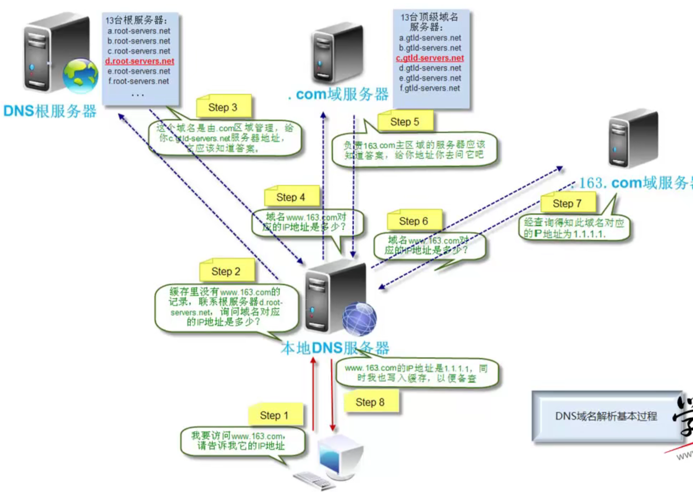
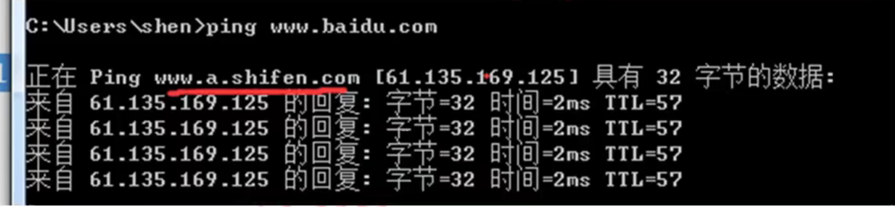

# DNS原理

## 概述

```
DNS服务概述:。
DNS ( Domain Name System )域名系统,在TCP/IP网络中有非常重要的地位，能够提供域名与IP地址的解析服务。
DNS是-一个分布式数据库,命名系统采用层次的逻辑结构,如同-棵倒置的树,这个逻辑的树形结构称为域名空间,于DNS划分了域名空间,所以各机构可以使用自己的域名空间创建DNS信息。。
注: DNS域名空间中,树的最大深度不得超过127层,树中每个节点最长可以存储63个字符。
www.baidu.com	有四层，(www baidu com .)

Windows，dns文件位置
C:/Windows/system32/drivers/etc/hosts
```


```
根域	全球13台

顶级域 13个
.com	商业机构/ .cn 中国
.edu 教育机构
.gov 政府部门
```

## 域和域名

```
1)域和域名。
DNS树的每个节点代表一个域,通过这些节点,对整个域名空间进行划分,成为一个层次结构。。域名空间的每个域的名字,通过域名进行表示。

域名:通常由一个完全合格域名( FQDN )标识。FQDN能准确表示出其相对于DNS域树根的位置,也就是节点到DNS树根的完整表述方式,从节点到树根采用反向书写,并将每个节点用"."分隔,对于DNS域google来说,其完全正式域名( FQDN )。为google.com. .
例如, google为com域的子域,其表示方法为google.com ,而www为google域中的子域,可以使用www.google.com表示。

注意:通常, FQDN有严格的命名限制,长度不能超过256字节,只允许使用字符a-z,0-9,A-Z.和减号(-)。点号(.)只允许在域名标志之间(例如"google.com" ) 或者FQDN的结尾使用。域名不区分大小。

由最顶层到下层，可以分成:根域、顶级域、二级域、子域。

Internet域名空间的最顶层是根域( root) , 其记录着Internet的重要DNS信息,由Internet域名注册授权机构管理,该机构把域名空间各部分的管理责任分配给连接到Internet的各个组织。
```

### 3种顶级域

```
DNS根域下面是顶级域,也由Internet域名注册授权机构管理。共有3种类型的顶级域。

组织域:采用3个字符的代号,表示DNS域中所包含的组织的主要功能或活动。比如com为商业机构组织，edu为教育机构组织, gov为政府机构组织, mil为军事机构组织, net为网络机构组织, org为非营利机构组织, int为国际机构组织。。

地址域:采用两个字符的国家或地区代号。如cn为中国, kr为韩国, us为美国。

反向域:这是个特殊域,名字为in-addr.arpa ,用于将IP地址映射到名字(反向查询)
```

## 区zone

```
2、区(Zone) , 资源记录。
区是DNS名称空间的一-部分,其包含了- -组存储在DNS服务器.上的资源记录。使用区的概念, DNS服务器回答关于自己区中主机的查询,每个区都有自己的授权服务器。
```

## 主域名服务器和辅助域名服务器

```
3、主域名服务器与辅助域名服务器
当区的辅助服务器启动时,它与该区的主控服务器进行连接并启动一次区传输,区辅助服务器定期与区主控服务器通信,查看区数据是否改变。如果改变了,它就启动-次数据更新传输。每个区必须有主服务器,另外每个区至少要有一台辅助服务器,否则如果该区的主服务器崩溃了,就无法解析该区的名称。
```

### 辅助服务器的优点

#### 1 )容错能力.

```
配置辅助服务器后,在该区主服务器崩溃的情况下,客户机仍能解析该区的名称。-般把区的主服务器和区的辅助服务器安装在不同子网上，这样如果到一个子网的连接中断，DNS客户机还能+直接查询另一个子网上的名称服务器。
```

#### 2 )减少广域链路的通信量

```
如果某个区在远程有大量客户机，用户就可以在远程添加该区的辅助服务器,并把远程的客户机。配置成先查询这些服务器,这样就能防止远程客户机通过慢速链路通信来进行DNS查询。
```

#### 3 )减轻主服务器的负载。

```
辅助服务器能回答该区的查询,从而减少该区主服务器必须回答的查询数。
```

## dns

### (1) DNS服务器

运行DNS服务器程序的计算机,储存DNS数据库信息。DNS服务器会尝试解析客户机的查询请求。

### (2) DNS缓存

DNS服务器在解析客户机请求时,如果本地没有该DNS信息,则可以会询问其他DNS服务器,当。其他域名服务器返回查询结果时,该DNS服务器会将结果记录在本地的缓存中,成为DNS缓存。当下- 次客户机提交相同请求时, DNS服务器能够直接使用缓存中的DNS信息进行解析。。

### dns查询方式

递归查询和迭代查询
看一个DNS查询过程:。通过8个步骤的解析过程就使得客户端可以顺利访问www.163.com这个域名,但实际应用中,通常这个过程是非常迅速的。



#### 两种查询方式:

##### (1)递归查询. - -次沟通完。

递归查询是- -种DNS服务器的查询模式,在该模式下DNS服务器接收到客户机请求,必须使用一。个准确的查询结果回复客户机。如果DNS服务器本地没有存储查询DNS信息,那么该服务器会询，问其他服务器，并将返回的查询结果提交给客户机。。

##### (2)迭代查询

DNS服务器另外-种查询方式为迭代查询,当客户机发送查询请求时, DNS服务器并不直接回复查询结果，而是告诉客户机另- -台DNS服务器地址,客户机再向这台DNS服务器提交请求,依次循环直到返回查询的结果为止。

#### 总结：

一般情况下,从PC客户端到本地DNS服务器是属于递归查询。而DNS服务器之间就是的交互查询就是迭代查询。

### 正向解析和反向解析

#### 1正向解析。

正向解析是指域名到IP地址的解析过程。。

#### 反向解析。

反向解析是从IP地址到域名的解析过程。反向解析的作用为服务器的身份验证。

### DNS资源记录

#### 1) SOA资源记录。

每个区在区的开始处都包含了一个起始授权记录( Start of Authority Record ) ,简称SOA记录。
SOA定义了域的全局参数,进行整个域的管理设置。-个区域文件只允许存在唯一的SOA记录。。

#### 2) NS资源记录. 

NS ( Name Server )记录是域名服务器记录,用来指定该域名由哪个DNS服务器来进行解析。每个区在区根处至少包含一个NS记录。

#### 3)A资源记录.

地址( A )资源记录把FQDN映射到IP地址。因为有此记录 ,所以DNS服务器能解析FQDN域名对应的IP地址。

#### 4) PTR资源记录。

相对于A资源记录,指针( PTR )记录把1P地址映射到FQDN。用于反向查询 ，通过IP地址,找到域名。

#### 5) CNAME资源记录.

别名记录( CNAME )资源记录创建特定FQDN的别名。用户可以使用CNAME记录来隐藏用户网络的实现细节,使连接的客户机无法知道真正的域名。例: ping百度时,解析到了百度的别名服务器。百度有个cname=www.a.shifen.com.的别名 .


#### 6) MX资源记录。

邮件交换( MX)资源记录,为DNS域名指定邮件交换服务器。

 


# end

## 参考

```
哔哩哔哩， BV1GW411j7Ts
```

