# HTTP协议详解

重要性

```
无论是webservice，还是用rest做大型架构，都离不开对http协议的认识
```

可以简化说：

```
webservice = http协议 + XML
Rest = http协议 + json
各种API，也一般是用Http+XML/json来实现的
```


## 1.原理

### 	1.形象理解http协议

```
ftp，http，stmp，pop，tcp/ip协议
就是按照一定的规则进行处理和操作
```

http协议的工作流程

```
1.原始状态：客户端和服务器站之间没有关系
2.建立连接，发送请求
连接就是网络上的虚拟电路
3.沿着连接，返回响应信息
4.断开连接
```

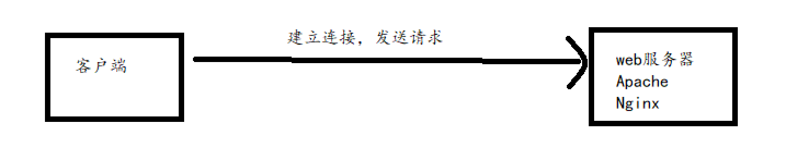

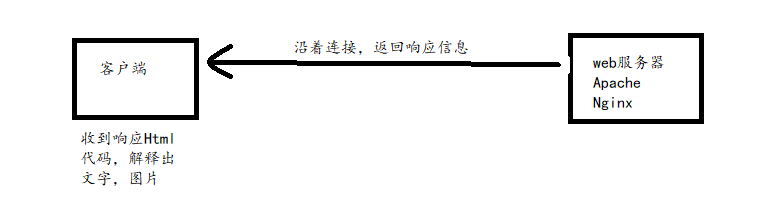


#### 		1.http请求信息和响应 信息的格式

```
请求：
    请求行
    请求头信息
    请求主体信息（可以没有）
    头信息结束后和主体信息之间要空一行

请求行：
	请求方法
	请求路径
	所用的协议

请求方法：
	GET/POST/PUT/DELETE/TRACE/OPTIONS

请求路径：
	就是URL的一部分
	
请求所用的协议：
	HTTP/1.1 ...
```

```
telnet localhostIP 80

ctrl+]

GET /xxx/xx.php HTTP/1.1
Host: localhost
两次回车
```


### 	2.动手试试http协议

#### 		1.get请求部分

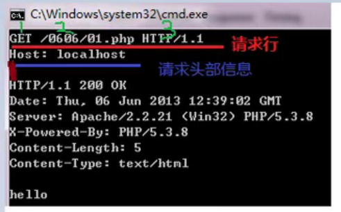

```
1.get 就是请求方法 method
2./0606/01.php 请求的资源
3.HTTP/1.1 请求所用的协议版本

注意：头信息结束后，有一个空行，头信息和主体信息（如果有），需要这个空行做区分。
即使没有主体信息，空行也不能少
```

响应部分

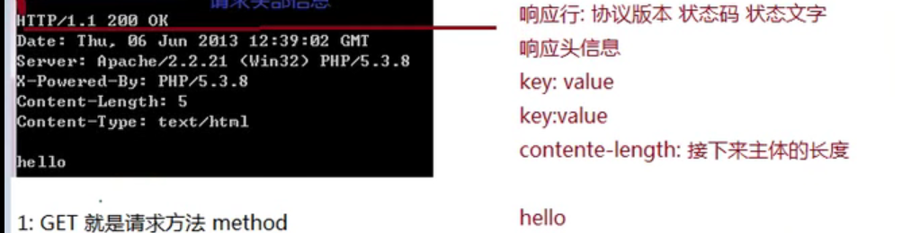

```
响应行：协议版本 状态码 状态文字
响应头信息
key:value
key:value
content-length:接下来主体的长度

hello
```

#### 		2.post请求部分

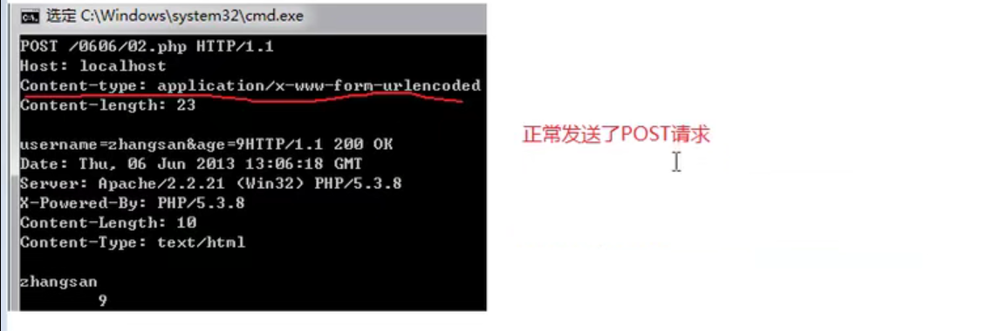

```
POST /0606/02.php HTTP/1.1
Host: localhost
需要写入主体长度,来说明要传递的参数长度
Content-length: 10
内容的类型
content-type: application/x-www-form-urlencoded

a=3&age=28
```

```
注意点在于需要写入传递的主体长度和传递的主体的类型用于编码
没有主体长度，在两次回车将会直接进行请求
没有主体编码，在输入之后不会把内容进行编码操作   
```


### 	3.http协议3部分介绍

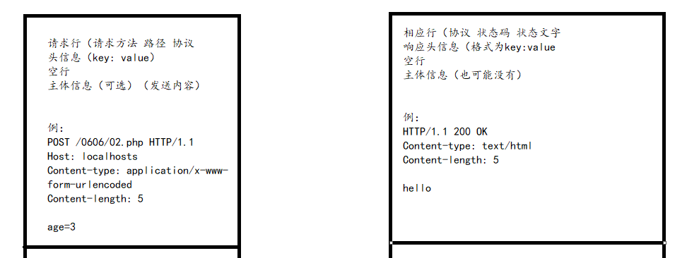

#### 		1.请求

```
请求方法中 Head 和 get
基本一致，只是返回内容，
比如我们只是确认内容存在，不需要返回内容使用head比较合适，不会返回主体内容

trace：是你用来代理上网，比如用代理访问xx，你想看看代理有没有修改你的http请求，可以用trace来测试一下，服务器会把最后收到的请求返回给你

options：返回服务器能用的请求方法

注意：这些请求方法虽然HTTP协议李规定的，但是web server未必允许或支持这些方法
```

options

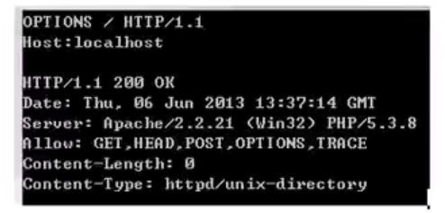

#### 		2.响应

```
状态码，状态文字

状态码：反应服务器反应情况
	1xx	信息		  接收到请求，继续处理
	2xx	成功		  操作成功地收到，理解和接受
	3xx	重定向       为了完成请求，必须采取进一步措施
	4xx	客户端错误	请求的语法有错误或不能完全被满足
	5xx	服务端错误	服务器无法完成明显有效的请求
	
	常用状态码
		200	服务器成功返回网页
		301/2	永久/临时重定向
		304	Not Modified	未修改
		
		404	请求的网页不存在
		503	服务器暂时不可用
		500	服务器内部错误
	
状态文字：用来描述状态码
```

#### 		3.重定向

```
php代码
默认是302重定向
header('Location: http://www.baidu.com');

指定用301重定向，true参数意思指用301信息替换原来的头信息
header('Location: http://www.baidu.com', true, 301);

对于使用get请求的，重定向没有问题
但是对于post数据，需要
307,重定向中保持原有的请求数据和请求方式，get可以不用
header('Location: xxxxxx', true, 307);
```


## 2.实战

### 	1.PHP+socket编程发送http请求

### 	2.PHP批量发帖

### 	3.http协议防盗链

#### 		1.防盗链

```
当我们在网页引用站外图片，常会出现
```

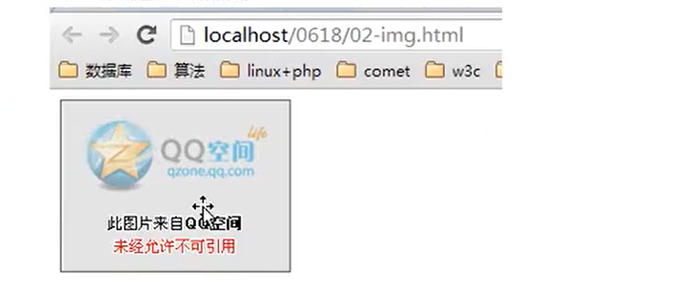

```
referer
代表网页的来源，即上一页的地址

如果是直接在浏览器上输入地址，回车进来，则没有referer头
这也是：为什么服务器直到我们的图片是从哪儿引用的，也知道我们的客服从哪个网站链接点击过来的
```

```
如何配置apache服务器，用于图片防盗链
原理：在web服务器层面，根据http协议的referer头信息，来判断
如果来自站外，则统一重写到一个很小的防盗链提醒图片
```

```
apache具体步骤
1.打开apache，重写模块 mod_rewrite
2.前面的#号去掉
3.在需要防盗的网站或目录，写.htaccess文件,并指定防盗链规则

如何指定：
分析referer信息，如果不是，则重写
```

```
.htaccess文件
RewriteEngine On
RewriteCond %{REQUEST_FILENAME} .*\.(jpg|jpeg|gif|png) [NC]
RewriteCond %{HTTP_REFERER} !localhost [NC]
RewriteRule .* no.png
```


#### 		2.反防盗链

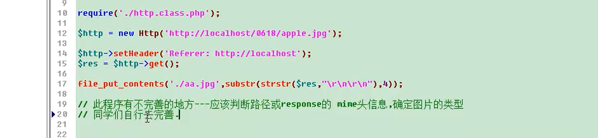


## 3.优化

### 	1.http协议与缓存控制

```
图片请求
	第一次	200	ok
	第二次	304	Not Modified 未修改状态
在网络上，有一些缓存服务器，有的浏览器自身也有缓存功能

服务器在返回200的同时，还返回该图片的'签名' -- Etag，当浏览器再次访问时，会带上etag，如果图片没有变化，则会直接使用缓存中的图片，减轻了服务器的负担
```

第一次请求头

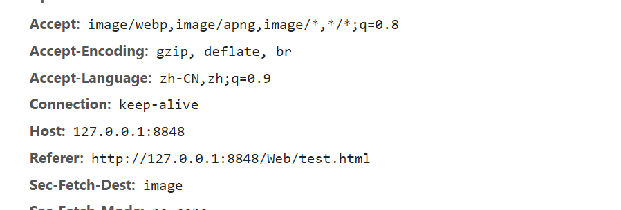

第一次响应头

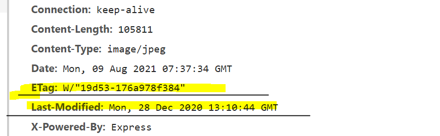

第二次请求头

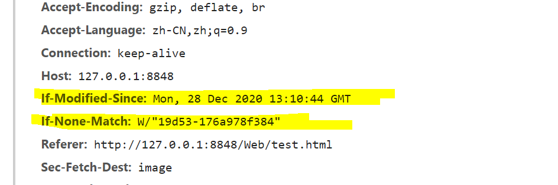

```
if-Modified-Since意思是，如果在这个时间点后修改过，则重新请求，如果图片的etag值和if-None-Match的值不匹配，则重新请求
```

第二次响应头，304

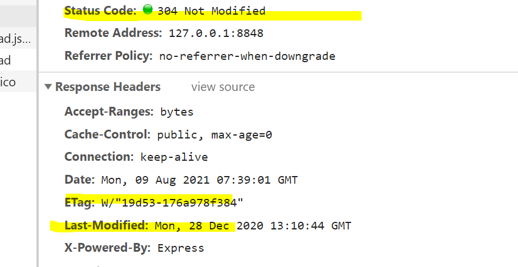

#### 1.设置缓存控制

```
缓存服务器与祝福其之间，应该有一些协议，来说明问题
使用http协议，用头信息 chache-chontrol 来控制
```

```
利用协议控制缓存
mod_expires

然后在 .htaccess 中
ExpiresActive On 激活缓存

ExpiresDefault '<base> [plus] {<num> <type>}*' 设置默认缓存参数
ExpiresByType type/encoding '<base> [plus] {<num> <type>}*'	按照文件类型来设计

后面的参数解释
base:基于哪个时间点来计算缓存有效期
	Access/now: 基于请求响应的那一瞬间
	Modification：基于被请求文件的最后修改时间
	
Num: 时间大小
Type: 时间单位
```

实例

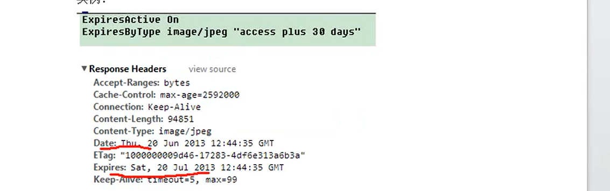


#### 2.设置不用缓存

```
意味着不允许缓存，必须去服务器
Cache-Control: no-store, must-revalidate;

可以利用apache的header模块
```

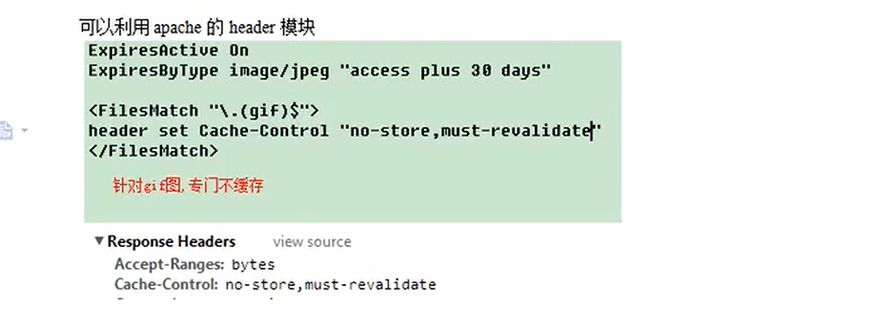


### 	2.http协议和内容压缩

```
content-encoding: gzip

原理: 为了提高网页在网络上的传输速度，服务器对主体信息进行压缩，
gzip压缩，deflate压缩，comporess压缩以及google chrome的sdch压缩
```

#### 		1.压缩过程

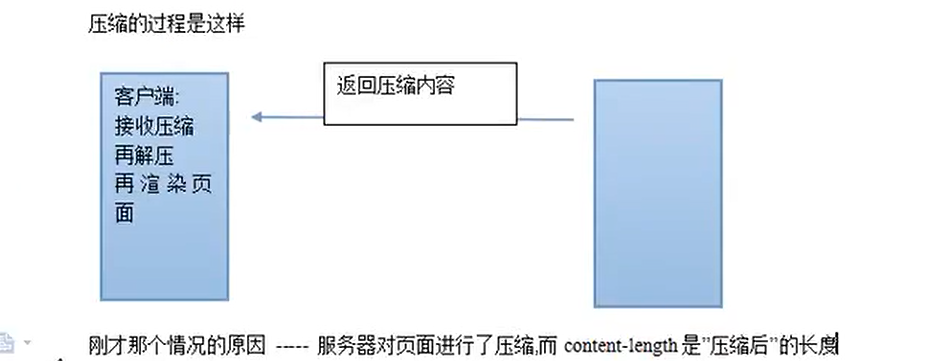


#### 		2.如何在apache启用压缩功能

```
1.开启gzip或deflate模块
2.在conf文件中，写
```

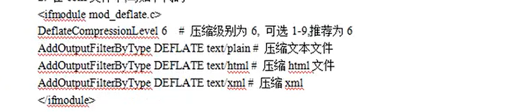

```
这里指定文件类型压缩的原因，1.压缩消耗CPU资源，并且有的压缩效果不好（图片/视频），一般指定文本压缩
```

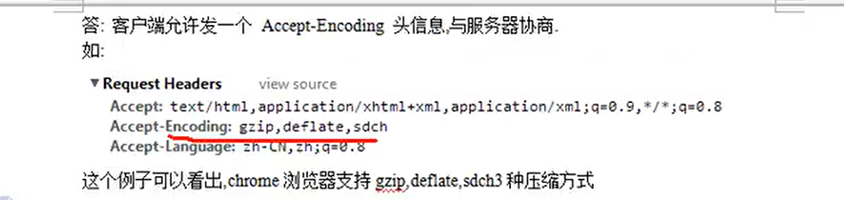

```
客户端会发送一个带有支持压缩格式的请求头
```

```
小技巧：当我们在采集时，可以不发送Accept-Encoding信息，这样采集直接是源码，也可以采集gzip（提高速度），再用PHP解压gzip的内容
```


### 	3.分块传输，持久连接与反向Ajax

```
http协议与持久链接+分块传输 -->	反向Ajax
反向Ajax又叫做 comet,server push，服务器推技术
应用范围：网页聊天服务器，新浪微博在线聊天，Google mail网页聊天
```

```
原理：一般而言，http协议的特点，连接<-->断开
具体什么时间断开？
服务器响应 content-length，收到指定length长度内容便断开了

在http1.1协议中，允许不屑content—length
这时需要一个特殊的 content-type: chunked
```

```
分块传输的原理：
123H\r\n
123H个长度的内容传输给客户端...\r\n
...
0\r\n 服务器说内容发完了
```

代码截图

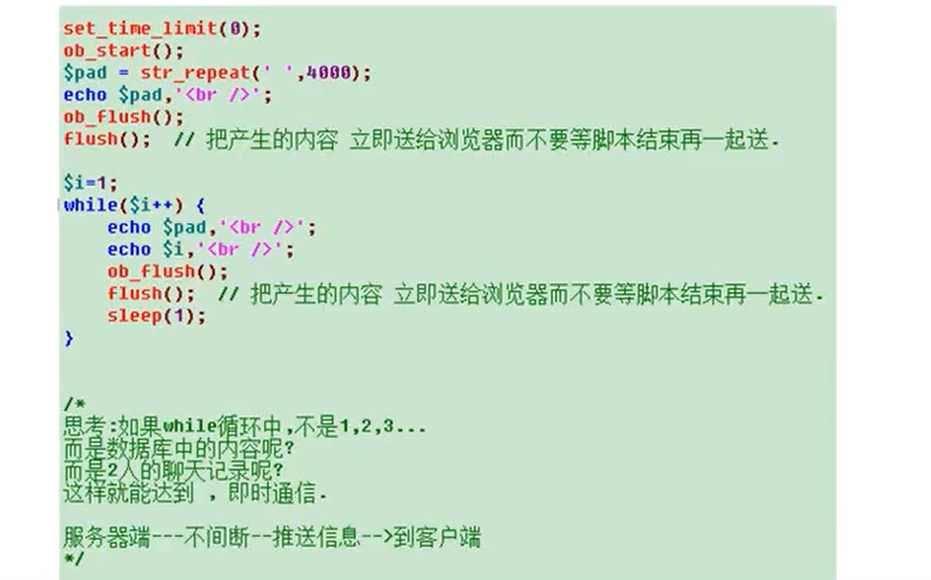

# end

## 参考

```
参照视频
哔哩哔哩：BV1At41137Q8，燕十八老师
```

