# HTTP和HTTPS协议

## 	1.TCP/IP协议和网络模型的理解

```
OSI网络参考模型和TCP/IP模型
```

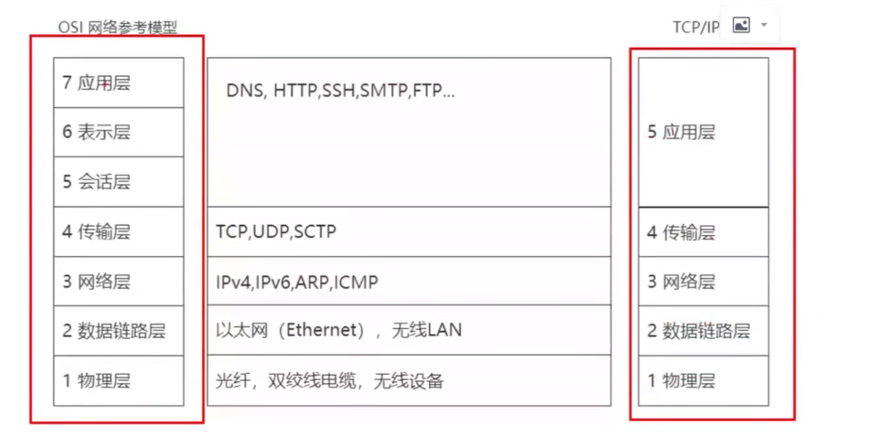

```
过程：
浏览器解析域名，查看浏览器是否有dns缓存，没有的话查看本地的host文件是否有配置，没有的话就发起dns请求获得域名的ip地址
获得ip地址后，
应用层进行http请求的发送，
进入传输层，调用tcp协议
往下进入网络层，使用IP协议，加上ip头
数据链路层加上mac头
物理层进行传输

运营商之间通过专线连接
直到找到目的，然后逆向解析，
数据层查看是不是mac地址
网络层查看IP是否能对应上

服务器的响应报文同上
```

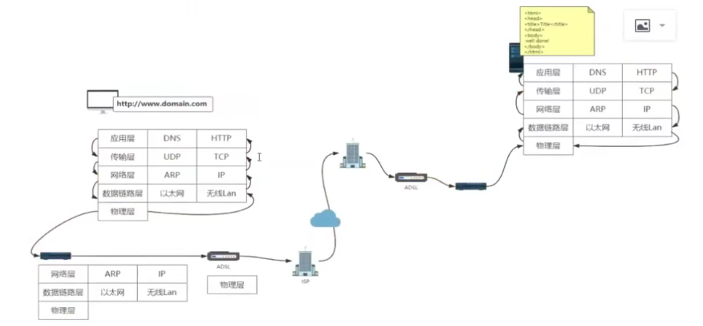


通过域名进行dns请求获取ip地址

```
应用层构造一个dns请求报文，
然后调用传输层接口，dns使用udp进行传输，就会在dns请求报文的基础上加上一个udp请求头，
然后交给网络层，加上了ip的请求头，
然后交给数据链路层，把自己的mac头加上，然后把请求报文和目的的mac地址也加上目的的mac地址通过arp协议进行获取对应的ip的mac地址，
然后物理层通过物理介质传播

然后传到路由器上面
物理层获取信息
传递数据链路层，查看信息的目的mac地址是否是本地的，是就继续，不是就丢弃
网络层就会处理，寻找这个数据的下一个路由器的地址

然后到了网络供应商，在dns服务器中找到对应IP地址，
然后原路返回
```


## 	2.HTTP协议

### 		1.http报文格式

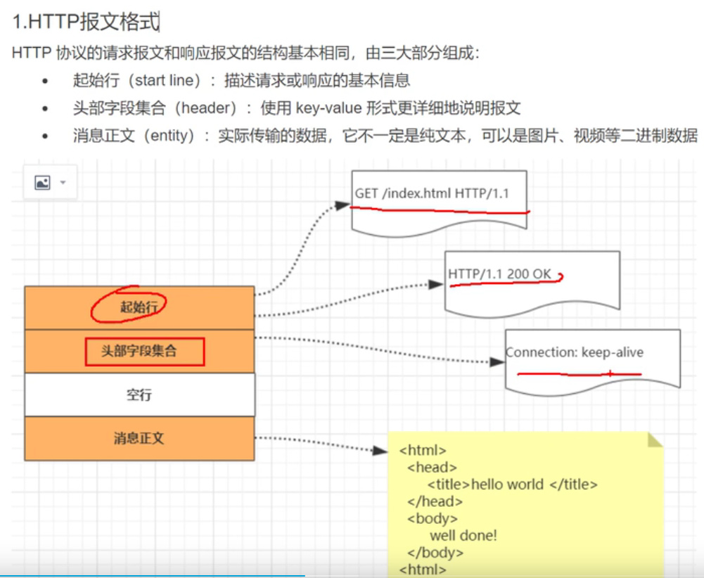


### 		2.请求行报文格式

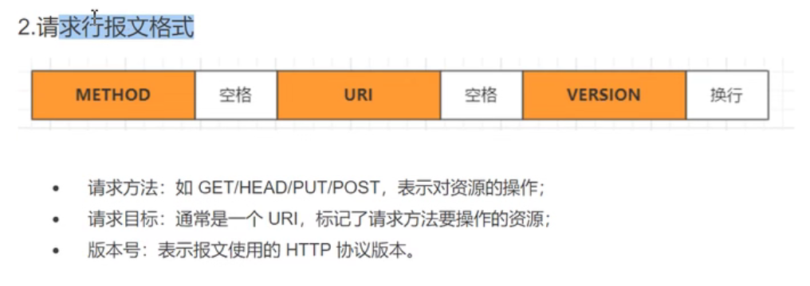


### 				3.响应行报文格式

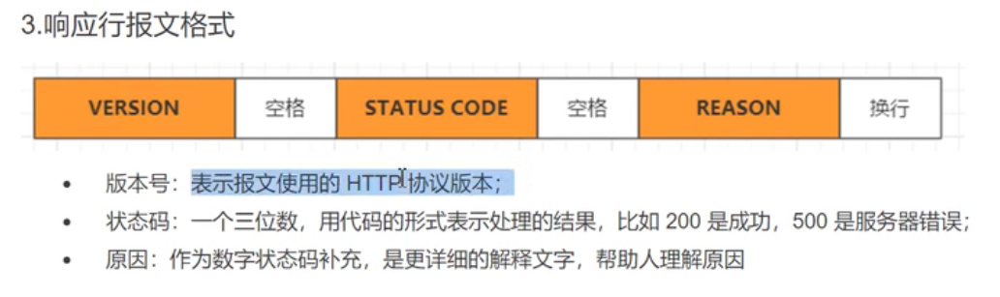


### 		4.HTTP头字段

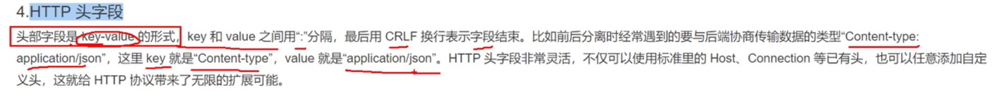

头字段注意事项

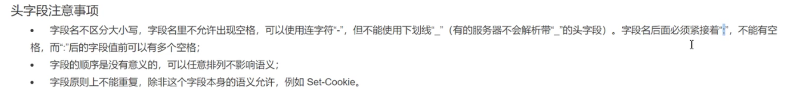


## 	3.HTTP请求完整过程

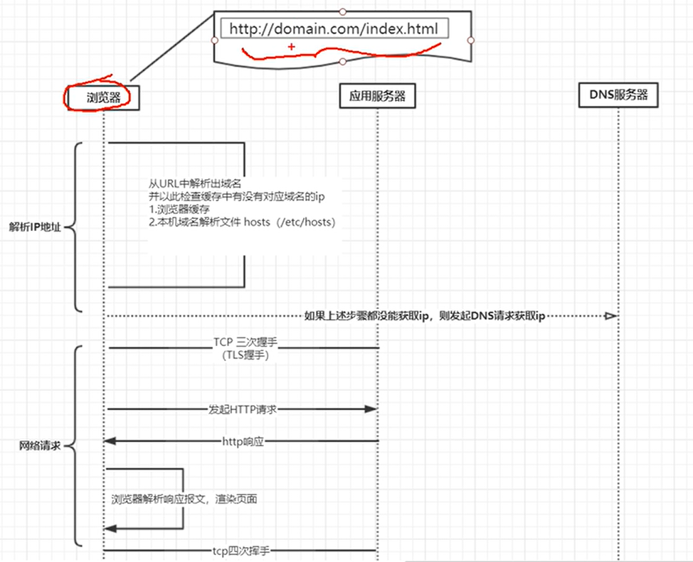


## 4.TCP协议

### 		1.特点

```
基于连接的:数据传输之前需要建立连接
全双工的:双向传输
字节流:不限制数据大小，打包成报文段,保证有序接收，重复报文自动丢弃
流量缓冲:解决双方处理能力的不匹配
可靠的传输服务:保证可达，丢包时通过重发机制实现可靠性
拥塞控制:防止网络出现恶性拥塞
```

### 		2.TCP连接管理

```
1. TCP连接:四元组[源地址，源端口，目的地址，目的端口]
2.确立连接: TCP三次握手
    a.同步通信双方初始序列号( ISN, initial sequence number )
    b.协商TCP通信参数(MSS, 窗口信息，指定校验和算法)
```


### 		3.TCP报文内容

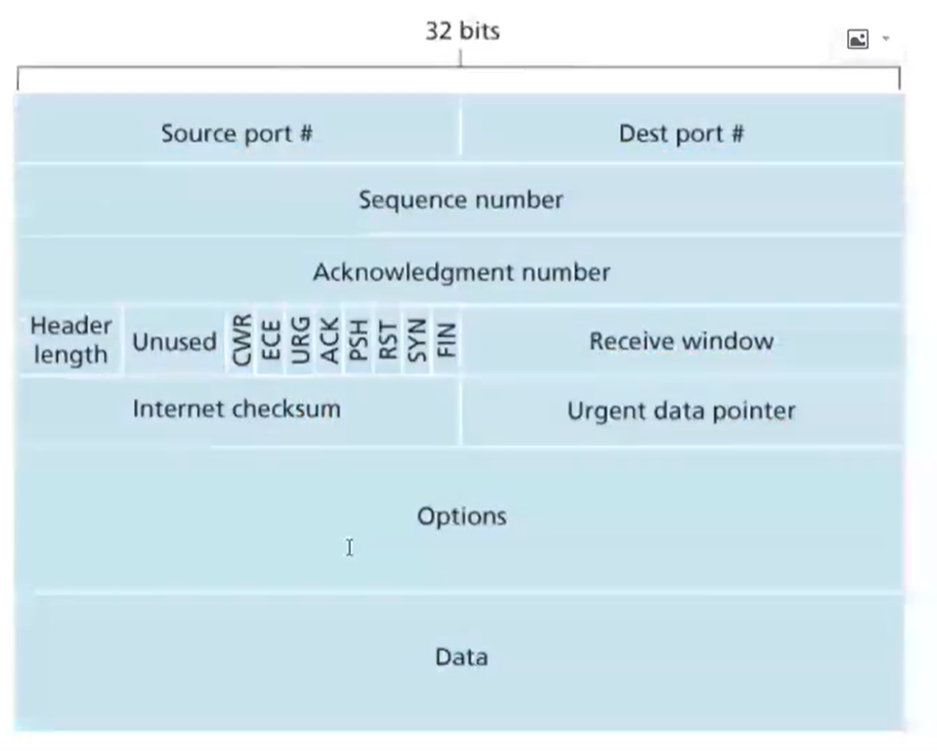


### 		4.TCP三次握手

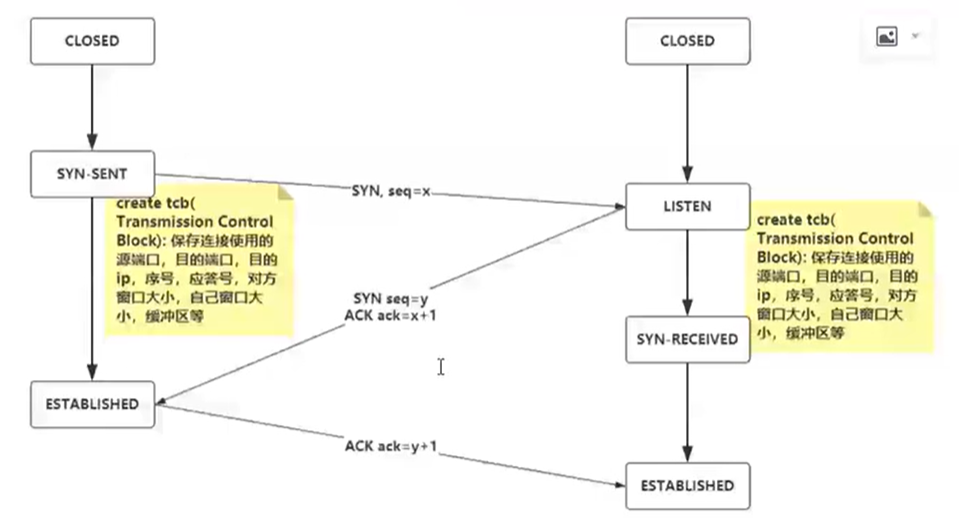

```
客户端创建一个数据结构存储信息，然后发送同步请求，进入syn.sent状态
服务器端收到请求后也创建一个数据结构存储相关信息，回传一个ack响应和一个同步请求，进入listen状态
客户端收到请求后，响应ack报文并进入established状态
服务器端收到ack请求后，也进入了established状态，
连接成功
```

此时操作系统内核的变化

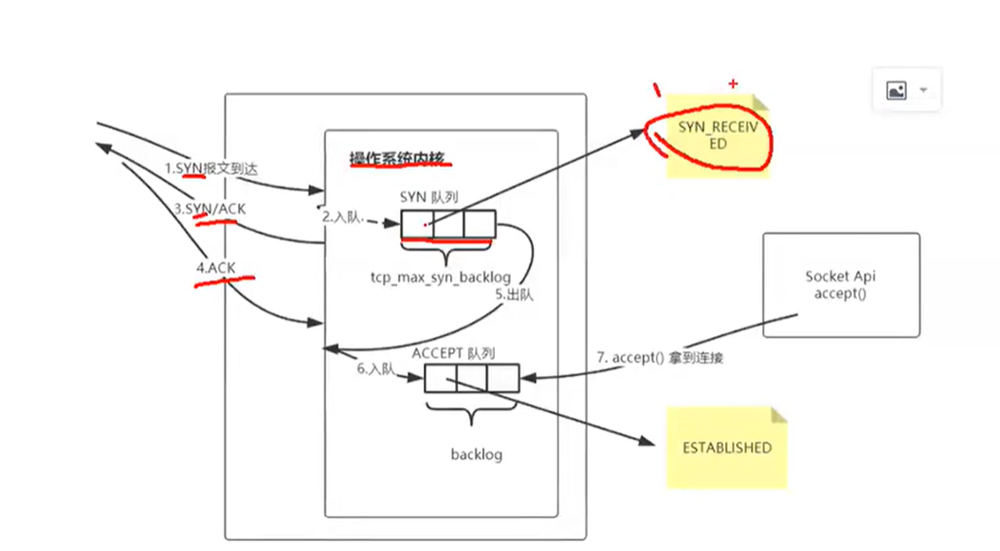


### 		5.TCP四次挥手

```
双方都可以关闭连接
```

```
A:发送Fin数据包，代表A不再发送数据，进入Fin_Wait_1状态
B:收到请求，开始应答Ack，避免A重新发送Fin重试（应答机制），进入	Close_Wait状态
A:收到ack应答，进入Fin_Wait_2状态
B:处理完数据之后关闭，关闭连接，进入close状态，发送fin请求
A:收到请求后发送ack应答，进入time_wait(2msl)状态
B:收到后可以释放连接
A:等待2MSL后释放连接

2MSL：报文最大来回传输时间
等待2MSl原因
1.防止报文丢失，导致B重复发送Fin
2.防止滞留在网络中的报文，对新建立的连接造成数据扰乱
```

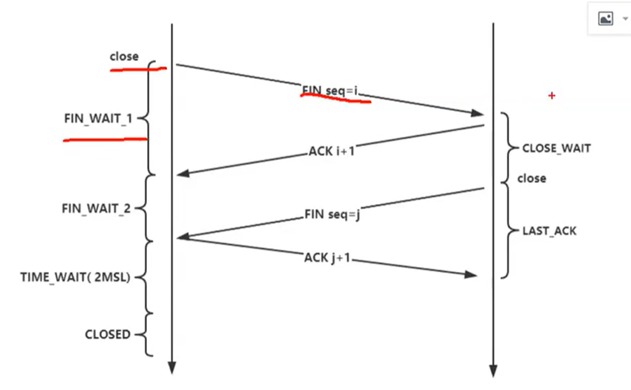


### 6.字节流协议

```
TCP把应用交付的数据仅仅看成时一连串的无结构的字节流， TCP并不知道字节流的含义，TCP并不关心应用程序-次将多大的报文发送到TCP的缓存中，而是根据对方给出的窗口值和当前网络拥堵的程度来决定一个报文段应该包含多少个字节。
MSS: Max Segment Size,默认536byte实际数据
```


7.数据可靠性传输

```
停止等待协议：
	发一个报文等待服务器的回应，再发送后面的
```

```
重传机制：
	发送的报文丢失，没有收到回应，会重传
```

```
请求报文丢失
	同上，没有收到回应，重传
```


8.滑动窗口协议

```
滑动窗口大小通过TCP三次握手和对端写上，且受网络状况影响
```

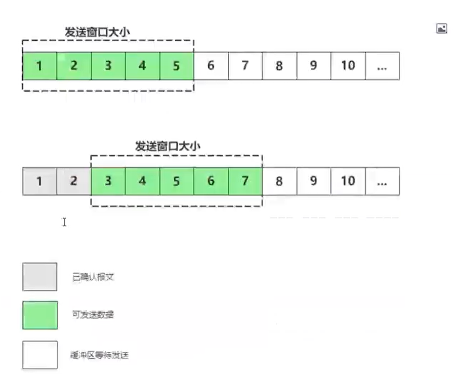


## 5.https协议

### 	1.https

```
由于HTTP天生“明文”的特点，整个传输过程完全透明，任何人都能够在链路中截获、修改或者伪造请求/响应报文,数据不具有可信性。因此就诞生了为安全而生的HTTPS协议。
使用HTTPS时，所有的HTTP请求和响应在发送到网络之前，都要进行加密。
```

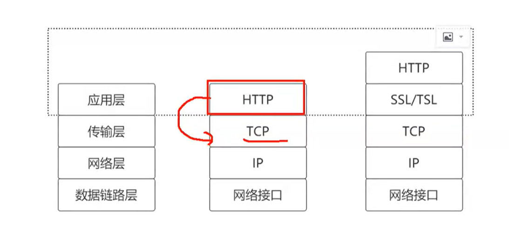

```
以前是通过socket，直接和TCP进行交互
https是通过安全层对TCP进行交互
```

### 	2.ssl/tls 

```
SSL即安全套接层(Secure Sockets Layer)， 由网景公司于1994年发明，IETF在1999年把它改名为TLS (传输层安全, Transport Layer Security),正式标准化，到今天TLS已经发展出了主流的三个版本，分别是2006年的1.1、 2008年的1.2，2018的1.3, 每个新版本都紧跟密码学的发展和互联网的现状，持续强化安全和性能，已经成为了信息安全领域中的权威标准。
```

### 	3.摘要算法

```
摘要算法

摘要算法能够把任意长度的数据‘压缩’成固定长度、而且独一无二的“摘要”字符串，就好像是给这段数据生成了一一个数字“指纹”。任意微小的数据差异,都可以生成完全不同的摘要。所以可以通过把明文信息的摘要和明文一起加密进行传输，数据传输到对方之后再进行解密，重新对数据进行摘要,再比对就能发现数据有没有被篡改。这样就保证了数据的完整性。
md5算法(sha1,sha2...)
```

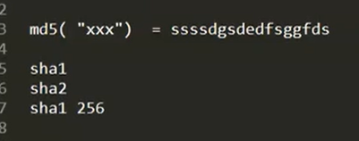

```
对称加密
(经典的异或实现)
对称密钥加密算法:编、解码使用相同密钥的算法，如(AES,RC4,ChaCha20)。
```

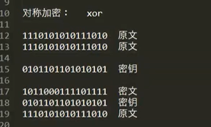

```
非对称加密
非对称密钥加密算法:它有两个密钥，一个叫“公钥”，-个叫“私钥”。两个密钥是不同的，公钥可以公开给任何人使用，而私钥必须严格保密。非对称加密可以解决“密钥交换"的问题。网站秘密保管私钥，在网上任意分发公钥,你想要登录网站只要用公钥加密就行了，密文只能由私钥持有者才能解密。而黑客因为没有私钥，所以就无法破解密文。非对称密钥加密系统通常需要大量的数学运算,比较慢。如(DH、DSA、RSA、 ECC )
```

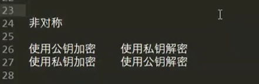


TLS使用的是混合加密

```
1.通信开始的时候使用非对称算法如RSA,ECDHE先解决密钥交换的问题
2.用随机数产生对称算法使用的"会话密钥"，再用公钥加密。会话密钥很短，所以即便使用非对称加密算法也可以很快完成加解密。
3.对方拿到密文后用私钥解密，取出会话密钥。完成对称密钥的安全交换，后续就使用对称算法发完成数据交换


简要来说：就是非对称加密传输对称加密的密钥，然后再用对称加密的密钥进行数据传输
```

```
身份验证：
数字证书的组成：
	CA信息，公钥用户信息，公钥，权威机构的签名，有效期
数字证书的作用：
	1.通过数字证书向浏览器证明身份
	2.数字证书里面包含了公钥

数字证书的申请和验证：
申请：
	1.生成自己的公钥和私钥，服务器自己保留私钥
	2.向CA机构提交公钥，公司，域名信息等待认证
	3.CA机构通过线上，线下多种途径验证你提交信息的真实性，合法性
	4.信息审核通过，CA机构则会想你签发认证的数字证书，包含了公钥，组织信息，CA信息，有效时间，证书		序列号，同时生成一个签名；
	签名步骤：hash（你用于申请证书所提交的明文信息）=信息摘要；CA再使用私钥进行加密，密文就是证书的		数字签名
验证：

    有了CA签名过的数字证书。当浏览器访问服务器时，服务器会返回数字证书给浏览器。浏览器收到证书后会     对数字证书进行验证。首先浏览器读取证书中相关的明文信息，采用CA签名时相同的hash函数计算得到信息     摘要A，再利用对应的CA公钥解密数字签名数据得到信息摘要B，如果摘要A和摘要B一致，则可以确认证书时     合法的

    1.对公钥数字证书的明文信息进行hash，获得摘要
    2.CA公钥再对签名进行解密，获得另一个摘要
    3.这两个摘要相等即正确
```


```
先进行三次握手，然后在通过安全层的握手，

客户端会发送一个加密套件的列表
服务器端会从客户端和服务器端都支持的里面选择一个最安全的传给客户端告诉自己的选择并且还会把公钥给客户	端
客户端生成对称加密随机密钥，并使用公钥加密
服务器端用私钥解密，获取密钥，
然后使用对称加密算法进行传输
```

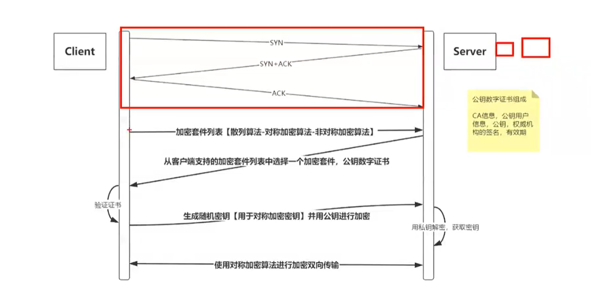

# end

## 参考

```
哔哩哔哩， 图灵诸葛官方号， BV1V54y1y7c4
```

