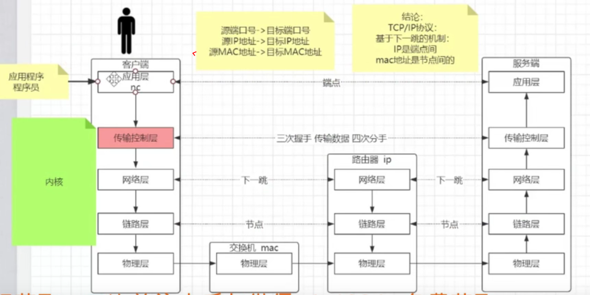

# TCP/IP

## 	1.tcp/ip在开发中的作用




## 	2.什么是socket

## 	3.什么是三次握手四次挥手

## 	4.如何应对百万连接，如何制造百万连接

## 	5.数据包如何发送出去

## 	6.什么是路由表，什么是IP地址，什么是掩码

## 	7.什么是网关，什么是下一跳

## 	8.什么是链路层，什么是原子通信

## 	9.什么是连接池，并发和连接的关系

## 	10.什么时候能复用什么时候不能复用连接

## 	11.有状态无状态通信的本质是啥

## 	12.拆包粘包到底谁才是罪魁祸首

## 	13.什么是面向连接，什么是可靠传输

## 	14.什么是负载均衡的原子保障

## 	15.百万连接下代理层如何保障后端服务器

## 	16.深刻理解分层解耦的软件工程学

# end

## 参考

```
哔哩哔哩， 马士兵教育， BV1Ky4y1k7Gn
```

