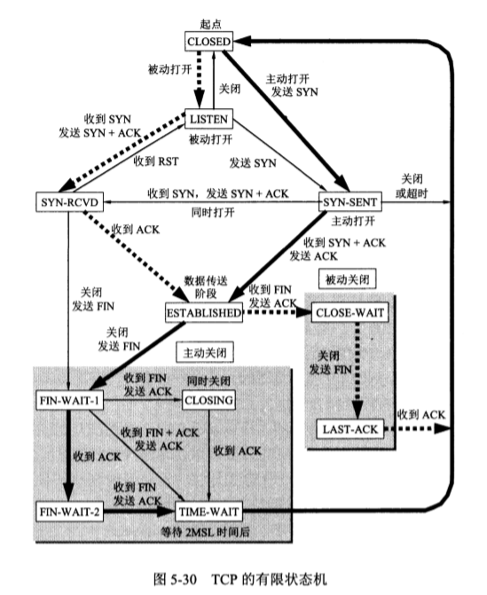

# 计算机网络

## 概述

### ISP

互联网第三阶段是形成了多层次ISP结构的互联网，ISP（Internet service provider），常被翻译为互联网服务提供商。（eg:中国电信，中国联通）

#### 基于ISP的多层结构的互联网的概念示意图


### ixp 互联网交换点

主要作用就是允许两个网络直接相连并交换分组

### 互联网的边缘部分

#### 端系统（主机）之间的通信方式可以划分为两大类：

##### 客户-服务器方式(C/S方式)


最常用的，传统的方式

客户 (client) 和服务器 (server) 都是指通信中所涉及的两个应用进程。

客户是服务的请求方，服务器是服务的提供方。

###### 客户软件的特点：

被用户调用后运行，在打算通信时主动向远地服务器发起通信（请求服务）。因此，客户程序必须知道服务器程序的地址。

不需要特殊的硬件和很复杂的操作系统。

###### 服务器软件的特点：

一种专门用来提供某种服务的程序，可同时处理多个远地或本地客户的请求。

系统启动后即自动调用并一直不断地运行着，被动地等待并接受来自各地的客户的通信请求。因此，服务器程序不需要知道客户程序的地址。

一般需要强大的硬件和高级的操作系统支持。

##### 对等方式（P2P方式）

peer to peer

指两个主机在通信时并不区分哪一个是服务请求方还是服务提供方。

只要两个主机都运行了对等连接软件 (P2P 软件) ，它们就可以进行平等的、对等连接通信。

对等连接工作方式可支持大量对等用户（如上百万个）同时工作


### 互联网的核心部分

路由器在网络核心部分起特殊作用，

**路由器是实现分组交换的关键构件**，其任务是转发收到的分组，这是网格核心部分的重要功能。

#### 电路交换的主要特点

这种必须经过

​		“建立连接(占用通信资源)

​		→通话(一直占用通信资源)

​		→释放连接(归还通信资源)”

三个步骤的交换方式称为电路交换。

**在通话的全部时间内，通话的两个用户始终占用端到端的通信资源**

#### 分组交换的主要特点

分组交换则采用**存储转发**技术。

表示把一个报文划分为几个分组后再进行传送。通常我们把要发送的整块数据称为一个**报文(message)**。

在发送报文之前，先把较长的报文划分成为一个个更小的等长数据段，例如，每个数据段为1024 bit。

在每一个 数据段前面，加上一些由必要的控制信息组成的**首部(header)**后，就构成了一个**分组(packet)**。分组又称为“**包”**，而分组的首部也可称**为“包头”。**

分组是在互联网中传送的数据单元。**分组中的“首部”是非常重要的**，正是由于分组的首部包**含了诸如目的地址和源地址等重要控制信息**，每一个分组才能在互联网中独立地选择传输路径，并被正确地交付到分组传输的终点。


位于**网络边缘的主机**和位于**网络核心部分的路由器**都是**计算机，**但它们**的作用却很不一样。**

**主机是为用户进行信息处理的**，并且可以和其他主机通过网络交换信息。

**路由器则是用来转发分组的**，即进行分组交换的。

路由器收到一个分组，先暂时存储一下，检查其首部，查找转发表，

按照首部中的目的地址，找到合适的接口转发出去，把分组交给下一一个路由器。

这样一步一步地(有时会经过几十个不同的路由器)以存储转发的方式，把分组交付最终的目的主机。

各路由器之间必须经常交换彼此掌握的路由信息，以便创建和动态维护路由器中的转发表，使得转发表能够在整个网络拓扑发生变化时及时更新。


当我们讨论互联网的核心部分中的路由器转发分组的过程时，往往**把单个的网络简化成一条链路，而路由器成为核心部分的**结点，如图1-12(b)所示。 

这里要注意，路由器暂时存储的是一个个短分组，而不是整个的长报文。短分组是暂存在路由器的存储器(即内存)中而不是存储在磁盘中的。这就保证了较高的交换速率。

应当注意，分组交换在传送数据之前不必先占用一条端到端的链路的通信资源。分组在哪段链路上传送才占用这段链路的通信资源。

分组在传输时就**这样- - 段一段地断续占用通信**资源，而且还省**去了建立连接和释放连接的开销**，因而数据的传输**效率更高。**

互联网采取了专门的措施，保证了数据的传送具**有非常高的可靠性**(在第5章5.4节介绍运输层协议时要着重讨论这个问题)。当网络中的某些结**点或链路突然出现故障时**，在各路由器**中运行的路由选择协议(protocol)能**够自动找到转发分组最合适的路径。这些将在第4章4.5节中详细讨论。

##### 分组交换的优点

| 优点 | 所采用的手段                                                 |
| ---- | ------------------------------------------------------------ |
| 高效 | 在分组传输的过程中动态分配传输带宽，对通信链路是逐段占用     |
| 灵活 | 为每一个分组独立地选择最合适的转发路由                       |
| 迅速 | 以分组作为传送单位，可以不先建立连接就能向其他主机发送分组   |
| 可靠 | 保证可靠性的网络协议;分布式多路由的分组交换网，使网络有很好的生存性 |

##### 问题

例如，分组在各路由器存**储转发时需要排队，这**就会.造成一定的时延。因此，必须尽量设法减少这种时延。

此外，由于分组交换不像电路交换那样通过建立连接来保证**通信时所需的各种资源，因而无法确保通信时端到端所需的带宽。**

分组交换带来的另一个问题是各**分组必须携带的控制信息也造成了- -定的开销(overhead)。**整个分**组交换网还需要专门的管理和控制机制。**

#### 报文交换

基于存储转发原理，

##### 三种交换的比较

电路交换	——	整个报文的比特流连续地从源点直达终点，好像在一个管道中传送。
报文交换	——	整 个报文先传送到相邻结点，全部存储下来后查找转发表，转发到下一个结点。
分组交换	——	单个分组 (这只是整个报文的一部分)传送到相邻结点，存储下来后查找转发表，转发到下一一个结点。


### 计算机网络的性能

#### 速率

我们知道，计算机发送出的信号都是数字形式的。**比特(bit)**来源于binary digit, 意思是一个“二进制数字”，因此一个**比特就是二进制数字中的一个1或0**。比特也是信息论中使用的信息量的单位。网络技术**中的速率指的是数据的传送速率**，它也称为**数据率(datarate)或比特率**(bit rate)。速率是计算机网络中最重要的一个性能指标。 速率的单位是bit/s (比特

#### 带宽

(1)带宽本来是指某个信号具有的频带宽度。

在计算机网络中，带宽表示单位时间内网络中的某信道所能通过的“最高数据率”。这种意义的带宽的单位就是数据率的单位bit/s，是“比特每秒”。

#### 吞吐量

#### 时延

**时延(delay或latency)**是指数据(一个报文或分组，甚至比特)从网络(或链路)的一端传送到另一端所需的时间。时延是个很重要的性能指标，它有时也称为**延迟或迟延。**

##### 发送时延

##### 传播时延

##### 处理时延

##### 排队时延

#### 时延带宽积

#### 往返时间rtt

#### 利用率

### 计算机网络体系结构

系统体系网络结构SNA

开放系统互连基本参考模型OSI/RM （open systems interconnection reference model）

法律国际标准OSI，没有得到广泛应用

非国际标准Tcp/IP， 事实上的国际标准

#### 分层的好处

**1）各层之间是独立的。**

**2）灵活性好。**

**3）结构上可分割开。**

**4）易于实现和维护。**

**5）能促进标准化工作。**

通常各层所要成的功能主要有以下一些(可以只包括一种，也可以包括多种):
**①差错控制**	使相应层次对等方的通信更加可靠。
**②流量控制**	发送端的发送速率必须使接收端来得及接收，不要太快。
**③分段和重装**	发送端将要发送的数据块划分为更小的单位，在接收端将其还原。
**④复用和分用**	发送端几个高层会话复用一条低层的连接，在接收端再进行分用。
**⑤连接建立和释放**	交换数据前先建立-条逻辑连接，数据传送结束后释放连接。.
分层当然也有一些**缺点**，例如，有些功能会在不同的层次中重复出现，因而产生了额外开销。

#### 具有五层协议的体系结构

OSI的七层协议体系结构(图1-18(a)) 的概念清楚，理论也较完整，但它既复杂又不实用。TCP/IP体系结构则不同，但它现在却得到了非常广泛的应用。

osi 七层	tcp 四层 	综合 5层


##### 应用层 application layer

应用层是体系结构中的**最高层**。应用层的**任务是通过应用进程间的交互来完成特定网络应用**。应用层协议定义的是应用**进程间通信和交互的规则**。这里的进程就是指主机中正在运行的程序。对于不同的网络应用**需要有不同的应用层协议**。在互联网中的应用层协议很多，如域名系统**DNS**，支持万维网应用**的HTTP协**议，支持电子邮**件的SMTP协议，**等等。我们把应用层交互的数据单元称为**报文(message)。**

##### 运输层(transport layer)

运输层的任务就是负责向两台主机中进程**之间的通信提供通用的数据传输服务**。应用进程利用该服务传送应用层报文。所谓“通用的”，是指并不针对某个特定网络应用，而是多种应用可以使用同一个运输层服务。由于**一台主机可同时运行多个进程**，因此运输层有**复用和分用**的功能。**复用就是多个应用层进程可同时使用下面运输层的**服务，**分用和复用相反**，**是运输层把收到的信息分别交付**，上面应用层中的相应进程。

运输层使用以下两种协议

**传输控制协议TCP (Transmission Control Protocol**—— 提供**面 向连接的、可靠的数据传输**服务，其数据传输的单位是**报文段(segment)。**
**用户数据报协议UDP (User Datagram Protocol)**——提供无连接的、 尽最大努力(best-effort)的数据传输服务( 不保证数据传输的可靠性)，其数据传输的单位**是用户数据报。**

##### 网络层(network layer)

​		网络层负责为分组交换网.上的不同主机提供通信服务。在发送数据时，网络层把运输层产生的报文段或用户数据报封装成分组或包进行传送。在TCP/IP 体系中，**由于网络层使用IP协议，因此分组也叫做IP数据报**，或简称为数据报。本书把**“分组”和“数据报”**作为同义词使用。
​		请注意:不要将**运输层的“用户数据报UDP”和网络层的“IP数据报”弄混。**此外，无论在哪- -层传送的数据单元，都可笼统地用“分组”来表示。

​		网络层的另一个任务就**是要选择合适的路由**，使源主机运输层所传下来的分组，能够通过网络中的路由器找到目的主机。
​		这里要强调指出，网络层中的“网络”二字，已不是我们通常谈到的具体网络，而是在计算机网络体系结构模型中的第3层的名称。互联网是由**大量的异构(heterogeneous)网络通过路由器(router)相互连接起来**的。互联网使用的网络层协议是**无连接的网际协议IP (Internet Protocol)和许多种路由选择协议，因此互联网的网络层也叫做网际层或IP层。**在本书中，网络层、网际层和IP层都是同义语。

​		在位于不同地理位置的网络中的两个**主机系统之间提供连接和路径选择**。Internet的发展使得从世界各站点访问信息的用户数大大增加，**而网络层正是管理这种连接的层。** 　

##### 数据链路层(data link layer)

​		数据链路层常简称为**链路层**。我们知道，两台主机之间的数据传输，总是在一段一段的链路_上传送的，这就需要使用专门的链路层的协议。在两个相邻结点之间传送数据时，数据链路层将网络层**交下来的IP 数据报组装成帧(framing),**在两个相邻结点间的链路上**传送帧(frame)**。每- -帧包括数据和必要的**控制信息( 如同步信息、地址信息、差错控制等)。**
​		在接收数据时，控制信息使接收端能够知道--个帧从哪个比特开始和到哪个比特结束。这样，数据链路层在收到一个帧后，就可从中提取出数据部分，上交给网络层。
​		控制信息还使接收端能够检测到所收到的帧中有无差错。如发现有差错，数据链路层就简单地丢弃这个出了差错的帧，以免继续在网络中传送下去白白浪费网络资源。如果需要改正数据在数据链路层传输时出现的差错(这就是说，数据链路层不仅要检错，而且要纠错)，那么就要采用可靠传输协议来纠正出现的差错。这种方法会使数据链路层的协议复杂些。

​		定义了如何让**格式化数据以进行传输**，以及如何让控制对物理介质的访问。这一**层通常还提供错误检测和纠正，以**确保数据的可靠传输。 

##### 物理层 physical layer

​		主**要定义物理设备标准**，如网线的接口类型、光纤的接口类型、各种传输介质的传输速率等。它的主要作用**是传输比特流（就**是由1、0转化为电流强弱来进行传输,到达目的地后在转化为1、0，也就是我们常说的数模转换与模数转换）。这一层的数据**叫做比特。** 


​		现在人们经常经常提到的**tcp/ip**往往指的是互联网所使用的**整个 tcp/ip协议簇 protocol suite**


```
假定主机1的应用进程AP1向主机2的应用进程AP2传送数据。
AP1先将其数据交给本主机的第5层(应用层)。第5层加上必要的控制信息Hs就变成了下一层的数据单元。
第4层(运输层)收到这个数据单元后，加上本层的控制信息H4，
再交给第3层(网络层)，成为第3层的数据单元。
依此类推。不过到了第2层(数据链路层)后，控制信息被分成两部分，分别加到本层数据单元的首部(H2)和尾部(T2);
而第1层(物理层)由于是比特流的传送，所以不再加上控制信息。请注意，传送比特流时应从首部开始传送。
```

对等层，协议栈

#### 实体、协议、服务、服务访问点

​		当研究开放系统中的信息交换时，往往使用**实体(entity)**这一较为抽象的名词表示任何可发送或接收信息的硬件或软件进程。在许多情况下，实体就是-个特定的软件模块。
​		**协议是控制两个对等实体(或多个实体)进行通信的规则的集合**。协议的语法方面的规则**定义了所交换的信息的格式**，而协议的语义方面的规则就定义了发送者或接收者所要完成的操作，例如，在何种条件下，数据必须重传或丢弃。
​		在协议的控制下，**两个对等实体间的通信使得本层能够向上一层提供服**务。要实现本层协议，还需要使用**下面一层所提供的服务。**
​		一定 要弄清楚，协议和服务在概念上是很不-样的。
​		首先，**协议的实现保证了能够向上一层提供**服务。使用本层服务的**实体只能看见服务而无法看见下面**的协议。也就是说，下面的**协议对上面的实体是透明的。**
​		其次，**协议是“水平的”**，即协议是控制对等实体之间通信的规则。**但服务是“垂直的”**，即服务是由下层向上层通过层间接口提供的。另外，并非在**一个层内完成的全部功能都称为服务**。只有那些能**够被高- -层实体“看得见”的功能才能称之为“服务”**。上层使用下层所提供的服务必须通过与下层交换一些命令，这些命令在OSI中称为服务原语。


#### tcp/IP体系结构


### 本章的重要概念

​		计算机网络(可简称为网络)把许多计算机连接在一起，而互连网则把许多网络连接在一起，是网络的网络。
​		以小写字母i开始的intermet (互连网)是通用名词，它泛指由多个计算机网络互连而成的网络。在这些网络之间的通信协议(即通信规则)可以是任意的。
​		以大写字母I开始的Internet (互联网)是专用名词，它指当前全球最大的、开放的、由众多网络相互连接而成的特定互连网，并采用TCP/IP 协议族作为通信规则，且其前身是美国的ARPANET。Internet 的推荐译名是“因特网”，但很少被使用。
​		互联网现在采用存储转发的分组交换技术，以及三层ISP结构。.
​		互联网按工作方式可划分为边缘部分与核心部分。主机在网络的边缘部分，其作用是进行信息处理。路由器在网络的核心部分，其作用是按存储转发方式进行分组交换。
​		计算机通信是计算机中的进程(即运行着的程序)之间的通信。计算机网络采用的通信方式是客户-服务器方式和对等连接方式(P2P方式)。
​		客户和服务器都是指通信中所涉及的应用进程。客户是服务请求方，服务器是服务提供方。
​		按作用范围的不同，计算机网络分为广域网WAN.城域网MAN、局域网LAN和个人区域网PAN。
​		计算机网络最常用的性能指标是:速率、带宽、吞吐量、时延(发送时延、传播时延、处理时延、排队时延)、时延带宽积、往返时间和信道(或网络)利用率。
​		网络协议即协议，是为进行网络中的数据交换而建立的规则。计算机网络的各层及其协议的集合，称为网络的体系结构。
​		五层协议的体系结构由应用层、运输层、网络层(或网际层)、数据链路层和物理层组成。运输层最重要的协议是TCP和UDP协议，而网络层最重要的协议是IP 协议。


## 物理层

本章看书

### 物理层的基本概念

机械特性

电气特性

功能特性

过程特性

### 数据通信的基础知识


#### 数据通信系统模型

​		即源系统(或发送端、发送方)、传输系统( 或传输网络)和目的系统(或接收端、接收方)。

#### 信道的几个基本概念

单工通信

半双工通信

全双工通信

##### 常用编码方式

##### 基本的带通调制方法


## 数据链路层

**数据链路层属于计算机网络的低层。数据链路层使用的信道主要有以下两种类型:**
**(1)点对点信道**。这种信道使用一-对一的点对点通信方式。
**(2)广播信道。**这种信道使用一对多的广播通信方式，因此过程比较复杂。广播信道上连接的主机很多，因此必须使用专用的共享信道协议来协调这些主机的数据发送。

**本章最重要的内容是:**
(1)数据链路层的点对点信道和广播信道的特点，以及这两种信道所使用的协议(PPP协议以及CSMACD协议)的特点。
(2)数据链路层的三个基本问题:封装成帧、透明传输和差错检测。
(3)以太网MAC层的硬件地址。
(4)适配器、转发器、集线器、网桥、以太网交换机的作用以及使用场合。


### 使用点对点信道的数据链路层

#### 数据链路和帧

​		我们在这里要明确一下，**“链路”和“数据链路”并不是一回事。**
​		所谓**链路(link)就**是从-一个结点到相邻结点的一段物理线路(有线或无线)，而中间没有任何其他的交换结点。在进行数据通信时，两台计算机之间的通信路径往往要经过许多段这样的链路。可见链路只是- - 条路径的组成部分。
​		**数据链路(data link)则是另 一个概念。**这是因为当需要在一条线路上传送数据时，除了必须有一条物理线路外，还必须有一些必要**的通信协议来控**制这些数据的传输(这将在后面i几节讨论)。若把实现这些**协议的硬件和软件加到链**路上，就构成了数**据链路**。现在最常用的方法是使**用网络适配器(既有**硬件，也包括软件)来实现这些协议。- -般的适配器都包括了**数据链路层和物理层这**两层的功能。
​		也有人采用另外的术语。这就是把链路分**为物理链路和逻辑链路**。物理链路就是上面所说的链路，而逻辑链路就是上面的数据链路，是物理链路加上必要的通信协议。

​		早期的数据通信协议叫做**规程procedure**

​		下面再介绍点对点信道的数据链路层的协议数据单元一**帧。**
​		数据链路层把网络层交下来的**数据构成帧发送到链**路上，以及把接收到的帧中的**数据取出并上交给网络层**。在互联网中，网络层协议数据单元就**是IP数据报(或简称为数据报、**分组或包)。


#### 三个基本问题

这三个基本问题是:**封装成帧、透明传输和差错检测。**

##### 封装成帧

​		封装成帧(framing)就是在一段数据 的前后**分别添加首部和尾部**，这样就**构成了一个帧。**接收端在收到物理层上交的比特流后，就能**根据首部和尾部的标记**，从收到的**比特流中识别帧的开始和结束**。

​		所有在互联网上传输的数据都**以分组为单位**，网络层的**分组(IP数据报)到数据链路层就变成了帧的数据部分。**

​		在数据部分加上首部和尾部就变成了一个**完整的帧**

​		**帧就是数据链路层的传送单元**

​		**帧长度**等于IP数据报加上 首尾的长度

​		首尾还有一个重要作用就是**帧定界(确定帧的界限)**

​		各种数据链路层协议都对帧首部和尾部的格式有规定

​		每种链路层协议都规定了帧的**数据部分长度上限——最大传送单元 MTU （maximum transfer unit）**


SOH 	0x01				EOT	  0x04

##### 透明传输

​		有的时候会出现这种情况，会把数据的部分错误的当作帧的边界收下，而把剩下的丢弃，这种显然就不是 透明传输


​		前面提到的“**透明”是**一个很重要的术语。它表示:**某- -个实际存在的事物看起来却好像不存在一样**(例如，你看不见在你前面有块100%透明的玻璃的存在)。

​		所以为了解决这个问题，要将数据中出现的控制字符 soh，eot 不被解释

​		方法：在前面插入 转义字符  ESC ox1B，	这种被称为字节填充 or 字符填充


##### 差错检测。

现实的通信链路都不会是理想的。这就是说，比特在传输过程中可能会产生差错: 1可能会变成0，而0也可能变成1。这**就叫做比特差错**。比特差错是传输差错中的一种。

目前在数据链路层广泛使用了**循环冗余检验CRC (Cyclic Redundancy Check)**的检错技术。

会添加差错检测用的n位**冗余码**

### 点对点协议PPP

point to point protocol

#### 特点

##### 应满足的需求

**简单**：	总之，这种数据链路层的协议非常简单:接收方每收到一个帧，就进行CRC检验。如CRC检验正确，就收下这个帧;反之，就丢弃这个帧，其他什么也不做。

**封装成帧**：	必须规定帧定界符

**透明性**：	必须保证数据传输的透明性

**多种网络层协议**：	必须能够在同一条物理链路上同时支持多种网络层协议（ip/ipx等）的运行

**多种类型链路**：	必须能够在多种类型的链路上运行

**差错检测**：	需要进行检测，并立即丢i其有差错的帧

**检测连接状态**：	能够及时自动检测链路是否处于正常的工作状态

**最大传送单元**：	设置mtu的标准默认值

**网络层地址协商**：	提供机制，使通信的两个网络层实体能够通过协商知道彼此的网络层地址

**数据压缩协商**：提供一种方法来协商使用数据压缩，但并不要求将数据压缩算法标准化	

##### ppp协议的组成

**三部分**

**(1)一个将IP数据报封装到串行链路的方法。**PPP 既支持异步链路(无奇偶检验的8比特数据)，也支持面向比特的同步链路。IP 数据报在PPP帧中就是其信息部分。这个信息部分的长度受最大传送单元MTU的限制。

**(2)一个用来建立、配置和测试数据链路连接的链路控制协议LCP(LinkControlProtocol)。**通信的双方可协商-一些选项。在RFC 1661中定义了11种类型的LCP分组。

**(3)一套网络控制协议NCP (Network Control Protocol)",**其中的每一个协议支持不同的网络层协议，如IP、OSI 的网络层、DECnet,以及AppeTalk等。

#### ppp协议的帧格式

##### 各字段的意义


F，标志字段 flag，	编制字段表示一个镇的开始或结束，帧定界符

A，地址字段，C，控制字段		至今没用

PPP首部的第四个字段是2字节的**协议字段**。当协议字段为0x0021时，PPP帧的信息
字**段就是IP数据报**。若为0xC021，则信息字段**是PPP链路控制协议LCP的数据**，而
**0x8021**表示这是**网络层的控制数据”。**

**信息字段的长度是可变的**，不超过1500字节。

尾部中的第一个字段(2字节)是使**用CRC的帧检验序列FCS.**

### 使用广播信道的数据链路层

#### 局域网的数据链路层

局域网最主要的**特点**是:**网络为一-个单位所拥有，且地理范围和站点数目均有限。**

**优点：**

(1)具有广播功能，从一一个站点可很方便地访问全网。局域网上的主机可共享连接在局域网上的各种硬件和软件资源。

**(2)便于系统的扩展和逐渐演变，各设备的位置可灵活调整和改变。**

**(3)提高了系统的可靠性(reliability)、可用性(availability)和生存性(survivability)。**

**局域网按网络拓扑进行分类**，可以分为星形网，环形网，总线网


**共享信道的两种方法**

​	**静态划分信道**

​	**动态媒体接入控制**

​		**随机接入**

​		**受控接入**

##### 以太网的标准

为了使数据链路层能更好地适应多种局域网标准，IEEE802委员会就把局域网的数据链路层拆成两**个子层，**即**逻辑链路控制LLC (Logical Link Contro)子 层和媒体接入控制MAC (Medium Access Control)子层。**与接入到传输媒体有关的内容都放在**MAC子层**，而L**LC子层则**与传输媒体无关，不管采用何种传输媒体和MAC子层的局域网对LLC子层来说都**是透明**的( 如图3-14所示)。


##### 适配器的作用

适配器的一个**重要功能就是要进行数据串行传输和并行传输的转换**。由于网络上的数据率和计算机总线.上的数据率并不相同，因此在适配器中必须装有**对数据进行缓存的存储芯片**。在主板上插入适配器时，还必须把管理该适配器的设**备驱动程序安装在计**算机的操作系统中。这个驱动程序以后就会告诉适配器，**应当从存储器的什么位置.上把多长的数据块发送到局域网，或者应当在存储器的什么位置上把局域网传送过来的数据块存储下来**。适配器还要能够实**现以太网协议。**
		适配器在接收和发送**各种帧**时，不使用计**算机的CPU.这**时计算机中的CPU可以处理其他任务。当适配器收**到有差错的帧时，就把这个帧直接丢弃而不必通知计算机**。当适配器收到正确的帧时，它就使**用中断来通知该计算**机，并交付协议栈**中的网络层**。当计算机要发**送IP数据报时**，就由**协议栈把IP数据报向下交给适配器**，组装成**帧后发送到局域网。**


#### csma/cd协议

使用的协议是CSMA/CD,意思是**载波监听多点接入/碰撞检测(Carrier Sense Multiple Access with Collision Detection)。**

**多点接入**

**载波监听**

**碰撞检测**

#### 以太网的mac层

硬件地址，物理地址，mac地址（因为这个地址用在mac帧种 ），48位的全球地址，每一个计算机中固化在适配器的ROM地址


### 扩展的以太网

#### 在物理层扩展

#### 在数据链路层扩展

##### 以太网交换机的自学习功能


### 本章重要概念

链路是从一个结点到相邻结点的一-段物理线路，数据链路则是在链路的基础上增加了-些必要的硬件(如网络适配器)和软件(如协议的实现)。
		数据链路层使用的信道主要有点对点信道和广播信道两种。
		数据链路层传送的协议数据单元是帧。数据链路层的三个基本问题则是:封装成帧、透明传输和差错检测。
		循环冗余检验CRC是- -种检错方法，而帧检验序列FCS是添加在数据后面的冗余码。
		点对点协议PPP 是数据链路层使用最多的- -种协议，它的特点是:简单:只检测差错，而不是纠正差错:不使用序号，也不进行流量控制:可同时支持多种网络层协议。
		PPPoE是为宽带上网的主机使用的链路层协议。
		局域网的优点是:具有广播功能，从一个站点可很方便地访问全网:便于系统的扩展和逐渐演变:提高了系统的可靠性、可用性和生存性。
		共享通信媒体资源的方法有二:一是静态划分信道(各种复用技术)，二是动态媒体接入控制，又称为多点接入(随机接入或受控接入)。.
		IEEE 802 委员会曾把局城网的数据链路层拆成两个子层，即逻辑链路控制(LLC)子层(与传输媒体无关)和媒体接入控制MAC子层(与传输媒体有关)。但现在LLC子层已成为历史。
		计算机与外界局域网的通信要通过通信适配器(或网络适配器),它又称为网络接口卡或网卡。计算机的硬件地址就在适配器的ROM中。
		以太网采用无连接的工作方式，对发送的数据帧不进行编号，也不要求对方发回确认。目的站收到有差错帧就把它丢弃，其他什么也不做。
		以太网采用的协议是具有冲突检测的载波监听多点接入CSMACD.协议的要点是:发送前先监听，边发送边监听，一旦发现总线上出现了碰撞，就立即停止发送。然后按照退避算法等待-段随机时间后再次发送。因此，每一个站在自己发送数据之后的一小段时间内，存在着遭遇碰撞的可能性。以太网上各站点都平等地争用以太网信道。
		传统的总线以太网基本上都是使用集线器的双绞线以太网。这种以太网在物理上是星形网，但在逻辑上则是总线形网。集线器工作在物理层，它的每个接口仅仅简单地转发比特，不进行碰撞检测。
		以太网的硬件地址，即MAC地址实际上就是适配器地址或适配器标识符，与主机所在的地点无关。源地址和目的地址都是48位长。
		以太网的适配器有过滤功能，它只接收单播帧、广播帧或多播帧。.
		使用集线器可以在物理层扩展以太网(扩展后的以太网仍然是一一个网络)。
		交换式集线:器常称为以太网交换机或第二层交换机(工作在数据链路层)。它就是一个多接口的网桥，而每个接口都直接与某台单主机或另一个集线器相连，且工作在全双工方式。以太网交换机能同时连通许多对的接口，使每- -对相互通信的主机都能像独占通信媒体那样，无碰撞地传输数据。
		高速以太网有100 Mbit/s 的快速以太网、吉比特以太网和10 Gbit's的10吉比特以太网。最近还发展到100吉比特以太网。在宽带接入技术中，也常使用高速以太网进行接入。

## 网络层

### 网络层提供的两种服务


### 网际协议IP

与IP协议配套使用的还有三个协议

​	**地址解析协议ARP (Address Resolution Protocol)**

​	**网际控制报文协议ICMP (Internet Control Message Protocol)**

​	**网际组管理协议IGMP (Internet Group Management Protocol)**


```
		图4-2 画出了这三个协议和网际协议IP的关系。
		在这一层中，ARP画在最下面，因为IP 经常要使用这个协议。
		ICMP和IGMP画在这一层的上部，因为它们要使用IP协议。
		这三个协议将在后面陆续介绍。由于网际协议IP 是用来使互连起来的许多计算机网络能够进行通信的，
		因此TCP/IP体系中的网络层常常被称为网际层(internet layer),或IP层。使用“网际层”这个名词的好处是强调这是由很多网络构成的互连网络。
```

#### 虚拟互联网络

**四种不同中间设备：**

​	(1)物理层使用的中间设备叫做**转发器(repeater)。**
​			(2)数据链路层使用的中间设备叫做**网桥或桥接器(bridge)。**
​			(3)网络层使用的中间设备叫做**路由器(router)”。**
​			(4)在网络层以上使用的中间设备叫做**网关(gateway)。**用网关连接两个不兼容的系统需要在高层进行协议的转换。

IP网的概念


分组在互联网中的传送


#### 分类的IP地址

IP地址中的网络号字段和主机号字段


点分十进制记法

IP地址的指派范围


一般不使用的特殊IP地址


IP地址的特点，p121

#### IP地址与硬件地址

图4-8说明了这两种地址的区别。从层次的角度看，**物理地址是数据链路层和物理层使**
**用的地址**，**而IP地址是网络层和以上各层使用的地址，是一种逻辑地址(**称IP地址为逻辑
地址是因为IP地址是用软件实现的)。


#### 地址解析协议arp

地址解析协议arp的工作原理


#### IP数据报的格式


### 划分子网和构造超网

#### 划分子网

电子掩码


### 国际控制报文协议 icmp

报文 格式


#### icmp报文的种类

**icmp差错报文和icmp询问报文**

**几种常用的icmp报文类型**


**icmp差错报文有四种**

**(1) 终点不可达**

​	当路由器或主机不能交付数据报时就向源点发送终点不可达报文。

**(2)时间超过**

​	当路由器收到生存时间为零的数据报时，除丢弃该数据报外，还要向源点发送时间超过报文。当终点在预先规定的时间内不能收到-一个数据报的全部数据报片时，就把已收到的数据报片都丢弃，并向源点发送时间超过报文。

**(3)参数问题**

​	当路由器或目的主机收到的数据报的首部中有的字段的值不正确时,就丢弃该数据报，并向源点发送参数问题报文。

**(4)改变路由(重定向)**

​	路由器把改变路由报文发送给主机，让主机知道下次应将数据报发送给另外的路由器(可通过更好的路由)。.

**icmp差错报文的数据字段的内容**


### 互联网的路由选择协议

#### **rip**

基于距离向量的路由选择协议

距离等于16相当于不可达

**rip协议报文的格式**


#### ospf内部网关协议


###  本章的重要概念

TCP/IP体系中的网络层向上只提供简单灵活的、无连接的、尽最大努力交付的数据报服务。网络层不提供服务质量的承诺，不保证分组交付的时限，所传送的分组可能出错、秩、重复和失序。进程之间通信的可靠性由运输层负责。

IP网是虚拟的，因为从网络层上看，IP网就是一个统一的、抽象的网络(实际上是异构的)。IP层抽象的互联网屏蔽了下层网络很复杂的细节，使我们能够使用统一的、抽象的IP地址处理主机之间的通信问题。在互联网上的交付有两种:在本网络上的直接交付(不经过路由器)和到其他网络的间接交付(经过至少-一个路由器，但最后- -次-定是直接交付)。

一个IP地址在整个互联网范围内是唯- -的。 分类的IP地址包括A类. B类和C类地址(单播地址)，以及D类地址(多播地址)。E类地址未使用。分类的IP地址由网络号字段(指明网络)和主机号字段(指明主机)组成。网络号字段最前面的类别位指明IP地址的类别。

IP地址是一种分等级的地址结构。IP地址管理机构在分配IP地址时只分配网络号，而主机号则由得到该网络号的单位自行分配。路由器仅根据目的主机所连接的网络号来转发分组。.IP地址标志- -台主机(或路由器)和- -条链路的接口。多归属主机同时连接到两个或更多的网络上。这样的主机同时具有两个或更多的IP地址，其网络号必须是不同的。由于-一个路由器至少应当连接到两个网络，因此--个路由器至少应当有两个不同的IP地址。

按照互联网的观点，用转发器或网桥连接起来的若千个局域网仍为一个网络。所有分配到网络号的网络(不管是范围很小的局域网，还是可能覆盖很大地理范围的广域网)都是平等的。

物理地址(即硬件地址)是数据链路层和物理层使用的地址，而IP地址是网络层和以上各层使用的地址，是一 -种逻辑地址(用软件实现的)，在数据链路层看不见
数据报的IP地址。

IP数据报分为首部和数据两部分。首部的前一部分是固定长度，共20字节，是所有IP数据报必须具有的(源地址、目的地址、总长度等重要字段都在固定首部中)。一些长度可变的可选字段放在固定首部的后面。

IP首部中的生存时间字段给出了IP 数据报在互联网中所能经过的最大路由器数，可防止IP数据报在互联网中无限制地兜圈子。

地址解析协议ARP把IP地址解析为硬件地址，它解决同一个局域网上的主机或路由器的IP地址和硬件地址的映射问题。ARP的高速缓存可以大大减少网络上的通信量。

在互联网中，我们无法仅根据硬件地址寻找到在某个网络上的某台主机。因此，从IP地址到硬件地址的解析是非常必要的。

无分类城间路由选择CIDR是解决目前IP 地址紧缺的一个好方法。CIDR记法把IP地址后面加上斜线“/"，然后写上前缀所占的位数。前缀(或网络前缀)用来指明网络，前缀后面的部分是后缀，用来指明主机。CIDR把前缀都相同的连续的IP地址组成- -个“CIDR地址块”。IP 地址的分配都以CIDR地址块为单位。

CIDR的32位地址掩码(或子网掩码)由一串1和一串0组成，而1的个数就是前缀的长度。只要把IP 地址和地址掩码逐位进行“逻辑与(AND)” 运算，就很.容易得出网络地址。A类地址的默认地址掩码是255.0.0.0. B类地址的默认地址掩码是255.255.0.0. C类地址的默认地址掩码是255.255.255.0

路由聚合(把许多前缀相同的地址用一个来代替)有利于减少路由表中的项目，减少路由器之间的路由选择信息的交换，从而提高了整个互联网的性能。

“转发”和“路由选择”有区别。“转发”是单个路由器的动作。“路由选择”是许多路由器共同协作的过程，这些路由器相互交换信息，目的是生成路由表，再从路由表导出转发表。若采用自适应路由选择算法，则当网络拓扑变化时，路由表和转发表都能够自动更新。在许多情况下，可以不考虑转发表和路由表的区别，而都使用路由表这一-名词。

自治系统(AS)就是在单一的技术管理下的- - 组路由器。-个自治系统对其他自治系统表现出的是一个单- -的和一 致的路 由选择策略。

路由选择协议有两大类:内部网关协议(或自治系统内部的路由选择协议)，如RIP和OSPF:外部网关协议(或自治系统之间的路由选择协议)，如BGP-4。

RIP是分布式的基于距离向量的路由选择协议，只适用于小型互联网。RIP 按固定的时间间隔与相邻路由器交换信息。交换的信息是自己当前的路由表，即到达本自治系统中所有网络的(最短)距离，以及到每个网络应经过的下一跳路由器。

OSPF是分布式的链路状态协议，适用于大型互联网。OSPF只在链路状态发生变化时，才向本自治系统中的所有路由器，用洪泛法发送与本路由器相邻的所有路由器的链路状态信息。“链路状态"指明本路由器都和哪些路由器相邻，以及该链路的“度量”。“度量”可表示费用、距离、时延、带宽等，可统称为“代价”。所有的路由器最终都能建立-一个全网的拓扑结构图。

BGP-4是不同AS的路由器之间交换路由信息的协议，是- - 种路径向量路由选择协议。BGP力求寻找一条能够到达目的网络(可达)且比较好的路由(不兜圈子)，而并非要寻找一条最佳路由。

网际控制报文协议ICMP是IP层的协议。ICMP 报文作为IP数据报的数据，加上首部后组成IP数据报发送出去。使用ICMP并非为了实现可靠传输。ICMP 允许主机或路由器报告差错情况和提供有关异常情况的报告。ICMP 报文的种类有两种，即ICMP差错报告报文和ICMP询问报文。

ICMP的一个重要应用就是分组网间探测PING,用来测试两台主机之间的连通性。PING使用了ICMP回送请求与回送回答报文。

要解决IP地址耗尽的问题，最根本的办法就是采用具有更大地址空间的新版本的IP协议，即IPv6.

IPv6所带来的主要变化是: (1) 更大的地址空间(采用128位的地址); (2) 灵活的首部格式; (3) 改进的选项; (4) 支持即插即用: (5) 支持资源的预分配: (6) IPv6首部改为8字节对齐。

IPv6数据报在基本首部的后面允许有零个或多个扩展首部，再后面是数据。所有的扩展首部和数据合起来叫做数据报的有效载荷或净负荷。

IPv6数据报的目的地址可以是以下三种基本类型地址之一-:单播、多播和任播。

IPv6的地址使用冒号十六进制记法。

向IPv6过渡只能采用逐步演进的办法，必须使新安装的IPv6系统能够向后兼容。向IPv6过渡可以使用双协议栈或使用隧道技术。

与单播相比，在一对多的通信中，IP 多播可大大节约网络资源。IP 多播使用D类IP地址。IP 多播需要使用网际组管理协议IGMP和多播路由选择协议。

虚拟专用网VPN利用公用的互联网作为本机构各专用网之间的通信载体。VPN内部使用互联网的专用地址。一个VPN至少要有- -个路由器具有合法的全球IP地址，这样才能和本系统的另一个VPN通过互联网进行通信。所有通过互联网传送的数据都必须加密。

使用网络地址转换NAT技术，可以在专用网络内部使用专用IP地址，而仅在连接到互联网的路由器使用全球IP地址。这样就大大节约了宝贵的IP地址。

MPLS的特点: (1) 支持面向连接的服务质量: (2) 支持流量工程，平衡网络负.载: (3) 有效地支持虚拟专用网VPN.

MPLS在入口结点给每-个IP数据报打上固定长度的“标记”，然后根据标记在第二层(链路层)用硬件进行转发(在标记交换路由器中进行标记对换)，因而转发速率大大加快。

## 运输层

**运输层是整个网络体系结构中的关键层次之- -。-定要弄清以下 - -些重要概念:**

**(1)运输层为相互通信的应用进程提供逻辑通信。**

**(2)端口和套接字的意义。**

**(3)无连接的UDP的特点。**

**(4)面向连接的TCP的特点。**

**(5)在不可靠的网络上实现可靠传输的工作原理，停止等待协议和ARQ协议。**

**(6) TCP的滑动窗口、流量控制、拥塞控制和连接管理。**

### 运输层协议概述

#### 运输层的两个主要协议

**(1)用户数据报协议UDP (User Datagram Protocol) [RFC 768]**

**(2)传输控制协议TCP (Transmission Control Protocol) [RFC 793]**

**UDP**在传送数据之前**不需要先建立连接**。远地主机的运输层在收到UDP报文后，**不需**
**要给出任何确认**。虽然UDP不提供可靠交付，但在某些情况下UDP却是一种最有效的工作
方式。

**TCP**则提供面向连接的服务。在传送数据**之前必须先建立连接**，数据传送结束后**要释**
**放连接**。**TCP不提供广播或多播服务**。由于TCP要提供可靠的、面向连接的运输服务，因
此不可避免地增加了许多的开销，如确认、流量控制、计时器以及连接管理等。这不仅使协
议数据单元的首部增大很多，还要占用许多的处理机资源。

### udp

#### 概述

无连接的

尽最大努力交付

面向报文的

没有拥塞控制

支持一对一、一对多、多对多、多对一的交互通信

首部开销小


#### 首部格式


### tcp

#### 特点

面向连接的运输层协议

每一条TCP连接只能有两个端点

提供可靠交付服务

提供全双工通信

面向字节流：指的是流入到进程或从进程流出的字节序列


```
		TCP并不关心应用进程一次把多长的报文发送到TCP的缓存中，而是根据对方给出的窗口值和当前网络拥塞的程度来决定一个报文段应包含多少个字节(UDP发送的报文长度是应用进程给出的)。如果应用进程传送到TCP缓存的数据块太长，TCP就可以把它划分短-些再传送。如果应用进程一次只发来一个字节，TCP也可以等待积累有足够多的字节后再构成报文段发送出去。
```

#### tcp的连接

tcp连接的端点叫做套接字（socket）或插口

根据RFC793的定义： 端口号拼接到 IP 地址即构成了套接字

### 可靠传输的工作原理

#### 停止等待协议

**无差错和出现差错**


```
确认一个发送一个
```

**确认丢失和确认迟到**


#### 流水线传输，连续arq协议


**发送方**，每收到一个确认，就滑动一个分组的位置

**接收方**一般采用累计确认方式，是在收到几个分组之后，对按序到达的最后一个分组发送确认

### tcp报文的首部格式


```
若确认号=N,则表明:到序号N-1为止的所有数据都已正确收到。
```

tcp规定，连接建立后，所有的传送的报文段都必须把ack置1

```
窗口字段明确指出了现在允许对方发送的数据量。窗口值经常在动态变化着。
```

```
mss，最大报文段长度，是每一个TCP报文段中的数据字段的最大长度
```

### TCP可靠传输的实现

#### 以字节为单位的滑动窗口


#### 超时重传时间的选择

#### 选择确认sack

### TCP的流量控制

#### 利用滑动窗口实现流量控制

#### tcp传输效率

### TCP的拥塞控制

#### 拥塞控制的一般原理

#### tcp的拥塞 控制方法

**慢开始和拥塞避免**

慢开始门限ssthresh的用法如下：

```
当cwnd < ssthresh时，使用上述的慢开始算法。
当cwnd>ssthresh时，停止使用慢开始算法而改用拥塞避免算法。
当cwnd = ssthresh时，既可使用慢开始算法，也可使用拥塞避免算法。
```


```
cwnd = cwnd * 2
cwnd++
ssthresh = cwnd / 2
```


### tcp的运输连接管理

#### tcp的连接建立

**三次握手**


```
		注意，在本例中，A主动打开连接，而B被动打开连接。
	一开始，B的TCP服务器进程先创建传输控制块TCB，准备接受客户进程的连接请求。然后服务器进程就处于LISTEN (收听)状态，等待客户的连接请求。如有，即作出响应。
		A的TCP客户进程也是首先创建传输控制模块TCB。然后，在打算建立TCP连接时，向B发出连接请求报文段，这时首部中的同步位SYN = 1,同时选择一个初始序号seq =x。TCP规定，SYN报文段(即SYN= 1的报文段)不能携带数据，但要消耗掉一个序号。这时，TCP客户进程进入SYN-SENT (同步已发送)状态。
		B收到连接请求报文段后，如同意建立连接，则向A发送确认。在确认报文段中应把SYN位和ACK位都置1，确认号是ack=x+1,同时也为自己选择-一个初始序号seq= y。请注意，这个报文段也不能携带数据，但同样要消耗掉-一个序号。这时TCP服务器进程进入SYN-RCVD ( 同步收到)状态。
		TCP客户进程收到B的确认后，还要向B给出确认。确认报文段的ACK置1,确认号ack=y+ 1，而自己的序号seq=x+ 1。TCP的标准规定，ACK报文段可以携带数据。但如.果不携带数据则不消耗序号，在这种情况下，下一个数据报文段的序号仍是seq=x+ 1。这时，TCP连接已经建立，A进入ESTABLISHED (已建立连接)状态。
		当B收到A的确认后，也进入ESTABLISHED状态。
```

#### TCP的连接释放

**四次挥手**


```
		数据传输结束后，通信的双方都可释放连接。现在A和B都处于ESTABLISHED状态(图5-29)。A的应用进程先向其TCP发出连接释放报文段，并停止再发送数据，主动关闭TCP连接。A把连接释放报文段首部的终止控制位FIN置1，其序号seq=u,它等于前面已传送过的数据的最后一个字节的序号加1。 这时A进入FIN-WAIT-1 (终止等待1)状态，等待B的确认。请注意，TCP定，FIN报文段即使不携带数据，它也消耗掉一个序号。
		B收到连接释放报文段后即发出确认，确认号是ack=u+ 1，而这个报文段自己的序号是v，等于B前面已传送过的数据的最后一个字节的序号加1。然后B就进入CLOSE-WAIT (关闭等待)状态。TCP服务器进程这时应通知高层应用进程，因而从A到B这个方向的连接就释放了，这时的TCP连接处于半关闭(alf-close)状态，即A已经没有数据要发送了，但B若发送数据，A仍要接收。也就是说，从B到A这个方向的连接并未关闭，这个状态可能会持续-段时间。
		A收到来自B的确认后，就进入FIN-WAIT-2 (终止等待2)状态，等待B发出的连接释放报文段。
		若B已经没有要向A发送的数据，其应用进程就通知TCP释放连接。这时B发出的连接释放报文段必须使FIN= 1。现假定B的序号为w (在半关闭状态B可能又发送了一些数据)。B还必须重复上次已发送过的确认号ack=u+ 1。这时B就进入LAST-ACK (最后确认)状态，等待A的确认。
		A在收到B的连接释放报文段后，必须对此发出确认。在确认报文段中把ACK置1,确认号ack=w+ 1,而自己的序号是seq=u+ 1 (根据TCP标准，前面发送过的FIN报文段要消耗一个序号)。然后进入到TIME-WAIT (时间等待)状态。请注意，现在TCP连接还没有释放掉。必须经过时间等待计时器(TIME-WAIT timer)设置的时间2MSL后，A才进入到CLOSED状态。时间MSL叫做最长报文段寿命(Maximum Segment Lifetime)，RFC 793建议设为2分钟。但这完全是从工程上来考虑的，对于现在的网络，MSL= 2分钟可能太长了一些。因此TCP允许不同的实现可根据具体情况使用更小的MSL值。因此，从A进入到TIME-WAIT状态后，要经过4分钟才能进入到CLOSED状态，才能开始建立下一个新的连接。当A撤销相应的传输控制块TCB后，就结束了这次的TCP连接。
```

#### TCP的有限状态机



### 本章重要的概念

运输层提供应用进程间的逻辑通信，也就是说，运输层之间的通信并不是真正在两个运输层之间直接传送数据。运输层向应用层屏蔽了下面网络的细节(如网络拓扑、所采用的路由选择协议等)。它使应用进程看见的就是好像在两个运输层实体之间有一条端到端的逻辑通信信道。

网络层为主机之间提供逻辑通信，而运输层为应用进程之间提供端到端的逻辑通信。

运输层有两个主要的协议: TCP和UDP.它们都有复用和分用，以及检错的功能。当运输层采用面向连接的TCP协议时，尽管下面的网络是不可靠的(只提供尽最大努力服务)。但这种逻辑通信信道就相当于- .条全双工通信的可靠信道。当运输层采用无连接的UDP协议时，这种逻辑通信信道仍然是-一条不可靠信道。

运输层用一个16位端口号来标志-一个端口。端口号只具有本地意义，它只是为了标志本计算机应用层中的各个进程在和运输层交互时的层间接口。在互联网的不同计算机中，相同的端口号是没有关联的。

两台计算机中的进程要互相通信，不仅要知道对方的IP 地址(为了找到对方的计算机)，而且还要知道对方的端口号(为了找到对方计算机中的应用进程)。

运输层的端口号分为服务器端使用的端口号(0 ~ 1023 指派给熟知端口，1024 ~49151是登记端口号)和客户端暂时使用的端口号(49152 ~ 65535)。

UDP的主要特点是: (1) 无连接; (2) 尽最大努力交付: (3) 面向报文: (4)无拥塞控制; (5) 支持- -对一、- -对多、多对- -和多对多的交互通信: (6) 首部开销小(只有四个字段:源端口、目的端口、长度、检验和)。

TCP的主要特点是: (1) 面向连接; (2) 每一条TCP连接只能是点对点的(一对一): (3)提供可靠交付的服务: (4) 提供全双工通信; (5) 面向字节流。

TCP用主机的IP地址加.上主机上的端口号作为TCP连接的端点。这样的端点就叫做套接字(socket) 或插口。套接字用(IP 地址:端口号)来表示。

停止等待协议能够在不可靠的传输网络上实现可靠的通信。每发送完一个分组就停止发送，等待对方的确认。在收到确认后再发送下一一个分组。分组需要进行编号。

超时重传是指只要超过了一段时间仍然没有收到确认，就重传前面发送过的分组(认为刚才发送的分组丢失了)。因此每发送完一个分组需要设置一个超时计时器，其重传时间应比数据在分组传输的平均往返时间更长一-些。这种自动重传方式常称为自动重传请求ARQ。

在停止等待协议中，若接收方收到重复分组，就丢弃该分组，但同时还要发送确认。

连续ARQ协议可提高信道利用率。发送方维持-一个发送窗口，凡位于发送窗口内的分组都可连续发送出去，而不需要等待对方的确认。接收方- -般采用累积确认, 对按序到达的最后一个分组发送确认，表明到这个分组为止的所有分组都已正确收到了。

TCP报文段首部的前20个字节是固定的，后面有4N字节是根据需要而增加的选项(N是整数)。在一个TCP连接中传送的字节流中的每-一个字节都按顺序编号。首部中的序号字段值则指的是本报文段所发送的数据的第-一个字节的序号。

TCP首部中的确认号是期望收到对方下一个报文段的第一个数据字节的序号。若确认号为N，则表明:到序号N- 1为止的所有数据都已正确收到。

TCP首部中的窗口字段指出了现在允许对方发送的数据量。窗口值是经常在动态变化着的。

TCP使用滑动窗口机制。发送窗口里面的序号表示允许发送的序号。发送窗口后沿的后面部分表示已发送且己收到了确认，而发送窗口前沿的前面部分表示不允许发送。发送窗口后沿的变化情况有两种可能，即不动(没有收到新的确认)和前移(收到了新的确认)。发送窗口前沿通常是不断向前移动的。

流量控制就是让发送方的发送速率不要太快，要让接收方来得及接收。

在某段时间，若对网络中某一资 源的需求超过了该资源所能提供的可用部分，网络的性能就要变坏。这种情况就叫做拥塞。拥塞控制就是防止过多的数据注入到网络中，这样可以使网络中的路由器或链路不致过载。

流量控制是一个端到端的问题，是接收端抑制发送端发送数据的速率，以便使接收端来得及接收。拥塞控制是一个全局性的过程，涉及到所有的主机、所有的路由器，以及与降低网络传输性能有关的所有因素。

为了进行拥塞控制，TCP的发送方要维持一个拥塞窗口cwnd的状态变量。拥塞窗口的大小取决于网络的拥塞程度，并且动态地在变化。发送方让自己的发送窗口取为拥塞窗口和接收方的接收窗口中较小的-一个。

TCP的拥塞控制采用了四种算法，即慢开始、拥塞避免、快重传和快恢复。在网络层，也可以使路由器采用适当的分组丢弃策略(如主动队列管理AQM)，以减少网络拥塞的发生。

运输连接有三个阶段，即:连接建立、数据传送和连接释放。

主动发起TCP连接建立的应用进程叫做客户，而被动等待连接建立的应用进程叫做服务器。TCP的连接建立采用三报文握手机制。服务器要确认客户的连接请求，然后客户要对服务器的确认进行确认。

TCP的连接释放采用四报文握手机制。任何一方都可以在数据传送结東后发出连接释放的通知，待对方确认后就进入半关闭状态。当另一方也没有数据再发送时，则发送连接释放通知，对方确认后就完全关闭了TCP连接。

## 应用层

运输层为应用进程提供了端到端的通信服务，但不同的网络应用的应用进程之间，还需要有不同的通信规则。

**应用层协议应当定义：**

​	应用进程交换的报文类型，如请求报文和响应报文。

​	各种报文类型的语法，如报文中的各个字段及其详细描述。

​	字段的语义，即包含在字段中的信息的含义。

​	进程何时、如何发送报文，以及对报文进行响应的规则。

**本章的主要内容是**：

​	(1)域名系统DNS一 从域名解析出IP地址。

​	(2)万维网和HTTP协议，以及万维网的两种不同的信息搜索引擎。

​	(3)电子邮件的传送过程，SMTP协议和POP3协议、IMAP协议使用的场合。

​	(4)动态主机配置协议DHCP的特点。

​	(5)网络管理的三个组成部分(SNMP本身、管理信息结构SMI和管理信息库MIB)的作用。

​	(6)系统调用和应用编程接口的基本概念。

​	(7) P2P 文件系统。

### 域名系统DNS


# end

## 参考

```
计算机网络 第7版 谢希仁
```

